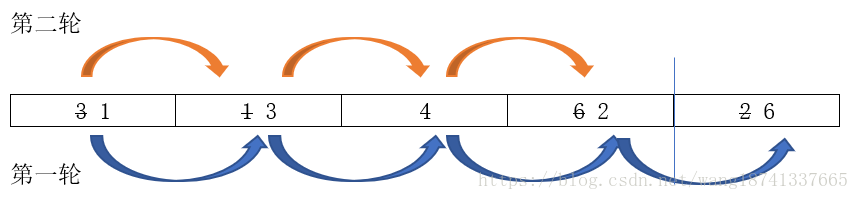
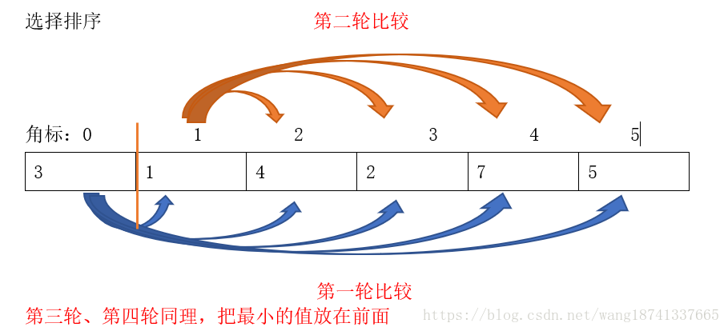

# 排序概述

## 排序稳定性

排序前两个相等的数其在序列的前后位置顺序和排序后它们两个的前后位置顺序相同。

即：如果Ai = Aj，Ai原来在位置前，排序后Ai还是要在Aj位置前。

## 什么时候必须要求使用稳定排序呢

当现实应用中排序的需求需要区别先后顺序的时候就必须用到稳定排序。

如发奖学金，排在前三个的分别获一、二、三等奖，结果一排序把原来并列第二名的排成第三名，估计不会乐意。

## 分类

不稳定的排序: 选择排序、快速排序、希尔排序、堆排序。

稳定排序：冒泡排序、插入排序、归并排序、基数排序。


# 冒泡排序

相邻的两个元素进行比较，如果符合条件就换位。

注：这样第一轮，最大的数会在最后面，长度在依次递减 。

待排序的数据：3	1	4	6	2



```java
// 冒泡排序
public int[] bubbleSort(int[] arr) {
    int len = arr.length;
    for (int i = 0; i < len - 1; i++) { // 因为最后一个元素的排序没有必要
        // 排序之后，之前未排序的数据，最大的数会在最后面，长度在依次递减 
        for (int j = 0; j < len - 1 - i; j++) { 
            if (arr[j] > arr[j+1]) {        // 相邻元素两两对比
                int temp = arr[j+1];        // 元素交换
                arr[j+1] = arr[j];
                arr[j] = temp;
            }
        }
    }
    return arr;
}
```


# 选择排序

第一次从待排序的数据元素中选出最小（或最大）的一个元素，存放在序列的起始位置，然后再从剩余的未排序元素中寻找到最小（大）元素，然后放到已排序的序列的末尾。以此类推，直到全部待排序的数据元素的个数为零。

待排序的数据：3	1	4	2	7 	5



```java
// 选择排序
public int[] selectsort(int[] arr) {
    for(int x=0;x<arr.length-1;x++)  //最后一个数不用在自己和自己进行比较了，n-1轮
    {
        for(int y=x+1;y<arr.length;y++)
        {
            if(arr[x]>arr[y])
            {
                int temp=arr[x];
                arr[x]=arr[y];
                arr[y]=temp;                
            }
        }
    }
    return arr;
}
```


