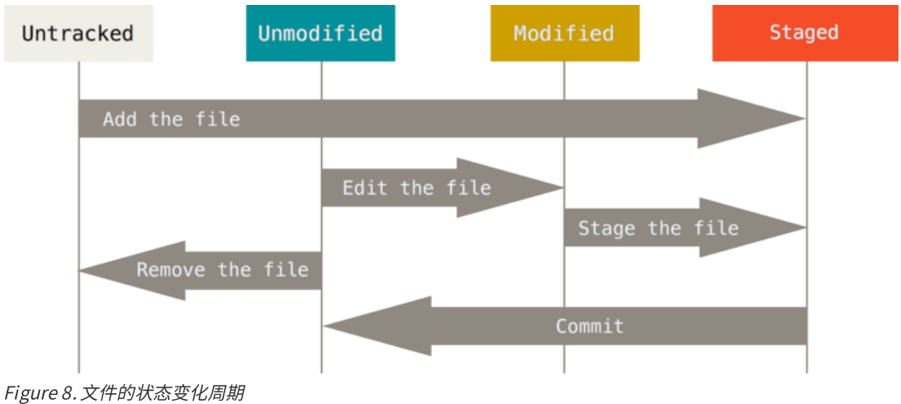

# 第1章 起步

## 1.1 初次运行Git前的配置

Git自带一个git config的工具来帮助设置控制Git外观和行为的配置变量。这些变量存储在三个不同的位
置：

1、/etc/gitconfig 文件: 包含系统上每一个用户及他们仓库的通用配置。 如果使用带有 --system 选项的
git config 时，它会从此文件读写配置变量。

2、 ~/.gitconfig 或 ~/.config/git/config 文件：只针对当前用户。 可以传递 --global 选项让 Git
读写此文件。

3、当前使用仓库的 Git 目录中的 config 文件（就是 .git/config）：针对该仓库。

每一个级别覆盖上一级别的配置，所以 .git/config 的配置变量会覆盖 /etc/gitconfig 中的配置变量。

### 1.1.1 用户信息

当安装完 Git 应该做的第一件事就是设置你的用户名称与邮件地址。 这样做很重要，因为每一个 Git 的提交都会
使用这些信息，并且它会写入到你的每一次提交中，不可更改：

```shell
$ git config --global user.name "zhxj"
$ git config --global user.email 173422588@qq.com
```

注：如果使用了 --global 选项，那么该命令只需要运行一次，因为之后无论你在该系统上做任何事情， Git 都会使用那些信息。 当你想针对特定项目使用不同的用户名称与邮件地址时，可以在那个项目目录下运行没有 --global 选项的命令来配置。

### 1.1.2 检查配置信息

如果想要检查你的配置，可以使用 git config --list 命令来列出所有 Git 当时能找到的配置。

```shell
$ git config --list
user.name=173422588@qq.com
```

你可能会看到重复的变量名，因为 Git 会从不同的文件中读取同一个配置（例如：/etc/gitconfig 与
~/.gitconfig）。 这种情况下，Git 会使用它找到的每一个变量的最后一个配置。

你可以通过输入 git config <key>： 来检查 Git 的某一项配置：

```shell
$ git config user.name
173422588@qq.com
```

# 第2章 Git基础

## 2.1 获取Git仓库

有两种取得 Git 项目仓库的方法。 第一种是在现有项目或目录下导入所有文件到 Git 中； 第二种是从一个服务器
克隆一个现有的 Git 仓库。

### 2.1.1 在现有目录中初始化仓库

如果你打算使用 Git 来对现有的项目进行管理，你只需要进入该项目目录并输入：

```shell
$ git init
```

该命令将创建一个名为 .git 的子目录，这个子目录含有你初始化的 Git 仓库中所有的必须文件，这些文件是
Git 仓库的骨干。 但是，在这个时候，我们仅仅是做了一个初始化的操作，你的项目里的文件还没有被跟踪。

如果你是在一个已经存在文件的文件夹（而不是空文件夹）中初始化 Git 仓库来进行版本控制的话，你应该开始
跟踪这些文件并提交。 你可通过 git add 命令来实现对指定文件的跟踪，然后执行 git commit 提交：

```shell
$ git add *.c
$ git add LICENSE
$ git commit -m 'initial project version'
```

### 2.1.2 克隆现有的仓库

Git 克隆的是该 Git 仓库服务器上的几乎所有数据，而不是仅仅复制完成你的工作所需要文件。 当你执行 git clone 命令的时候，默认配置下远程 Git 仓库中的每一个文件的每一个版本都将被拉取下来。

克隆仓库的命令格式是 git clone [url] 。 比如，要克隆 Git 的可链接库 libgit2，可以用下面的命令：

```shell
$ git clone https://github.com/libgit2/libgit2
```

这会在当前目录下创建一个名为 “libgit2” 的目录，并在这个目录下初始化一个 .git 文件夹，从远程仓库拉取下所有数据放入 .git 文件夹，然后从中读取最新版本的文件的拷贝。 如果你进入到这个新建的 libgit2 文件夹，你会发现所有的项目文件已经在里面了，准备就绪等待后续的开发和使用。 如果你想在克隆远程仓库的时候，自定义本地仓库的名字，你可以使用如下命令：

```shell
$ git clone https://github.com/libgit2/libgit2 mylibgit
```

这将执行与上一个命令相同的操作，不过在本地创建的仓库名字变为 mylibgit。

## 2.2 记录每次更新到仓库

工作目录下的每一个文件都不外乎这两种状态：已跟踪或未跟踪。 已跟踪的文件是指那些被纳入了版本控制的文件，在上一次快照中有它们的记录，在工作一段时间后，它们的状态可能处于未修改，已修改或已放入暂存区。工作目录中除已跟踪文件以外的所有其它文件都属于未跟踪文件，它们既不存在于上次快照的记录中，也没有放入暂存区。 初次克隆某个仓库的时候，工作目录中的所有文件都属于已跟踪文件，并处于未修改状态。

编辑过某些文件之后，由于自上次提交后你对它们做了修改，Git 将它们标记为已修改文件。 我们逐步将这些修
改过的文件放入暂存区，然后提交所有暂存了的修改，如此反复。所以使用 Git 时文件的生命周期如下：



### 2.2.1 检查当前文件状态

要查看哪些文件处于什么状态，可以用 git status 命令。 如果在克隆仓库后立即使用此命令，会看到类似这
样的输出：

```shell
$ git status
On branch master
nothing to commit, working directory clean
```

这说明你现在的工作目录相当干净。换句话说，所有已跟踪文件在上次提交后都未被更改过。 此外，上面的信息还表明，当前目录下没有出现任何处于未跟踪状态的新文件，否则 Git 会在这里列出来。 最后，该命令还显示了当前所在分支，并告诉你这个分支同远程服务器上对应的分支没有偏离。 现在，分支名是 “master”,这是默认的分支名。

在项目下创建一个新的 README 文件。 如果之前并不存在这个文件，使用 git status 命令，你将看到一个新的未跟踪文件：

```shell
$ echo 'My Project' > README
$ git status
On branch master
Untracked files:
 (use "git add <file>..." to include in what will be committed)
 README
nothing added to commit but untracked files present (use "git add" to
track)
```

在状态报告中可以看到新建的 README 文件出现在 Untracked files 下面。 未跟踪的文件意味着 Git 在之前的快照（提交）中没有这些文件；Git 不会自动将之纳入跟踪范围，除非你明明白白地告诉它“我需要跟踪该文件”， 这样的处理让你不必担心将生成的二进制文件或其它不想被跟踪的文件包含进来。 

### 2.2.2 跟踪新文件

使用git add开始跟踪一个文件。 所以，要跟踪 README 文件，运行：

```shell
$ git add README
```

此时再运行 git status 命令，会看到 README 文件已被跟踪，并处于暂存状态：

```shell
$ git status
On branch master
Changes to be committed:
 (use "git reset HEAD <file>..." to unstage)
 new file: README
```

只要在 Changes to be committed 这行下面的，就说明是已暂存状态。 如果此时提交，那么该文件此时此刻的版本将被留存在历史记录中。

 git add 命令使用文件或目录的路径作为参数；如果参数是目录的路径，该命令将递归地跟踪该目录下的所有文件。

### 2.2.3 暂存已修改文件

现在我们来修改一个已被跟踪的文件。 如果你修改了一个名为 CONTRIBUTING.md 的已被跟踪的文件，然后运
行 git status 命令，会看到下面内容：

```shell
$ git status
On branch master
Changes to be committed:
 (use "git reset HEAD <file>..." to unstage)
 new file: README
Changes not staged for commit:
 (use "git add <file>..." to update what will be committed)
 (use "git checkout -- <file>..." to discard changes in working
directory)
 modified: CONTRIBUTING.md
```

文件 CONTRIBUTING.md 出现在 Changes not staged for commit 这行下面，说明已跟踪文件的内容发生了变化，但还没有放到暂存区。 要暂存这次更新，需要运行 git add 命令。这是个多功能命令：可以用它开始跟踪新文件，或者把已跟踪的文件放到暂存区，还能用于合并时把有冲突的文件标记为已解决状态等。 将这个命令理为“添加内容到下一次提交中”而不是“将一个文件添加到项目中”要更加合适。

运行git add 将"CONTRIBUTING.md"放到暂存区，然后再看看 git status 的输出：

```shell
$ git add CONTRIBUTING.md
$ git status
On branch master
Changes to be committed:
 (use "git reset HEAD <file>..." to unstage)
 new file: README
 modified: CONTRIBUTING.md
```

现在两个文件都已暂存，下次提交时就会一并记录到仓库。 假设此时，你想要在 CONTRIBUTING.md 里再加条注释， 重新编辑存盘后，准备好提交。 不过且慢，再运行 git status 看看：

```shell
$ vim CONTRIBUTING.md
$ git status
On branch master
Changes to be committed:
 (use "git reset HEAD <file>..." to unstage)
 new file: README
 modified: CONTRIBUTING.md
Changes not staged for commit:
 (use "git add <file>..." to update what will be committed)
 (use "git checkout -- <file>..." to discard changes in working
directory)
 modified: CONTRIBUTING.md
```

现在 CONTRIBUTING.md 文件同时出现在暂存区和非暂存区。 实际上 Git 只不过暂存了你运行 git add 命令时的版本， 如果你现在提交，CONTRIBUTING.md 的版本是你最后一次运行git add 命令时的那个版本，而不是你运行 git commit 时，在工作目录中的当前版本。 所以，运行了 git add 之后又作了修订的文件，需要重新运行 git add 把最新版本重新暂存起来：

```shell
$ git add CONTRIBUTING.md
$ git status
On branch master
Changes to be committed:
 (use "git reset HEAD <file>..." to unstage)
 new file: README
 modified: CONTRIBUTING.md
```

### 2.2.4 状态简览

git status 命令的输出十分详细，但其用语有些繁琐。 如果你使用 git status -s 命令或 git status --short 命令，你将得到一种更为紧凑的格式输出。 运行 git status -s ，状态报告输出如下：

```shell
$ git status -s
 M README
MM Rakefile
A lib/git.rb
M lib/simplegit.rb
?? LICENSE.txt
```

新添加的未跟踪文件前面有 ?? 标记，新添加到暂存区中的文件前面有 A 标记，修改过的文件前面有 M 标记。 你
可能注意到了 M 有两个可以出现的位置，出现在右边的 M 表示该文件被修改了但是还没放入暂存区，出现在靠左
边的 M 表示该文件被修改了并放入了暂存区。

### 2.2.5 忽略文件

一般我们总会有些文件无需纳入 Git 的管理，也不希望它们总出现在未跟踪文件列表。 通常都是些自动生成的文件，比如日志文件，或者编译过程中创建的临时文件等。 在这种情况下，我们可以创建一个名为 .gitignore的文件，列出要忽略的文件模式。

```shell
$ cat .gitignore
*.[oa]
*~
```

第一行告诉 Git 忽略所有以 .o 或 .a 结尾的文件。一般这类对象文件和存档文件都是编译过程中出现的。 第二行告诉 Git 忽略所有以波浪符（~）结尾的文件，许多文本编辑软件（比如 Emacs）都用这样的文件名保存副本。 此外，你可能还需要忽略 log，tmp 或者 pid 目录，以及自动生成的文档等等。 要养成一开始就设置好.gitignore 文件的习惯，以免将来误提交这类无用的文件。

文件 .gitignore 的格式规范如下：

（1）所有空行或者以 ＃ 开头的行都会被 Git 忽略。

（2）可以使用标准的 glob 模式匹配。

（3） 匹配模式可以以（/）开头防止递归。

（4）匹配模式可以以（/）结尾指定目录。

（5）要忽略指定模式以外的文件或目录，可以在模式前加上惊叹号（!）取反。

所谓的 glob 模式是指 shell 所使用的简化了的正则表达式。 星号（\*）匹配零个或多个任意字符；[abc] 匹配任何一个列在方括号中的字符（这个例子要么匹配一个 a，要么匹配一个 b，要么匹配一个 c）；问号（?）只匹配一个任意字符；如果在方括号中使用短划线分隔两个字符，表示所有在这两个字符范围内的都可以匹配（比如 [0-9] 表示匹配所有 0 到 9 的数字）。 使用两个星号（*\*) 表示匹配任意中间目录，比如\`a/**/z\` 可以匹配 a/z, a/b/z 或 \`a/b/c/z\`等。

注：GitHub 有一个十分详细的针对数十种项目及语言的 .gitignore 文件列表，你可以在https://github.com/github/gitignore 找到它。

### 2.2.6 查看已暂存和未暂存的修改

如果 git status 命令的输出对于你来说过于模糊，你想知道具体修改了什么地方，可以用 git diff 命令。通常会用它来回答这两个问题：当前做的哪些更新还没有暂存？ 有哪些更新已经暂存起来准备好了下次提交？

若要查看已暂存的将要添加到下次提交里的内容，可以用 git diff --cached 命令。（Git 1.6.1 及更高版本还允许使用 git diff --staged，效果是相同的，但更好记些。）

### 2.2.7 提交更新

在提交之前，请一定要确认还有什么修改过的或新建的文件还没有git add 过，否则提交的时候不会记录这些还没暂存起来的变化。 这些修改过的文件只保留在本地磁盘。 所以，每次准备提交前，先用 git status 看下，是不是都已暂存起来了， 然后再运行提交命令 git commit：

```shell
$ git commit
```

可以看到，默认的提交消息包含最后一次运行 git status 的输出，放在注释行里，另外开头还有一空行，供你输入提交说明。

也可以在 commit 命令后添加 -m 选项，将提交信息与命令放在同一行，如下所示：

```shell
$ git commit -m "Story 182: Fix benchmarks for speed"
[master 463dc4f] Story 182: Fix benchmarks for speed
 2 files changed, 2 insertions(+)
 create mode 100644 README
```

### 2.2.8 跳过使用暂存区域

 Git 提供了一个跳过使用暂存区域的方式， 只要在提交的时候，给 git commit 加上 -a 选项，Git 就会自动把所有已经跟踪过的文件暂存起来一并提交，从而跳过 git add 步骤：

```shell
$ git status
On branch master
Changes not staged for commit:
 (use "git add <file>..." to update what will be committed)
 (use "git checkout -- <file>..." to discard changes in working
directory)
 modified: CONTRIBUTING.md
no changes added to commit (use "git add" and/or "git commit -a")
$ git commit -a -m 'added new benchmarks'
[master 83e38c7] added new benchmarks
 1 file changed, 5 insertions(+), 0 deletions(-)
```

### 2.2.9 移除文件

要从 Git 中移除某个文件，就必须要从已跟踪文件清单中移除（确切地说是从暂存区域移除），然后提交。可以用 git rm 命令完成此项工作，并连带从工作目录中删除指定的文件，这样以后就不会出现在未跟踪文件清单中了。

### 2.2.10 移除文件

Git 并不显式跟踪文件移动操作。 如果在 Git 中重命名了某个文件，仓库中存储的元数据并不会体现出这是一次改名操作。

要在 Git 中对文件改名，可以这么做：

```shell
$ git mv file_from file_to
```

```shell
$ git mv README.md README
$ git status
On branch master
Changes to be committed:
 (use "git reset HEAD <file>..." to unstage)
 renamed: README.md -> README
```

其实，运行 git mv 就相当于运行了下面三条命令：

```shell
$ mv README.md README
$ git rm README.md
$ git add README
```

如此分开操作，Git 也会意识到这是一次改名，所以不管何种方式结果都一样。 两者唯一的区别是，mv 是一条命令而另一种方式需要三条命令，直接用 git mv 轻便得多。 

## 2.3 查看提交历史

在提交了若干更新，又或者克隆了某个项目之后，你也许想回顾下提交历史。 完成这个任务最简单而又有效的工具是 git log 命令。

默认不用任何参数的话，git log 会按提交时间列出所有的更新，最近的更新排在最上面。 这个命令会列出每个提交的 SHA-1 校验和、作者的名字和电子邮件地址、提交时间以及提交说明。

git log 有许多选项可以帮助你搜寻你所要找的提交：

（1）一个常用的选项是 -p，用来显示每次提交的内容差异。 你也可以加上 -2 来仅显示最近两次提交。

```shell
$ git log -p -2
```

该选项除了显示基本信息之外，还附带了每次 commit 的变化。

（2）如果你想看到每次提交的简略的统计信息，你可以使用 --stat 选项。

```shell
$ git log --stat
```

--stat 选项在每次提交的下面列出所有被修改过的文件、有多少文件被修改了以及被修改过的文件的哪些行被移除或是添加了。 在每次提交的最后还有一个总结。

（3）另外一个常用的选项是 --pretty。这个选项可以指定使用不同于默认格式的方式展示提交历史。 这个选项有
一些内建的子选项供你使用。 比如用 oneline 将每个提交放在一行显示，查看的提交数很大时非常有用。 另外还有 short，full 和 fuller 可以用。

注： git log 的常用选项：

| 选项            | 说明                                                         |
| --------------- | ------------------------------------------------------------ |
| -p              | 按补丁格式显示每个更新之间的差异。                           |
| --stat          | 显示每次更新的文件修改统计信息。                             |
| --shortstat     | 只显示 --stat 中最后的行数修改添加移除统计。                 |
| --name-only     | 仅在提交信息后显示已修改的文件清单。                         |
| --name-status   | 显示新增、修改、删除的文件清单。                             |
| --abbrev-commit | 仅显示 SHA-1 的前几个字符，而非所有的 40 个字符。            |
| --relative-date | 使用较短的相对时间显示（比如，“2 weeks ago”）。              |
| --graph         | 显示 ASCII 图形表示的分支合并历史。                          |
| --pretty        | 使用其他格式显示历史提交信息。可用的选项包括 oneline，short，full，fuller 和format（后跟指定格式）。 |

### 2.3.1 限制输出长度

除了定制输出格式的选项之外，git log 还有许多非常实用的限制输出长度的选项，也就是只输出部分提交信息。

注：限制 git log 输出的选项

| 选项              | 说明                                 |
| ----------------- | ------------------------------------ |
| -(n)              | 仅显示最近的 n 条提交                |
| --since, --after  | 仅显示指定时间之后的提交。           |
| --until, --before | 仅显示指定时间之前的提交。           |
| --author          | 仅显示指定作者相关的提交。           |
| --committer       | 仅显示指定提交者相关的提交。         |
| --grep            | 仅显示含指定关键字的提交。           |
| -S                | 仅显示添加或移除了某个关键字的提交。 |

## 2.4 撤销操作

有时候我们提交完了才发现漏掉了几个文件没有添加，或者提交信息写错了。 此时，可以运行带有 --amend 选项的提交命令尝试重新提交：

```shell
$ git commit --amend
```

这个命令会将暂存区中的文件提交。 如果自上次提交以来你还未做任何修改（例如，在上次提交后马上执行了此命令），那么快照会保持不变，而你所修改的只是提交信息。

例如，你提交后发现忘记了暂存某些需要的修改，可以像下面这样操作：

```shell
$ git commit -m 'initial commit'
$ git add forgotten_file
$ git commit --amend
```

最终你只会有一个提交 - 第二次提交将代替第一次提交的结果。

### 2.4.1 取消暂存的文件

例如，你已经修改了两个文件并且想要将它们作为两次独立的修改提交，但是却意外地输入了 git add * 暂存了它们两个。 如何只取消暂存两个中的一个呢？ git status 命令提示了你：

```shell
$ git add *
$ git status
On branch master
Changes to be committed:
 (use "git reset HEAD <file>..." to unstage)
 renamed: README.md -> README
 modified: CONTRIBUTING.md
```

在 “Changes to be committed” 文字正下方，提示使用 git reset HEAD <file>... 来取消暂存。 所以，我们可以这样来取消暂存 CONTRIBUTING.md 文件：

```shell
$ git reset HEAD CONTRIBUTING.md
Unstaged changes after reset:
M CONTRIBUTING.md
$ git status
On branch master
Changes to be committed:
 (use "git reset HEAD <file>..." to unstage)
 renamed: README.md -> README
Changes not staged for commit:
 (use "git add <file>..." to update what will be committed)
 (use "git checkout -- <file>..." to discard changes in working
directory)
 modified: CONTRIBUTING.md
```

注：虽然在调用时加上 --hard 选项可以令 git reset 成为一个危险的命令（译注：可能导致工作目录中所有当前进度丢失！），但本例中工作目录内的文件并不会被修改。 不加选项地调用git reset 并不危险 — 它只会修改暂存区域。

### 2.4.2 撤消对文件的修改

如果你并不想保留对 CONTRIBUTING.md 文件的修改怎么办？ 你该如何方便地撤消修改 - 将它还原成上次提交时的样子（或者刚克隆完的样子，或者刚把它放入工作目录时的样子）？ 幸运的是，git status 也告诉了你应该如何做。 在最后一个例子中，未暂存区域是这样：

```shell
Changes not staged for commit:
 (use "git add <file>..." to update what will be committed)
 (use "git checkout -- <file>..." to discard changes in working
directory)
 modified: CONTRIBUTING.md
```

它非常清楚地告诉了你如何撤消之前所做的修改。 让我们来按照提示执行：

```shell
$ git checkout -- CONTRIBUTING.md
$ git status
On branch master
Changes to be committed:
 (use "git reset HEAD <file>..." to unstage)
 renamed: README.md -> README
```

可以看到那些修改已经被撤消了。

注：你需要知道 git checkout -- [file] 是一个危险的命令，这很重要。 你对那个文件做的任何修改都会消失 - 你只是拷贝了另一个文件来覆盖它。 除非你确实清楚不想要那个文件了，否则不要使用这个命令。

## 2.5 远程仓库的使用

为了能在任意 Git 项目上协作，你需要知道如何管理自己的远程仓库。 远程仓库是指托管在因特网或其他网络中的你的项目的版本库。 你可以有好几个远程仓库，通常有些仓库对你只读，有些则可以读写。 与他人协作涉及管理远程仓库以及根据需要推送或拉取数据。 管理远程仓库包括了解如何添加远程仓库、移除无效的远程仓库、管理不同的远程分支并定义它们是否被跟踪等等。

### 2.5.1 查看远程仓库

如果想查看你已经配置的远程仓库服务器，可以运行 git remote 命令。 它会列出你指定的每一个远程服务器的简写。 如果你已经克隆了自己的仓库，那么至少应该能看到 origin - 这是 Git 给你克隆的仓库服务器的默认名字：

```shell
$ git clone https://github.com/schacon/ticgit
Cloning into 'ticgit'...
remote: Reusing existing pack: 1857, done.
remote: Total 1857 (delta 0), reused 0 (delta 0)
Receiving objects: 100% (1857/1857), 374.35 KiB | 268.00 KiB/s, done.
Resolving deltas: 100% (772/772), done.
Checking connectivity... done.
$ cd ticgit
$ git remote
origin
```

你也可以指定选项 -v，会显示需要读写远程仓库使用的 Git 保存的简写与其对应的 URL。

```shell
$ git remote -v
origin https://github.com/schacon/ticgit (fetch)
origin https://github.com/schacon/ticgit (push)
```

如果你的远程仓库不止一个，该命令会将它们全部列出。


