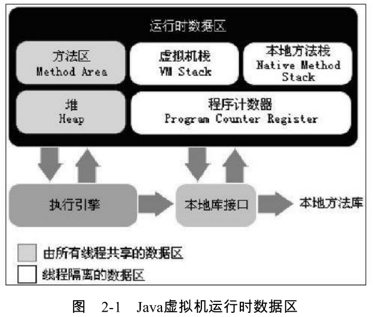
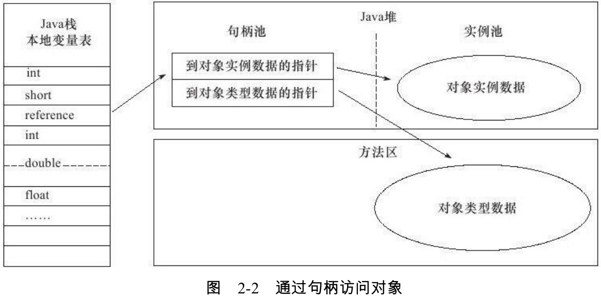
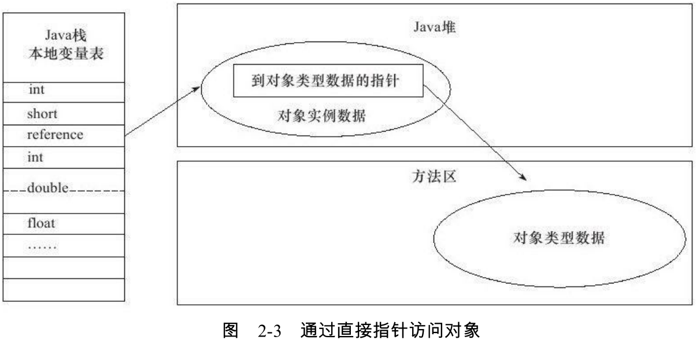
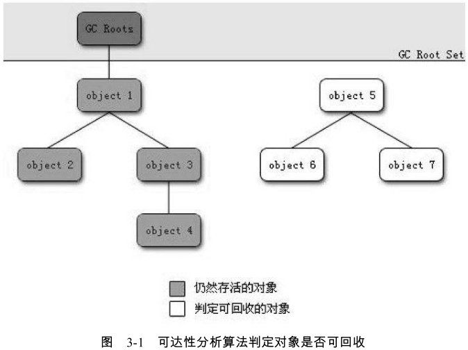

# 第2章 Java内存区域与内存溢出异常

## 2.1 概述

对于Java来说，在虚拟机自动内存管理机制的帮助下，不在需要为每一个new操作去写配置的delete/free代码，不容易出现内存泄漏和内存溢出问题。不过也正是因为Java把内存控制的权力交给了Java虚拟机，一旦出现内存泄漏和溢出方面的问题，如果不了解虚拟机是怎样使用内存的，那么排查错误将会成为一项异常艰难的工作。

## 2.2 运行时数据区域

Java虚拟机在执行Java程序的过程中会把它所管理的内存划分为若干个不同的数据区域。这些区域都有各自的用途，以及创建和销毁的时间，有的区域随着虚拟机进程的启动而存在，有些区域则依赖用户线程的启动和结束而建立和销毁。

根据《Java虚拟机规范1.7版》的规定，Java虚拟机所管理的内存将会包括以下几个运行时数据区域：



### 2.2.1 程序计数器

程序计数器（Program Counter Register）是一块较小的内存空间，它可以看作是当前线程所执行的字节码的行号指示器。字节码解释器工作时就是通过改变这个计数器的值来选取下一条需要执行的字节码指令，分支、循环、跳转、异常处理、线程恢复等基础功能都需要依赖这个计数器来完成。

由于Java虚拟机的多线程是通过线程轮流切换并分配处理器执行时间的方式来实现的，在任何一个确定的时刻，一个处理器（对于多核处理器来说是一个内核）都只会执行一条线程中的指令。因此，为了线程切换后能恢复到正确的执行位置，每条线程都需要有一个独立的程序计数器，各条线程之间计数器互不影响，独立存储，我们称这类内存区域为“线程私有”的内存。

如果线程正在执行的是一个Java方法，这个计数器记录的是正在执行的虚拟机字节码指令的地址；如果正在执行的是Native方法，这个计数器值则为空（Undefined）。此内存区域是唯一一个在Java虚拟机规范中没有规定任何OutOfMemoryError情况的区域。

### 2.2.2 Java虚拟机栈

与程序计数器一样，Java虚拟机栈（Java Virtual Machine Stacks）也是线程私有的，它的生命周期与线程相同。虚拟机栈描述的是Java方法执行的内存模型：每个方法在执行的同时都会创建一个栈帧用于存储局部变量表、操作数栈、动态链接、方法出口等信息。每一个方法从调用直至执行完成的过程，就对应着一个栈帧在虚拟机栈中入栈到出栈的过程。

局部变量表存放了编译期可知的各种基本数据类型（boolean、byte、char、short、int、float、long、double）、对象引用（reference类型，它不等同于对象本身，可能是一个指向对
象起始地址的引用指针，也可能是指向一个代表对象的句柄或其他与此对象相关的位置）和
returnAddress类型（指向了一条字节码指令的地址）。

其中64位长度的long和double类型的数据会占用2个局部变量空间（Slot），其余的数据类型只占用1个。局部变量表所需的内存空间在编译期间完成分配，当进入一个方法时，这个方法需要在帧中分配多大的局部变量空间是完全确定的，在方法运行期间不会改变局部变量表的大小。

在Java虚拟机规范中，对这个区域规定了两种异常状况：如果线程请求的栈深度大于虚拟机所允许的深度，将抛出StackOverflowError异常；如果虚拟机栈可以动态扩展，如果扩展时无法申请到足够的内存，就会抛出OutOfMemoryError异常。

1、模拟StackOverflowError异常：

```java
public class Test {

    public static void main(String[] args) {
        new Test().stackOverFlowTest();
    }

    public void stackOverFlowTest(){
        stackOverFlowTest();
    }
}
// 异常：Exception in thread "main" java.lang.StackOverflowError
```

产生原因可以归结为两类：

（1）程序中出现了不该出现的死循环，例如递归函数没有出口，这种情况，不管栈空间有多大，早晚要溢出的。这类错误，通过debug，比较容易查找。

（2）确实栈不够使用。保存到栈上的主要内容是：局部变量和函数调用的函数环境（包括函数参数等）。

### 2.2.3 本地方法栈

本地方法栈（Native Method Stack）与虚拟机栈所发挥的作用是非常相似的，它们之间的区别不过是虚拟机栈为虚拟机执行Java方法（也就是字节码）服务，而本地方法栈则为虚拟机使用到的Native方法服务。在虚拟机规范中对本地方法栈中方法使用的语言、使用方式与数据结构并没有强制规定，因此具体的虚拟机可以自由实现它。

与虚拟机栈一样，本地方法栈区域也会抛出StackOverflowError和OutOfMemoryError异常。

### 2.2.4 Java堆

对于大多数应用来说，Java堆（Java Heap）是Java虚拟机所管理的内存中最大的一块。Java堆是被所有线程共享的一块内存区域，在虚拟机启动时创建。此内存区域的唯一目的就是存放对象实例，几乎所有的对象实例都在这里分配内存。

Java堆是垃圾收集器管理的主要区域，因此很多时候也被称做“GC堆”。

从内存回收的角度来看，由于现在收集器基本都采用分代收集算法，所以Java堆中还可以细分为：新生代和老年代；再细致一点的有Eden空间、From Survivor空间、To Survivor空间等。

从内存分配的角度来看，线程共享的Java堆中可能划分出多个线程私有的分配缓冲区（Thread Local Allocation Buffer,TLAB）。

不过无论如何划分，都与存放内容无关，无论哪个区域，存储的都仍然是对象实例，进一步划分的目的是为了更好地回收内存，或者更快地分配内存。

根据Java虚拟机规范的规定，Java堆可以处于物理上不连续的内存空间中，只要逻辑上是连续的即可。在实现时，既可以实现成固定大小的，也可以是可扩展的，不过当前主流的虚拟机都是按照可扩展来实现的（通过-Xmx和-Xms控制）。如果在堆中没有内存完成实例分配，并且堆也无法再扩展时，将会抛出OutOfMemoryError异常。

### 2.2.5 方法区

方法区（Method Area）与Java堆一样，是各个线程共享的内存区域，它用于存储已被虚拟机加载的类信息、常量、静态变量、即时编译器编译后的代码等数据。虽然Java虚拟机规范把方法区描述为堆的一个逻辑部分，但是它却有一个别名叫做Non-Heap（非堆），目的应该是与Java堆区分开来。

根据Java虚拟机规范的规定，当方法区无法满足内存分配需求时，将抛出OutOfMemoryError异常。

### 2.2.6 运行时常量池

运行时常量池（Runtime Constant Pool）是方法区的一部分。Class文件中除了有类的版本、字段、方法、接口等描述信息外，还有一项信息是常量池（Constant Pool Table），用于存放编译期生成的各种字面量和符号引用，这部分内容将在类加载后进入方法区的运行时常量池中存放。

Java虚拟机对Class文件每一部分（自然也包括常量池）的格式都有严格规定，每一个字节用于存储哪种数据都必须符合规范上的要求才会被虚拟机认可、装载和执行，但对于运行时常量池，Java虚拟机规范没有做任何细节的要求，不同的提供商实现的虚拟机可以按照自己的需要来实现这个内存区域。一般来说，除了保存Class文件中描述的符号引用外，还会把翻译出来的直接引用也存储在运行时常量池中 。

运行时常量池相对于Class文件常量池的另外一个重要特征是具备动态性，Java语言并不要求常量一定只有编译期才能产生，也就是并非预置入Class文件中常量池的内容才能进入方法区运行时常量池，运行期间也可能将新的常量放入池中。

既然运行时常量池是方法区的一部分，自然受到方法区内存的限制，当常量池无法再申请到内存时会抛出OutOfMemoryError异常。

### 2.2.7 直接内存

直接内存（Direct Memory）并不是虚拟机运行时数据区的一部分，也不是Java虚拟机规范中定义的内存区域。但是这部分内存也被频繁地使用，而且也可能导致OutOfMemoryError异常出现。

在JDK 1.4中新加入了NIO（New Input/Output）类，引入了一种基于通道（Channel）与缓冲区（Buffer）的I/O方式，它可以使用Native函数库直接分配堆外内存，然后通过一个存储在Java堆中的DirectByteBuffer对象作为这块内存的引用进行操作。

本机直接内存的分配不会受到Java堆大小的限制，但是，既然是内存，肯定还是会受到本机总内存（包括RAM以及SWAP区或者分页文件）大小以及处理器寻址空间的限制。

## 2.3 HotSpot虚拟机对象探秘

### 2.3.1 对象的创建

虚拟机遇到一条new指令时，首先将去检查这个指令的参数是否能在常量池中定位到一个类的符号引用，并且检查这个符号引用代表的类是否已被加载、解析和初始化过。如果没有，那必须先执行相应的类加载过程。

在类加载检查通过后，接下来虚拟机将为新生对象分配内存。对象所需内存的大小在类加载完成后便可完全确定，为对象分配空间的任务等同于把一块确定大小的内存从Java堆中划分出来。假设Java堆中内存是绝对规整的，所有用过的内存都放在一边，空闲的内存放在另一边，中间放着一个指针作为分界点的指示器，那所分配内存就仅仅是把那个指针向空闲空间那边挪动一段与对象大小相等的距离，这种分配方式称为“指针碰撞”（Bump the Pointer）。如果Java堆中的内存并不是规整的，已使用的内存和空闲的内存相互交错，那就没有办法简单地进行指针碰撞了，虚拟机就必须维护一个列表，记录上哪些内存块是可用的，在分配的时候从列表中找到一块足够大的空间划分给对象实例，并更新列表上的记录，这种分配方式称为“空闲列表”（Free  List）。选择哪种分配方式由Java堆是否规整决定，而Java堆是否规整又由所采用的垃圾收集器是否带有压缩整理功能决定。

除如何划分可用空间之外，还有另外一个需要考虑的问题是对象创建在虚拟机中是非常频繁的行为，即使是仅仅修改一个指针所指向的位置，在并发情况下也并不是线程安全的，可能出现正在给对象A分配内存，指针还没来得及修改，对象B又同时使用了原来的指针来分配内存的情况。解决这个问题有两种方案：

（1）对分配内存空间的动作进行同步处理。实际上虚拟机采用CAS配上失败重试的方式保证更新操作的原子性；（2）把内存分配的动作按照线程划分在不同的空间之中进行，即每个线程在Java堆中预先分配一小块内存，称为本地线程分配缓冲（Thread Local Allocation Buffer,TLAB）。哪个线程要分配内存，就在哪个线程的TLAB上分配，只有TLAB用完并分配新的TLAB时，才需要同步锁定。
虚拟机是否使用TLAB，可以通过-XX：+/-UseTLAB参数来设定。

内存分配完成后，虚拟机需要将分配到的内存空间都初始化为零值（不包括对象头），如果使用TLAB，这一工作过程也可以提前至TLAB分配时进行。这一步操作保证了对象的实例字段在Java代码中可以不赋初始值就直接使用，程序能访问到这些字段的数据类型所对应的零值。

接下来，虚拟机要对对象进行必要的设置，例如这个对象是哪个类的实例、如何才能找到类的元数据信息、对象的哈希码、对象的GC分代年龄等信息。这些信息存放在对象的对象头（Object Header）之中。根据虚拟机当前的运行状态的不同，如是否启用偏向锁等，对象头会有不同的设置方式。

在上面工作都完成之后，从虚拟机的视角来看，一个新的对象已经产生了，但从Java程序的视角来看，对象创建才刚刚开始，＜init＞方法还没有执行，所有的字段都还为零。所以一般来说，执行new指令之后会接着执行＜init＞方法，把对象按照程序员的意愿进行初始化，这样一个真正可用的对象才算完全产生出来。

### 2.3.2 对象的内存布局

在HotSpot虚拟机中，对象在内存中存储的布局可以分为3块区域：对象头（Header）、实例数据（Instance Data）和对齐填充（Padding）。

HotSpot虚拟机的对象头包括两部分信息，第一部分用于存储对象自身的运行时数据，如哈希码（HashCode）、GC分代年龄、锁状态标志、线程持有的锁、偏向线程ID、偏向时间戳等，这部分数据的长度在32位和64位的虚拟机（未开启压缩指针）中分别为32bit和64bit，官方称它为“Mark Word”。

对象需要存储的运行时数据很多，其实已经超出了32位、64位Bitmap结构所能记录的限度，但是对象头信息是与对象自身定义的数据无关的额外存储成本，考虑到虚拟机的空间效率，Mark Word被设计成一个非固定的数据结构以便在极小的空间内存储尽量多的信息，它会根据对象的状态复用自己的存储空间。

### 2.3.3 对象的访问定位

建立对象是为了使用对象，我们的Java程序需要通过栈上的reference数据来操作堆上的具体对象。由于reference类型在Java虚拟机规范中只规定了一个指向对象的引用，并没有定义这个引用应该通过何种方式去定位、访问堆中的对象的具体位置，所以对象访问方式也是取决于虚拟机实现而定的。目前主流的访问方式有使用句柄和直接指针两种。

如果使用句柄访问的话，那么Java堆中将会划分出一块内存来作为句柄池，reference中存储的就是对象的句柄地址，而句柄中包含了对象实例数据与类型数据各自的具体地址信息：



如果使用直接指针访问，那么Java堆对象的布局中就必须考虑如何放置访问类型数据的相关信息，而reference中存储的直接就是对象地址：



使用句柄来访问的最大好处就是reference中存储的是稳定的句柄地址，在对象被移动（垃圾收集时移动对象是非常普遍的行为）时只会改变句柄中的实例数据指针，而reference本身不需要修改。

使用直接指针访问方式的最大好处就是速度更快，它节省了一次指针定位的时间开销，由于对象的访问在Java中非常频繁，因此这类开销积少成多后也是一项非常可观的执行成本。

注：虚拟机Sun HotSpot而言，它是使用第二种方式进行对象访问的。

## 2.4 实战：OutOfMemoryError异常

### 2.4.1 Java堆溢出

Java堆用于存储对象实例，只要不断地创建对象，并且保证GC Roots到对象之间有可达路径来避免垃圾回收机制清除这些对象，那么在对象数量到达最大堆的容量限制后就会产生内存溢出异常。

```java
/**
*VM Args：-Xms20m-Xmx20m-XX：+HeapDumpOnOutOfMemoryError
*/
public class HeapOOM{
    static class OOMObject{
    }
    public static void main（String[]args）{
        List＜OOMObject＞list = new ArrayList＜OOMObject＞（）；
			while（true）{
            list.add（new OOMObject（））；
        }
    }
}
```

### 2.4.2 虚拟机栈和本地方法栈溢出

如果线程请求的栈深度大于虚拟机所允许的最大深度，将抛出StackOverflowError异常。如果虚拟机在扩展栈时无法申请到足够的内存空间，则抛出OutOfMemoryError异常。

1、虚拟机栈和本地方法栈OOM测试：

```java
/**
*VM Args：-Xss128k
*/
public class JavaVMStackSOF{
    private int stackLength=1；
        public void stackLeak（）{
        stackLength++；
            stackLeak（）；
    }
    public static void main（String[]args）throws Throwable{
        JavaVMStackSOF oom=new JavaVMStackSOF（）；
            try{
                oom.stackLeak（）；
            }catch（Throwable e）{
                System.out.println（"stack length："+oom.stackLength）；
                    throw e；
            }
    }
}
```

实验结果表明：在单个线程下，无论是由于栈帧太大还是虚拟机栈容量太小，当内存无法分配的时候，虚拟机抛出的都是StackOverflowError异常。

2、创建线程导致内存溢出异常：

```java
/**
*VM Args：-Xss2M（这时候不妨设置大些）
*@author zzm
*/
public class JavaVMStackOOM{
    private void dontStop（）{
        while（true）{
        }
    }
    public void stackLeakByThread（）{
        while（true）{
            Thread thread=new Thread（new Runnable（）{
                @Override
                public void run（）{
                    dontStop（）；
                }
            }）；
            thread.start（）；
        }
    }
    public static void main（String[]args）throws Throwable{
        JavaVMStackOOM oom=new JavaVMStackOOM（）；
        oom.stackLeakByThread（）；
    }
}
```

### 第3章 垃圾收集器与内存分配策略

## 3.2对象已死吗

### 3.2.1 引用计数算法

Java虚拟机里面没有选用引用计数算法来管理内存，其中最主要的原因是它很难解决对象之间相互循环引用的问题。

举例：对象objA和objB都有字段instance，赋值令objA.instance=objB及objB.instance=objA，除此之外，这两个对象再无任何引用，实际上这两个对象已经不可能再被访问，但是它们因为互相引用着对方，导致它们的引
用计数都不为0，于是引用计数算法无法通知GC收集器回收它们。

```java
/**
*testGC（）方法执行后，objA和objB会不会被GC呢？
*@author zzm
*/
public class ReferenceCountingGC{
    public Object instance=null；
        private static final int_1MB=1024*1024；
        /**
*这个成员属性的唯一意义就是占点内存，以便能在GC日志中看清楚是否被回收过
*/
        private byte[]bigSize=new byte[2*_1MB]；
        public static void testGC（）{
        ReferenceCountingGC objA=new ReferenceCountingGC（）；
        ReferenceCountingGC objB=new ReferenceCountingGC（）；
        objA.instance=objB；
        objB.instance=objA；
        objA=null；
        objB=null；
        //假设在这行发生GC,objA和objB是否能被回收？
        System.gc（）；
    }
}
```

从运行结果中可以清楚看到，虚拟机并没有因为这两个对象互相引用就不回收它们，这也从侧面说明虚拟机并不是通过引用计数算法来判断对象是否存活的。

### 3.2.2 可达性分析算法

在主流的商用程序语言的主流实现中，都是称通过可达性分析（Reachability Analysis）来判定对象是否存活的。

这个算法的基本思路就是通过一系列的称为“GC Roots”的对象作为起始点，从这些节点开始向下搜索，搜索所走过的路径称为引用链（Reference  Chain），当一个对象到GC  Roots没有任何引用链相连（就是从GC Roots到这个对象不可达）时，则证明此对象是不可用的。如图3-1所示，对象object 5、object 6、object 7虽然互相有关联，但是它们到GC Roots是不可达的，所以它们将会被判定为是可回收的对象。



