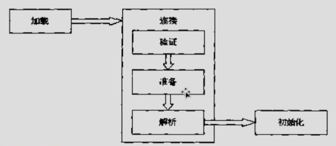

## 类加载器

### Java虚拟机与程序的生命周期

在如下几种情况下，Java虚拟机将结束生命周期：

（1）执行了System.exit()方法。

（2）程序正常执行结束。

（3）程序在执行过程中遇到了异常或错误而异常终止。

（4）由于操作系统出现错误而导致Java虚拟机进程终止。

### 类的加载、连接与初始化

（1）加载：查找并加载类的二进制数据。

（2）连接：

​	1）验证：确保被加载的类的正确性。

​	2）准备：为类的静态变量分配内存，并将其初始化为默认值。

​	3）解析：把类中的符号引用转换为直接引用。

（3）初始化：为类的静态变量赋予正确的初始值。

（4）使用（略）

（5）卸载（略）

Java程序对类的使用方式可分为两种：

（1）主动使用。

（2）被动使用。

所有的Java虚拟机实现必须在每个类或接口被Java程序“首次主动使用”时才初始化它们。

主动使用的情况（7种）：

（1）创建类的实例。

（2）访问某个类或接口的平台变量，或者对该静态变量赋值。

（3）调用类的静态方法。

（4）反射：如Class.forName("com.test.Test")。

（5）初始化一个类地子类。

（6）Java虚拟机启动时被表明为启动类的类（Java Test）。

（7）JDK1.7开始提供的动态语言支持。

主动使用的情况：

除了以上7中情况外，其他使用Java类的方式否被看作是对类的被动使用，都不会导致类的初始化。

#### 类的加载

类的加载指...