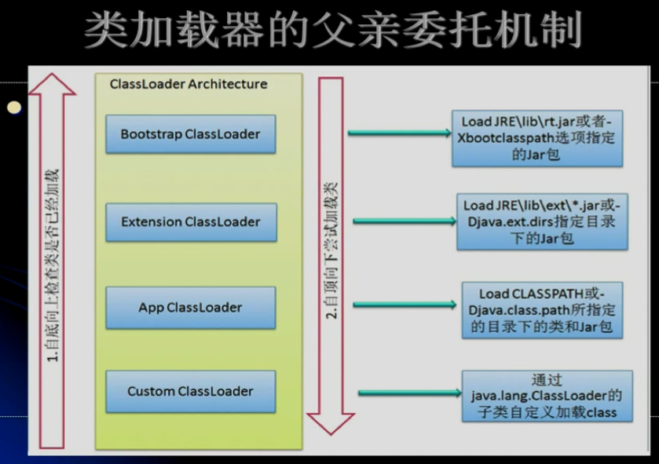

## 类加载器

### Java虚拟机与程序的生命周期

在如下几种情况下，Java虚拟机将结束生命周期：

（1）执行了System.exit()方法。

（2）程序正常执行结束。

（3）程序在执行过程中遇到了异常或错误而异常终止。

（4）由于操作系统出现错误而导致Java虚拟机进程终止。

### 类的加载、连接与初始化

（1）加载：查找并加载类的二进制数据。

（2）连接：

​	1）验证：确保被加载的类的正确性。

​	2）准备：为类的静态变量分配内存，并将其初始化为默认值。

​	3）解析：把类中的符号引用转换为直接引用。

（3）初始化：为类的静态变量赋予正确的初始值。

（4）使用（略）

（5）卸载（略）


Java程序对类的使用方式可分为两种：

（1）主动使用。

（2）被动使用。

所有的Java虚拟机实现必须在每个类或接口被Java程序“首次主动使用”时才初始化它们。

主动使用的情况（7种）：

（1）创建类的实例。

（2）访问某个类或接口的平台变量，或者对该静态变量赋值。

（3）调用类的静态方法。

（4）反射：如Class.forName("com.test.Test")。

（5）初始化一个类地子类。

（6）Java虚拟机启动时被表明为启动类的类（Java Test）。

（7）JDK1.7开始提供的动态语言支持。

主动使用的情况：

除了以上7中情况外，其他使用Java类的方式否被看作是对类的被动使用，都不会导致类的初始化。

#### 类的加载

类的加载指的是将类的.class文件中的二进制数据读入内存中，将其放在运行时数据区的方法去内，然后再内存中创建一个java.lang.Class对象（规范未说明Class对象位于哪里，HotSpot虚拟机将其放在方法去中）用来封装类在方法区内的数据结构。

加载.class文件的方式

（1）从本地系统中直接加载。

（2）通过网络下载.class文件。

（3）从zip、jar等归档文件中加载.class文件。

（4）从专有数据库中提取.class文件。

（5）将Java源文件动态编译为.class文件。

注：可以在虚拟机参数中添加-XX:+TraceClassLoading，用于追踪类的加载信息并打印出来。

-XX:+\<optional>，表示开启optional选项。

-XX:-\<optional>，表示关闭optional选项。

-XX:\<optional>=\<value>，表示将optional选项的值设置为value。

### 示例

示例1：

```java
public class Test01 {

	public static void main(String[] args) {
		
		System.out.println(MyParent.str);
	}
}

class MyParent {
	public static String str = "hello world!";

	static {
		System.out.println("MyParent static block");
	}
}
/*
打印结果：
MyParent static block
hello world!
*/
```

示例2：

```java
public class Test01 {

	public static void main(String[] args) {
		
		System.out.println(MyParent.str);
		
	}
	
}

class MyParent {
	public static final String str = "hello world!";

	static {
		System.out.println("MyParent static block");
	}
}

/*
打印结果：
hello world!
*/
```

为什么上述代码中示例1和示例2的打印结果有差异呢？示例1和示例2的代码之间的差异是在str声明的时候，示例2添加了final，即str被声明为常量“hello world!”。

常量在编译节点会存入到调用这个常量的方法所在的类的常量池中，本质上，调用类并没有直接引用到定义常量的类，一次你并不会触发定义常量的类的初始化。

当一个常量的值并非编译期间可以确定的，那么其值就不会被放到调用类的常量池中，这时在程序运行时，会导致主动使用这个常量所在的类，显然会导致这个类被初始化。

注：这里指的是将常量存放到了Test01的常量池中，之后Test01与MyParent就没有任何关系了。甚至，可以将MyParent的class文件删除。

反编译查看Test01字节码的信息：javap -c Test01，打印结果：

```java
public class jvm.demo01.Test01 {
  public jvm.demo01.Test01();
    Code:
       0: aload_0
       1: invokespecial #1                  // Method java/lang/Object."<init>":                       ()V
       4: return

  public static void main(java.lang.String[]);
    Code:
       0: getstatic     #2                  // Field java/lang/System.out:Ljava/                       io/PrintStream;
       3: ldc           #4                  // String hello world!
       5: invokevirtual #5                  // Method java/io/PrintStream.printl                       n:(Ljava/lang/String;)V
       8: return
}

```


### 数组的创建及初始化

```java
public class Test02 {

    public static void main(String[] args) {

        MyParent02[] myParent02s = new MyParent02[1];

    }


}

class MyParent02 {

    static {
        System.out.println("MyParent02 static block");
    }
}

/*
打印结果：
没有打印结果
*/
```

对于数组实例来说，其类型是由JVM在运行期动态生成的，表示为[Lcom.jvm.demo01.MyParent02的形式。动态生成的类型，其父类型就是Object。

对于数组来说，JavaDoc经常将构成数组的元素Component，实际上就是将数组降低一个维度后的类型。

### 接口的初始化

```java
public class Test03 {

    public static void main(String[] args) {
        System.out.println(MyChild03.b);
    }
}

interface MyParent03{

    public static int a = 5;
}

class MyChild03 implements MyParent03 {
    public static int b = 6;
}
```

接口不能声明静态代码块，那么如何验证是否上述代码中加载的MyParent03呢？

可以在编译完成之后，将MyParent03.class删除。然后再执行Test03.class，如果没有报错，那么可以确定有没有加载MyParent03。

从实验结果来看，程序正常执行输入6，所以没有加载MyParent03。

```java
public class Test03 {

    public static void main(String[] args) {
        System.out.println(MyParent03.a);
    }

}

interface MyParent03{
    public static int a = 5;
}
```

用上述的方式将编译好的MyParent03.class删除，再执行Test03.class。发现程序正常执行输入5。所以没有加载MyParent03.class。

```java
public class Test03 {

    public static void main(String[] args) {
        System.out.println(MyChild03.b);
    }

}

interface MyParent03{

    public static int a = new Random().nextInt(2);

}

interface MyChild03 extends MyParent03 {
    public static int b = new Random().nextInt(2);
}
```

用上述的方式将编译好的MyParent03.class删除，再执行Test03.class。发现程序报错了。


当一个接口在初始化时，并不要求其父接口都完成了初始化。只有在真正使用到父接口的时候（如引用接口中所定义的常量时），才会初始化。

### 类的初始化过程

示例1：

```java
public class Test04 {

    public static void main(String[] args) {

        Singleton singleton = Singleton.getInstance();

        System.out.println("count1 = " + Singleton.count1);
        System.out.println("count2 = " + Singleton.count2);
    }
}

class Singleton {

    public  static  int count1;

    public static  int count2 = 0;

    private  static Singleton singleton = new Singleton();

    private Singleton (){
        count1++;
        count2++;
    }

    public  static Singleton getInstance(){
        return singleton;
    }
}
/*
打印结果：
count1 = 1
count2 = 1
*/
```

示例2：

```java
public class Test04 {

    public static void main(String[] args) {

        Singleton singleton = Singleton.getInstance();

        System.out.println("count1 = " + Singleton.count1);
        System.out.println("count2 = " + Singleton.count2);
    }

}

class Singleton {

    public  static  int count1;

    private  static Singleton singleton = new Singleton();

    private Singleton (){
        count1++;
        count2++;
    }

    public static  int count2 = 0;

    public  static Singleton getInstance(){
        return singleton;
    }
}
/*
打印结果：
count1 = 1
count2 = 0
*/
```

类的加载顺序：

```java
class Child extends Parent {

    private static Car car = new Car();

    static {
        System.out.println("Child 静态代码块");
    }

    {
        System.out.println("Child 匿名代码块");
    }

    private Child() {
        System.out.println("Child 构造器");
    }

    public static Child getInstance() {
        System.out.println("Child...getInstance静态方法");
        return  new Child();
    }
}

class Parent {

    public Parent() {
        System.out.println("Parent 构造器");
    }

    static {
        System.out.println("Parent 静态代码块");
    }

    {
        System.out.println("Parent 匿名代码块");
    }
}

class Car {

    public Car() {
        System.out.println("Car 构造函数");
    }

    static {
        System.out.println("Car 静态代码块");
    }

    {
        System.out.println("Car 匿名代码块");
    }
}
```

测试代码：

```java
public static void main(String[] args) {

    Child child = Child.getInstance();
    System.out.println("---------------");
    Child child2 = Child.getInstance();

}

/*
打印结果：
Parent 静态代码块
Car 静态代码块
Car 匿名代码块
Car 构造函数
Child 静态代码块
Child...getInstance静态方法
Parent 匿名代码块
Parent 构造器
Child 匿名代码块
Child 构造器
---------------
Child...getInstance静态方法
Parent 匿名代码块
Parent 构造器
Child 匿名代码块
Child 构造器
*/
```


### 类加载器的类型

1、Java虚拟机自带的加载器：

（1）根类加载器（Bootstrap）

（2）扩展类加载器（Extension）

（3）系统（应用）类加载器（System）

2、用户自定义的类加载器：

（1）java.lang.ClassLoader的子类。

（2）用户可以定制类的加载方式。

### 类的加载

1、JVM规范允许类加载器在预料某个类将要被使用时就预先加载它，如果在预先加载的过程中遇到了.class文件缺失或存在错误，类加载器必须在程序首次主动使用该类时才报告错误。

2、如果这个类一直没有被程序主动使用，那么类加载器就不会报告错误。

### 类的验证

类被加载后，就进入连接阶段。连接就是将预警读到内存的类的二进制数据合并到虚拟机的运行时环境中去。

类的验证的内容：

（1）类文件的结构检查。

（2）语义检查。

（3）字节码验证。

（4）二进制兼容性的验证。

### 类的初始化步骤

1、加入这个类还没有被加载和连接，那就先进行加载和连接。

2、加入类存在直接父类，并且这个父类还没有被初始化，那么就先初始化直接父类。

3、加入类中存在初始化语句，那就依次执行这些初始化语句。

4、当Java虚拟机初始化一个类时，要求它的所有父类都已经被初始化，但是这条规则并不适用于接口：

（1）在初始化一个类时，并不会先初始化它所实现的接口。

（2）在初始化一个接口时，并不会先初始化它的父接口。

因此一个父接口并不会因为它的子接口或者实现类的初始化而初始化。只有当程序首次使用特定接口的静态变量时，才会导致该接口的初始化。

###类的初始化时机

调用ClassLoader类的loadClass方法加载一个类，并不是对类的主动使用，不会导致类的初始化。

### 类加载器

类加载器用来把类加载到Java虚拟机中。类加载的过程采用父亲委托机制，这种机制更好地保证Java平台的安全。在此委托机制中，除了Java虚拟机自带的根路径以外，其余的类加载器都有且只有一个父加载器。当Java程序请求加载器loader1记载Sample类时，loader1首先委托自己的父加载器去加载Sample类，若父加载器能加载，则由父加载器完成加载任务，否则才由加载器loader1本身加载Sample类。

即：用户自定义类加载器 -> 系统类加载器 -> 扩展类加载器 -> 根类加载器。

### 类与接口初始化的异同

```java
public class Test03 {

	public static void main(String[] args) {
		
		System.out.println(MyChild03.num);
		
	}
}

interface MyParent03 {
	
	public static Thread thread = new Thread() {
		{
			System.out.println("MyInterface run...");
		}
	};
}

class MyChild03 implements MyParent03 {
	
	public static int num = 3;
    
	static {
		System.out.println("MyChild03 static block...");
	}
}

/*
打印结果：
MyChild03 static block...
3
*/
```

从打印结果来看，说明MyParent03的thread类变量没有被执行，即MyChild03加载时，接口MyParent03没有被加载。

### 类加载器双亲委托机制详解

除了虚拟机自带的加载器外，用户可以定制自己的类加载器。Java提供了抽象类java.lang.ClassLoader，所有用户自定义的类加载器都应该继承ClassLoader类。

在父亲委托机制中，各个加载器按照父子关系形成了树形结构，除了根类加载器之外，其余的类加载器都有且只有一个父加载器。



（1）Bootstrap ClassLoader（启动类加载器）：$JAVA_HOME中jre/lib/rt.jar里所有的class，由C++实现，不是ClassLoader子类。

（2）Extension ClassLoader（扩展类加载器）：负责加载Java平台中扩展功能的一些jar包，包括$JAVA_HOME中jre/lib/*.jar或-Djava.ext.dirs指定目录下的jar包。

（3）App ClassLoader（系统类加载器）：负责加载classpath中指定的jar包及目录中class。

若有一个类加载器能够成功加载自定义的Test类，那么这个类加载器被称为自定义类加载器。所有能够成功返回Class对象引用的类加载器（包括定义类加载器）都被称为初始类加载器。

```java
public class Test04 {

    public static void main(String[] args) throws Exception {

        Class<?> clazz = Class.forName("java.lang.String");
        System.out.println(clazz.getClassLoader());

        Class<?> clazz02 = Class.forName("jvm.demo01.C");
        System.out.println(clazz02.getClassLoader());

    }
}

class C {
}

/*
打印结果：
null
sun.misc.Launcher$AppClassLoader@2a139a55
*/
```

### 类加载器与类初始化过程

```java
public class Test05 {

    public static void main(String[] args) {

        System.out.println(Child05.a);

        System.out.println("-----------");

        Child05.doSomething();

    }
}

class Parent05 {

    public static int a = 5;

    static {
        System.out.println("Parent05 static block");
    }

    public static void doSomething() {
        System.out.println("Parent05 doSomething");
    }
}

class Child05 extends Parent05 {
    static {
        System.out.println("Child05 static block");
    }
}
/*
打印结果：
Parent05 static block
5
-----------
Parent05 doSomething
*/
```

从打印结果来看，可以总结几个点：

（1）子类调用父类定义的静态成员变量时：子类.父类静态成员变量，其实在编译的时候会改写成由父类调用：父类.静态成员变量。

（2）不操作子类的静态方法或静态成员变量，而是直接操作父类的静态方法或静态成员变量时，不会加载子类。

（3）子类可以操作父类的静态非或静态成员变量（非私有）。

注：子类操作父类的静态方法或静态成员变量时，本质上都是父类的主动使用，而不是子类。


```java
public class Test06 {

	public static void main(String[] args) throws Exception {

		ClassLoader loader = ClassLoader.getSystemClassLoader();
		Class<?> cl01 = loader.loadClass("jvm.demo01.CL");
		System.out.println(cl01);

		System.out.println("------------");

		Class<?> cl02 = Class.forName("jvm.demo01.CL");
		System.out.println(cl02);
	}
}

class CL {

	static {
		System.out.println("Class CL");
	}
}
/*
打印结果：
class jvm.demo01.CL
------------
Class CL
class jvm.demo01.CL
*/
```

从上面的打印情况可以知道：调用ClassLoader类的loadClass方法加载一个类，并不是对类的主动使用，不会导致类的初始化。


## 助记符汇总

助记符：

ldc：表示将int、float或是String类型的常量从常量池中推送至栈顶。

bipush：表示将单字节（-128~127）的常量值推送至栈顶。

sipush：表示将一个短整型常量值推送到栈顶。

iconst_1：表示将int类型1推送至栈顶（iconst_1~iconst_5）。

anewarray：表示创建一个引用类型的（如类、接口、数组）数组，并将其引用值压入栈顶。

newarray：表示创建一个指定的原始类型（如int、float、char等）的数组，并将其引用值压入栈顶。

