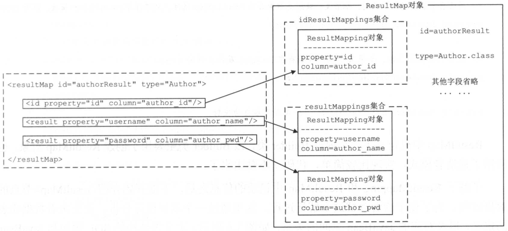

# 第3章 核心处理层

### 3.1 Mybatis初始化

Mybatis中的配置文件主要由两个，分别是mybatis-config.xml配置文件和映射配置文件。

在Mybatis初始化的过程中，除了会读取mybatis-config.xm配置文件以及映射配置文件，还会加载配置文件制定的类，处理类中的注解，创建一些配置对象，最终完成框架中各个模块的初始化。

Mybatis的初始化入口是SqlSessionFactoryBuilder.build()方法，其具体实现如下：

```java
public SqlSessionFactory build(Reader reader, String environment, Properties properties) {
    XMLConfigBuilder parser = new XMLConfigBuilder(reader, environment, properties);
    return build(parser.parse());
}
```

SqlSessionFactoryBuilder.build()方法会创建XMLConfigBuilder对象来解析mybatis-config.xml配置文件，而XMLConfigBuilder继承自BaseBuilder抽象类。

Mybatis的初始化过程使用了建造者模式，而BaseBuilder抽象类就扮演着建造者接口的角色。BaseBuilder中核心字段的含义如下：

```java
public abstract class BaseBuilder {
    /**
    Configuration是Mybatis初始化过程的核心对象，Mybatis中几乎全部的配置信息会保存到configuration对象中。configuration对象是在Mybatis初始化过程中创建且是全局唯一的
    */
  	protected final Configuration configuration;
    /**
    在mybatis-config.xml配置文件中可以使用<typeAliases>标签定义别名，这些定义的别名都会记录在该typeAliasRegistry对象中
    */
  	protected final TypeAliasRegistry typeAliasRegistry;
    /**
    在mybatis-config.xml配置文件中可以使用<typeHandlers>标签添加自定义TypeHandler器，完成指定数据库类型与Java类型的转换，这些TypeHandler都会记录在typeHandlerRegistry对象中。
    */
 	protected final TypeHandlerRegistry typeHandlerRegistry;
}
```

BaseBuilder中记录的TypeAliasRegistry对象和TypeHandlerRegistry对象，其实是全局唯一的，它们在Configuration对象初始化时创建的。在BaseBuilder构造函数值鸿，通过响应的configuration.get*()方法得到TypeAliasRegistry对象和TypeHandlerRegistry对象，并赋值给BaseBuilder相应字段。

### 3.1.3 XMLConfigBuilder

XMLConfigBuilder是BaseBuilder的众多子类之一，它扮演的是具体建造者的角色。XMLConfigBuilder主要负责解析mybatis-config.xml配置文件，其核心字段如下：

```java
public class XMLConfigBuilder extends BaseBuilder {
  	/**
  	标识是否已经解析过mybatis-config.xml配置文件
  	*/
    private boolean parsed;
    /**
  	用于解析mybatis-config.xml配置文件的XPathParser对象
  	*/
 	private XPathParser parser;
    /**
  	标识<environment>配置的名称，默认读取<environment>标签的default属性
  	*/
  	private String environment;
    /**
  	ReflectorFactory负责创阿金和缓存Reflector对象
  	*/
  	private ReflectorFactory localReflectorFactory = new DefaultReflectorFactory();
}
```

XMLConfigBuilder.parse()方法是解析mybatis-config.xml配置文件的入口，它通过调用XMLConfigBuilder.parseConfiguration(XNode)方法实现整个解析过程：

```java
private void parseConfiguration(XNode root) {
    // 解析<settings>节点
	Properties settings = settingsAsPropertiess(root.evalNode("settings"));
    // 解析<properties>节点
    propertiesElement(root.evalNode("properties"));
    // 设置vfsImpl字段
    loadCustomVfs(settings);
    // 设置typeAliases节点
    typeAliasesElement(root.evalNode("typeAliases"));
    // 解析<plugins>节点
    pluginElement(root.evalNode("plugins"));
    // 解析<objectFactory>节点
    objectFactoryElement(root.evalNode("objectFactory"));
    // 解析<objectWrapperFactory>节点
    objectWrapperFactoryElement(root.evalNode("objectWrapperFactory"));
    // 解析<reflectorFactory>节点
    reflectorFactoryElement(root.evalNode("reflectorFactory"));
    // 将settings值设置到Configuration对象中
    settingsElement(settings);
    // 解析<environments>节点
    environmentsElement(root.evalNode("environments"));
    // 解析<databaseIdProvider>节点
    databaseIdProviderElement(root.evalNode("databaseIdProvider"));
    // 解析<typeHandlers>节点
    typeHandlerElement(root.evalNode("typeHandlers"));
    // 解析<mappers>节点
    mapperElement(root.evalNode("mappers"));
}
```

XMLConfigBuilder.parseConfiguration()方法将mybatis-config.xml配置文件中每个节点的解析过程封装成了一个相应的方法。

#### 解析\<properties>节点

XMLConfigBuilder.propertiesElement()方法会解析mybatis-config.xml配置文件中\<properties>节点并形成java.util.Properties对象，之后该Properties对象设置到XPathParser和Configuration的variable字段中。在后面的解析过程中，会使用该Properties对象中的信息替换占位符。

#### 解析\<settings>节点

XMLConfigBuilder.settingsAsPropertiess()方法负责解析\<settings>节点下的配置是Mybatis全局性的配置，并设置到Configuration对象的相应字段中，它们会改变Mybatis的运行时行为。

#### 解析\<typeAliases>节点

XMLConfigBuilder.typeAliasesElement()方法负责解析\<typeAliases>节点及其子节点，并通过Configuration.typeAliasRegistry字段进行管理并完成别名的注册。

#### 解析\<glugins>节点

XMLConfigBuilder.pluginElement()方法负责解析\<glugins>节点下的配置。插件是Mybatis提供的扩展机制之一，用户可以通过添加自定义插件在SQL语句执行过程中的某一点进行拦截。Mybatis中的自定义插件只需要实现Interceptor接口，并通过注解指定想要拦截的方法签名即可。

所有配置的Interceptor对象都是通过Configuration.interceptorChain字段（org.apache.ibatis.plugin.InterceptorChain类型）管理的，InterceptorChain底层使用ArrayList\<Interceptor>实现。

#### 解析\<objectFactory>节点

可以通过添加自定义org.apache.ibatis.reflection.factory.ObjectFactory接口实现类、org.apache.ibatis.reflection.wrapper.ObjectWrapperFactory接口实现类以及org.apache.ibatis.reflection.ReflectorFactory接口实现类对Mybatis进行扩展。

XMLConfigBuilder.objectFactoryElement()方法负责解析并实例化\<objectFactory>节点指定的ObjectFactory实现类，之后将自定义的ObjectFactory对象记录到Configuration.objectFactory字段中。

XMLConfigBuilder对\<objectWrapperFactory>节点、\<reflectorFactory>节点的解析与上诉过程类似，最终会将解析得到的自定义对象记录到Configuration的相应字段中。

#### 解析\<environments>节点

在实际生产中，同一项目可能分为开发、测试和生产多个不同的环境，每个环境的配置可能也不尽相同。Mybatis可以配置多个\<environment>节点，每个\<environment>节点对应一种环境的配置。但是尽管可以配置多个环境，每个SqlSessionFactory实例只能选择其一。

XMLConfigBuilder.environmentsElement()方法负责解析\<environments>的相关配置，它会根据XMLConfigBuilder.environment字段值确定要使用的\<environment>配置，之后创建对应的TransactionFactory和DataSource对象，并封装仅Environment对象中，然后再将Environment对象记录到Configuration.environment字段中。

#### 解析\<databaseIdProvider>节点

Mybatis不能像Hibernate那样。直接屏蔽多种数据库产品在SQL语言支持方面的差异，但是在mybatis-config.xml配置文件中，通过\<databaseIdProvider>定义所有支持的数据库产品的databaseId，然后再映射配置文件中定义SQL语句节点时，通过databaseId指定该SQL语言应用的数据库产品，这样也可以实现类似的功能。

在Mybatis初始化时，会根据前面确定的DataSource确定当前使用的数据库产品，然后在解析映射配置文件时，加载不带databaseId属性和带有匹配当前数据库databaseId属性的所有SQL语句。如果同时找到带有databaseId和不带databaseId的相同语句，则后者会被舍弃，使用前者。

XMLConfigBuilder.databaseIdProviderElement()方法负责解析\<databaseIdProvider>节点，并创建指定的DatabaseIdProvider对象。DatabaseIdProvider会返回databaseId值，Mybatis会根据databaseId选择合适的SQL进行执行。

Mybatis提供的DatabaseIdProvider接口及其实现比较简单，其核心方法是getDatabaseId()方法，它主要负责通过给定的DataSource来查找对应的databaseId。Mybatis提供了VendorDatabaseIdProvider和DefaultDatabaseIdProvider，其中DefaultDatabaseIdProvider已过时。

VendorDatabaseIdProvider.getDatabaseId()方法在接收到DataSource对象时，会先解析DataSource所连接的数据库产品名称，之后根据\<databaseIdProvider>节点配置的数据库产品名称与databaseId的对应关系确定最终的databaseId。

最后将databaseId记录到Configuration.databaseId字段中。

#### 解析\<mappers>节点

在Mybatis初始化时，除了加载mybatis-config.xml配置文件，还会加载全部的映射配置文件。mybatis-config.xml配置文件中的\<mappers>节点会告诉Mybatis去哪些位置查找映射配置文件以及使用了配置注解标识的接口。

XMLConfigBuilder.mapperElement()方法负责解析\<mappers>节点，它会创建org.apache.ibatis.builder.xml.XMLMapperBuilder对象加载配置映射文件。如果映射配置文件存在相应的Mapper接口，也会加载相应的Mapper接口，解析其中的注解并完成向MapperRegistry的注册。

### 3.1.4 XMLMapperBuilder

XMLMapperBuilder负责解析映射配置文件，它继承了BaseBuilder抽象类，也是具体建造者的角色。XMLMapperBuilder.parse()方法是解析映射文件的入口：

```java
public void parse() {
    if (!configuration.isResourceLoaded(resource)) {
        configurationElement(parser.evalNode("/mapper"));
        configuration.addLoadedResource(resource);
        bindMapperForNamespace();
    }
    parsePendingResultMaps();
    parsePendingChacheRefs();
    parsePendingStatements();
}
```

XMLMapperBuilder也是将每个节点的解析过程封装成了一个方法，而这些方法由XMLMapperBuilder.configurationElement()方法调用：

```java
private void configurationElement(XNode context) {
    // 获取<mepper>节点的namespace属性，如果namespace属性为空，则抛出异常
    String namespace = context.getStringAttribute("namespace");
    if (namespace == null || namespace.equals("")) {
        throw new BuilderException("Mapper's namespace cannot be empty");
    }
    // 设置MapperBuilderAssistant的currentNamespace字段，记录当前命名空间
    builderAssistant.setCurrentNamespace(namespace);
    // 解析<cache-ref>节点
    cacheRefElement(context.evalNode("cache-ref"));
    // 解析<cache>节点
    cacheElement(context.evalNode("cache"));
    // 解析<parameterMap>节点（该节点已废弃，不再推荐使用）
    parameterMapElement(context.evalNodes("/mapper/parameterMap"));
    // 解析<resultMap>节点
    resultMapElements(context.evalNodes("/mapper/resultMap"));
    // 解析<sql>节点
    sqlElement(context.evalNodes("/mapper/sql"));
    // 解析<select>、<insert>、<update>、<delete>等SQL节点
    buildStatementFromContext(context.evalNodes("select|insert|update|delete")); 
}
```

#### 解析\<cache>节点

Mybatis拥有非常强大的二级缓存功能，该功能可以非常方便地进行配置，Mybatis默认情况下没有开启二级缓存，如果要为某个命名空间（namespace）开启二级缓存功能，需要在响应的映射配置文件中添加\<cache>节点，还可以通过配置\<cache>节点的相关属性，为二级缓存配置响应的特性。

XMLMapperBuilder.cacheElement()方法主要负责解析\<cache>节点，其具体实现如下：

```java
private void cacheElement(XNode context) throws Exception {
    if (context != null) {
        // 获取<cache>节点的type属性，默认值是PERPETUAL，对应的类型是org.apache.ibatis.cache.impl.PerpetualCache
        String type = context.getStringAttribute("type", "PERPETUAL");
        // 查找type属性对应的Cache接口实现
        Class<? extends Cache> typeClass = typeAliasRegistry.resolveAlias(type);
        // 获取<cache>节点的eviction属性，默认值是LRU
        String eviction = context.getStringAttribute("eviction", "LRU");
        // 解析eviction属性指定的Cache装饰器类型
        Class<? extends Cache> evictionClass = typeAliasRegistry.resolveAlias(eviction);
        // 获取<cache>节点的flushInterval属性，默认值是null
        Long flushInterval = context.getLongAttribute("flushInterval");
        // 获取<cache>节点的size属性，默认值是null
        Integer size = context.getIntAttribute("size");
        // 获取<cache>节点的readOnly属性，默认值是false
        boolean readWrite = !context.getBooleanAttribute("readOnly", false);
        // 获取<cache>节点的blocking属性，默认值是false
        boolean blocking = context.getBooleanAttribute("blocking", false);
        // 获取<cache>节点下的子节点，将用于初始化二级缓存
        Properties props = context.getChildrenAsProperties();
        // 通过MapperBuilderAssistant创建Cache对象，并添加到Configuration.caches集合中保存
        builderAssistant.useNewCache(typeClass, evictionClass, flushInterval, size, readWrite, blocking, props);
    }
}
```

MapperBuilderAssistant是一个辅助类，其useNewCache()方法负责创建Cache对象，并将其添加到Configuration.caches集合中保存。Configuration中的caches字段是org.apache.ibatis.session.Configuration.StrictMap\<Cache>类型的字段，它记录Cache的id（默认是映射文件的namespace）与Cache对象（二级缓存）之间的对应关系。

CacheBuilder是Cache的建造者，CacheBuilder中各个字段的含义如下：

```java
public class CacheBuilder {
    // Cache对象的唯一标识，一般情况下对应映射文件中的配置namespace
  	private String id;
    // Cache接口的真正实现类，默认值是PerpetualCache
  	private Class<? extends Cache> implementation;
    // 装饰器集合，默认只包含LruCache.class
  	private List<Class<? extends Cache>> decorators;
    // Cache的大小
  	private Integer size;
    // 清理时间周期
  	private Long clearInterval;
    // 是否可读写
  	private boolean readWrite;
    // 其他配置信息
  	private Properties properties;
    // 是否阻塞
  	private boolean blocking;
}
```

#### 解析\<cache-ref>节点

如果希望多个namespace共用一个二级缓存，即同一个Cache对象，则可以使用\<cache-ref>节点进行配置。

XMLMapperBuilder.cacheRefElement()方法负责解析\<cache-ref>节点，并将解析结果存到Configuration.cacheRefMap集合，该集合是HashMap\<String, String>类型，其中key是\<cache-ref>节点所在的namespace，value是\<cache-ref>节点的namespace属性指定的namespace。即：前者共用后者的Cache对象。


```java
private void cacheRefElement(XNode context) {
    if (context != null) {
        // 将当前的Mapper配置文件的namespace与被引用的Cache所在的namespace之间的对应关系，记录到Configuration.cacheRefMap集合中
        configuration.addCacheRef(builderAssistant.getCurrentNamespace(), context.getStringAttribute("namespace"));
     	// 创建CacheRefResolver对象
        CacheRefResolver cacheRefResolver = new CacheRefResolver(builderAssistant, context.getStringAttribute("namespace"));
        try {
            // 解析Cache引用，该过程主要是设置MapperBuilderAssistant中的currentCache和unresolveCacheRef();
            cacheRefResolver.resolveCacheRef();
        } catch (IncompleteElementException e) {
            // 如果解析过程出现异常，则添加到Configuration.incompleteCacheRefs集合，稍后再解析
            configuration.addIncompleteCacheRef(cacheRefResolver);
        }
    }
}
```

CacheRefResolver是一个简单的Cache引用解析器，其中封装了被引用的namespace以及当前XMLMapperBuilder对应的MapperBuilderAssistant对象。CacheRefResolver.resolveCacheRef()方法会调用MapperBuilderAssistant.useCacheRef()方法。在MapperBuilderAssistant.useCacheRef()方法中会通过namespace查找被引用的Cache对象。

```java
public Cache useCacheRef(String namespace) {
    // 省略try...catch()代码
    // 标识未成功解析Cache引用
    unresolvedCacheRef = true;
    // 获取namespace对应的Cache对象
    Cache cache = configuration.getCache(namespace);
    if (cache == null) {
        throw new IncompleteElementException("No cache for namespace '" + namespace + "' could be found.");
    }
    // 记录当前命名空间使用的Cache对象
    currentCache = cache;
    // 标识已成功解析Cache引用
    unresolvedCacheRef = false;
    return cache;
}
```

注：Configuration字段是incompleteCacheRefs集合，它是LinkedList\<CacheRefResolver>类型，其中记录了当前解析出现异常的CacheRefResolver对象。

#### 解析\<resultMap>节点

select语句查询得到的结果集时一张二维表。在JDBC编程中，为了将结果集中的数据映射成对象，需要写代码从结果集中获取数据，然后封装成对应的对象并设置对象之间的关系，这些都是重复性代码。为了减少这些重复的代码，Mybatis使用\<resultMap>节点定义了结果集与结果对象（POJO对象）之间的映射规则，\<resultMap>节点可以满足绝大部分的映射需求，从而减少开发人员的重复性劳动，提高开发效率。

每个ResultMapping对象记录结果集中的一列与JavaBean中一个属性之间的映射关系。\<resultMap>节点除了\<discriminator>子节点的其他子节点，都会被解析成对应的ResultMapping对象。ResultMapping中的核心字段含义如下：

```java
public class ResultMapping {
	// Configuration对象
    private Configuration configuration;
    // 对应节点的property属性，表示的是与该列进行映射的属性
    private String property;
    // 对应节点的column属性，表示的是从数据库中得到的列名或是列名的别名
    private String column;
    // 对应节点的javaType属性，表示的是一个JavaBean的完全限定名，或一个类型别名
    private Class<?> javaType;
    // 对应节点的jdbcType属性，表示的是进行映射的列的JDBC类型
    private JdbcType jdbcType;
    // 对应节点的typeHandler属性，表示的是类型处理器，它会覆盖默认的类型处理器
    private TypeHandler<?> typeHandler;
    //对应节点的resultMap属性，该属性通过id引用另一个<resultMap>节点定义，它负责将结果集中的一部分列映	 //射成其他关联的结果对象。这样就可以通过join方式进行关联查询，然后直接映射成多个对象，并同时设置这些对	   //象之间的组合关系
    private String nestedResultMapId;
    // 对应节点的select属性，该属性通过id引用了另一个<select>节点定义，它会把指定的类的值传入select属性指定的select语句中作为参数进行查询。使用select属性可能会导致N+1问题
    private String nestedQueryId;
    // 对应节点的notNullColumn属性拆分后的结果
    private Set<String> notNullColumns;
    // 对应节点的columnPrefix属性
    private String columnPrefix;
    // 处理后的标志，标志共两个：id和constructor
    private List<ResultFlag> flags;
    // 对应节点的column属性拆分后生成的结果，composites.size()>0会使column为null
    private List<ResultMapping> composites;
    // 对应节点的resultSet属性
    private String resultSet;
    // 对应节点的foreignColumn属性
    private String foreignColumn;
    // 是否延迟加载，对应节点的fetchType属性
    private boolean lazy;
}
```

每个\<resultMap>节点都会被解析成一个ResultMap对象。其中每个节点所定义的映射关系，则使用ResultMapping对象表示。



ResultMap中各个字段的含义如下：

```java
public class ResultMap {
    //<resultMap>节点的id属性
    private String id;
    // <resultMap>的type属性
    private Class<?> type;
    // 记录了除<discriminator>节点之外的其他映射关系（即ResultMapping对象集合）
    private List<ResultMapping> resultMappings;
    // 记录了映射关系这能够带有ID标志的映射关系，如<id>节点和<constrcuctor>节点的<idArg>子节点
    private List<ResultMapping> idResultMappings;
    // 记录了映射关系中带有Constructor标志的映射关系，如<constrcuctor>所有子元素
    private List<ResultMapping> constructorResultMappings;
    // 记录了映射关系中不带有Constructor标志的映射关系
    private List<ResultMapping> propertyResultMappings;
    // 记录所有映射关系中设计的column属性的集合
    private Set<String> mappedColumns;
    // 鉴别器，对应<discriminator>节点
    private Discriminator discriminator;
    // 是否含有嵌套结果映射，如果某个映射关系中存在resultMap属性，且不存在resultSet属性，则为true
    private boolean hasNestedResultMaps;
    // 是否含有嵌套查询，如果某个属性映射存在select属性，则为true
    private boolean hasNestedQueries;
    // 是否开启自动映射
    private Boolean autoMapping;
}
```

在XMLMapperBuilder中通过resultMapElements()方法解析映射配置文件中的全部\<resultMap>节点，该方法会循环调用resultMapElement()方法处理每个\<resultMap>节点。

```java
resultMapElements(context.evalNodes("/mapper/resultMap"));
// -------------
private void resultMapElements(List<XNode> list) throws Exception {
    for (XNode resultMapNode : list) {
        resultMapElement(resultMapNode);
    }
  }
```

resultMapElement()方法的具体实现如下：

```java
private ResultMap resultMapElement(XNode resultMapNode, List<ResultMapping> additionalResultMappings) throws Exception {
    ErrorContext.instance().activity("processing " + resultMapNode.getValueBasedIdentifier());
    // 获取<resultMap>的id属性，默认值会拼装成所有父节点的id或value或Property属性值
    String id = resultMapNode.getStringAttribute("id",
        resultMapNode.getValueBasedIdentifier());
    // 获取<resultMap>节点的type属性，表示结果集被映射成type指定类型的对象，注意其默认值：type > 	
    //ofType > resultType > javaType
    String type = resultMapNode.getStringAttribute("type",
        resultMapNode.getStringAttribute("ofType",
            resultMapNode.getStringAttribute("resultType",
                resultMapNode.getStringAttribute("javaType"))));
    // 获取<resultMap>节点的extendd属性，该属性指定了该<resultMap>节点的继承关系
    String extend = resultMapNode.getStringAttribute("extends");
    // 读取<resultMap>节点的autoMapping属性，将该属性设置为true，则启动自动映射功能，即自动查找与列名
    //同名的属性名，并调用setter方法。而设置为false后，则需要在<resultMap>节点内明确注明映射关系才会调
    //用对应的setter方法
    Boolean autoMapping = resultMapNode.getBooleanAttribute("autoMapping");
    // ...
    ResultMapResolver resultMapResolver = new ResultMapResolver(builderAssistant, id, typeClass, extend, discriminator, resultMappings, autoMapping);
    try {
        // 创建ResultMap对象，并添加到Configuration.resultMaps集合中，该集合是strictMap类型
      return resultMapResolver.resolve();
    } catch (IncompleteElementException  e) {
      configuration.addIncompleteResultMap(resultMapResolver);
      throw e;
    }
  }
```

#### 解析\<sql>节点

在映射配置文件中，可以使用\<sql>节点定义可重用的SQL语句片段。当需要重用\<sql>节点中鸿定义的SQL语句片段时，只需要使用\<include>节点引入相应的SQL片段即可。这样在编写SQL语句以及维护这些SQL语句时都会比较方便。

```java
private void sqlElement(List<XNode> list, String requiredDatabaseId) throws Exception {
    // 遍历<sql>节点
    for (XNode context : list) {
        // 获取databaseId属性
        String databaseId = context.getStringAttribute("databaseId");
        // 获取id属性
        String id = context.getStringAttribute("id");
        // 为id添加命名空间
        id = builderAssistant.applyCurrentNamespace(id, false);
        if (databaseIdMatchesCurrent(id, databaseId, requiredDatabaseId)) {
            // 记录到XMLMapperBuilder.sqlFragments(Map<String,XNode>类型)中保存，在记录到
            //XMLMapperBuilder的构造函数中，可以看到该字段指向了Configuration.sqlFragments集合
            sqlFragments.put(id, context);
        }
    }
}
```

### 3.1.5 XMLStatementBuilder

SQL杰思娜主要用于定义SQL语句，它们不再由XMLMapperBuilder进行解析，而是由XMLStatementBuilder负责进行解析。

Mybatis使用SqlSource接口表示映射文件或注解中定义的SQL语句，但它表示的SQL语句是不能直接被数据库执行的，因为其中可能含有动态SQL语句相关的节点或是占位符等需要解析的元素。

SqlSource接口的定义如下：

```java
public interface SqlSource {
  	// getBoundSql()方法会根据映射文件或注解描述的SQL语句，以及传入的参数，返回可执行的SQL
  	BoundSql getBoundSql(Object parameterObject);
}
```

Mybatis使用MappedStatement表示映射配置文件中定义的SQL节点，MappedStatement包含了这些节点的很多属性，其中比较重要的字段如下：

```java
public final class MappedStatement {
	// 节点中的id属性（包括命名空间前缀）
    private String resource;
    // SqlSource对象，对应一条SQL语句
    private SqlSource sqlSource;
    // SQL的类型，INSERT、UPDATE、DELETE、SELECT或PLUSH
    private SqlCommandType sqlCommandType;
    //...
}
```

XMLStatementBuilder.parseStatementNode()方法是解析SQL节点的入口函数，其具体实现如下：

获取SQL节点的id以及databaseId属性，若其databaseId属性值与当前使用的数据库不匹配，则不加载该SQL节点；若存在相同id且databaseId不为空的SQL节点，则不再加载该SQL节点。

获取SQL节点的多种属性值，如：fetchSize、timeout、parameterType、resultMap、resultType等等。

根据SQL节点的名称决定其SqlCommandType

```java
String nodeName = context.getNode().getNodeName();
    SqlCommandType sqlCommandType = SqlCommandType.valueOf(nodeName.toUpperCase(Locale.ENGLISH));
```

在解析SQL语句之前，先处理其中的\<include>节点：

```java
XMLIncludeTransformer includeParser = new XMLIncludeTransformer(configuration, 
                                                                builderAssistant);
includeParser.applyIncludes(context.getNode());
```

处理\<selectKey>节点：

```java
processSelectKeyNodes(id, parameterTypeClass, langDriver);
```

完成SQL节点的解析....，该部分是parseStatementNode()方法的核心。

#### 解析\<include>节点

在解析SQL节点之前，首先通过XMLIncludeTransformer解析SQL语句中的\<include>节点，该过程会将\<include>节点替换成\<sql>节点中定义的SQL片段，并将其中的“${xxx}”占位符替换成真实的参数，该解析过程是在XMLIncludeTransformer.applyIncludes()方法中实现的：

```java
public void applyIncludes(Node source) {
    // Huoqu mybatis-config.xml中<Properties>节点下定义的变量集合
    Properties variablesContext = new Properties();
    Properties configurationVariables = configuration.getVariables();
    if (configurationVariables != null) {
        variablesContext.putAll(configurationVariables);
    }
    // 处理<include>子节点
    applyIncludes(source, variablesContext);
}
```

方法的递归调用.png)

\<include>节点和\<sql>节点可以配合使用、多层嵌套，实现更加复杂的sql片段的重用。

#### 解析\<selectKey>节点

XMLStatementBuilder.processSelectKeyNodes(String, Class<?>, LanguageDriver)方法负责解析SQL节点中的\<selectKey>子节点：

```java
private void processSelectKeyNodes(String id, Class<?> parameterTypeClass, LanguageDriver langDriver) {
    // 获取全部的<selectKey>节点
    List<XNode> selectKeyNodes = context.evalNodes("selectKey");
    // 解析<selectKey>节点
    if (configuration.getDatabaseId() != null) {
        parseSelectKeyNodes(id, selectKeyNodes, parameterTypeClass, langDriver, configuration.getDatabaseId());
    }
    parseSelectKeyNodes(id, selectKeyNodes, parameterTypeClass, langDriver, null);
    // 移除<selectKey>节点
    removeSelectKeyNodes(selectKeyNodes);
}
```

在XMLStatementBuilder.parseSelectKeyNodes()方法中，首先读取\<selectKey>节点的一系列属性，然后调用LanguageDriver.createSqlSource()方法创建对应的SqlSource对象，最后创建MappedStatement对象，并添加到Configuration.mappedStatements集合中保存。

在Mybatis中，默认的LanguageDriver实现类org.apache.ibatis.scripting.xmltags.XMLLanguageDriver。

在XMLLanguageDriver.createSqlSource()方法中会创建XMLScriptBuilder对象并调用XMLScriptBuilder.parseScriptNode()方法创建SqlSource对象：

```java
public SqlSource parseScriptNode() {
    // 首先判断当前节点是否有动态SQL，动态SQL会包含占位符或是动态SQL的相关节点
    List<SqlNode> contents = parseDynamicTags(context);
    // SqlNode集合包装成一MixedSqlNode
    MixedSqlNode rootSqlNode = new MixedSqlNode(contents);
    SqlSource sqlSource = null;
    if (isDynamic) {
        // 根据是否是动态SQL，创建相应的SqlSource对象
        sqlSource = new DynamicSqlSource(configuration, rootSqlNode);
    } else {
        sqlSource = new RawSqlSource(configuration, rootSqlNode, parameterType);
    }
    return sqlSource;
}
```

在XMLLanguageDriver.parseDynamicTags()方法中，会遍历\<selectKey>下的每个节点，如果包含任何标签点，则认为是动态SQL语句；Eugene文本节点中含有“${}”占位符，也认为其为动态SQL语句。

SqlNode接口的每个市县都对应于不同的动态SQL节点类型。

如果\<selectKey>节点下存在其他标签，则会调用nodeHandlers()方法根据标签名称创建对应的NodeHandler对象：

```java
NodeHandler nodeHandlers(String nodeName) {
    Map<String, NodeHandler> map = new HashMap<String, NodeHandler>();
    map.put("trim", new TrimHandler());
    map.put("where", new WhereHandler());
    map.put("set", new SetHandler());
    map.put("foreach", new ForEachHandler());
    map.put("if", new IfHandler());
    map.put("choose", new ChooseHandler());
    map.put("when", new IfHandler());
    map.put("otherwise", new OtherwiseHandler());
    map.put("bind", new BindHandler());
    return map.get(nodeName);
}
```

NodeHandler接口实现类会根据不同的动态SQL标签进行解析，生成对应的SqlNode对象，并将其添加到contents集合中。

#### 解析SQL节点

经过上述两个解析过程之后，\<include>节点和\<selectKey>节点已经被解析并删除掉了。XMLStatementBuilder.parseStatementNode()方法剩余的操作就是解析SQL节点。

### 3.1.6 绑定Mapper接口

每个映射配置文件的命名空间可以绑定一个Mapper接口，并注册到MapperRegistry中。在XMLMapperBuilder.bindMapperForNamespace()方法中，完成了映射配置文件对应的Mapper接口的绑定。

```java
private void bindMapperForNamespace() {
    // 获取映射配置文件的命名空间
    String namespace = builderAssistant.getCurrentNamespace();
    if (namespace != null) {
        // 解析命名空间对应的类型
        Class<?> boundType = boundType = Resources.classForName(namespace);
        if (boundType != null) {
            // 追加namespace前缀，并添加到Configuration.loadedResources集合中保存
            if (!configuration.hasMapper(boundType)) {
                configuration.addLoadedResource("namespace:" + namespace);
                // 调用MapperRegistry.addMapper()方法，注册boundType接口
                configuration.addMapper(boundType);
            }
        }
    }
}
```

在MapperRegistry.addMapper()方法时，该方法还会创建MapperAnnotationBuilder，并调用MapperAnnotationBuilder.parse()方法解析Mapper接口中的注册信息：

```java
public void parse() {
    String resource = type.toString();
    // 检测是否已经加载过该接口
    if (!configuration.isResourceLoaded(resource)) {
        // 检测是否加载过对应的映射配置文件，如果未加载，则创建XMLMapperBuilder对象解析对应的映射文件,
        //该过程就是映射配置文件解析过程
        loadXmlResource();
        configuration.addLoadedResource(resource);
        assistant.setCurrentNamespace(type.getName());
        // 解析@CacheNamespace注解
        parseCache();
        // 解析@CacheNamespaceRef注解
        parseCacheRef();
        // 获取接口中定义的全部方法
        Method[] methods = type.getMethods();
        for (Method method : methods) {
            try {
                // issue #237
                if (!method.isBridge()) {
                    // 解析@SelectKey、@ResultMap等注解，并创建MappedStatement对象
                    parseStatement(method);
                }
            } catch (IncompleteElementException e) {
                // 如果解析过程出现IncompleteElementException异常，可能是引用了未解析的注解，这里
                // 将出现异常的方法添加到Configuration.incompleteMethods集合中暂存，该集合是
                // LinkedList<MethodResolver>类型
                configuration.addIncompleteMethod(new MethodResolver(this, method));
            }
        }
    }
    // 遍历Configuration.incompleteMethods集合中记录的未解析的方法，并重新进行解析
    parsePendingMethods();
}
```

### 3.1.7 处理incomplete*集合

XMLMapperBuilder.configurationElement()方法解析映射配置文件时，是按照从文件头到文件尾的顺序解析的，但是有时候在解析一个节点时，会引用定义在该节点之后的、还未解析的节点，这就会导致解析失败并抛出IncompleteElementException。

根据抛出异常的节点不同，Mybatis会创建不同的*Resolver对象，并添加到Configuration的不同incomplete*集合中。如解析Mapper接口中的方法出现异常时，会创建MethodResolver对象，并将其追加到Configuration.incompleteMethods集合中暂存。

在XMLMapperBuilder.parse()方法中可以看到，每次执行完相应节点的解析，都会再次进行执行解析该节点的异常解析。如果还是无法解析，则会忽略该节点。

## 3.2 SqlNode&SqlSource


