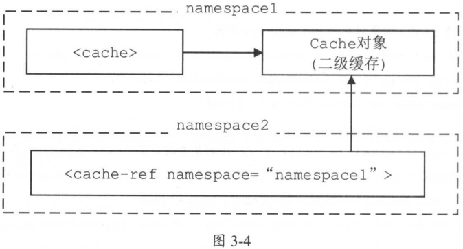

# 第3章 核心处理层

### 3.1 Mybatis初始化

Mybatis中的配置文件主要由两个，分别是mybatis-config.xml配置文件和映射配置文件。

在Mybatis初始化的过程中，除了会读取mybatis-config.xm配置文件以及映射配置文件，还会加载配置文件制定的类，处理类中的注解，创建一些配置对象，最终完成框架中各个模块的初始化。

Mybatis的初始化入口是SqlSessionFactoryBuilder.build()方法，其具体实现如下：

```java
public SqlSessionFactory build(Reader reader, String environment, Properties properties) {
    XMLConfigBuilder parser = new XMLConfigBuilder(reader, environment, properties);
    return build(parser.parse());
}
```

SqlSessionFactoryBuilder.build()方法会创建XMLConfigBuilder对象来解析mybatis-config.xml配置文件，而XMLConfigBuilder继承自BaseBuilder抽象类。

Mybatis的初始化过程使用了建造者模式，而BaseBuilder抽象类就扮演着建造者接口的角色。BaseBuilder中核心字段的含义如下：

```java
public abstract class BaseBuilder {
    /**
    Configuration是Mybatis初始化过程的核心对象，Mybatis中几乎全部的配置信息会保存到configuration对象中。configuration对象是在Mybatis初始化过程中创建且是全局唯一的
    */
  	protected final Configuration configuration;
    /**
    在mybatis-config.xml配置文件中可以使用<typeAliases>标签定义别名，这些定义的别名都会记录在该typeAliasRegistry对象中
    */
  	protected final TypeAliasRegistry typeAliasRegistry;
    /**
    在mybatis-config.xml配置文件中可以使用<typeHandlers>标签添加自定义TypeHandler器，完成指定数据库类型与Java类型的转换，这些TypeHandler都会记录在typeHandlerRegistry对象中。
    */
 	protected final TypeHandlerRegistry typeHandlerRegistry;
}
```

BaseBuilder中记录的TypeAliasRegistry对象和TypeHandlerRegistry对象，其实是全局唯一的，它们在Configuration对象初始化时创建的。在BaseBuilder构造函数值鸿，通过响应的configuration.get*()方法得到TypeAliasRegistry对象和TypeHandlerRegistry对象，并赋值给BaseBuilder相应字段。

### 3.1.3 XMLConfigBuilder

XMLConfigBuilder是BaseBuilder的众多子类之一，它扮演的是具体建造者的角色。XMLConfigBuilder主要负责解析mybatis-config.xml配置文件，其核心字段如下：

```java
public class XMLConfigBuilder extends BaseBuilder {
  	/**
  	标识是否已经解析过mybatis-config.xml配置文件
  	*/
    private boolean parsed;
    /**
  	用于解析mybatis-config.xml配置文件的XPathParser对象
  	*/
 	private XPathParser parser;
    /**
  	标识<environment>配置的名称，默认读取<environment>标签的default属性
  	*/
  	private String environment;
    /**
  	ReflectorFactory负责创阿金和缓存Reflector对象
  	*/
  	private ReflectorFactory localReflectorFactory = new DefaultReflectorFactory();
}
```

XMLConfigBuilder.parse()方法是解析mybatis-config.xml配置文件的入口，它通过调用XMLConfigBuilder.parseConfiguration(XNode)方法实现整个解析过程：

```java
private void parseConfiguration(XNode root) {
    // 解析<settings>节点
	Properties settings = settingsAsPropertiess(root.evalNode("settings"));
    // 解析<properties>节点
    propertiesElement(root.evalNode("properties"));
    // 设置vfsImpl字段
    loadCustomVfs(settings);
    // 设置typeAliases节点
    typeAliasesElement(root.evalNode("typeAliases"));
    // 解析<plugins>节点
    pluginElement(root.evalNode("plugins"));
    // 解析<objectFactory>节点
    objectFactoryElement(root.evalNode("objectFactory"));
    // 解析<objectWrapperFactory>节点
    objectWrapperFactoryElement(root.evalNode("objectWrapperFactory"));
    // 解析<reflectorFactory>节点
    reflectorFactoryElement(root.evalNode("reflectorFactory"));
    // 将settings值设置到Configuration对象中
    settingsElement(settings);
    // 解析<environments>节点
    environmentsElement(root.evalNode("environments"));
    // 解析<databaseIdProvider>节点
    databaseIdProviderElement(root.evalNode("databaseIdProvider"));
    // 解析<typeHandlers>节点
    typeHandlerElement(root.evalNode("typeHandlers"));
    // 解析<mappers>节点
    mapperElement(root.evalNode("mappers"));
}
```

XMLConfigBuilder.parseConfiguration()方法将mybatis-config.xml配置文件中每个节点的解析过程封装成了一个相应的方法。

#### 解析\<properties>节点

XMLConfigBuilder.propertiesElement()方法会解析mybatis-config.xml配置文件中\<properties>节点并形成java.util.Properties对象，之后该Properties对象设置到XPathParser和Configuration的variable字段中。在后面的解析过程中，会使用该Properties对象中的信息替换占位符。

#### 解析\<settings>节点

XMLConfigBuilder.settingsAsPropertiess()方法负责解析\<settings>节点下的配置是Mybatis全局性的配置，并设置到Configuration对象的相应字段中，它们会改变Mybatis的运行时行为。

#### 解析\<typeAliases>节点

XMLConfigBuilder.typeAliasesElement()方法负责解析\<typeAliases>节点及其子节点，并通过Configuration.typeAliasRegistry字段进行管理并完成别名的注册。

#### 解析\<glugins>节点

XMLConfigBuilder.pluginElement()方法负责解析\<glugins>节点下的配置。插件是Mybatis提供的扩展机制之一，用户可以通过添加自定义插件在SQL语句执行过程中的某一点进行拦截。Mybatis中的自定义插件只需要实现Interceptor接口，并通过注解指定想要拦截的方法签名即可。

所有配置的Interceptor对象都是通过Configuration.interceptorChain字段（org.apache.ibatis.plugin.InterceptorChain类型）管理的，InterceptorChain底层使用ArrayList\<Interceptor>实现。

#### 解析\<objectFactory>节点

可以通过添加自定义org.apache.ibatis.reflection.factory.ObjectFactory接口实现类、org.apache.ibatis.reflection.wrapper.ObjectWrapperFactory接口实现类以及org.apache.ibatis.reflection.ReflectorFactory接口实现类对Mybatis进行扩展。

XMLConfigBuilder.objectFactoryElement()方法负责解析并实例化\<objectFactory>节点指定的ObjectFactory实现类，之后将自定义的ObjectFactory对象记录到Configuration.objectFactory字段中。

XMLConfigBuilder对\<objectWrapperFactory>节点、\<reflectorFactory>节点的解析与上诉过程类似，最终会将解析得到的自定义对象记录到Configuration的相应字段中。

#### 解析\<environments>节点

在实际生产中，同一项目可能分为开发、测试和生产多个不同的环境，每个环境的配置可能也不尽相同。Mybatis可以配置多个\<environment>节点，每个\<environment>节点对应一种环境的配置。但是尽管可以配置多个环境，每个SqlSessionFactory实例只能选择其一。

XMLConfigBuilder.environmentsElement()方法负责解析\<environments>的相关配置，它会根据XMLConfigBuilder.environment字段值确定要使用的\<environment>配置，之后创建对应的TransactionFactory和DataSource对象，并封装仅Environment对象中，然后再将Environment对象记录到Configuration.environment字段中。

#### 解析\<databaseIdProvider>节点

Mybatis不能像Hibernate那样。直接屏蔽多种数据库产品在SQL语言支持方面的差异，但是在mybatis-config.xml配置文件中，通过\<databaseIdProvider>定义所有支持的数据库产品的databaseId，然后再映射配置文件中定义SQL语句节点时，通过databaseId指定该SQL语言应用的数据库产品，这样也可以实现类似的功能。

在Mybatis初始化时，会根据前面确定的DataSource确定当前使用的数据库产品，然后在解析映射配置文件时，加载不带databaseId属性和带有匹配当前数据库databaseId属性的所有SQL语句。如果同时找到带有databaseId和不带databaseId的相同语句，则后者会被舍弃，使用前者。

XMLConfigBuilder.databaseIdProviderElement()方法负责解析\<databaseIdProvider>节点，并创建指定的DatabaseIdProvider对象。DatabaseIdProvider会返回databaseId值，Mybatis会根据databaseId选择合适的SQL进行执行。

Mybatis提供的DatabaseIdProvider接口及其实现比较简单，其核心方法是getDatabaseId()方法，它主要负责通过给定的DataSource来查找对应的databaseId。Mybatis提供了VendorDatabaseIdProvider和DefaultDatabaseIdProvider，其中DefaultDatabaseIdProvider已过时。

VendorDatabaseIdProvider.getDatabaseId()方法在接收到DataSource对象时，会先解析DataSource所连接的数据库产品名称，之后根据\<databaseIdProvider>节点配置的数据库产品名称与databaseId的对应关系确定最终的databaseId。

最后将databaseId记录到Configuration.databaseId字段中。

#### 解析\<mappers>节点

在Mybatis初始化时，除了加载mybatis-config.xml配置文件，还会加载全部的映射配置文件。mybatis-config.xml配置文件中的\<mappers>节点会告诉Mybatis去哪些位置查找映射配置文件以及使用了配置注解标识的接口。

XMLConfigBuilder.mapperElement()方法负责解析\<mappers>节点，它会创建org.apache.ibatis.builder.xml.XMLMapperBuilder对象加载配置映射文件。如果映射配置文件存在相应的Mapper接口，也会加载相应的Mapper接口，解析其中的注解并完成向MapperRegistry的注册。

### 3.1.4 XMLMapperBuilder

XMLMapperBuilder负责解析映射配置文件，它继承了BaseBuilder抽象类，也是具体建造者的角色。XMLMapperBuilder.parse()方法是解析映射文件的入口：

```java
public void parse() {
    if (!configuration.isResourceLoaded(resource)) {
        configurationElement(parser.evalNode("/mapper"));
        configuration.addLoadedResource(resource);
        bindMapperForNamespace();
    }
    parsePendingResultMaps();
    parsePendingChacheRefs();
    parsePendingStatements();
}
```

XMLMapperBuilder也是将每个节点的解析过程封装成了一个方法，而这些方法由XMLMapperBuilder.configurationElement()方法调用：

```java
private void configurationElement(XNode context) {
    // 获取<mepper>节点的namespace属性，如果namespace属性为空，则抛出异常
    String namespace = context.getStringAttribute("namespace");
    if (namespace == null || namespace.equals("")) {
        throw new BuilderException("Mapper's namespace cannot be empty");
    }
    // 设置MapperBuilderAssistant的currentNamespace字段，记录当前命名空间
    builderAssistant.setCurrentNamespace(namespace);
    // 解析<cache-ref>节点
    cacheRefElement(context.evalNode("cache-ref"));
    // 解析<cache>节点
    cacheElement(context.evalNode("cache"));
    // 解析<parameterMap>节点（该节点已废弃，不再推荐使用）
    parameterMapElement(context.evalNodes("/mapper/parameterMap"));
    // 解析<resultMap>节点
    resultMapElements(context.evalNodes("/mapper/resultMap"));
    // 解析<sql>节点
    sqlElement(context.evalNodes("/mapper/sql"));
    // 解析<select>、<insert>、<update>、<delete>等SQL节点
    buildStatementFromContext(context.evalNodes("select|insert|update|delete")); 
}
```

#### 解析\<cache>节点

Mybatis拥有非常强大的二级缓存功能，该功能可以非常方便地进行配置，Mybatis默认情况下没有开启二级缓存，如果要为某个命名空间（namespace）开启二级缓存功能，需要在响应的映射配置文件中添加\<cache>节点，还可以通过配置\<cache>节点的相关属性，为二级缓存配置响应的特性。

XMLMapperBuilder.cacheElement()方法主要负责解析\<cache>节点，其具体实现如下：

```java
private void cacheElement(XNode context) throws Exception {
    if (context != null) {
        // 获取<cache>节点的type属性，默认值是PERPETUAL，对应的类型是org.apache.ibatis.cache.impl.PerpetualCache
        String type = context.getStringAttribute("type", "PERPETUAL");
        // 查找type属性对应的Cache接口实现
        Class<? extends Cache> typeClass = typeAliasRegistry.resolveAlias(type);
        // 获取<cache>节点的eviction属性，默认值是LRU
        String eviction = context.getStringAttribute("eviction", "LRU");
        // 解析eviction属性指定的Cache装饰器类型
        Class<? extends Cache> evictionClass = typeAliasRegistry.resolveAlias(eviction);
        // 获取<cache>节点的flushInterval属性，默认值是null
        Long flushInterval = context.getLongAttribute("flushInterval");
        // 获取<cache>节点的size属性，默认值是null
        Integer size = context.getIntAttribute("size");
        // 获取<cache>节点的readOnly属性，默认值是false
        boolean readWrite = !context.getBooleanAttribute("readOnly", false);
        // 获取<cache>节点的blocking属性，默认值是false
        boolean blocking = context.getBooleanAttribute("blocking", false);
        // 获取<cache>节点下的子节点，将用于初始化二级缓存
        Properties props = context.getChildrenAsProperties();
        // 通过MapperBuilderAssistant创建Cache对象，并添加到Configuration.caches集合中保存
        builderAssistant.useNewCache(typeClass, evictionClass, flushInterval, size, readWrite, blocking, props);
    }
}
```

MapperBuilderAssistant是一个辅助类，其useNewCache()方法负责创建Cache对象，并将其添加到Configuration.caches集合中保存。Configuration中的caches字段是org.apache.ibatis.session.Configuration.StrictMap\<Cache>类型的字段，它记录Cache的id（默认是映射文件的namespace）与Cache对象（二级缓存）之间的对应关系。

CacheBuilder是Cache的建造者，CacheBuilder中各个字段的含义如下：

```java
public class CacheBuilder {
    // Cache对象的唯一标识，一般情况下对应映射文件中的配置namespace
  	private String id;
    // Cache接口的真正实现类，默认值是PerpetualCache
  	private Class<? extends Cache> implementation;
    // 装饰器集合，默认只包含LruCache.class
  	private List<Class<? extends Cache>> decorators;
    // Cache的大小
  	private Integer size;
    // 清理时间周期
  	private Long clearInterval;
    // 是否可读写
  	private boolean readWrite;
    // 其他配置信息
  	private Properties properties;
    // 是否阻塞
  	private boolean blocking;
}
```

#### 解析\<cache-ref>节点

如果希望多个namespace共用一个二级缓存，即同一个Cache对象，则可以使用\<cache-ref>节点进行配置。

XMLMapperBuilder.cacheRefElement()方法负责解析\<cache-ref>节点，并将解析结果存到Configuration.cacheRefMap集合，该集合是HashMap\<String, String>类型，其中key是\<cache-ref>节点所在的namespace，value是\<cache-ref>节点的namespace属性指定的namespace。即：前者共用后者的Cache对象。



```java
private void cacheRefElement(XNode context) {
    if (context != null) {
        // 将当前的Mapper配置文件的namespace与被引用的Cache所在的namespace之间的对应关系，记录到Configuration.cacheRefMap集合中
        configuration.addCacheRef(builderAssistant.getCurrentNamespace(), context.getStringAttribute("namespace"));
     	// 创建CacheRefResolver对象
        CacheRefResolver cacheRefResolver = new CacheRefResolver(builderAssistant, context.getStringAttribute("namespace"));
        try {
            // 解析Cache引用，该过程主要是设置MapperBuilderAssistant中的currentCache和unresolveCacheRef();
            cacheRefResolver.resolveCacheRef();
        } catch (IncompleteElementException e) {
            // 如果解析过程出现异常，则添加到Configuration.incompleteCacheRefs集合，稍后再解析
            configuration.addIncompleteCacheRef(cacheRefResolver);
        }
    }
}
```

CacheRefResolver是一个简单的Cache引用解析器，其中封装了被引用的namespace以及当前XMLMapperBuilder对应的MapperBuilderAssistant对象。CacheRefResolver.resolveCacheRef()方法会调用MapperBuilderAssistant.useCacheRef()方法。在MapperBuilderAssistant.useCacheRef()方法中会通过namespace查找被引用的Cache对象。

```java
public Cache useCacheRef(String namespace) {
    // 省略try...catch()代码
    // 标识未成功解析Cache引用
    unresolvedCacheRef = true;
    // 获取namespace对应的Cache对象
    Cache cache = configuration.getCache(namespace);
    if (cache == null) {
        throw new IncompleteElementException("No cache for namespace '" + namespace + "' could be found.");
    }
    // 记录当前命名空间使用的Cache对象
    currentCache = cache;
    // 标识已成功解析Cache引用
    unresolvedCacheRef = false;
    return cache;
}
```

注：Configuration字段是incompleteCacheRefs集合，它是LinkedList\<CacheRefResolver>类型，其中记录了当前解析出现异常的CacheRefResolver对象。

#### 解析\<resultMap>节点


