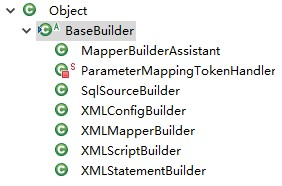

## SqlSessionFactoryBuilder

Mybatis通过读取mybatis-config.xml文件，将解析后的信息加载到Configuration对象中，Mybatis在运行时根据Configuration对象的信息进行相应的操作。

SqlSessionFactoryBuilder是Mybatis读取配置mybatis-config.xml文件的入口：

```java
public SqlSessionFactory build(Reader reader, String environment, Properties properties) {
    XMLConfigBuilder parser = new XMLConfigBuilder(reader, environment, properties);
    return build(parser.parse());
  }
```

XMLConfigBuilder是负责解析mybatis-config.xml文件的对象，它继承自BaseBuilder类。BaseBuilder类说明：

```java
public abstract class BaseBuilder {
    // Configuration是Mybatis的核心对象,Mybatis运行时的配置信息都会存在此对象中
    protected final Configuration configuration;
    // 类别名存储对象，存储Mybatis默认的别名和用户自定义的别名
    protected final TypeAliasRegistry typeAliasRegistry;
    // TypeHandler存储对象，存储了Mybatis定义的TypeHandler和用户自定义的TypeHandler
    protected final TypeHandlerRegistry typeHandlerRegistry;
    
    // BaseBuilder的构造函数
    public BaseBuilder(Configuration configuration) {
    this.configuration = configuration;
    this.typeAliasRegistry = this.configuration.getTypeAliasRegistry();
    this.typeHandlerRegistry = this.configuration.getTypeHandlerRegistry();
  }
}
```

其中TypeHandlerRegistry和TypeAliasRegistry对象都是Configuration对象初始化时创建的。

BaseBuilder的继承关系图如下：



BaseBuilder的这些子类后面会进行说明。

## XMLConfigBuilder

XMLConfigBuilder是BaseBuilder的子类之一，作用是具体的建造者的角色，负责解析mybatis-config.xml配置文件，其核心字段如下：

```java
public class XMLConfigBuilder extends BaseBuilder {
	// 标识是否已经解析过mybatis-config.xml配置文件
    private boolean parsed;
    // 用于解析mybatis-config.xml的XPathParser对象
    private final XPathParser parser;
    // 标识<environment>配置的名称，默认读取<environment>标签的default属性
    private String environment;
    // localReflectorFactory负责创建和缓存Reflector对象
    private final ReflectorFactory localReflectorFactory = new DefaultReflectorFactory();
}
```

继续跟踪XMLConfigBuilder#parse()内代码：

```java
// XMLConfigBuilder#parseConfiguration()方法：
private void parseConfiguration(XNode root) {
    // 解析<properties>节点
    propertiesElement(root.evalNode("properties"));
    // 解析<settings>节点
    Properties settings = settingsAsProperties(root.evalNode("settings"));
    // 设置vfsImpl字段
    loadCustomVfs(settings);
    // 解析<typeAliases>节点
    typeAliasesElement(root.evalNode("typeAliases"));
    // 解析<plugins>节点
    pluginElement(root.evalNode("plugins"));
    // 解析<objectFactory>节点
    objectFactoryElement(root.evalNode("objectFactory"));
    // 解析<objectWrapperFactory>节点
    objectWrapperFactoryElement(root.evalNode("objectWrapperFactory"));
    // 解析<reflectorFactory>节点
    reflectorFactoryElement(root.evalNode("reflectorFactory"));
    // 将settings值设置到Configuration中
    settingsElement(settings);
    // 解析<environments>节点
    environmentsElement(root.evalNode("environments"));
    // 解析<databaseIdProvider>节点
    databaseIdProviderElement(root.evalNode("databaseIdProvider"));
    // 解析<typeHandlers>节点
    typeHandlerElement(root.evalNode("typeHandlers"));
    // 解析<mappers>节点
    mapperElement(root.evalNode("mappers"));
}
```

### 解析\<properties>节点

XMLConfigBuilder.propertiesElement()方法会解析mybatis-config.xml配置文件中的\<properties>节点并形成Properties对象，之后将该Properties对象设置到XPathParser和Configuration的variables字段中。在后面的解析过程中，会使用该Properties对象中的信息替换占位符。

```java
private void propertiesElement(XNode context) throws Exception {
    if (context != null) {
        // 解析<properties>的子节点（标签<property>标签）的name和value属性，并记录到Properties中
        Properties defaults = context.getChildrenAsProperties();
        // 解析<properties>的resource和url属性，这两个属性用于确定properties配置文件的位置
        String resource = context.getStringAttribute("resource");
        String url = context.getStringAttribute("url");
        // resource和url属性不能同时存在，否则会抛出异常
        if (resource != null && url != null) {
            throw new BuilderException("...");
        }
        // 加载resource属性或url指定的properties文件
        if (resource != null) {
            defaults.putAll(Resources.getResourceAsProperties(resource));
        } else if (url != null) {
            defaults.putAll(Resources.getUrlAsProperties(url));
        }
        // 与Configuration对象中的variables集合合并
        Properties vars = configuration.getVariables();
        if (vars != null) {
            defaults.putAll(vars);
        }
        // 更新XPathParser和Configuration的variables字段
        parser.setVariables(defaults);
        configuration.setVariables(defaults);
    }
}
```

### 解析\<settings>节点

XMLConfigBuilder.settingsAsProperties()方法负责解析\<settings>节点，在\<settings>节点下的配置是Mybatis全局性的配置，它们会改变Mybatis的运行时行为。

在Mybatis初始化时，这些全局配置信息都会被记录到Configuration对象的对应属性中。

### 解析\<typeAliases>

XMLConfigBuilder#typeAliasesElement()方法负责解析\<typeAliases>节点及其子节点，并通过TypeAliasRegistry完成别名的注册：

```java
private void typeAliasesElement(XNode parent) {
    if (parent != null) {
        // 处理全部子节点
        for (XNode child : parent.getChildren()) {
            // 处理<package>节点
            if ("package".equals(child.getName())) {
                // 获取指定的包名
                String typeAliasPackage = child.getStringAttribute("name");
                // 通过TypeAliasRegistry扫描指定包中所有的类，并即系@Alias注解，完成别名的注册
                configuration.getTypeAliasRegistry().registerAliases(typeAliasPackage);
            } else { // 处理<typeAliases>节点
                // 获取指定的别名
                String alias = child.getStringAttribute("alias");
                // 获取别名对应的类型
                String type = child.getStringAttribute("type");
                try {
                    Class<?> clazz = Resources.classForName(type);
                    if (alias == null) {
                        // 扫描@Alias注解，完成注册
                        typeAliasRegistry.registerAlias(clazz);
                    } else {
                        // 注册别名
                        typeAliasRegistry.registerAlias(alias, clazz);
                    }
                } catch (ClassNotFoundException e) {
                    throw new BuilderException("...");
                }
            }
        }
    }
}
```

### 解析\<typeHandlers>节点

```java
private void typeHandlerElement(XNode parent) throws Exception {
    if (parent != null) {
        for (XNode child : parent.getChildren()) {
            if ("package".equals(child.getName())) {
                String typeHandlerPackage = child.getStringAttribute("name");
                typeHandlerRegistry.register(typeHandlerPackage);
            } else {
                String javaTypeName = child.getStringAttribute("javaType");
                String jdbcTypeName = child.getStringAttribute("jdbcType");
                String handlerTypeName = child.getStringAttribute("handler");
                Class<?> javaTypeClass = resolveClass(javaTypeName);
                JdbcType jdbcType = resolveJdbcType(jdbcTypeName);
                Class<?> typeHandlerClass = resolveClass(handlerTypeName);
                if (javaTypeClass != null) {
                    if (jdbcType == null) {
                        typeHandlerRegistry.register(javaTypeClass, typeHandlerClass);
                    } else {
                        typeHandlerRegistry.register(javaTypeClass, jdbcType, typeHandlerClass);
                    }
                } else {
                    typeHandlerRegistry.register(typeHandlerClass);
                }
            }
        }
    }
}
```

XMLConfigBuilder.typeHandlerElement()方法负责解析\<typeHandlers>节点，并通过TypeHandlerRegistry对象完成TypeHandler的注册。

### 解析\<plugins>节点

插件是Mybatis提供的扩展机制之一，用户可以通过添加自定义插件在SQL语句执行过程中的某一点进行拦截。Mybatis中的自定义插件只需要实现Interceptor接口，并通过注解指定想要拦截的方法签名即可。

```java
private void pluginElement(XNode parent) throws Exception {
    if (parent != null) {
        for (XNode child : parent.getChildren()) {
            String interceptor = child.getStringAttribute("interceptor");
            // 获取<plugin>节点下<properties>配置的信息，并形成Properties对象
            Properties properties = child.getChildrenAsProperties();
            // 经过TypeAliasRegistry解析别名之后。实例化Interceptor对象
            Interceptor interceptorInstance = 
                (Interceptor) resolveClass(interceptor).newInstance();
            interceptorInstance.setProperties(properties);
            configuration.addInterceptor(interceptorInstance);
        }
    }
}
```

### 解析\<objectFactory>、\<objectWrapperFactory>节点

可以通过添加自定义ObjectFactory实现类、ObjectWrapperFactory实现类以及ReflectorFactory实现类对Mybatis进行扩展。

```java
private void objectFactoryElement(XNode context) throws Exception {
    if (context != null) {
        // 获取<objectFactory>节点的type属性
        String type = context.getStringAttribute("type");
        // 获取<objectFactory>节点下配置的信息，并形成Properties对象
        Properties properties = context.getChildrenAsProperties();
        // 进行别名解析后，实例化自定义ObjectFactory实现
        ObjectFactory factory = (ObjectFactory) resolveClass(type).newInstance();
        // 设置自定义ObjectFactory的属性，完成初始化的相关操作
        factory.setProperties(properties);
        // 将自定义ObjectFactory对象记录到Configuration对象的objectFactory字段中
        configuration.setObjectFactory(factory);
    }
}
```

\<objectWrapperFactory>节点的解析与\<objectFactory>节点的解析类似，不再重述。

### 解析\<environments>节点

在实际生产中，同一项目可能分为开发、测试和生产多个不同的环境，每个环境的配置可能也不尽相同。Mybatis可以配置多个\<environment>节点，每个\<environment>节点对应一种环境的配置。

尽管可以配置多个环境，但是每个SqlSessionFactory实例只能选择其一。

XMLConfigBuilder#environmentsElement()方法负责解析\<environments>的相关配置，它会根据XMLConfigBuilder.environment字段确定要使用的\<environment>配置，之后创建对应的TransactionFactory和DataSource对象，并封装进Environment对象中。

```java
private void environmentsElement(XNode context) throws Exception {
    if (context != null) {
        // 未指定XMLConfigBuilder.environment字段，则使用default属性指定<environment>
        if (environment == null) {
            environment = context.getStringAttribute("default");
        }
        // 遍历子节点，即<environment>节点
        for (XNode child : context.getChildren()) {
            // 与XMLConfigBuilder.environment字段匹配
            String id = child.getStringAttribute("id");
            if (isSpecifiedEnvironment(id)) {
            // 创建TransactionFactory，具体实现是先通过TypeAliasRegistry解析别名后，实例化
            // TransactionFactory
                TransactionFactory txFactory = 
                    transactionManagerElement(child.evalNode("transactionManager"));
                // 创建DataSourceFactory和DataSource
                DataSourceFactory dsFactory = 
                    dataSourceElement(child.evalNode("dataSource"));
                DataSource dataSource = dsFactory.getDataSource();
               // 将Environment对象记录到Configuration.environment字段中
                Environment.Builder environmentBuilder = new Environment.Builder(id)
                    .transactionFactory(txFactory)
                    .dataSource(dataSource);
                configuration.setEnvironment(environmentBuilder.build());
            }
        }
    }
}
```

### 解析\<databaseIdProvider>节点

Mybatis不能直接屏蔽多种数据库产品在SQL语言支持方面的差异。但是在mybatis-config.xml配置文件中，通过\<databaseIdProvider>定义所有支持的数据库产品的databaseId，然后在映射配置文件中定义SQL语句节点时，通过databaseId指定该SQL语句应用的数据库产品，这样也可以实现类似的功能。

XMLConfigBuilder#databaseIdProviderElement()方法负责解析\<databaseIdProvider>节点，并创建指定的DatabaseIdProvider对象。DatabaseIdProvider会返回databaseId值，Mybatis会根据databaseId选择合适的SQL进行执行。

```java
private void databaseIdProviderElement(XNode context) throws Exception {
    DatabaseIdProvider databaseIdProvider = null;
    if (context != null) {
        String type = context.getStringAttribute("type");
        // 为了保证兼容性，修改type取值
        if ("VENDOR".equals(type)) {
            type = "DB_VENDOR";
        }
        // 解析相关配置信息
        Properties properties = context.getChildrenAsProperties();
        // 创建DatabaseIdProvider对象
        databaseIdProvider = (DatabaseIdProvider) resolveClass(type).newInstance();
        // 配置DatabaseIdProvider，完成初始化
        databaseIdProvider.setProperties(properties);
    }
    Environment environment = configuration.getEnvironment();
    if (environment != null && databaseIdProvider != null) {
        // 通过前面确定的DataSource获取databaseId，并记录到Configuration.databaseId字段中
        String databaseId = 
            databaseIdProvider.getDatabaseId(environment.getDataSource());
        configuration.setDatabaseId(databaseId);
    }
}
```

### 解析\<mappers>节点

在Mybatis初始化时，除了加载mybatis-config.xml配置文件，还会加载全部的映射配置文件，mybatis-config.xml配置文件中的\<mappers>节点会告诉Mybatis去哪些位置查找映射配置文件以及使用了配置注解标识的接口。

XMLConfigBuilder#mapperElement()方法负责解析\<mappers>节点，它会创建XMLMapperBuilder对象加载映射文件，如果映射配置文件存在相应的Mapper接口，也会加载相应的Mapper接口，解析其中的注解并完成向MapperRegistry的注册。

```java
private void mapperElement(XNode parent) throws Exception {
    if (parent != null) {
        // 处理<mappers>的子节点
        for (XNode child : parent.getChildren()) {
            // <package>子节点
            if ("package".equals(child.getName())) {
                String mapperPackage = child.getStringAttribute("name");
                // 扫描指定的包，并向MapperRegistry注册Mapper接口
                configuration.addMappers(mapperPackage);
            } else {
                // 获取<mapper>节点的resource、url、class属性，这三个属性互斥
                String resource = child.getStringAttribute("resource");
                String url = child.getStringAttribute("url");
                String mapperClass = child.getStringAttribute("class");
                // 如果<mapper>节点指定了resource或url属性，则创建XMLMapperBuilder对象，并通过该
                // 对象解析resource或是url属性指定的Mapper配置文件
                if (resource != null && url == null && mapperClass == null) {
                    ErrorContext.instance().resource(resource);
                    InputStream inputStream = Resources.getResourceAsStream(resource);
                    // 创建XMLMapperBuilder对象，解析映射配置文件
                    XMLMapperBuilder mapperParser = new XMLMapperBuilder(inputStream, 
                               configuration, resource, configuration.getSqlFragments());
                    mapperParser.parse();
                } else if (resource == null && url != null && mapperClass == null) {
                    ErrorContext.instance().resource(url);
                    InputStream inputStream = Resources.getUrlAsStream(url);
                    // 创建XMLMapperBuilder对象，解析映射配置文件
                    XMLMapperBuilder mapperParser = new XMLMapperBuilder(inputStream, 
                                    configuration, url, configuration.getSqlFragments());
                    mapperParser.parse();
                } else if (resource == null && url == null && mapperClass != null) {
                   	// 如果<mapper>节点指定了class属性，则向MapperRegistry注册该Mapper接口
                    Class<?> mapperInterface = Resources.classForName(mapperClass);
                    configuration.addMapper(mapperInterface);
                } else {
                    throw new BuilderException("...");
                }
            }
        }
    }
}
```


## XMLMapperBuilder

XMLMapperBuilder负责解析映射配置文件，它继承了BaseBuilder抽象类，也是具体建造者的角色。XMLMapperBuilder.parse()方法是解析映射文件的入口：

```java
public void parse() {
    // 判断是否已经加载过该映射文件
    if (!configuration.isResourceLoaded(resource)) {
        // 处理<mapper>节点
        configurationElement(parser.evalNode("/mapper"));
        // 将resource添加到Configuration.loadedResources集合中保存，它是HashSet<String>类型的
        // 集合，其中记录了已经加载过的映射文件
        configuration.addLoadedResource(resource);
        // 注册Mapper接口
        bindMapperForNamespace();
    }
	// 处理configurationElement()方法中解析失败的<resultMap>节点
    parsePendingResultMaps();
    // 处理configurationElement()方法中解析失败的<cache-ref>节点
    parsePendingChacheRefs();
    // 处理configurationElement()方法中解析失败的SQL语句节点
    parsePendingStatements();
}
```

XMLMapperBuilder将每个节点的解析过程封装成了一个方法，而这些方法由XMLMapperBuilder.configurationElement()方法调用。

```java
private void configurationElement(XNode context) {
    // 获取<mapper>节点的namespace属性
    String namespace = context.getStringAttribute("namespace");
    if (namespace == null || namespace.equals("")) {
        throw new BuilderException("Mapper's namespace cannot be empty");
    }
    // 设置MapperBuilderAssistant的currentNamespace字段，记录当前命名空间
    builderAssistant.setCurrentNamespace(namespace);
    // 解析<cache-ref>节点
    cacheRefElement(context.evalNode("cache-ref"));
     // 解析<cache>节点
    cacheElement(context.evalNode("cache"));
    // 该节点以废弃
    parameterMapElement(context.evalNodes("/mapper/parameterMap"));
    // 解析<resultMap>节点
    resultMapElements(context.evalNodes("/mapper/resultMap"));
    // 解析<sql>节点
    sqlElement(context.evalNodes("/mapper/sql"));
    // 解析<select>、<insert>、<update>、<delete>等SQL节点
    buildStatementFromContext(context.evalNodes("select|insert|update|delete"));
}
```

### 解析\<cache>节点

### 解析\<cache-ref>节点

### 解析\<resultMap>节点

select语句查询得到的结果时一张二维表，水平方向上看是一个个字段，垂直方向上看是一条条记录。

Mybatis使用\<resultMap>节点定义了结果集与Java对象之间的映射规则。

ResultMapping对象记录了结果集中的一列与JavaBean中一个属性之间的映射关系。\<resultMap>节点下除了\<discriminator>的其他子节点，都会被解析成对应的ResultMapping对象。ResultMapping中的核心字段如下：

```java
public class ResultMapping {
	
    private Configuration configuration;
    private String property;
    private String column;
    private Class<?> javaType;
    private JdbcType jdbcType;
    private TypeHandler<?> typeHandler;
    private String nestedResultMapId;
    private String nestedQueryId;
    private Set<String> notNullColumns;
    private String columnPrefix;
    private List<ResultFlag> flags;
    private List<ResultMapping> composites;
    private String resultSet;
    private String foreignColumn;
    private boolean lazy;
}
```

