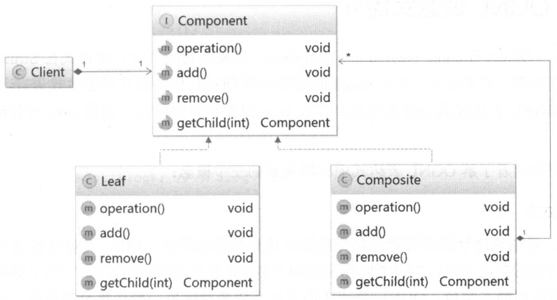

## SqlSessionFactoryBuilder

Mybatis通过读取mybatis-config.xml文件，将解析后的信息加载到Configuration对象中，Mybatis在运行时根据Configuration对象的信息进行相应的操作。

SqlSessionFactoryBuilder是Mybatis读取配置mybatis-config.xml文件的入口：

```java
public SqlSessionFactory build(Reader reader, String environment, Properties properties) {
    XMLConfigBuilder parser = new XMLConfigBuilder(reader, environment, properties);
    return build(parser.parse());
  }
```

XMLConfigBuilder是负责解析mybatis-config.xml文件的对象，它继承自BaseBuilder类。BaseBuilder类说明：

```java
public abstract class BaseBuilder {
    // Configuration是Mybatis的核心对象,Mybatis运行时的配置信息都会存在此对象中
    protected final Configuration configuration;
    // 类别名存储对象，存储Mybatis默认的别名和用户自定义的别名
    protected final TypeAliasRegistry typeAliasRegistry;
    // TypeHandler存储对象，存储了Mybatis定义的TypeHandler和用户自定义的TypeHandler
    protected final TypeHandlerRegistry typeHandlerRegistry;
    
    // BaseBuilder的构造函数
    public BaseBuilder(Configuration configuration) {
    this.configuration = configuration;
    this.typeAliasRegistry = this.configuration.getTypeAliasRegistry();
    this.typeHandlerRegistry = this.configuration.getTypeHandlerRegistry();
  }
}
```

其中TypeHandlerRegistry和TypeAliasRegistry对象都是Configuration对象初始化时创建的。

BaseBuilder的继承关系图如下：


BaseBuilder的这些子类后面会进行说明。

## XMLConfigBuilder

XMLConfigBuilder是BaseBuilder的子类之一，作用是具体的建造者的角色，负责解析mybatis-config.xml配置文件，其核心字段如下：

```java
public class XMLConfigBuilder extends BaseBuilder {
	// 标识是否已经解析过mybatis-config.xml配置文件
    private boolean parsed;
    // 用于解析mybatis-config.xml的XPathParser对象
    private final XPathParser parser;
    // 标识<environment>配置的名称，默认读取<environment>标签的default属性
    private String environment;
    // localReflectorFactory负责创建和缓存Reflector对象
    private final ReflectorFactory localReflectorFactory = new DefaultReflectorFactory();
}
```

继续跟踪XMLConfigBuilder#parse()内代码：

```java
// XMLConfigBuilder#parseConfiguration()方法：
private void parseConfiguration(XNode root) {
    // 解析<properties>节点
    propertiesElement(root.evalNode("properties"));
    // 解析<settings>节点
    Properties settings = settingsAsProperties(root.evalNode("settings"));
    // 设置vfsImpl字段
    loadCustomVfs(settings);
    // 解析<typeAliases>节点
    typeAliasesElement(root.evalNode("typeAliases"));
    // 解析<plugins>节点
    pluginElement(root.evalNode("plugins"));
    // 解析<objectFactory>节点
    objectFactoryElement(root.evalNode("objectFactory"));
    // 解析<objectWrapperFactory>节点
    objectWrapperFactoryElement(root.evalNode("objectWrapperFactory"));
    // 解析<reflectorFactory>节点
    reflectorFactoryElement(root.evalNode("reflectorFactory"));
    // 将settings值设置到Configuration中
    settingsElement(settings);
    // 解析<environments>节点
    environmentsElement(root.evalNode("environments"));
    // 解析<databaseIdProvider>节点
    databaseIdProviderElement(root.evalNode("databaseIdProvider"));
    // 解析<typeHandlers>节点
    typeHandlerElement(root.evalNode("typeHandlers"));
    // 解析<mappers>节点
    mapperElement(root.evalNode("mappers"));
}
```

### 解析\<properties>节点

XMLConfigBuilder.propertiesElement()方法会解析mybatis-config.xml配置文件中的\<properties>节点并形成Properties对象，之后将该Properties对象设置到XPathParser和Configuration的variables字段中。在后面的解析过程中，会使用该Properties对象中的信息替换占位符。

```java
private void propertiesElement(XNode context) throws Exception {
    if (context != null) {
        // 解析<properties>的子节点（标签<property>标签）的name和value属性，并记录到Properties中
        Properties defaults = context.getChildrenAsProperties();
        // 解析<properties>的resource和url属性，这两个属性用于确定properties配置文件的位置
        String resource = context.getStringAttribute("resource");
        String url = context.getStringAttribute("url");
        // resource和url属性不能同时存在，否则会抛出异常
        if (resource != null && url != null) {
            throw new BuilderException("...");
        }
        // 加载resource属性或url指定的properties文件
        if (resource != null) {
            defaults.putAll(Resources.getResourceAsProperties(resource));
        } else if (url != null) {
            defaults.putAll(Resources.getUrlAsProperties(url));
        }
        // 与Configuration对象中的variables集合合并
        Properties vars = configuration.getVariables();
        if (vars != null) {
            defaults.putAll(vars);
        }
        // 更新XPathParser和Configuration的variables字段
        parser.setVariables(defaults);
        configuration.setVariables(defaults);
    }
}
```

### 解析\<settings>节点

XMLConfigBuilder.settingsAsProperties()方法负责解析\<settings>节点，在\<settings>节点下的配置是Mybatis全局性的配置，它们会改变Mybatis的运行时行为。

在Mybatis初始化时，这些全局配置信息都会被记录到Configuration对象的对应属性中。

### 解析\<typeAliases>

XMLConfigBuilder#typeAliasesElement()方法负责解析\<typeAliases>节点及其子节点，并通过TypeAliasRegistry完成别名的注册：

```java
private void typeAliasesElement(XNode parent) {
    if (parent != null) {
        // 处理全部子节点
        for (XNode child : parent.getChildren()) {
            // 处理<package>节点
            if ("package".equals(child.getName())) {
                // 获取指定的包名
                String typeAliasPackage = child.getStringAttribute("name");
                // 通过TypeAliasRegistry扫描指定包中所有的类，并即系@Alias注解，完成别名的注册
                configuration.getTypeAliasRegistry().registerAliases(typeAliasPackage);
            } else { // 处理<typeAliases>节点
                // 获取指定的别名
                String alias = child.getStringAttribute("alias");
                // 获取别名对应的类型
                String type = child.getStringAttribute("type");
                try {
                    Class<?> clazz = Resources.classForName(type);
                    if (alias == null) {
                        // 扫描@Alias注解，完成注册
                        typeAliasRegistry.registerAlias(clazz);
                    } else {
                        // 注册别名
                        typeAliasRegistry.registerAlias(alias, clazz);
                    }
                } catch (ClassNotFoundException e) {
                    throw new BuilderException("...");
                }
            }
        }
    }
}
```

### 解析\<typeHandlers>节点

```java
private void typeHandlerElement(XNode parent) throws Exception {
    if (parent != null) {
        for (XNode child : parent.getChildren()) {
            if ("package".equals(child.getName())) {
                String typeHandlerPackage = child.getStringAttribute("name");
                typeHandlerRegistry.register(typeHandlerPackage);
            } else {
                String javaTypeName = child.getStringAttribute("javaType");
                String jdbcTypeName = child.getStringAttribute("jdbcType");
                String handlerTypeName = child.getStringAttribute("handler");
                Class<?> javaTypeClass = resolveClass(javaTypeName);
                JdbcType jdbcType = resolveJdbcType(jdbcTypeName);
                Class<?> typeHandlerClass = resolveClass(handlerTypeName);
                if (javaTypeClass != null) {
                    if (jdbcType == null) {
                        typeHandlerRegistry.register(javaTypeClass, typeHandlerClass);
                    } else {
                        typeHandlerRegistry.register(javaTypeClass, jdbcType, typeHandlerClass);
                    }
                } else {
                    typeHandlerRegistry.register(typeHandlerClass);
                }
            }
        }
    }
}
```

XMLConfigBuilder.typeHandlerElement()方法负责解析\<typeHandlers>节点，并通过TypeHandlerRegistry对象完成TypeHandler的注册。

### 解析\<plugins>节点

插件是Mybatis提供的扩展机制之一，用户可以通过添加自定义插件在SQL语句执行过程中的某一点进行拦截。Mybatis中的自定义插件只需要实现Interceptor接口，并通过注解指定想要拦截的方法签名即可。

```java
private void pluginElement(XNode parent) throws Exception {
    if (parent != null) {
        for (XNode child : parent.getChildren()) {
            String interceptor = child.getStringAttribute("interceptor");
            // 获取<plugin>节点下<properties>配置的信息，并形成Properties对象
            Properties properties = child.getChildrenAsProperties();
            // 经过TypeAliasRegistry解析别名之后。实例化Interceptor对象
            Interceptor interceptorInstance = 
                (Interceptor) resolveClass(interceptor).newInstance();
            interceptorInstance.setProperties(properties);
            configuration.addInterceptor(interceptorInstance);
        }
    }
}
```

### 解析\<objectFactory>、\<objectWrapperFactory>节点

可以通过添加自定义ObjectFactory实现类、ObjectWrapperFactory实现类以及ReflectorFactory实现类对Mybatis进行扩展。

```java
private void objectFactoryElement(XNode context) throws Exception {
    if (context != null) {
        // 获取<objectFactory>节点的type属性
        String type = context.getStringAttribute("type");
        // 获取<objectFactory>节点下配置的信息，并形成Properties对象
        Properties properties = context.getChildrenAsProperties();
        // 进行别名解析后，实例化自定义ObjectFactory实现
        ObjectFactory factory = (ObjectFactory) resolveClass(type).newInstance();
        // 设置自定义ObjectFactory的属性，完成初始化的相关操作
        factory.setProperties(properties);
        // 将自定义ObjectFactory对象记录到Configuration对象的objectFactory字段中
        configuration.setObjectFactory(factory);
    }
}
```

\<objectWrapperFactory>节点的解析与\<objectFactory>节点的解析类似，不再重述。

### 解析\<environments>节点

在实际生产中，同一项目可能分为开发、测试和生产多个不同的环境，每个环境的配置可能也不尽相同。Mybatis可以配置多个\<environment>节点，每个\<environment>节点对应一种环境的配置。

尽管可以配置多个环境，但是每个SqlSessionFactory实例只能选择其一。

XMLConfigBuilder#environmentsElement()方法负责解析\<environments>的相关配置，它会根据XMLConfigBuilder.environment字段确定要使用的\<environment>配置，之后创建对应的TransactionFactory和DataSource对象，并封装进Environment对象中。

```java
private void environmentsElement(XNode context) throws Exception {
    if (context != null) {
        // 未指定XMLConfigBuilder.environment字段，则使用default属性指定<environment>
        if (environment == null) {
            environment = context.getStringAttribute("default");
        }
        // 遍历子节点，即<environment>节点
        for (XNode child : context.getChildren()) {
            // 与XMLConfigBuilder.environment字段匹配
            String id = child.getStringAttribute("id");
            if (isSpecifiedEnvironment(id)) {
            // 创建TransactionFactory，具体实现是先通过TypeAliasRegistry解析别名后，实例化
            // TransactionFactory
                TransactionFactory txFactory = 
                    transactionManagerElement(child.evalNode("transactionManager"));
                // 创建DataSourceFactory和DataSource
                DataSourceFactory dsFactory = 
                    dataSourceElement(child.evalNode("dataSource"));
                DataSource dataSource = dsFactory.getDataSource();
               // 将Environment对象记录到Configuration.environment字段中
                Environment.Builder environmentBuilder = new Environment.Builder(id)
                    .transactionFactory(txFactory)
                    .dataSource(dataSource);
                configuration.setEnvironment(environmentBuilder.build());
            }
        }
    }
}
```

### 解析\<databaseIdProvider>节点

Mybatis不能直接屏蔽多种数据库产品在SQL语言支持方面的差异。但是在mybatis-config.xml配置文件中，通过\<databaseIdProvider>定义所有支持的数据库产品的databaseId，然后在映射配置文件中定义SQL语句节点时，通过databaseId指定该SQL语句应用的数据库产品，这样也可以实现类似的功能。

XMLConfigBuilder#databaseIdProviderElement()方法负责解析\<databaseIdProvider>节点，并创建指定的DatabaseIdProvider对象。DatabaseIdProvider会返回databaseId值，Mybatis会根据databaseId选择合适的SQL进行执行。

```java
private void databaseIdProviderElement(XNode context) throws Exception {
    DatabaseIdProvider databaseIdProvider = null;
    if (context != null) {
        String type = context.getStringAttribute("type");
        // 为了保证兼容性，修改type取值
        if ("VENDOR".equals(type)) {
            type = "DB_VENDOR";
        }
        // 解析相关配置信息
        Properties properties = context.getChildrenAsProperties();
        // 创建DatabaseIdProvider对象
        databaseIdProvider = (DatabaseIdProvider) resolveClass(type).newInstance();
        // 配置DatabaseIdProvider，完成初始化
        databaseIdProvider.setProperties(properties);
    }
    Environment environment = configuration.getEnvironment();
    if (environment != null && databaseIdProvider != null) {
        // 通过前面确定的DataSource获取databaseId，并记录到Configuration.databaseId字段中
        String databaseId = 
            databaseIdProvider.getDatabaseId(environment.getDataSource());
        configuration.setDatabaseId(databaseId);
    }
}
```

### 解析\<mappers>节点

在Mybatis初始化时，除了加载mybatis-config.xml配置文件，还会加载全部的映射配置文件，mybatis-config.xml配置文件中的\<mappers>节点会告诉Mybatis去哪些位置查找映射配置文件以及使用了配置注解标识的接口。

XMLConfigBuilder#mapperElement()方法负责解析\<mappers>节点，它会创建XMLMapperBuilder对象加载映射文件，如果映射配置文件存在相应的Mapper接口，也会加载相应的Mapper接口，解析其中的注解并完成向MapperRegistry的注册。

```java
private void mapperElement(XNode parent) throws Exception {
    if (parent != null) {
        // 处理<mappers>的子节点
        for (XNode child : parent.getChildren()) {
            // <package>子节点
            if ("package".equals(child.getName())) {
                String mapperPackage = child.getStringAttribute("name");
                // 扫描指定的包，并向MapperRegistry注册Mapper接口
                configuration.addMappers(mapperPackage);
            } else {
                // 获取<mapper>节点的resource、url、class属性，这三个属性互斥
                String resource = child.getStringAttribute("resource");
                String url = child.getStringAttribute("url");
                String mapperClass = child.getStringAttribute("class");
                // 如果<mapper>节点指定了resource或url属性，则创建XMLMapperBuilder对象，并通过该
                // 对象解析resource或是url属性指定的Mapper配置文件
                if (resource != null && url == null && mapperClass == null) {
                    ErrorContext.instance().resource(resource);
                    InputStream inputStream = Resources.getResourceAsStream(resource);
                    // 创建XMLMapperBuilder对象，解析映射配置文件
                    XMLMapperBuilder mapperParser = new XMLMapperBuilder(inputStream, 
                               configuration, resource, configuration.getSqlFragments());
                    mapperParser.parse();
                } else if (resource == null && url != null && mapperClass == null) {
                    ErrorContext.instance().resource(url);
                    InputStream inputStream = Resources.getUrlAsStream(url);
                    // 创建XMLMapperBuilder对象，解析映射配置文件
                    XMLMapperBuilder mapperParser = new XMLMapperBuilder(inputStream, 
                                    configuration, url, configuration.getSqlFragments());
                    mapperParser.parse();
                } else if (resource == null && url == null && mapperClass != null) {
                   	// 如果<mapper>节点指定了class属性，则向MapperRegistry注册该Mapper接口
                    Class<?> mapperInterface = Resources.classForName(mapperClass);
                    configuration.addMapper(mapperInterface);
                } else {
                    throw new BuilderException("...");
                }
            }
        }
    }
}
```


## XMLMapperBuilder

XMLMapperBuilder负责解析映射配置文件，它继承了BaseBuilder抽象类，也是具体建造者的角色。XMLMapperBuilder.parse()方法是解析映射文件的入口：

```java
public void parse() {
    // 判断是否已经加载过该映射文件
    if (!configuration.isResourceLoaded(resource)) {
        // 处理<mapper>节点
        configurationElement(parser.evalNode("/mapper"));
        // 将resource添加到Configuration.loadedResources集合中保存，它是HashSet<String>类型的
        // 集合，其中记录了已经加载过的映射文件
        configuration.addLoadedResource(resource);
        // 注册Mapper接口
        bindMapperForNamespace();
    }
	// 处理configurationElement()方法中解析失败的<resultMap>节点
    parsePendingResultMaps();
    // 处理configurationElement()方法中解析失败的<cache-ref>节点
    parsePendingChacheRefs();
    // 处理configurationElement()方法中解析失败的SQL语句节点
    parsePendingStatements();
}
```

XMLMapperBuilder将每个节点的解析过程封装成了一个方法，而这些方法由XMLMapperBuilder.configurationElement()方法调用。

```java
private void configurationElement(XNode context) {
    // 获取<mapper>节点的namespace属性
    String namespace = context.getStringAttribute("namespace");
    if (namespace == null || namespace.equals("")) {
        throw new BuilderException("Mapper's namespace cannot be empty");
    }
    // 设置MapperBuilderAssistant的currentNamespace字段，记录当前命名空间
    builderAssistant.setCurrentNamespace(namespace);
    // 解析<cache-ref>节点
    cacheRefElement(context.evalNode("cache-ref"));
     // 解析<cache>节点
    cacheElement(context.evalNode("cache"));
    // 该节点以废弃
    parameterMapElement(context.evalNodes("/mapper/parameterMap"));
    // 解析<resultMap>节点
    resultMapElements(context.evalNodes("/mapper/resultMap"));
    // 解析<sql>节点
    sqlElement(context.evalNodes("/mapper/sql"));
    // 解析<select>、<insert>、<update>、<delete>等SQL节点
    buildStatementFromContext(context.evalNodes("select|insert|update|delete"));
}
```

### 解析\<cache>节点

### 解析\<cache-ref>节点

### 解析\<resultMap>节点

select语句查询得到的结果时一张二维表，水平方向上看是一个个字段，垂直方向上看是一条条记录。

Mybatis使用\<resultMap>节点定义了结果集与Java对象之间的映射规则。

ResultMapping对象记录了结果集中的一列与JavaBean中一个属性之间的映射关系。\<resultMap>节点下除了\<discriminator>的其他子节点，都会被解析成对应的ResultMapping对象。ResultMapping中的核心字段如下：

```java
public class ResultMapping {
	// Configuration对象
    private Configuration configuration;
    // 对应节点的property属性，表示的是与该列进行映射的属性
    private String property;
    // 对应节点的column属性，表示的是从数据库中得到的列名或是列名的别名
    private String column;
    // 对应节点的javaType属性，表示的是一个JavaBean的完全限定名，或一个类型别名
    private Class<?> javaType;
    // 对应节点的jdbcType属性，表示的是进行映射的列的JDBC类型
    private JdbcType jdbcType;
    // 对应节点的typeHandler属性，表示的是类型处理器，它会覆盖默认的类型处理器
    private TypeHandler<?> typeHandler;
    // 对应节点的resultMap属性，该属性通过id引用另一个<resultMap>节点定义，它负责将结果集中的一部分列
    // 映射成其他关联的结果对象，这样就可以通过join方式进行关联查询，然后直接映射成多个对象，并同时设置
    // 蛇蝎对象之间的组合关系
    private String nestedResultMapId;
    // 对应节点的select属性，该属性通过id引用了另一个<select>节点定义，它会把指定的列的值传入select
    // 属性指定的select语句中作为参数进行查询。使用select属性可能会导致N+1问题。
    private String nestedQueryId;
    // 对应节点的notNullColumn属性拆分后的结果
    private Set<String> notNullColumns;
    // 对应节点的columnPrefix属性
    private String columnPrefix;
    // 处理后的标志，标志供两个：id和constructor
    private List<ResultFlag> flags;
    // 对应节点的column属性拆分后生成的结果，composites.size()>0会使column为null
    private List<ResultMapping> composites;
    // 对应节点的resultSet属性
    private String resultSet;
    // 对应节点的foreignColumn属性
    private String foreignColumn;
    // 是否延迟加载，对应节点的fetchType属性
    private boolean lazy;
}
```

每个\<resultMap>节点都会被解析成一个ResultMap对象，其中每个节点所定义的映射关系，则使用ResultMapping对象表示。

ResultMap中各个字段的含义如下：

```java
public class ResultMap {
	// <resultMap>节点的id属性
    private String id;
    // <resultMap>的type属性
    private Class<?> type;
    // 记录了除<discriminator>节点之外的其他映射关系(即ResultMapping对象集合)
    private List<ResultMapping> resultMappings;
    // 记录了映射关系中带有ID标志的映射关系，如<id>节点和<constructor>节点的<idArg>子节点
    private List<ResultMapping> idResultMappings;
    // 记录了映射关系中带有Constructor标志的映射关系，如：<constructor>所有子元素
    private List<ResultMapping> constructorResultMappings;
    // 记录了映射关系中不带有Constructor标志的映射关系
    private List<ResultMapping> propertyResultMappings;
    // 记录所有映射关系中涉及的column属性的集合
    private Set<String> mappedColumns;
    
    private Set<String> mappedProperties;
    // 鉴别器，对应<discriminator>节点
    private Discriminator discriminator;
    // 是否含有嵌套的结果映射，如果某个映射关系中存在resultMap属性，且不存在resultSet属性，则为true
    private boolean hasNestedResultMaps;
    // 是否含有嵌套查询，如果某个属性映射存在select属性，则为true
    private boolean hasNestedQueries;
    // 是否开启自动映射
    private Boolean autoMapping;
}
```

得到ResultMapping对象集合之后，会调用ResultMapResolver.resolve()方法，该方法会调用MapperBuilderAssistant.addResultMap()方法创建ResultMap对象，并将ResultMap对象添加到Configuration.resultMaps集合中保存。

解析\<association>节点也是在XMLMapperBuilder.buildResultMappingFromContext()方法中完成解析。

### 解析\<sql>节点

在映射配置文件中，可以使用\<sql>节点定义可重用的SQL语句片段。当需要重用\<sql>节点中定义的SQL语句片段时，只需要使用\<include>节点引入相应的片段即可，这样在编写SQL语句以及维护这些SQL语句时，都会比较方便。

```java
private void sqlElement(List<XNode> list, String requiredDatabaseId) throws Exception {
    // 遍历<sql>节点
    for (XNode context : list) {
        // 获取databaseId属性
        String databaseId = context.getStringAttribute("databaseId");
        // 获取id属性
        String id = context.getStringAttribute("id");
        //为id添加命名空间
        id = builderAssistant.applyCurrentNamespace(id, false);
        if (databaseIdMatchesCurrent(id, databaseId, requiredDatabaseId)) {
            // 记录到XMLMapperBuilder.sqlFragments(Map<String, XNode>)中保存，
            // 在记录到XMLMapperBuilder的构造函数中，可以看到该字段指向了
            // Configuration.sqlFragments集合
            sqlFragments.put(id, context);
        }
    }
}
```


## XMLStatementBuilder

SQL节点主要用于定义SQL语句，它们由XMLStatementBuilder负责进行解析。

Mybatis使用SqlSource接口表示映射文件或注解中定义的SQL语句，但它表示的SQL语句时不能直接被数据库执行，因为其中可能包含动态SQL语句相关的节点或是占位符等需要解析的元素。

SqlSource接口的定义如下：

```java
public interface SqlSource {
	//getBoundSql()方法会根据映射文件或注解描述的SQL语句，以及传入的参数，返回可执行的SQL
  BoundSql getBoundSql(Object parameterObject);
}
```

Mybatis使用MappedStatement表示映射配置文件中定义的SQL节点，MappedStatement包含了这些节点的很多属性，其中比较重要的字段如下：

```java
public final class MappedStatement {
	// 节点中的id属性（包含命名空间前缀）
    private String resource;
    // SqlSource对象，对应一条SQL语句
    private SqlSource sqlSource;
    //SQL的类型，INSERT、UPDATE、DELETE、SELECT
    private SqlCommandType sqlCommandType;
}
```

XMLStatementBuilder#parseStatementNode()方法是解析SQL节点的入口函数：

```java
public void parseStatementNode() {
    // ...
    // 根据SQL节点的名称决定其SQLCommandType
    String nodeName = context.getNode().getNodeName();
    SqlCommandType sqlCommandType = SqlCommandType.valueOf(nodeName.toUpperCase(Locale.ENGLISH));
    //...
    // 在解析SQL语句之前，先处理其中的<include>节点
    XMLIncludeTransformer includeParser = new XMLIncludeTransformer(configuration, builderAssistant);
    includeParser.applyIncludes(context.getNode());
    // 处理<selectKey>节点
    processSelectKeyNodes(id, parameterTypeClass, langDriver);

    // ...
}
```

### 解析\<incude>节点

在解析SQL节点之前，首先通过XMLIncludeTransformer解析SQL语句中的\<include>节点，该过程会将\<incude>节点替换成\<sql>节点中定义的SQL片段，并将其中的"${xxx}"占位符替换成真实的参数，该解析过程是在XMLIncludeTransformer.applyIncludes()方法中实现的：

```java
private void applyIncludes(Node source, final Properties variablesContext) {
    if (source.getNodeName().equals("include")) {
        Properties fullContext;
        String refid = getStringAttribute(source, "refid");
        refid = PropertyParser.parse(refid, variablesContext);
        // 查找refid属性指向的<sql>节点，返回的是其深克隆的Node对象
        Node toInclude = findSqlFragment(refid);
        // 解析<include>节点下的<property>节点，将得到的键值对添加到variablesContext中，并形成
        // 新的Properties对象返回，用于替换占位符
        Properties newVariablesContext = getVariablesContext(source, variablesContext);
        if (!newVariablesContext.isEmpty()) {
            fullContext = new Properties();
            fullContext.putAll(variablesContext);
            fullContext.putAll(newVariablesContext);
        } else {
            fullContext = variablesContext;
        }
        // 递归处理<include>节点，在<sql>节点中可能会使用<include>引用了其他SQL片段
        applyIncludes(toInclude, fullContext);
        if (toInclude.getOwnerDocument() != source.getOwnerDocument()) {
            toInclude = source.getOwnerDocument().importNode(toInclude, true);
        }
        // 将<include>节点替换成<sql>节点
        source.getParentNode().replaceChild(toInclude, source);
        while (toInclude.hasChildNodes()) {
        // 将<sql>节点的子节点添加到<sql>节点的前面
            toInclude.getParentNode().insertBefore(toInclude.getFirstChild(), toInclude);
        }
       // 删除<sql>节点
        toInclude.getParentNode().removeChild(toInclude);
    } else if (source.getNodeType() == Node.ELEMENT_NODE) {
        // 遍历当前SQL语句的子节点
        NodeList children = source.getChildNodes();
        for (int i=0; i<children.getLength(); i++) {
            applyIncludes(children.item(i), variablesContext);
        }
    } else if (source.getNodeType() == Node.ATTRIBUTE_NODE 
               && !variablesContext.isEmpty()) {
        // 使用之前解析得到的Properties对象替换对应的占位符
        source.setNodeValue(PropertyParser.parse(source.getNodeValue(), 
                                                 variablesContext));
    } else if (source.getNodeType() == Node.TEXT_NODE && !variablesContext.isEmpty()) {
        source.setNodeValue(PropertyParser.parse(source.getNodeValue(), 
                                                 variablesContext));
    }
}
```


方法的递归调用.png)

\<include>节点和\<sql>节点可以配合使用、多层嵌套，实现更加复杂的sql片段的重用，这样解析过程就会递归更多层，流程变得更加复杂，但本质与上述分析过程相同。

### 解析\<selectKey>节点

在\<insert>、\<update>节点中可以定义\<selectKey>节点来解决主键自增问题。

XMLStatementBuilder.processSelectKeyNodes()方法负责解析SQL节点中的\<selectKey>子节点：

```java
private void processSelectKeyNodes(String id, Class<?> parameterTypeClass, LanguageDriver langDriver) {
    // 获取全部的<selectKey>节点
    List<XNode> selectKeyNodes = context.evalNodes("selectKey");
    // 解析<selectKey>节点
    if (configuration.getDatabaseId() != null) {
        parseSelectKeyNodes(id, selectKeyNodes, parameterTypeClass, langDriver, configuration.getDatabaseId());
    }
    parseSelectKeyNodes(id, selectKeyNodes, parameterTypeClass, langDriver, null);
    // 移除<selectKey>节点
    removeSelectKeyNodes(selectKeyNodes);
}
```

### 解析SQL节点

## 3.1.6 绑定Mapper接口

每个映射配置文件的命名空间可以绑定一个Mapper接口，并注册到MapperRegistry中。在XMLMapperBuilder.bindMapperForNamespace()方法中，完成了映射配置文件与对应的Mapper接口的绑定：

```java
private void bindMapperForNamespace() {
    // 获取映射配置文件的命名空间
    String namespace = builderAssistant.getCurrentNamespace();
    if (namespace != null) {
        Class<?> boundType = null;
        // 解析命名空间对应的类型
        boundType = Resources.classForName(namespace);
        if (boundType != null) {
            // 是否已经加载了boundType接口
            if (!configuration.hasMapper(boundType)) {
                // 追加namespace前缀，并添加到Configuration.loadResources集合中保存
                configuration.addLoadedResource("namespace:" + namespace);
                // 调用MapperRegistry.addMapper()方法，注册boundType接口
                configuration.addMapper(boundType);
            }
        }
    }
}
```

在MapperRegistry.knownMappers集合注册指定的Mapper接口，其实该方法还会创建MapperAnnotationBuilder，并调用MapperAnnotationBuilder.parse()方法解析Mapper接口中的注解信息：

```java
public void parse() {
    String resource = type.toString();
    // 检测是否已经加载过该接口
    if (!configuration.isResourceLoaded(resource)) {
        // 检测是否加载过定义的映射配置文件，如果未加载，则创建XMLMapperBuilder对象解析对应的映射文件
        loadXmlResource();
        configuration.addLoadedResource(resource);
        assistant.setCurrentNamespace(type.getName());
        // 解析@CacheNamespace注解
        parseCache();
        // 解析@CacheNamespaceRef注解
        parseCacheRef();
        // 获取接口中定义的全部方法
        Method[] methods = type.getMethods();
        for (Method method : methods) {
            try {
                if (!method.isBridge()) {
                    // 解析@SelectKey、@ResultMap等注解，并创建MappedStatement对象
                    parseStatement(method);
                }
            } catch (IncompleteElementException e) {
                // 如果解析过程出现IncompleteElementException异常，可能是引用了未解析的注解，这里
                // 将出现异常的方法添加到Configuration.incompleteMethods集合中暂存，该集合是
                // LinkedList<MethodResolver>类型
                configuration.addIncompleteMethod(new MethodResolver(this, method));
            }
        }
    }
    // 遍历Configuration.incompleteMethods集合中记录的未解析的方法，并重新进行解析
    parsePendingMethods();
}
```

## 处理incomplete*集合

XMLMapperBuilder.configurationElement()方法解析映射配置文件时，是按照从文件头到文件尾的顺序解析，但是有时候在解析一个节点时，会引用定义在该节点之后的、还未解析的节点，这就会导致解析失败并抛出IncompleteElementException。

genuine抛出异常的节点不同，Mybatis会创建不同的*Resolver对象，并添加到Configuration的不同incomplete\*集合中。

## 3.2 SqlNode&SqlSource

映射配置文件中定义的SQL节点会被解析成MappedStatement对象，其中的SQL语句会被解析成SqlSource对象，SQL语句中定义的动态SQL节点、文本节点等，则由SqlNode接口的相应实现表示。

SqlSource接口的定义如下表示：

```java
public interface SqlSource {
	// 通过解析得到BoundSql对象，其中封装了包含“?”占位符的SQL语句，以及绑定的实参。
    BoundSql getBoundSql(Object parameterObject);
}
```


DynamicSqlSource负责处理动态SQL语句，RawSqlSource负责处理静态语句，两者最终都会将处理后的SQL语句封装成StaticSqlSource返回。

DynamicSqlSource与StaticSqlSource的主要区别是：StaticSqlSource中记录的SQL语句中可能含有“?”占位符，但是可以直接交给数据库执行；DynamicSqlSource中封装的SQL语句还需要进行一系列解析，才会最终形成数据库可执行的SQL语句。

### 组合模式

组合模式是将对象组合成树形结构，以表示“部分-整体”的层次结构（一般是树形结构），用户可以像处理一个简单对象一样来处理一个复杂对象，从而使得调用者无须了解复杂元素的内部结构。



组合模式中的角色如下：

（1）抽象组件（Component）：Component接口定义了树形结构中所有类的公共行为，如：operation()方法。一般情况下，其中还会定义一些用于管理子组件的方法，如：add()、remove()等方法。

（2）树叶（Leaf）：Leaf在树形结构中表示叶节点对象，叶节点没有子节点。

（3）树枝（Composite）：定义有子组件的哪些组件的行为。该角色用于管理子组件，并通过operation()方法调用其管理的子组件的相关操作。

（4）调用者（Client）：通过Component接口操纵整个树形结构。

组合模式的优点：

（1）组合模式可以帮助调用者屏蔽对象的复杂性。对于调用者来说，使用整个树形结构与使用单个Component对象没有任何区别，即：调用者并不必关系处理的是单个Component对象还是整个树形结构，这样就可以将调用者与复杂对象进行解耦。

（2）组合模式可以通过增加树中节点的方式，添加新的Component对象，从而实现功能上的扩展，这符合“开闭原则”，可以简化日后的维护工作。

组合模式的缺点：

有些场景下程序希望一个组合模式中只能有某些特定的组件，此时就很难直接通过组件类型进行限制（因为都是Component接口的实现类），这就必须在运行时进行类型检测。而且在递归程序中定位问题也是一件比较复杂的事情。

Mybatis在处理动态SQL节点时，应用到了组合设计模式。MybatisUI将动态SQL节点解析成对应的SqlNode实现，并形成树形结构。

### DynamicContext

DynamicContext主要用于记录解析动态SQL语句之后产生的SQL片段，可以认为它是一个用于记录动态SQL语句解析结果的容器。

```java
public class DynamicContext {
    public static final String PARAMETER_OBJECT_KEY = "_parameter";
  	public static final String DATABASE_ID_KEY = "_databaseId";
    // 参数上下文
    private final ContextMap bindings;
    // 在SqlNode解析动态SQL时，会将解析后的SQL语句片段添加到该属性中保存，最终拼凑除一条完整的SQL语句
    private final StringBuilder sqlBuilder = new StringBuilder();
    private int uniqueNumber = 0;
    public DynamicContext(Configuration configuration, Object parameterObject) {
        if (parameterObject != null && !(parameterObject instanceof Map)) {
            // 对于非Map类型的参数，会创建对应的MetaObject对象，并封装成ContextMap对象
            MetaObject metaObject = configuration.newMetaObject(parameterObject);
            bindings = new ContextMap(metaObject);
        } else {
            bindings = new ContextMap(null);
        }
        // 将key为：_parameter，value为：parameterObject的对应关系添加到bindings集合中
        // 其中_parameter在有的SqlNode实现中直接使用了该字面值
        bindings.put(PARAMETER_OBJECT_KEY, parameterObject);
        bindings.put(DATABASE_ID_KEY, configuration.getDatabaseId());
    }
}
```

DynamicContext中常用的两个方法是appendSql()方法和getSql()方法：

```java
// 追加SQL片段
public void appendSql(String sql) {
    sqlBuilder.append(sql);
    sqlBuilder.append(" ");
}
// 获取解析后的、完整的SQL语句
public String getSql() {
    return sqlBuilder.toString().trim();
}
```

### SqlNode

SqlNode接口的定义如下：

```java
public interface SqlNode {
    // apply()是SqlNode接口中定义的唯一方法，该方法会根据用户传入的实参，参数解析该SqlNode所记录的动态
    // SQL节点，并调用DynamicContext.appendSql()方法将解析后的SQL片段追加到
    // DynamicContext.sqlBuilder中保存。当SQL节点下的所有SqlNode完成解析后，就可以从
    // DynamicContext中获取一条动态生成的、完整的SQL语句。
    boolean apply(DynamicContext context);
}
```

SqlNode接口有很多个实现类，每个实现类对应一个动态SQL节点，按照组合模式来划分，SqlNode扮演了抽象的角色，MixedSqlNode扮演了树枝的角色，TextSqlNode节点扮演了树叶的角色。


