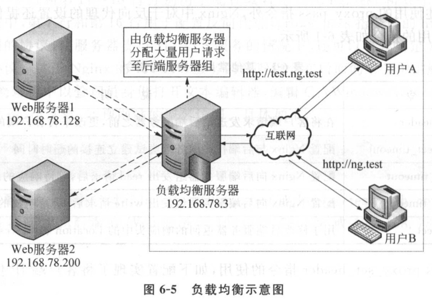

# 第3章 Nginx安装

## 3.2 Linux环境下安装Nginx

### 3.2.1 获取Nginx

Nginx在官方网站提供了软件下载。

目前Nginx发布了3中类型的版本，分别为Mainline version(开发板)、Stable version(稳定版)和Legacy versions(早期版本)，每种类型的版本中又提供了Linux版本和Windows版本。

官方网站下载页面：http://nginx.org/en/download.html

本文章基于nginx-1.10.3讲解。

下载好后进行安装：

```shell
$ tar -zxvf nginx-1.10.3.tar.gz
```

执行上述命令后，文件就被解压到当前目录下的nginx-1.10.3目录中。

```shell
auto  CHANGES  CHANGES.ru  conf  configure  contrib  html  LICENSE  Makefile  man  objs  README  src
```

关于上述目录结构的具体介绍：

（1）src目录：存放Nginx的源代码。

（2）man目录，存放Nginx的帮助文档。

（3）html目录：存放默认网站文件。

（4）contrib目录：存放其他机构或组织贡献的文档资料。

（5）auto目录：存放大量的脚本文件，和configure脚本程序相关。

（6）configure文件：Nginx自动安装脚本，用于检查环境，生成编译代码需要的makefile文件。

（7）CHANGES、CHANGES.ru、LICENSE和README都是Nginx服务器的相关文档资料。

### 3.2.2 编译安装Nginx

1、安装依赖包

由于Nginx中的而功能是模块化，而模块又依赖于一些软件包才能使用，因此在安装Nginx前，需要完成Nginx模块依赖的软件包安装。

| 软件包     | 说明                                                    |
| ---------- | ------------------------------------------------------- |
| pcre-devel | 为Nginx模块（如rewrite）提供正则表达式库                |
|            | 为Nginx模块（如gzip）提供数据压缩用的函数库             |
|            | 为Nginx模块（如ssl）提供密码算法、证书以及SSL协议等功能 |

通过yum方式安装Nginx相关依赖包：

```shell
$ yum -y install pcre-devel openssl-devel
```

由于openssl-devel依赖于zlib-devel，在通过yum进行安装时会自动解决依赖，因此上述命令中省略了zlib-devel。

2、Nginx的编译安装

（1）切换到Nginx解压目录nginx-1.10.3下执行命令：

```shell
$ ./configure --prefix=/usr/local/nginx --with-http_ssl_module
```

在上述命令中，源码安装的第一步./configure用于对即将安装的软件进行配置，检查当前的环境是否满足安装软件（Nginx）的依赖关系。其中，--prefix选项用于设置Nginx的安装目录，默认值是/usr/local/nginx，因此也可以省略此选项或指定到其他位置；--with-http_ssl_module选项用于设置在Nginx中允许使用http_ssl_module模块的相关功能。

在Nginx的安装包中还有许多其他模块，目前暂时用不到，当用到的时候重新编译Nginx并使用“--with-”选项添加需要的模块即可。

（2）通过make命令编译和安装Nginx

```shell
$ make && make install 
```

### 3.2.3 Nginx的启动与停止

1、启动Nginx

Nginx安装完成后，切换到Nginx安装目录中的sbin目录，通过执行该目录下Nginx编译后的二进制文件即可启动程序：

```shell
$ cd /usr/local/nginx/sbin
$ ./nginx
```

执行上述操作后，若成功启动Nginx，则程序没有任何提示。使用ps命令可以查看Nginx的运行状态：

```shell
$ ps aux | grep nginx
```

在输出结果中，前2行分别是Nginx主进程（master process）和工作进程（worker process）。当看到这两个Nginx进程时，说明Nginx已经启动。从第1列可以看出，Nginx主进程以root用户运行，而工作进程以nobody用户运行；第2列显示了两个进程的ID（即PID）分别为8170,和8171。

2、停止Nginx服务

当需要停止Nginx服务时，有多重停止方式，可以根据需求采取不同的方式。具体如下：

（1）立即停止服务

Nginx程序允许传递选项-s表示发送信号到主进程，如果后面跟上stop表示停止服务。

```shell
$ ./ginx -s stop
```

（2）从容停止服务

用stop的方式是立即停止Nginx服务，无论当前工作进程是否正在处理工作。而Nginx提供的从容停止方式quit，是在完成当前工作任务后再停止。

```shell
$ ./nginx -s quit
```

（3）通过kill或killall命令杀死进程

Linux中提供了kill和killall命令可以杀死进程，从而让指定进程停止运行。

```shell
$ kill Nginx主进程的PID
```

```shell
$ killall nginx
```

| 命令                             | 说明                                                |
| -------------------------------- | --------------------------------------------------- |
| nginx -s reload                  | 在Nginx已经启动的情况下重新加载配置文件（平滑重启） |
| nginx -s reopen                  | 重新打开日志文件                                    |
| nginx -c /特定目录/nginx.conf    | 以特定目录下的配置文件启动Nginx                     |
| nginx -t                         | 检测当前配置文件是否正确                            |
| nginx -t -c /特定目录/nginx.conf | 检测特定目录下的Nginx配置文件是否正确               |
| nginx -v                         | 显示版本信息                                        |
| nginx -V                         | 显示版本信息和编译选项                              |

### 

# 第4章 Nginx基本配置

## 4.1 认识配置文件

Nginx服务器安装完成后，默认安装时自带配置文件全部存储在conf目录下，并且为了备份还原，每个配置嗯嗯建都提供了一个以.default结尾的备份文件。其中，nginx.conf是Nginx默认的主配置文件，所有功能的实现都与此文件的配置相关。

### 4.1.1 配置文件结构

打开nginx.conf配置文件，从整体结构可以看出，该配置文件主要由以下几部分组成：

```tex
main
events {...}
http {
	server {
		location {...}
	}
}
```

从上面的结构可以看出，Nginx的默认主配置文件主要由main、events、http、server和location5个块组成。并且对于嵌套块（如http、server、location）中的指令，执行的顺序为从外到内依次执行，内层块中的大部分指令会自动获取外层块指令的值作为默认值，只有某些特殊指令除外。

| 块     | 说明                                                         |
| ------ | ------------------------------------------------------------ |
| main   | 主要控制Nginx子进程所属的用户和用户组、派生子进程数、错误日志位置与级别、pid位置、子进程优先级、进程对应CPU、进程能够打开的文件描述符数目等 |
|        | 控制Nginx处理连接的方式                                      |
| http   | Nginx处理http请求的主要配置块，大多数配置都在这里进行        |
| server | Nginx中主机的配置块，可用于配置多个虚拟主机                  |
|        | server中对应目录级别的控制块，可以有多个                     |

Nginx的指令由指令名称和参数组成。当一个指令含有多个子指令作为参数时，需要使用大括号{}进行包裹，且每条指令都以分号“;”结尾。

默认配置指令：

| 指令               | 说明                                                     |
| ------------------ | -------------------------------------------------------- |
| worker_processes   | 配置Nginx的工作进程数，一般设为CPU总核数或者总核数的两倍 |
| worker_connections | 配置Nginx允许单个进程并发连接的最大请求数                |
|                    | 用于引入配置文件                                         |
| default_type       | 设置默认文件类型                                         |
|                    | 默认值为on，表示开启高效文件传输模式                     |
| keepalive_timeout  | 设置长连接超时时间（单位：秒）                           |
|                    | 监听端口，默认监听80端口                                 |
| server_name        | 设置主机域名                                             |
|                    | 设置主机站点根目录地址                                   |
|                    | 指定默认索引文件                                         |
| error_page         | 自定义错误页面                                           |

### 4.1.2 设置用户和组

Nginx服务是由一个主进程（master process）和多个工作进程（worker process）组成的。其中主进程以root权限运行，而工作进程在默认情况下以nobody用户运行。原因在于nobody用户是一个不能登录的账号，有一个专用的ID，可将每个运行的工作进程隔离出来，这样即使黑客破坏了服务器程序，因其不是root用户，也不会影响到其他数据。

为工作进程设置的执行用户权限越低，则服务器安全系数越高。

Nginx提供两种设置用户和组的方式，一种是在安装时通过编译选项进行设置，另一种是修改配置文件。不论哪种方式在配置之前，都需要提前创建好用户和组。

1、编译安装配置文件方式

在.configure编译安装Nginx时的选项中，添加如下两个选项：

```shell
--user=<user>
--group=<group>
```

在上述选项中，user用于指定用户名称，group用于指定用户所在组的名称。

2、修改配置文件方式

打开Nginx的配置文件，找到配置用户和组的指令user：

```shell
# user nobody;
```

接下来以用户nuser和ngroup为例，修改后的配置如下：

```shell
user nuser ngroup
```

上述配置中，nuser用于指定执行工作进程的用户，ngroup用于指定nuser用户所属的组。按照上述命令修改完成后，保存nginx.conf配置文件，平滑重启。再次查询Nginx进程相关信息时，可以看到工作进程用户已成功修改为nuser。

### 4.1.3 自定义错误页

在网站访问过程中，经常会遇到各种各样的错误，如果找不到访问的页面则会提示404 Not Found错误，没有访问权限会提示403 Forbidden等，对于普通人而言，这样的提示界面并不友好。在Nginx的主配置文件中，给出了以下处理方式：

```tex
error_page 500 502 503 504 /50x.html;
```

上述配置中，error_page指令用于自定义错误页面，500、502/503和504指的就是HTTP错误代码，/50x.html用于表示当发生上述指定的任意一个错误时，都使用网站根目录下的50x.html文件处理。

除此之外，error_page指令还可以指定单个错误的处理页面、利用在线资源处理指定的错误，更改网站响应的状态码等多种设置。

1、为每种类型的错误设置单独的处理方式


# 第6章 负载均衡与缓存

## 6.2 负载均衡

Nginx不仅可以作为一个Web服务器或反向代理服务器，还可以按照权重、轮询、ip hash、URL hash等多种方式实现对后端服务器的负载均衡。

### 6.2.1 什么是负载均衡

负载均衡（load balance）就是负载分摊到多个操作单元上执行，从而提高服务的可用性和响应速度，带给用户更好的体验。



上图演示了负载均衡服务器的工作方式。其中客户端用户A和B同时请求了域名为test.ng.test的网站，负载均衡服务器(192.168.33.213)会根据具体配置进行不同的分配。假设用户A的请求被分配到Web服务器1(192.168.33.214)中处理，用户B的请求被分配到另一个闲置的Web服务器2(192.168.33.215)中处理。通过负载均衡，可以将一台服务器的工作扩展到多台服务器中执行，提高整个网站的负载能力。

### 6.2.2 负载均衡的配置

通过Nginx中的upstream指令可以实现负载均衡，在该指令中能够配置负载服务器组。目前负载均衡有4种典型的配置方式，分别为轮询方式、权重方式、ip_hash方式，以及利用第三方模块的方式。

| 配置方式    | 说明                                                         |
| ----------- | ------------------------------------------------------------ |
| 轮询方式    | 负载均衡默认设置方式，每个请求按照时间顺序逐一分配到不同的后端服务器仅处理，如果有服务器宕机，会自动剔除。 |
|             | 利用weight指定轮询的权重比率，与访问率成正比，用于后端服务器性能不均的情况。 |
| ip_hash方式 | 每个请求按照访问IP的hash结果分配，这样可以使每个访客固定访问一个后端服务器，可以解决Session共享的问题。 |
|             | 第三方模块采用fail时，按照每台服务器的响应时间来分配请求，响应时间短的优先分配；若第三方模块采用url_hash时，按照访问url的hash值来分配请求。 |

在upstream指定的服务器组中，若每个服务器的权重都设置为1（默认值）时，表示当前的负载均衡是一般轮询方式。

Nginx本身不包含第三方模块的实现方式，如fail或url_hash等，在使用时必须下载对应的upstream_fail模块或安装hash软件包，才可以实现第三方模块提供的负载均衡配置。

#### 一般轮询负载均衡

1、准备服务器

准备3台服务器，一台安装Nginx（192.168.33.213），其他两台安装Tomcat（192.168.33.214、192.168.33.215）。

2、配置一般轮询负载均衡

```shell
events {
    worker_connections  1024;
}

http {
    include       mime.types;
    default_type  application/octet-stream;

    sendfile        on;

    keepalive_timeout  65;

	server {
		listen 	80;
		server_name localhost;
		location / {
			proxy_pass http://web_server;
		}
	}

	upstream web_server {
		server 192.168.33.214:8080;
		server 192.168.33.215:8080;
	}
}
```

在上述的配置中，proxy_pass http://web_server;用于指定代理的URL，

upstream web_server {
		server 192.168.33.214:8080;
		server 192.168.33.215:8080;
}

用于设置负载均衡服务器组。其中upstream指令后的web_server表示代理服务器主机名，用于proxy_pass http://web_server;指令执行反向代理时使用；

server 192.168.33.214:8080;
server 192.168.33.215:8080;

利用server指令在upstream块中配置了后端Web服务器，这些服务器可以有一个或多个，从形成负载均衡服务器组。

#### 加权轮询负载均衡

如果负载均衡服务器组中的服务器硬件配置强弱不一，则可以通过weight参数设置权重大小。对于配置较好的服务器，可以为其设置成比较高的权值，对于配置较差的服务器，可以为其配置较小的权值。通过加权轮询，可以让每台服务器承担与之硬件配置相符的工作量，从而在整体上发挥最佳的效果。

加权轮询配置：

```shell
# .... 其他不变
	upstream web_server {
		server 192.168.33.214:8080 weight=1;
		server 192.168.33.215:8080 weight=2;
	}
}
```

在上述配置中，weight参数表示权值，权值越高则被分配到的概率越大。在负载均衡的过程中，Nginx将按照平滑加权轮询算法进行具体分配。其中权值总和为一个循环，这里的配置就是以3次请求为一个循环，在循环过程中，服务器192.168.33.214会在请求中被分配到1次，192.168.33.215则会分配到2次，但是3次被选取的机会并不会连续执行，而是按照算法分散执行。

除此之外，还可以设定每台Web服务器在负载均衡调度中的状态，常用的参数说明：

| 配置方式     | 说明                                                         |
| ------------ | ------------------------------------------------------------ |
| max_fails    | 允许请求失败的次数，默认为1。当超过最大次数时，返回proxy_next_upstream指令指定的错误。 |
| fail_timeout | 在经历了max_fails次失败后，暂停服务的时间。且在实际应用中，max_fails一般与fail_timeout一起使用。 |
|              | 预留的备份机器。                                             |
| down         | 表示当前的server暂时不参与负载均衡。                         |

设置backup的服务器，只有当其他所有的非backup机器出现故障或者忙碌的情况下，才会请求backup服务器，因此这台服务器的压力最小。

```shell
# .... 其他不变
	upstream web_server {
		server 192.168.33.214:8080 weight=1 max_fails=1 fail_timeout=2;
		server 192.168.33.215:8080 weight=2 max_fails=2 fail_timeout=2;
		server 192.168.33.216:8080 backup;
	}
}
```

在上述配置中，server 192.168.33.214:8080...和server 192.168.33.215:8080...设置了允许请求的最大失败次数和请求失败后暂停服务的时间；server 192.168.33.216:8080...设置了一台备份机器，用于在前面两台Web服务器出现故障的情况下，为用户继续提供服务。

#### ip_hash负载均衡

ip_hash方式的负载均衡，是将每个请求按照访问IP的hash结果分配，这样就可以使用来自同一个IP的客户端用户固定访问一台Web服务器，有效地解决了动态网页存在的Session共享问题。

```shell
# .... 其他不变
	upstream web_server {
		ip_hash;
		server 192.168.33.214:8080;
		server 192.168.33.215:8080;
		server 192.168.33.216:8080 down;
	}
}
```

在上述配置中，upstream块中的ip_hash指令用于标识当前负载均衡的处理方式。其中，对于一个暂时性宕机的服务器，可以使用down参数标识出来，这样在负载均衡时，就会忽略该服务器的分配。

注：在使用ip_hash方式处理负载均衡时，Web服务器在负载均衡列表中的状态不能使用weight和backup设置。

ip_hash这种方式为每个用户IP绑定一个Web服务器处理，将会导致某些Web服务器接收的请求多，某些Web服务器接收到的请求少，无法保证Web服务器的负载均衡。因此建议只在必要的情况下使用这种方式。

## 6.3 缓存配置


