## 2.1 预备

### 2.1.2 数据和内部编码

type命令实际返回的就是当前键的数据结构类型，它们分别是：string（字符串）、hash（哈希）、list（表）、set（集合）、zset（有序集合），但这些只是Redis对外的数据结构。实际上每种数据结构都有自己底层的内部编码实现，而且是多种实现，这样Redis会在合适的场景选择合适的内部编码。

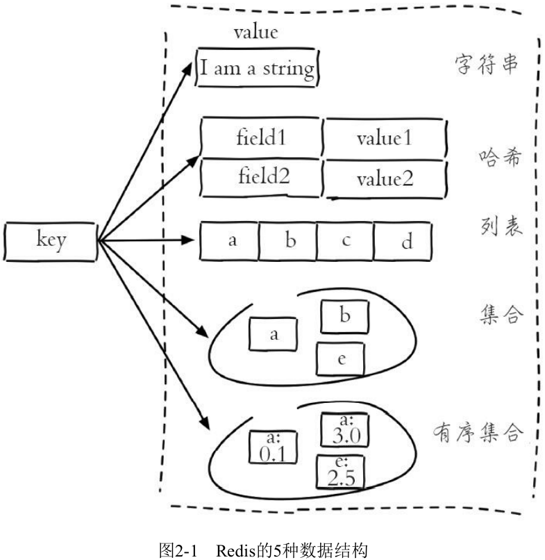

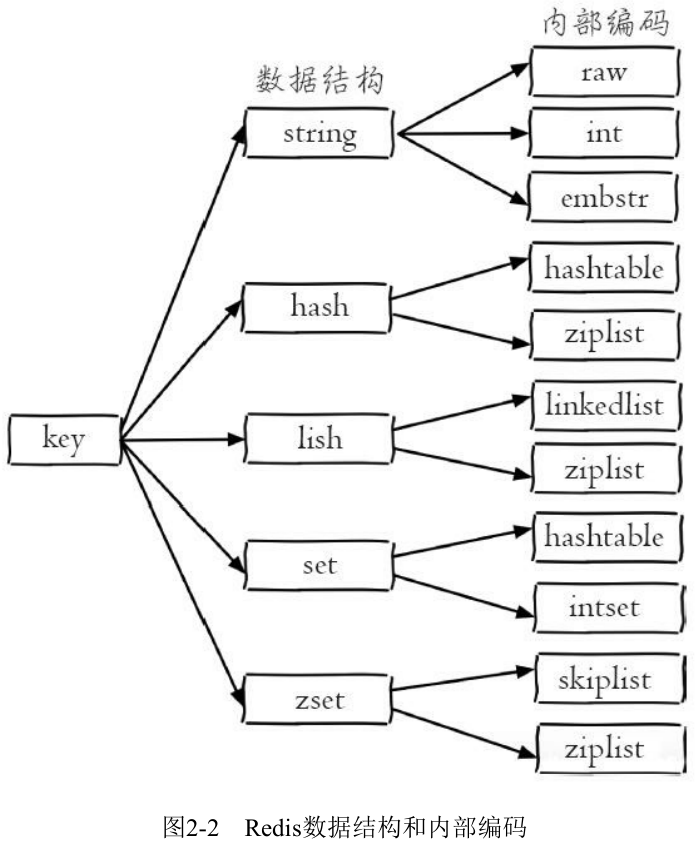

Redis这样设计有两个好处：第一，可以改进内部编码，而对外的数据结构和命令没有影响，这样一旦开发出更优秀的内部编码，无需改动外部数据结构和命令。

### 2.1.3 单线程架构

Redis使用了单线程架构和I/O多路复用模型来实现高性能的内存数据库服务。

因为Redis是单线程来处理命令的，所以一条命令从客户端达到服务端不会立刻被执行，所有命令都会进入一个队列中，然后逐个被执行。

注：Redis可以确定不会有两条命令被同时执行。

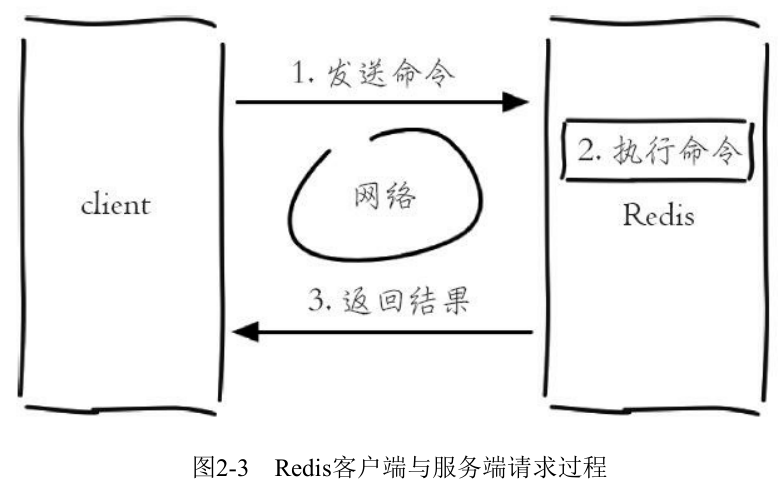

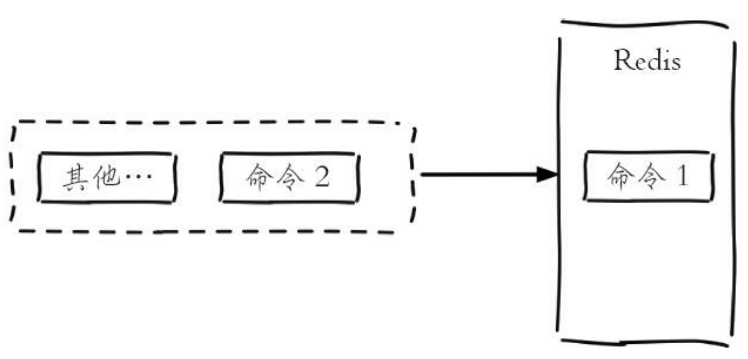

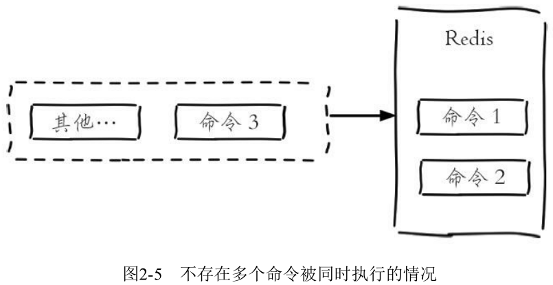

#### 为什么单线程还能这么快？

（1）纯内存访问，Redis将所有数据放在内存中，内存的响应时长大约为100纳秒，这是Redis达到每秒万级别访问的重要基础。

（2）非阻塞I/O，Redis使用epoll作为I/O多路复用技术的实现，再加上Redis自身的事件处理模型将epoll中的连接、读写、关闭都转换为事件，不在网络I/O上浪费过多的时间。

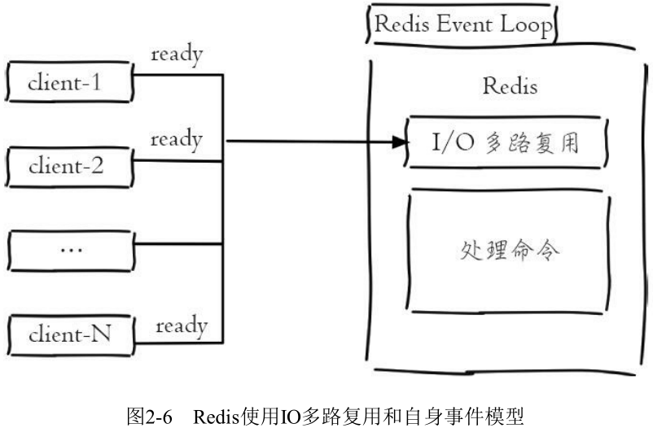

（3）单线程避免了线程切换和竞态产生的消耗。

#### 单线程能带来几个好处：

（1）单线程可以简化数据结构和算法的实现。

（2）单线程避免了线程切换和竞态产生的消耗（锁和线程切换通常是性能杀手）。

但是单线程会有一个问题：对于每个命令的执行时间是有要求的。如果某个命令执行过长，会造成其他命令的阻塞，对于Redis这种高性能的服务来说是致命的，所以Redis是面向快速执行场景的数据库。

## 2.2 字符串

字符串类型是Redis最基础的数据结构。首先键都是字符串类型，而且其他几种数据结构都是在字符串类型基础上构建的，所以字符串类型能为其他四种数据结构的学习奠定基础。

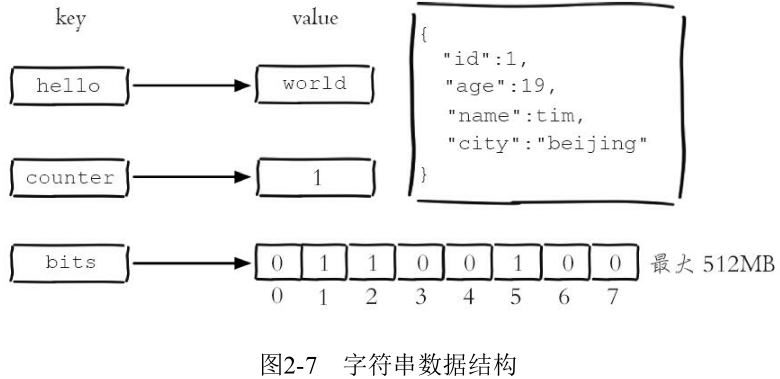

### 2.2.1 命令

#### 常用命令

（1）批量设置值：

​	mset key value [key value ...]

```shell
127.0.0.1:6379> mset a 1 b 2 c 3 d 4
OK
```

（2）批量获取值：

​	mget key [key ...]

```shell
127.0.0.1:6379> mget a b c d
1) "1"
2) "2"
3) "3"
4) "4"
```

如果有些键不存在，那么它的值为nil（空），结果是按照传入键的顺序返回：

```shell
127.0.0.1:6379> mget a b c f
1) "1"
2) "2"
3) "3"
4) (nil)
```

批量操作命令可以有效提高开发效率，假如没有mget这样的命令，要执行n次get命令需要按照图2-8的方式来执行，具体耗时如下：

n 次 get 时间 = n 次网络时间 + n 次命令时间

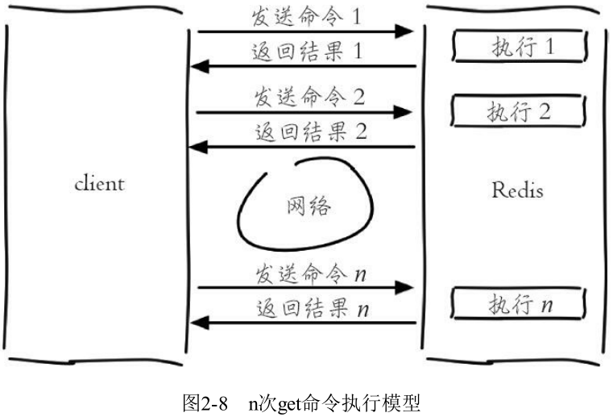

使用mget命令后，要执行n次get命令操作只需要按照图2-9的方式来完成，具体耗时如下：

n 次 get 时间 = 1 次网络时间 + n 次命令时间

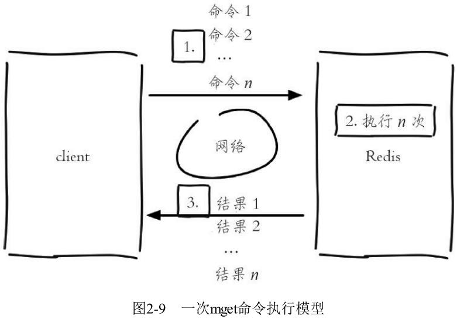

Redis可以支撑每秒数万的读写操作，但是这指的是Redis服务端的处理能力，对于客户端来说，一次命令除了命令时间还是有网络时间，假设网络时间为1毫秒，命令时间为0.1毫秒（按照每秒处理1万条命令算），那么执
行1000次get命令和1次mget命令的区别如表2-1，因为Redis的处理能力已经足够高，对于开发人员来说，网络可能会成为性能的瓶颈。

| 操作                        | 时间                           |
| --------------------------- | ------------------------------ |
| 1000次get                   | 1000×1+1000×0.1=1100毫秒=1.1秒 |
| 1次mget（组装1000个键值对） | 1×1+1000×0.1=101毫秒=0.101秒   |

学会使用批量操作，有助于提高业务处理效率，但是要注意的是每次批量操作所发送的命令数不是无节制的，如果数量过多可能造成Redis阻塞或者网络拥塞。


### 2.2.2 内部编码

字符串类型的内部编码有3种：

（1）int：8个字节的长整型。

（2）embstr：小于等于39个字节的字符串。

（3）raw：大于39个字节的字符串。

Redis会根据当前值的类型和长度决定使用哪种内部编码实现。

数字：

```shell
127.0.0.1:6379> set key 8653
OK
127.0.0.1:6379> object encoding key
"int"
```

短字符串：

```shell
# 小于等于 39 个字节的字符串： embstr
127.0.0.1:6379> set key "hello,world"
OK
127.0.0.1:6379> object encoding key
"embstr"
```

长字符串：

```shell
# 大于 39 个字节的字符串： raw
127.0.0.1:6379> set key "one string greater than 39 byte........."
OK
127.0.0.1:6379> object encoding key
"raw"
127.0.0.1:6379> strlen key
(integer) 40
```

### 2.2.3 典型应用场景

#### 1、缓存功能

下图是比较典型的缓存使用场景，其中Redis作为缓存层，MySQL作为存储层，绝大部分请求的数据都是从Redis中获取。由于Redis具有支撑高并发的特性，所以缓存通常能起到加速读写和降低后端压力的作用。

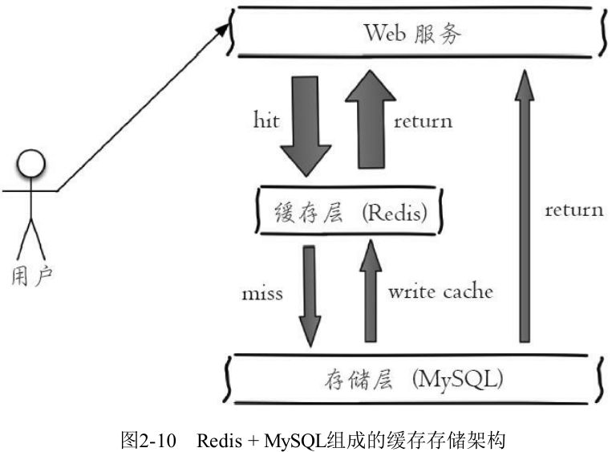

Redis没有命令空间，而且也没有对键名有强制要求（除了不能使用一些特殊字符）。但设计合理的键名，有利于防止键冲突和项目的可维护性，比较推荐的方式是使用“业务名：对象名：id：[属性]”作为键名（也可以不是分号）。例如MySQL的数据库名为vs，用户表名为user，那么对应的键可以用"vs：user：1"，"vs：user：1：name"来表示，如果当前Redis只被一个业务使用，甚至可以去掉“vs：”。如果键名比较长，例如“user：{uid}：friends：messages：{mid}”，可以在能描述键含义的前提下适当减少键的长度，例如变为“u：{uid}：fr：m：{mid}”，从而减少由于键过长的内存浪费。

#### 2、计数

许多应用都会使用Redis作为计数的基础工具，它可以实现快速计数、查询缓存的功能，同时数据可以异步落地到其他数据源。

#### 3、共享Session

下图所示，一个分布式Web服务将用户的Session信息（例如用户登录信息）保存在各自服务器中，这样会造成一个问题，出于负载均衡的考虑，分布式服务会将用户的访问均衡到不同服务器上，用户刷新一次访问可能会发现需要重新登录，这个问题是用户无法容忍的。

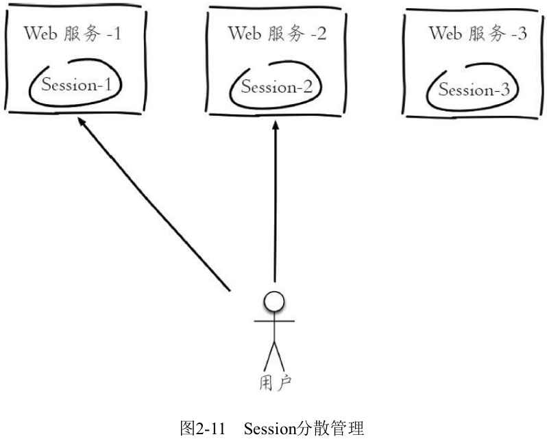

为了解决这个问题，可以使用Redis将用户的Session进行集中管理，如下图所示，在这种模式下只要保证Redis是高可用和扩展性的，每次用户更新或者查询登录信息都直接从Redis中集中获取。

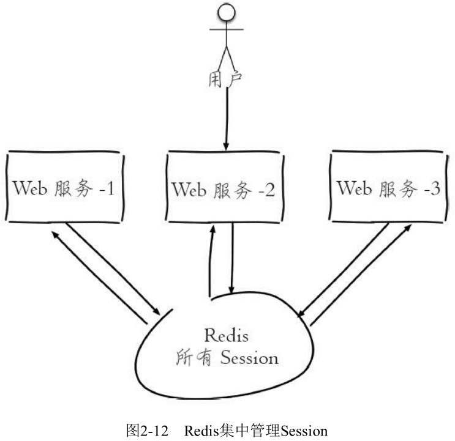

#### 3、限速

## 2.3 哈希


