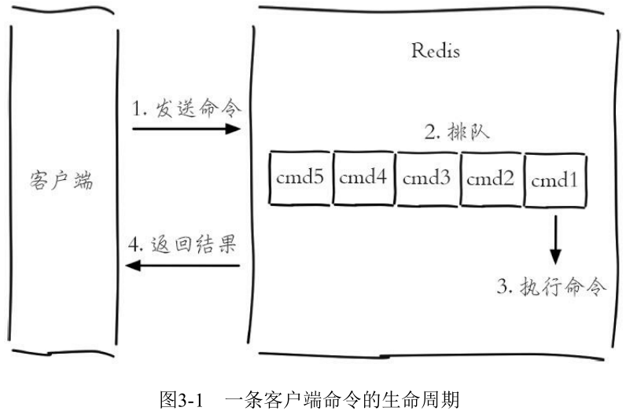

# 第3章 小功能大用处

Redis提供的5种数据结构已经足够强大，但除此之外，Redis还提供了诸如慢查询分析、功能强大的Redis Shell、Pipeline、事务与Lua脚本、Bitmaps、HyperLogLog、发布订阅、GEO等附加功能，这些功能可以在某些场景发挥重要的作用。

（1）慢查询分析：通过慢查询分析，找到有问题的命令进行优化。

（2）Redis Shell：功能强大的Redis Shell会有意想不到的实用功能。

（3）Pipeline：通过Pipeline（管道或者流水线）机制有效提高客户端性能。

（4）事务与Lua：制作自己的专属原子命令。

（5）Bitmaps：通过在字符串数据结构上使用位操作，有效节省内存，为开发提供新的思路。

（6）HyperLogLog：一种基于概率的新算法，难以想象地节省内存空间。

（7）发布订阅：基于发布订阅模式的消息通信机制。

（8）GEO：Redis3.2提供了基于地理位置信息的功能。

## 3.1 慢查询

所谓慢查询日志就是系统在命令执行前后计算每条命令的执行时间，当超过预设阀值，就将这条命令的相关信息（例如：发生时间，耗时，命令的详细信息）记录下来，Redis也提供了类似的功能。

Redis客户端执行一条命令分为如下4个部分：



（1）发布命令

（2）命令排队

（3）命令执行

（4）返回结果

需要注意，慢查询只统计步骤3的时间，所以没有慢查询并不代表客户端没有超时问题。

### 3.1.1 慢查询的两个配置参数

对于慢查询功能，需要明确两件事：

（1）预设阀值怎么设置？

（2）慢查询记录存放在哪？

Redis提供了slowlog-log-slower-than和slowlog-max-len配置来解决这两个问题。

slowlog-log-slower-than就是那个预设阀值，它的单位是微秒（1秒=1000毫秒=1000000微秒），默认值10000，假如执行了一条“很慢”的命令（例如keys*），如果它的执行时间超过了10000微秒，那么它将被记录在慢查询日志中。

注：如果slowlog-log-slower-than=0会记录所有的命令，slowlog-log-slower-than<0对于任何命令都不会进行记录。

从字面意思看，slowlog-max-len只是说明了慢查询日志最多存储多少条，并没有说明存放在哪里？实际上Redis使用了一个列表来存储慢查询日志，slowlog-max-len就是列表的最大长度。一个新的命令满足慢查询条件时被插入到这个列表中，当慢查询日志列表已处于其最大长度时，最早插入的一个命令将从列表中移出，例如slowlog-max-len设置为5，当有第6条慢查询插入的话，那么队头的第一条数据就出列，第6条慢查询就会入列。

在Redis中有两种修改配置的方法，一种是修改配置文件，另一种是使用config set命令动态修改。

如果要Redis将配置持久化到本地配置文件，需要执行config rewrite命令：


虽然慢查询日志是存放在Redis内存列表中的，但是Redis并没有暴露这个列表的键，而是通过一组命令来实现对慢查询日志的访问和管理：

（1）获取慢查询日志：

​	slowlog get [n]

```shell
127.0.0.1:6379> slowlog get
1) 1) (integer) 666
2) (integer) 1456786500
3) (integer) 11615
4) 1) "BGREWRITEAOF"
2) 1) (integer) 665
2) (integer) 1456718400
3) (integer) 12006
4) 1) "SETEX"
   2) "video_info_200"
   3) "300"
   4) "2"
...
```

可以看到每个慢查询日志有4个属性组成，分别是慢查询日志的标识id、发生时间戳、命令耗时、执行命令和参数:


（2）获取慢查询日志列表当前的长度：

​	slowlog len

```shell
127.0.0.1:6379> slowlog len
(integer) 45
127.0.0.1:6379> slowlog reset
OK
127.0.0.1:6379> slowlog len
(integer) 0
```

### 3.1.2 最佳实践

慢查询功能可以有效地帮助我们找到Redis可能存在的瓶颈，但在实际使用过程中要注意以下几点：

（1）slowlog-max-len配置建议：线上建议调大慢查询列表，记录慢查询时Redis会对长命令做截断操作，并不会占用大量内存。增大慢查询列表可以减缓慢查询被剔除的可能，例如线上可设置为1000以上。

（2）slowlog-log-slower-than配置建议：默认值超过10毫秒判定为慢查询，需要根据Redis并发量调整该值。由于Redis采用单线程响应命令，对于高流量的场景，如果命令执行时间在1毫秒以上，那么Redis最多可支撑OPS不到1000。因此对于高OPS场景的Redis建议设置为1毫秒。

（3）慢查询只记录命令执行时间，并不包括命令排队和网络传输时间。因此客户端执行命令的时间会大于命令实际执行时间。因为命令执行排队机制，慢查询会导致其他命令级联阻塞，因此当客户端出现请求超时，需要检查该时间点是否有对应的慢查询，从而分析出是否为慢查询导致的命令级联阻塞。

（4）由于慢查询日志是一个先进先出的队列，也就是说如果慢查询比较多的情况下，可能会丢失部分慢查询命令，为了防止这种情况发生，可以定期执行slow get命令将慢查询日志持久化到其他存储中（例如MySQL），然后可以制作可视化界面进行查询。

## 3.2 Redis Shell

### 3.2.1 redis-cli详解

1、-r

2、-i

3、-x

4、-c

5、-a

6、--scan和--pattern

7、--slave

8、--rdb

9、--pipe

10、--bigkeys

11、--eval

12、--latency

13、--stat

14、--raw和--no-raw

### 3.2.2 redis-server详解

redis-server除了启动Redis外，还有一个--test-memory选项。redis-server--test-memory可以用来检测当前操作系统能否稳定地分配指定容量的内存给Redis，通过这种检测可以有效避免因为内存问题造成Redis崩溃。

```shell
redis-server --test-memory 1024
```

### 3.2.3 redis-benchmark详解

redis-benchmark可以为Redis做基准性能测试，它提供了很多选项帮助开发和运维人员测试Redis的相关性能。

1、-c

-c（clients）选项代表客户端的并发数量（默认是50）。

2、-n\<requests>

-n（num）选项代表客户端请求总量（默认是100000）。

3、-q

-q选项仅仅显示redis-benchmark的requests per second信息。

4、-r

5、-P

-P选项代表每个请求pipeline的数据量（默认为1）。

6、-k\<boolean>

-k选项代表客户端是否使用keepalive，1为使用，0为不使用，默认值为1。

7、-t

-t选项可以对指定命令进行基准测试。

8、--csv

--csv选项会将结果按照csv格式输出，便于后续处理，如导出到Excel等。

## 3.3 Pipeline

