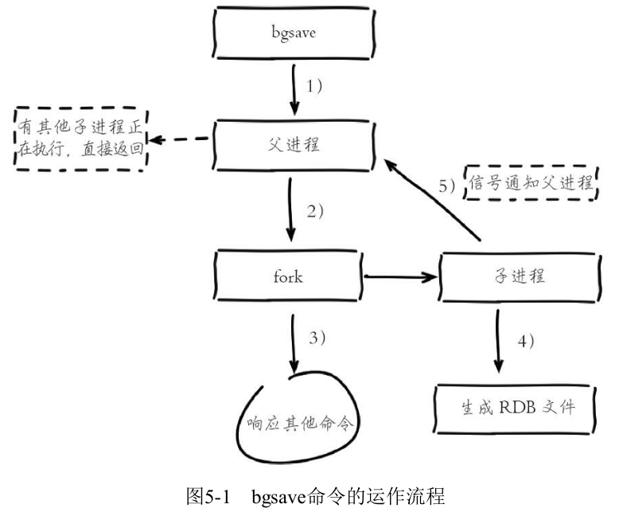
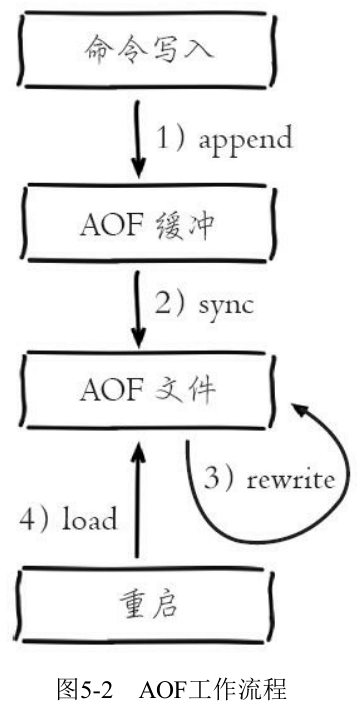
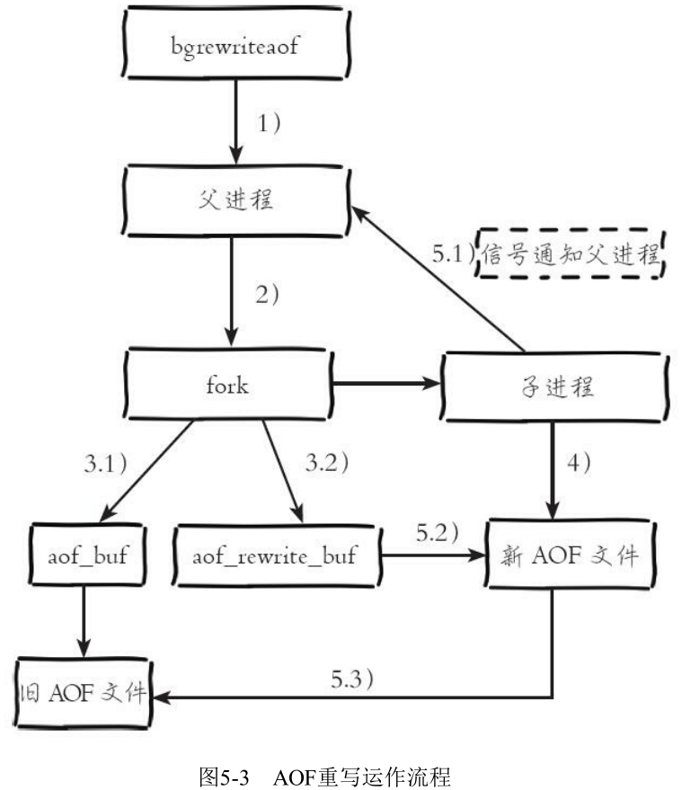
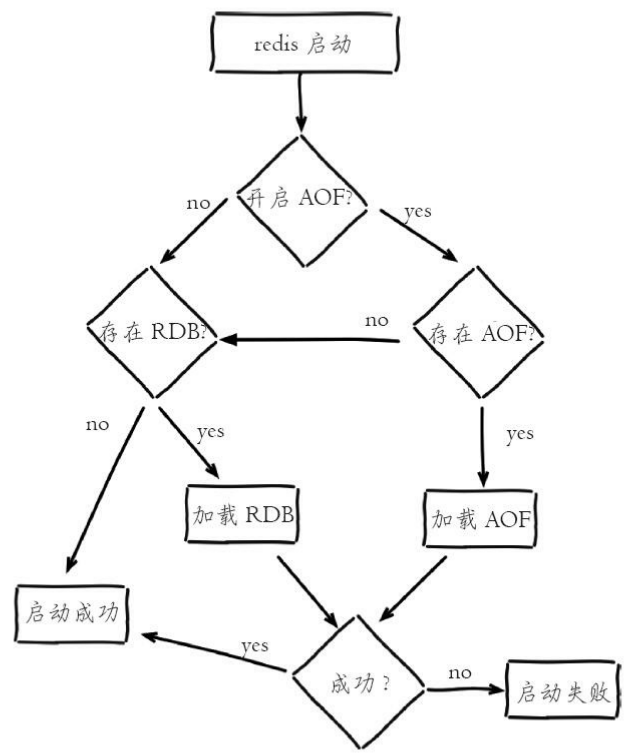
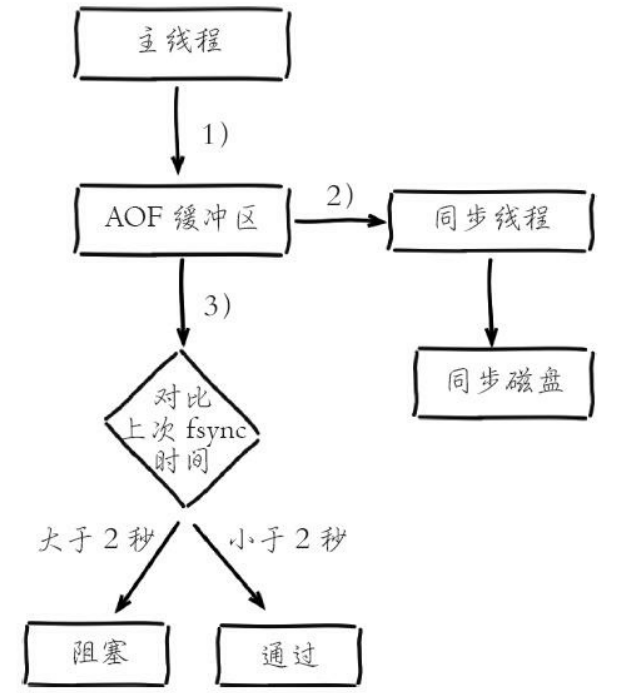

# 第5章 持久化

Redis支持RDB和AOF两种持久化机制，持久化功能有效地避免因进程退出造成的数据库丢失问题，当下次重启时利用之前持久化的文件即可实现数据恢复。

## 5.1 RDB

RDB持久化是把当前进程数据生成快照保存到硬盘的过程，触发RDB持久化过程分为手动触发和自动触发。

### 5.1.1 触发机制

手动触发分别对应save和bgsave命令：

1、save命令：阻塞当前Redis服务器，知道RDB过程完成为止，对于内存比较大的实例会造成长时间阻塞，线程环境不建议使用。运行save命令对应的Redis日志如下：

```verilog
DB saved on disk
```

2、bgsave命令：Redis进程执行fork操作创建子进程，RDB持久化过程由子进程负责，完成后自动结束。阻塞只发生在fork阶段，一般时间很短。运行bgsave命令对应的Redis日志如下：

```verilog
* Background saving started by pid 3151
* DB saved on disk
* RDB: 0 MB of memory used by copy-on-write
* Background saving terminated with success
```

显然bgsave命令是针对save阻塞问题做的优化。因此Redis内部所有的涉及RDB的操作都采用bgsave的方式，而save命令已经废弃。

除了执行命令手动触发之外，Redis内部还存在自动触发RDB的持久化机制，例如以下场景：

（1）使用save相关配置，如“save m n”。表示m秒内数据集存在n次修改时，自动触发bgsave。

（2）如果从节点执行全量复制操作，主节点自动执行bgsave生成RDB文件并发送给从节点。

（3）执行debug reload命令重新加载Redis时，也会自动触发save操作。

（4）默认情况下执行shutdown命令时，如果没有开启AOF持久化功能则自动执行bgsave。

### 5.1.2 流程说明



（1）执行bgsave命令，Redis父进程判断当前是否存在正在执行的子进程，如RDB/AOF子进程，如果存在bgsave命令直接返回。

（2）父进程执行fork操作创建子进程，fork操作过程中父进程会阻塞，通过info stats命令查看latest_fork_usec选项，可以获取最近一个fork操作的耗时，单位为微秒。

（3）父进程fork完成后，bgsave命令返回“Background saving started”信息并不再阻塞父进程，可以继续响应其他命令。

（4）子进程创建RDB文件，根据父进程内存生成临时快照文件，完成后对原有文件进行原子替换。执行lastsave命令可以获取最后一次生成RDB的时间，对应info统计的rdb_last_save_time选项。

（5）进程发送信号给父进程表示完成，父进程更新统计信息。

### 5.1.3 RDB文件的处理

1、保存：RDB文件保存在dir配置指定的目录下，文件名通过dbfilename配置指定。可以通过执行config set dir{newDir}和config set dbfilename{newFileName}运行期动态执行，当下次运行时RDB文件会保存到新目录。

注：当遇到坏盘或磁盘写满等情况时，可以通过config set dir{newDir}在线修改文件路径到可用的磁盘路径，之后执行bgsave进行磁盘切换，同样适用于AOF持久化文件。

2、压缩：Redis默认采用LZF算法对生成的RDB文件做压缩处理，压缩后的文件远远小于内存大小，默认开启，可以通过参数config set rdbcompression{yes|no}动态修改。

注：虽然压缩RDB会消耗CPU，但可大幅降低文件的体积，方便保存到硬盘或通过网络发送给从节点，因此线上建议开启。

3、校验：如果Redis加载损坏的RDB文件时拒绝启动，并打印如下日志：

```shell
# Short read or OOM loading DB. Unrecoverable error, aborting now.
```

这时可以使用Redis提供的redis-check-dump工具检测RDB文件并获取对应的错误报告。

### 5.1.4 RDB的优缺点

1、RDB的优点：

（1）RDB是一个紧凑压缩的二进制文件，代表Redis在某个时间点上的数据快照。非常适用于备份，全量复制等场景。

（2）Redis加载RDB恢复数据远远快于AOF的方式。

2、RDB的缺点：

（1）RDB方式数据没办法做到实时持久化/秒级持久化。因为bgsave每次运行都要执行fork操作创建子进程，属于重量级操作，频繁执行成本过高。

（2）RDB文件使用特定二进制格式保存，Redis版本演进过程中有多个格式的RDB版本，存在老版本Redis服务无法兼容新版RDB格式的问题。

针对RDB不适合实时持久化的问题，Redis提供了AOF持久化方式来解决。

## 5.2 AOF

AOF（append only file）持久化：以独立日志的方式记录每次写命令，重启时再重新执行AOF文件中的命令达到恢复数据的目的。AOF的主要作用是解决了数据持久化的实时性，目前已经是Redis持久化的主流方式。

### 5.2.1 使用AOF

开启AOF功能需要设置配置：appendonly yes，默认不开启。AOF文件名通过appendfilename配置设置，默认文件名是appendonly.aof。保存路径同RDB持久化方式一致，通过dir配置指定。AOF的工作流程操作：命令写入（append）、文件同步（sync）、文件重写（rewrite）、重启加载（load），如图5-2所示。



流程如下：

（1）所有的写入命令会追加到aof_buf（缓冲区）中。

（2）AOF缓冲区根据对应的策略向硬盘做同步操作。

（3）随着AOF文件越来越大，需要定期对AOF文件进行重写，达到压缩的目的。

（4）当Redis服务器重启时，可以加载AOF文件进行数据恢复。

### 5.2.2 命令写入

AOF命令写入的内容直接是文本协议格式。

AOF为什么直接采用文本协议格式？可能的理由如下：

（1）文本协议具有很好的兼容性。

（2）开启AOF后，所有写入命令都包含追加操作，直接采用协议格式，避免了二次处理开销。

（3）文本协议具有可读性，方便直接修改和处理。

AOF为什么把命令追加到aof_buf中？

Redis使用单线程响应命令，如
果每次写AOF文件命令都直接追加到硬盘，那么性能完全取决于当前硬盘负载。先写入缓冲区aof_buf中，还有另一个好处，Redis可以提供多种缓冲区同步硬盘的策略，在性能和安全性方面做出平衡。

### 5.2.3 文件同步

Redis提供了多种AOF缓冲区同步文件策略，由参数appendfsync控制，不同值的含义如下表所示。

| 可配置值 | 说明                                                         |
| -------- | ------------------------------------------------------------ |
| always   | 命令写入aof_buf后调用系统fsync操作同步到AOF文件，fsync完成后线程返回 |
|          | 命令写入aof_buf后调用系统write操作，write完成后线程返回。fsync同步文件操作由专门线程每秒调用一次 |
|          | 命令写入aof_buf后调用系统write操作，不对AOF文件做fsync同步，同步硬盘操作由操作系统负责，通常同步周期最长30s |

系统调用write和fsync说明：

（1）write操作会触发延迟写（delayed write）机制。Linux在内核提供页缓冲区用来提高硬盘IO性能。write操作在写入系统缓冲区后直接返回。同步硬盘操作依赖于系统调度机制，例如：缓冲区页空间写满或达到特定时间周
期。同步文件之前，如果此时系统故障宕机，缓冲区内数据将丢失。

（2）fsync针对单个文件操作（比如AOF文件），做强制硬盘同步，fsync将阻塞直到写入硬盘完成后返回，保证了数据持久化。

（3）配置为always时，每次写入都要同步AOF文件，在一般的SATA硬盘上，Redis只能支持大约几百TPS写入，显然跟Redis高性能特性背道而驰，不建议配置。

（4）配置为no，由于操作系统每次同步AOF文件的周期不可控，而且会加大每次同步硬盘的数据量，虽然提升了性能，但数据安全性无法保证。

（5）配置为everysec，是建议的同步策略，也是默认配置，做到兼顾性能和数据安全性。理论上只有在系统突然宕机的情况下丢失1秒的数据。

### 5.2.4 重写机制

随着命令不断写入AOF，文件会越来越大，为了解决这个问题，Redis引入AOF重写机制压缩文件体积。AOF文件重写是把Redis进程内的数据转化为写命令同步到新AOF文件的过程。

重写后的AOF文件为什么可以变小？有如下原因：

（1）进程内已经超时的数据不再写入文件。

（2）旧的AOF文件含有无效命令，如del key1、hdel key2、srem keys、set a111、set a222等。重写使用进程内数据直接生成，这样新的AOF文件只保留最终数据的写入命令。

（3）多条写命令可以合并为一个，如：lpush list a、lpush list b、lpush list c可以转化为：lpush list a b c。为了防止单条命令过大造成客户端缓冲区溢出，对于list、set、hash、zset等类型操作，以64个元素为界拆分为多条。

AOF重写降低了文件占用空间，除此之外，另一个目的是：更小的AOF文件可以更快地被Redis加载。

AOF重写过程可以手动触发和自动触发：

（1）手动触发：直接调用bgrewriteaof命令。

（2）自动触发：根据auto-aof-rewrite-min-size和auto-aof-rewrite-percentage参数确定自动触发时机。

（3）auto-aof-rewrite-min-size：表示运行AOF重写时文件最小体积，默认为64MB。

（4）auto-aof-rewrite-percentage：代表当前AOF文件空间（aof_current_size）和上一次重写后AOF文件空间（aof_base_size）的比值。

自动触发时机 = aof_current_size>auto-aof-rewrite-min-size && （aof_current_size-aof_base_size）/ aof_base_size >= auto-aof-rewrite-percentage其中aof_current_size和aof_base_size可以在info Persistence统计信息中查看。

当触发AOF重写时，Redis内部运行流程。



流程说明：

（1）执行AOF重写请求。

如果当前进程正在执行AOF重写，请求不执行并返回如下响应：

```shell
ERR Background append only file rewriting already in progress
```

如果当前进程正在执行bgsave操作，重写命令延迟到bgsave完成之后再执行，返回如下响应：

```shell
Background append only file rewriting scheduled
```

（2）父进程执行fork创建子进程，开销等同于bgsave过程。

（3.1）主进程fork操作完成后，继续响应其他命令。所有修改命令依然写入AOF缓冲区并根据appendfsync策略同步到硬盘，保证原有AOF机制正确性。

（3.2）由于fork操作运用写时复制技术，子进程只能共享fork操作时的内存数据。由于父进程依然响应命令，Redis使用“AOF重写缓冲区”保存这部分新数据，防止新AOF文件生成期间丢失这部分数据。
（4）子进程根据内存快照，按照命令合并规则写入到新的AOF文件。每次批量写入硬盘数据量由配置aof-rewrite-incremental-fsync控制，默认为32MB，防止单次刷盘数据过多造成硬盘阻塞。
（5.1）新AOF文件写入完成后，子进程发送信号给父进程，父进程更新统计信息，具体见info persistence下的aof_*相关统计。
（5.2）父进程把AOF重写缓冲区的数据写入到新的AOF文件。
（5.3）使用新AOF文件替换老文件，完成AOF重写。

### 5.2.5 重启加载



流程说明：

（1）AOF持久化开启且存在AOF文件时，优先加载AOF文件，打印如下日志：

```shell
DB loaded from append only file: 5.841 seconds
```

（2）AOF关闭或者AOF文件不存在时，加载RDB文件，打印如下日志：

```shell
DB loaded from disk: 5.586 seconds
```

（3）加载AOF/RDB文件成功后，Redis启动成功。

（4）AOF/RDB文件存在错误时，Redis启动失败并打印错误信息。

### 5.2.6 文件校验

加载损坏的AOF文件时会拒绝启动，并打印如下日志：

```shell
Bad file format reading the append only file: make a backup of your AOF file,
then use ./redis-check-aof --fix <filename>
```

对于错误格式的AOF文件，先进行备份，然后采用redis-check-aof--fix命令进行修复，修复后使用diff-u对比数据的差异，找出丢失的数据，有些可以人工修改补全。

AOF文件可能存在结尾不完整的情况，比如机器突然掉电导致AOF尾部文件命令写入不全。Redis为我们提供了aof-load-truncated配置来兼容这种情况，默认开启。加载AOF时，当遇到此问题时会忽略并继续启动，同时打印如下警告日志：

```shell
# !!! Warning: short read while loading the AOF file !!!
# !!! Truncating the AOF at offset 397856725 !!!
# AOF loaded anyway because aof-load-truncated is enabled
```

## 5.3 问题定位与优化

### 5.3.1 fork操作

当Redis做RDB或AOF重写时，一个必不可少的操作就是执行fork操作创建子进程，对于大多数操作系统来说fork是个重量级错误。虽然fork创建的子进程不需要拷贝父进程的物理内存空间，但是会复制父进程的空间内存页表。

正常情况下fork耗时应该是每GB消耗20毫秒左右。可以在info stats统计中查latest_fork_usec指标获取最近一次fork操作耗时，单位微秒。

如何改善fork操作的耗时？

（1）优先使用物理机或者高效支持fork操作的虚拟化技术，避免使用Xen。

（2）控制Redis实例最大可用内存，fork耗时跟内存量成正比，线上建议每个Redis实例内存控制在10GB以内。

（3）合理配置Linux内存分配策略，避免物理内存不足导致fork失败。

（4）降低fork操作的频率，如适度放宽AOF自动触发时机，避免不必要的全量复制等。

### 5.3.2 子进程开销优化

1、CPU

Redis是CPU密集型服务，不要做绑定单核CPU操作。由于子进程非常消耗CPU，会和父进程产生单核资源竞争。

不要和其他CPU密集型服务部署在一起，造成CPU过度竞争。

如果部署多个Redis实例，尽量保证同一时刻只有一个子进程执行重写工作。

2、内存

子进程通过fork操作产生，占用内存大小等同于父进程，理论上需要两倍的内存来完成持久化操作，但Linux有写时复制机制（copy-on-write）。父子进程会共享相同的物理内存页，当父进程处理写请求时会把要修改的页创建副本，而子进程在fork操作过程中共享整个父进程内存快照。

内存优化：

（1）同CPU优化一样，如果部署多个Redis实例，尽量保证同一时刻只有一个子进程在工作。

（2）避免在大量写入时做子进程重写操作，这样将导致父进程维护大量页副本，造成内存消耗。

3、硬盘

（1）不要和其他高硬盘负载的服务部署在一起。

（2）AOF重写时会消耗大量硬盘IO，可以开启配置no-appendfsync-on-rewrite，默认关闭。表示在AOF重写期间不做fsync操作。

（3）对于单机配置多个Redis实例的情况，可以配置不同实例分盘存储AOF文件，分摊硬盘写入压力。

### 5.3.3 AOF追加阻塞

当开启AOF持久化时，常用的同步硬盘的策略是everysec，用于平衡性能和数据安全性。对于这种方式，Redis使用另一条线程每秒执行fsync同步硬盘。当系统硬盘资源繁忙时，会造成Redis主线程阻塞。



阻塞流程分析：

（1）主线程负责写入AOF缓冲区。

（2）AOF线程负责每秒执行一次同步磁盘操作，并记录最近一次同步时间。

（3）主线程负责对比上次AOF同步时间：

​	1）如果距上次同步成功时间在2秒内，主线程直接返回。

	2）如果距上次同步成功时间超过2秒，主线程将会阻塞，直到同步操作完成。

通过对AOF阻塞流程可以发现两个问题：

（1）everysec配置最多可能丢失2秒数据，不是1秒。

（2）如果系统fsync缓慢，将会导致Redis主线程阻塞影响效率。

