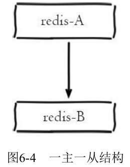
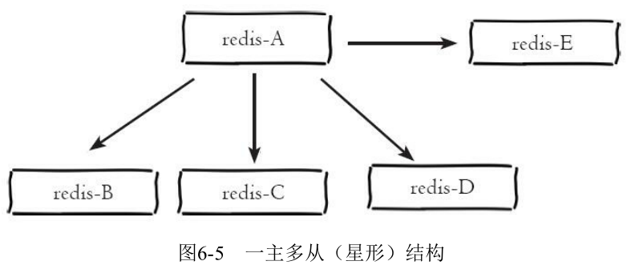
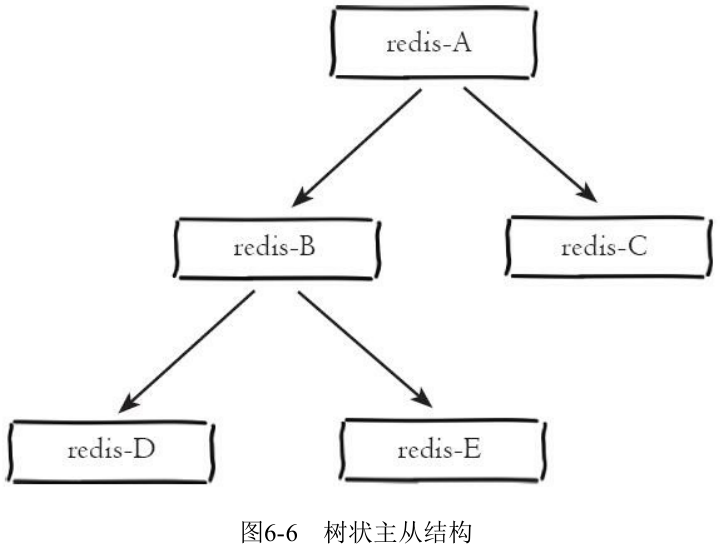
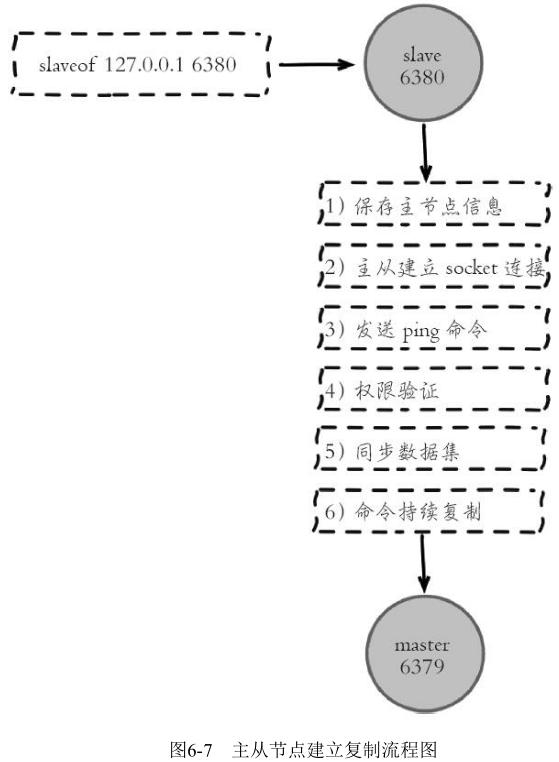
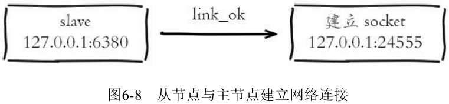
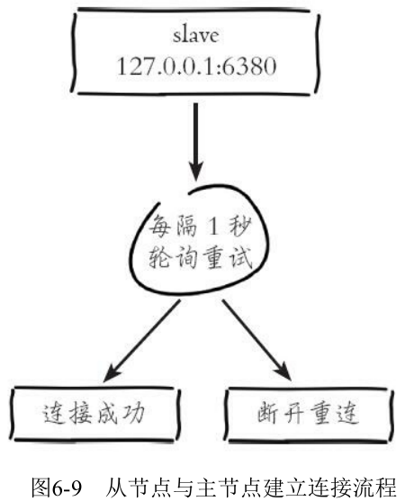
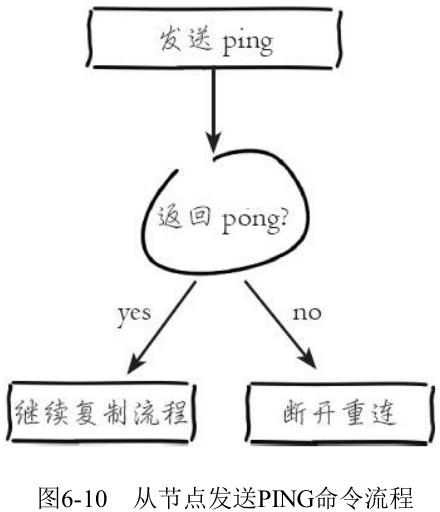

# 第6章 复制

## 6.1 配置

### 6.1.1 建立复制

参与复制的Redis实例划分为主节点（master）和从节点（slave）。默认情况下，Redis都是主节点。每个从节点只能有一个主节点，而主节点可以同时具有多个从节点。复制的数据流是单向的，只能由主节点复制到从节点。

配置复制的方式有以下三种：

（1）在配置文件中加入slaveof {masterHost} {masterPort} 随Redis启动生效。

（2）在redis-server启动命令后加入--slaveof {masterHost} {masterPort} 生效。

（3）直接使用命令：slaveof {masterHost} {masterPort} 生效。

slaveof本身是异步命令，执行slaveof命令时，节点只保存主节点信息后返回，后续复制流程在节点内部异步执行。

主从节点复制成功建立后，可以使用info replication命令查看复制相关状态：

```shell
127.0.0.1:6379>info replication
# Replication
role:master
connected_slaves:1
slave0:ip=127.0.0.1,port=6379,state=online,offset=43,lag=0
```

### 6.1.2 断开复制

slaveof命令不但可以建立复制，还可以在从节点执行slaveof no one来断开与主节点复制关系。


断开复制主要流程：

（1）断开与主节点复制关系。

（2）从节点晋升为主节点。

从节点断开复制后并不会抛弃原有数据，只是无法再获取主节点上的数据变化。

通过slaveof命令还可以实现切主操作，所谓切主是指把当前从节点对主节点的复制切换到另一个主节点。执行slaveof {newMasterIp} {newMasterPort}命令即可。


切主操作流程如下：

（1）断开与旧主节点复制关系。

（2）与新主节点建立复制关系。

（3）删除从节点当前所有数据。

（4）对新主节点进行复制操作。

注：切主后从节点会清空之前所有的数据。

### 6.1.4 只读

默认情况下，从节点使用slave-read-only=yes配置为只读模式。由于复制只能从主节点到从节点，对于从节点的任何修改主节点都无法感知，修改从节点会造成主从数据不一致。因此建议线上不要修改从节点的只读模式。

### 6.1.5 传输延迟

主从节点一般部署在不同机器上，复制时的网络延迟就成为需要考虑的问题，Redis为我们提供了repl-disable-tcp-nodelay参数用于控制是否关闭TCP_NODELAY，默认关闭。

说明如下：

（1）当关闭时，主节点产生的命令数据无论大小都会及时地发送给从节点，这样主从之间延迟会变小，但增加了网络带宽的消耗。适用于主从之间的网络环境良好的场景，如同机架或同机房部署。

（2）当开启时，主节点会合并较小的TCP数据包从而节省带宽。默认发送时间间隔取决于Linux的内核，一般默认为40毫秒。这种配置节省了带宽但增大主从之间的延迟。适用于主从网络环境复杂或带宽紧张的场景，如跨机房部署。

注：部署主从节点时需要考虑网络延迟、带宽使用率、防灾级别等因素，如要求低延迟时，建议同机架或同机房部署并关闭repl-disable-tcp-nodelay；如果考虑高容灾性，可以同城跨机房部署并开启repl-disable-tcp-nodelay。

## 6.2 拓扑

Redis的复制拓扑结构可以支持单层或多层复制关系，根据拓扑复杂性可以分为以下三种：一主一从、一主多从、树状主从结构。

### 6.2.1 一主一从结构

一主一从结构是最简单的复制拓扑结构，用于主节点出现宕机时从节点提供故障转移支持。

当应用写命令并发量较高且需要持久化时，可以只在从节点上开启AOF，这样既保证数据安全性同时也避免了持久化对主节点的性能干扰。但需要注意的是，当主节点关闭持久化功能时，如果主节点脱机要避免自动重启操作。因为主节点之前没有开启持久化功能自动重启后数据集为空，这时从节点如果继续复制主节点会导致从节点数据也被清空的情况，丧失了持久化的意义。

安全的做法是在从节点上执行slaveof no one断开与主节点的复制关系，再重启主节点从而避免这一问题。



### 6.2.2 一主多从结构

一主多从结构（又称为星形拓扑结构）使得应用端可以利用多个从节点实现读写分离。

对于读占比较大的场景，可以把读命令发送到从节点来分担主节点压力。同时在日常开发中如果需要执行一些比较耗时的读命令，如：keys、sort等，可以在其中一台从节点上执行，防止慢查询对主节点造成阻塞从而影响线上服务的稳定性。

对于写并发量较高的场景，多个从节点会导致主节点写命令的多次发送从而过度消耗网络带宽，同时也加重了主节点的负载影响服务稳定性。



### 6.2.3 树状主从结构

树状主从结构（又称为树状拓扑结构）使得从节点不但可以复制主节点数据，同时可以作为其他从节点的主节点继续向下层复制。通过引入复制中间层，可以有效降低主节点负载和需要传送给从节点的数据量。

当主节点需要挂载多个从节点时为了避免对主节点的性能干扰，可以采用树状主从结构降低主节点压力。



数据写入节点A后会同步到B和C节点，B节点再把数据同步到D和E节点，数据实现了一层一层的向下复制。

## 6.3 原理

### 6.3.1 复制过程

在从节点执行slaveof命令后，复制过程便开始运作，下面详细介绍建立复制的完整流程：



复制过程大致分为6个过程：

（1）保存主节点（master）信息。

执行slaveof后从节点只保存主节点的地址信息便直接返回，这时建立复制流程还没有开始，在从节点6380执行info replication可以看到如下信息：

```shell
master_host:127.0.0.1
master_port:6379
master_link_status:down
```

（2）从节点（slave）内部通过每秒运行的定时任务维护复制相关逻辑，当定时任务发现存在新的主节点后，会尝试与该节点建立网络连接：



从节点会建立一个socket套接字，例如图6-8中从节点建立了一个端口为24555的套接字，专门用于接受主节点发送的复制命令。从节点连接成功后打印如下日志：

```shell
* Connecting to MASTER 127.0.0.1:6379
* MASTER <-> SLAVE sync started
```

如果从节点无法建立连接，定时任务会无限重试直到连接成功或者执行slaveof no one取消复制。



（3）发送ping命令

连接建立成功后从节点发送ping请求进行首次通信，ping请求主要目的如下：

​	1）检测主从之间网络套接字是否可用。

​	2）检测主节点当前是否可接受处理命令。

如果发送ping命令后，从节点没有收到主节点的pong回复或者超时，比如网络超时或者主节点正在阻塞无法响应命令，从节点会断开复制连接，下次定时任务会发起重连。



从节点发送的ping命令成功返回，Redis打印如下日志，并继续后续复制流程：

```shell
Master replied to PING, replication can continue...
```

（4）权限验证

如果主节点设置了requirepass参数，则需要密码验证，从节点必须配置masterauth参数保证与主节点相同的密码才能通过验证；如果验证失败复制将终止，从节点重新发起复制流程。

（5）同步数据集

主从复制连接正常通信后，对于首次建立复制的场景，主节点会把持有的数据全部发送给从节点，这部分操作是耗时最长的步骤。Redis在2.8版本以后采用新复制命令psync进行数据同步，原来的sync命令依然支持，保证新旧版本的兼容性。新版同步划分两种情况：全量同步和部分同步。

（6）命令持续复制

主节点把当前的数据同步给从节点后，便完成了复制的建立流程。接下来主节点会持续地把写命令发送给从节点，保证主从数据一致性。

### 6.3.2 数据同步

Redis在2.8及以上版本使用psync命令完成主从数据同步，同步过程分为：全量复制和部分复制。

（1）全量复制：一般用于初次复制场景，Redis早期支持的复制功能只有全量复制，它会把主节点全部数据一次性发送给从节点，当数据量较大时，会对主从节点和网络造成很大的开销。

（2）部分复制：用于处理在主从复制中因网络闪断等原因造成的数据丢失场景，当从节点再次连上主节点后，如果条件允许，主节点会补发丢失数据给从节点。因为补发的数据远远小于全量数据，可以有效避免全量复制的过高开销。

