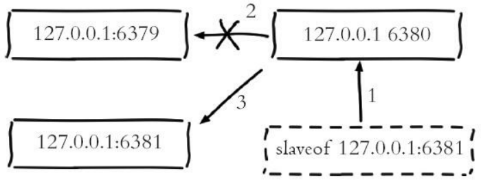

# 第6章 复制

## 6.1 配置

### 6.1.1 建立复制

参与复制的Redis实例划分为主节点（master）和从节点（slave）。默认情况下，Redis都是主节点。每个从节点只能有一个主节点，而主节点可以同时具有多个从节点。复制的数据流是单向的，只能由主节点复制到从节点。

配置复制的方式有以下三种：

（1）在配置文件中加入slaveof {masterHost} {masterPort} 随Redis启动生效。

（2）在redis-server启动命令后加入--slaveof {masterHost} {masterPort} 生效。

（3）直接使用命令：slaveof {masterHost} {masterPort} 生效。

slaveof本身是异步命令，执行slaveof命令时，节点只保存主节点信息后返回，后续复制流程在节点内部异步执行。

主从节点复制成功建立后，可以使用info replication命令查看复制相关状态：

```shell
127.0.0.1:6379>info replication
# Replication
role:master
connected_slaves:1
slave0:ip=127.0.0.1,port=6379,state=online,offset=43,lag=0
```

### 6.1.2 断开复制

slaveof命令不但可以建立复制，还可以在从节点执行slaveof no one来断开与主节点复制关系。


断开复制主要流程：

（1）断开与主节点复制关系。

（2）从节点晋升为主节点。

从节点断开复制后并不会抛弃原有数据，只是无法再获取主节点上的数据变化。

通过slaveof命令还可以实现切主操作，所谓切主是指把当前从节点对主节点的复制切换到另一个主节点。执行slaveof {newMasterIp} {newMasterPort}命令即可。



切主操作流程如下：

（1）断开与旧主节点复制关系。

（2）与新主节点建立复制关系。

（3）删除从节点当前所有数据。

（4）对新主节点进行复制操作。

注：切主后从节点会清空之前所有的数据。

### 6.1.4 只读

默认情况下，从节点使用slave-read-only=yes配置为只读模式。由于复制只能从主节点到从节点，对于从节点的任何修改主节点都无法感知，修改从节点会造成主从数据不一致。因此建议线上不要修改从节点的只读模式。

### 6.1.5 传输延迟

主从节点一般部署在不同机器上，复制时的网络延迟就成为需要考虑的问题，Redis为我们提供了repl-disable-tcp-nodelay参数用于控制是否关闭TCP_NODELAY，默认关闭。

说明如下：

（1）当关闭时，主节点产生的命令数据无论大小都会及时地发送给从节点，这样主从之间延迟会变小，但增加了网络带宽的消耗。适用于主从之间的网络环境良好的场景，如同机架或同机房部署。

（2）当开启时，主节点会合并较小的TCP数据包从而节省带宽。默认发送时间间隔取决于Linux的内核，一般默认为40毫秒。这种配置节省了带宽但增大主从之间的延迟。适用于主从网络环境复杂或带宽紧张的场景，如跨机房部署。

注：部署主从节点时需要考虑网络延迟、带宽使用率、防灾级别等因素，如要求低延迟时，建议同机架或同机房部署并关闭repl-disable-tcp-nodelay；如果考虑高容灾性，可以同城跨机房部署并开启repl-disable-tcp-nodelay。

## 6.2 拓扑

