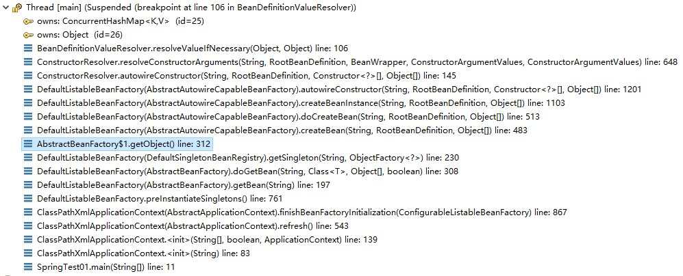

## 什么是循环依赖？

循环依赖是指：A在初始化时依赖于B，B在初始化时依赖于C，C在初始化时依赖于A，即：A->B，B->C，C->A。如果容器不处理循环依赖的话，容器会无限执行上面的流程，直到内存溢出，程序崩溃。

## Spring有几种循环依赖？

循环依赖分为3种：

（1）单例构造器方式注入循环依赖。

（2）单例Setter方式注入循环依赖。

（3）原型Setter方式注入循环依赖。

## 单例构造器方式注入循环依赖

### 单例构造器方式注入循环依赖示例

在Spring中相应的配置如下：

```java
// ClassA类
package beans;
import lombok.AllArgsConstructor;
import lombok.NoArgsConstructor;
import lombok.Data;
@Data
@AllArgsConstructor
@NoArgsConstructor
public class ClassA {
	private ClassB classB;
    
    public void print() {
		System.out.println("Class A");
	}
}

// ClassB类
package beans;
import lombok.AllArgsConstructor;
import lombok.NoArgsConstructor;
import lombok.Data;
@Data
@AllArgsConstructor
@NoArgsConstructor
public class ClassB {
	private ClassC classC;
    
    public void print() {
		System.out.println("Class B");
	}
}

// ClassC类
package beans;
import lombok.AllArgsConstructor;
import lombok.NoArgsConstructor;
import lombok.Data;
@Data
@AllArgsConstructor
@NoArgsConstructor
public class ClassC {
	private ClassA classA;
    
    public void print() {
		System.out.println("Class C");
	}
}
```

Spring的XML配置：

```xml
<bean id="classA" class="beans.ClassA">
    <constructor-arg name="classB" ref="classB"/>
</bean>
<bean id="classB" class="beans.ClassB">
    <constructor-arg name="classC" ref="classC"/>
</bean>
<bean id="classC" class="beans.ClassC">
    <constructor-arg name="classA" ref="classA"/>
</bean>
```

程序启动：

```java
public static void main(String[] args) {
		ClassPathXmlApplicationContext context = 
            new ClassPathXmlApplicationContext("beans.xml");
        ClassA userBean = context.getBean("classA", ClassA.class);
        context.close();
    }
```

程序启动时报错：

```java
Caused by: org.springframework.beans.factory.BeanCreationException: Error creating bean with name 'classB' defined in class path resource [beans.xml]: Cannot resolve reference to bean 'classC' while setting constructor argument; nested exception is org.springframework.beans.factory.BeanCreationException: Error creating bean with name 'classC' defined in class path resource [beans.xml]: Cannot resolve reference to bean 'classA' while setting constructor argument; nested exception is org.springframework.beans.factory.BeanCurrentlyInCreationException: Error creating bean with name 'classA': Requested bean is currently in creation: Is there an unresolvable circular reference?
	at org.springframework.beans.factory.support.BeanDefinitionValueResolver.resolveReference(BeanDefinitionValueResolver.java:359)
	at org.springframework.beans.factory.support.BeanDefinitionValueResolver.resolveValueIfNecessary(BeanDefinitionValueResolver.java:108)
	at org.springframework.beans.factory.support.ConstructorResolver.resolveConstructorArguments(ConstructorResolver.java:648)
	at org.springframework.beans.factory.support.ConstructorResolver.autowireConstructor(ConstructorResolver.java:145)
	at org.springframework.beans.factory.support.AbstractAutowireCapableBeanFactory.autowireConstructor(AbstractAutowireCapableBeanFactory.java:1201)
	at org.springframework.beans.factory.support.AbstractAutowireCapableBeanFactory.createBeanInstance(AbstractAutowireCapableBeanFactory.java:1103)
	at org.springframework.beans.factory.support.AbstractAutowireCapableBeanFactory.doCreateBean(AbstractAutowireCapableBeanFactory.java:513)
	at org.springframework.beans.factory.support.AbstractAutowireCapableBeanFactory.createBean(AbstractAutowireCapableBeanFactory.java:483)
	at org.springframework.beans.factory.support.AbstractBeanFactory$1.getObject(AbstractBeanFactory.java:312)
	at org.springframework.beans.factory.support.DefaultSingletonBeanRegistry.getSingleton(DefaultSingletonBeanRegistry.java:230)
	at org.springframework.beans.factory.support.AbstractBeanFactory.doGetBean(AbstractBeanFactory.java:308)
	at org.springframework.beans.factory.support.AbstractBeanFactory.getBean(AbstractBeanFactory.java:197)
	at org.springframework.beans.factory.support.BeanDefinitionValueResolver.resolveReference(BeanDefinitionValueResolver.java:351)
	... 17 more
```

从报错的信息中可以得知，程序发生了循环依赖导致程序终止。

跟踪异常栈：BeanDefinitionValueResolver.java:108：

```java
// BeanDefinitionValueResolver.resolveValueIfNecessary(Object, Object)
public Object resolveValueIfNecessary(Object argName, Object value) {
    if (value instanceof RuntimeBeanReference) {
        RuntimeBeanReference ref = (RuntimeBeanReference) value;
        return resolveReference(argName, ref);
    }
    // ...
}

private Object resolveReference(Object argName, RuntimeBeanReference ref) {
    String refName = ref.getBeanName();
    refName = String.valueOf(doEvaluate(refName));
    if (ref.isToParent()) {
        if (this.beanFactory.getParentBeanFactory() == null) {
            throw new BeanCreationException("...");
        }
        return this.beanFactory.getParentBeanFactory().getBean(refName);
    } else {
        // 根据beanName获取Bean实例，其中refName是构造函数中参数ref的名称
        Object bean = this.beanFactory.getBean(refName);
        this.beanFactory.registerDependentBean(refName, this.beanName);
        return bean;
    }
}
```

查看调用栈：



从上图可以看出，真正创建单例bean的逻辑是在AbstractAutowireCapableBeanFactory#doCreateBean中：

```java
// AbstractAutowireCapableBeanFactory#doCreateBean
protected Object doCreateBean(final String beanName, final RootBeanDefinition mbd, 
                              final Object[] args) throws BeanCreationException {

    BeanWrapper instanceWrapper = null;
    if (mbd.isSingleton()) {
        instanceWrapper = this.factoryBeanInstanceCache.remove(beanName);
    }
    if (instanceWrapper == null) {
        // 在这里执行
        instanceWrapper = createBeanInstance(beanName, mbd, args);
    }
    final Object bean = (instanceWrapper != null ? 
                         instanceWrapper.getWrappedInstance() : null);
    // ...
```

### Spring如何解决单例构造器方式循环依赖

没法解决。

```java
ClassA classA = new ClassA(new ClassB(new ClassC(new ClassA(...))));
```

ClassA构造函数在初始化的时候，发现需要依赖ClassB，然后接着去初始化ClassB；ClassB构造函数在初始化的时候，发现需要依赖ClassC，然后接着去初始化ClassC；ClassC构造函数在初始化的时候，发现需要依赖ClassA，然后接着去初始化ClassA...，从而形成一个环。如果没有介入机制，那么程序会直到内存溢出，程序崩溃。

但是通过异常栈的异常信息发现，异常信息不是内存异常的相关异常。Spring是如何发现循环依赖呢？

Spring通过两个Set容器inCreationCheckExclusions和singletonsCurrentlyInCreation，记录正在实例化的beanName。在bean开始进行实例化的时候，会将beanName添加到singletonsCurrentlyInCreation中：

```java
//DefaultSingletonBeanRegistry#setCurrentlyInCreation
protected void beforeSingletonCreation(String beanName) {
    // 在初始化bean的时候，校验是否已经存在该bean对应的beanName，没有则将其加入singletonsCurrentlyInCreation，有则抛出异常
    if (!this.inCreationCheckExclusions.contains(beanName) 
        				&& !this.singletonsCurrentlyInCreation.add(beanName)) {
        throw new BeanCurrentlyInCreationException(beanName);
    }
}
```

完成实例化的时候，会将其移除：

```java
// DefaultSingletonBeanRegistry#afterSingletonCreation
protected void afterSingletonCreation(String beanName) {
    // 完成bean的初始化时，将beanName从singletonsCurrentlyInCreation移除
    if (!this.inCreationCheckExclusions.contains(beanName) 
        		&& !this.singletonsCurrentlyInCreation.remove(beanName)) {
        throw new IllegalStateException("...");
    }
}
```

通过这两个方法的校验，可以及时发现循环依赖的问题：

ClassA构造函数在初始化的时候，将classA加入singletonsCurrentlyInCreation，然后发现需要依赖ClassB，然后接着去初始化ClassB；ClassB构造函数在初始化的时候，将classB加入singletonsCurrentlyInCreation，然后发现需要依赖ClassC，然后接着去初始化ClassC；ClassC构造函数在初始化的时候，将classC加入singletonsCurrentlyInCreation，然后发现需要依赖ClassA，然后接着去初始化ClassA；ClassA在初始化的时候，将classB加入singletonsCurrentlyInCreation，但是在beforeSingletonCreation方法中singletonsCurrentlyInCreation.add(beanName)返回false，则抛出BeanCurrentlyInCreationException异常，终止Spring容器初始化。这样即可解决了依赖注入时程序会内存溢出，程序崩溃。

## 单例Setter方式注入循环依赖

### 单例Setter方式注入循环依赖示例

ClassA、ClassB、ClassC三个类不变。

Spring的XML配置：

```xml
<bean id="classA" class="beans.ClassA">
    <property name="classB" ref="classB"/>
</bean>

<bean id="classB" class="beans.ClassB">
    <property name="classC" ref="classC"/>
</bean>

<bean id="classC" class="beans.ClassC">
    <property name="classA" ref="classA"/>
</bean>
```

程序启动：

```java
public static void main(String[] args) {

    ClassPathXmlApplicationContext context = 
        				new ClassPathXmlApplicationContext("beans.xml");

    ClassA classA = context.getBean("classA", ClassA.class);
    classA.print(); // 打印：Class A

    context.close();
}
```

从上面程序执行来看，程序成功启动并执行。那么Spring是如何解决单例Setter方式循环依赖呢？

### Spring如何解决单例Setter方式循环依赖

对于Spring如何解决单例Setter方式循环依赖的分析，需要对Spring源码实例化bean的流程有一定的了解。

在分析之前，需要说明3个涉及用于存储bean的不同的map：singletonObjects、singletonFactories、earlySingletonObjects。

| map                   | 说明                                                         |
| --------------------- | ------------------------------------------------------------ |
| singletonObjects      | 用于存放完成初始化的 bean                                    |
| singletonFactories    | 用于保存beanName和创建bean的工厂之间的关系，用于解决setter循环依赖 |
| earlySingletonObjects | 存放刚实例化，但是尚未完成属性初始化的 bean 对象，用于解决循环依赖 |

实例化Bean的方法为AbstractBeanFactory#doGetBean。对于doGetBean方法的执行流程，可以通过一张图来说明：


对于上图的流程， Object sharedInstance = getSingleton(beanName);如果返回的对象不为null，那么执行绿色的流程，直接返回。对于初次实例化的bean，当然在缓存中不会存在，所以接下来会执行红色的流程执行DefaultSingletonBeanRegistry#getSingleton(String, ObjectFactory<?>)方法：

```java
// DefaultSingletonBeanRegistry#getSingleton(String, ObjectFactory<?>)
public Object getSingleton(String beanName, ObjectFactory<?> singletonFactory) {
    //...
    singletonObject = singletonFactory.getObject();
	//...
    addSingleton(beanName, singletonObject);
	//...
}
```

从经过省略后的代码中所示，getSingleton方法首先会调用singletonFactory.getObject()创建bean实例，然后将创建的singletonObject放入singletonObjects集合中。

从上面的bean创建流程来看，并没有什么问题，也没有看到有解决循环依赖的逻辑。

回到上图的getObject()方法中，即singletonFactory.getObject()，singletonFactory是一个匿名内部类，其中的getObject方法的实现逻辑在外层的DefaultSingletonBeanRegistry#getSingleton(String, ObjectFactory<?>)中，不过getSingleton方法没有什么业务逻辑，具体的逻辑是在AbstractAutowireCapableBeanFactory#doCreateBean方法中：

```java
protected Object doCreateBean(final String beanName, final RootBeanDefinition mbd, 
                              final Object[] args) throws BeanCreationException {

    BeanWrapper instanceWrapper = null;
    // ...
    // 如果是构造器依赖注入，那么此处会进行解析构造器的参数，并对参数进行实例化，从而抛出循环依赖异常
    instanceWrapper = createBeanInstance(beanName, mbd, args);
    // 从BeanWrapper获取要实例化的bean对象，此bean仅仅刚实例化，还没有进行属性赋值填充
    final Object bean = (instanceWrapper != null ? 
                         instanceWrapper.getWrappedInstance() : null);


    /*
    earlySingletonExposure 用于表示是否”提前暴露“原始对象的引用，用于解决循环依赖。
    对于单例 bean，因为allowCircularReferences默认是true，
	而isSingletonCurrentlyInCreation(beanName)是判断当前bean是否在实例化中，
	走到此步骤，让是是存在，所以earlySingletonExposure是true。
     */ 
    boolean earlySingletonExposure = (mbd.isSingleton() 
                                      && this.allowCircularReferences 
                                      &&isSingletonCurrentlyInCreation(beanName));
    if (earlySingletonExposure) {
        //  提前暴露原始对象bean到singletonFactories缓存中
        addSingletonFactory(beanName, new ObjectFactory<Object>() {
            @Override
            public Object getObject() throws BeansException {
                return getEarlyBeanReference(beanName, mbd, bean);
            }
        });
    }

    // 填充属性
    Object exposedObject = bean;
    populateBean(beanName, mbd, instanceWrapper);	

    if (earlySingletonExposure) {
        Object earlySingletonReference = getSingleton(beanName, false);
        if (earlySingletonReference != null) {
            if (exposedObject == bean) {
                exposedObject = earlySingletonReference;
            }
        }
    }

    return exposedObject;
}


protected void addSingletonFactory(String beanName, ObjectFactory<?> singletonFactory) {
    synchronized (this.singletonObjects) {
        if (!this.singletonObjects.containsKey(beanName)) {
            // 将key为beanName的singletonFactory添加到singletonFactories缓存中
            this.singletonFactories.put(beanName, singletonFactory);
            // 移除key为beanName的相关缓存
            this.earlySingletonObjects.remove(beanName);
            this.registeredSingletons.add(beanName);
        }
    }
}
```

整理一下上面的逻辑，以ClassA、ClassB、ClassC的循环依赖创建进行说明：

（1）创建原始bean对象：

```java
instanceWrapper = createBeanInstance(beanName, mbd, args);
// 从BeanWrapper获取要实例化的bean对象，此bean仅仅刚实例化，还没有进行属性赋值填充
final Object bean = (instanceWrapper != null ? 
                     instanceWrapper.getWrappedInstance() : null);
```

当对ClassA进行创建时，到了此步骤后，ClassA已经被实例化，但是ClassA中的属性ClassB尚未初始化，即classB=null。

（2）指向刚创建的ClassA的ObjectFactory暴露出去：

```java
//  提前暴露原始对象bean到singletonFactories缓存中
addSingletonFactory(beanName, new ObjectFactory<Object>() {
    @Override
    public Object getObject() throws BeansException {
        return getEarlyBeanReference(beanName, mbd, bean);
    }
});
```

ClassA的实例创建好后，就开始将其通过ObjectFactory暴露出去。

（3）解析依赖

```java
populateBean(beanName, mbd, instanceWrapper);	
```

populateBean的作用是填充刚实例化bean的属性，即ClassA对象中的classB属性。当检查到ClassA依赖于ClassB属性，会去实例化ClassB；当检查到ClassB依赖于ClassC属性，会去实例化ClassC；当检查到ClassC依赖于ClassA属性，会去实例化ClassA。即最后在实例化ClassC时执行populateBean方法中，会去实例化ClassA。

到这里还是没有说清楚怎样解决这个循环依赖呢？

当ClassA再次实例化的时候，文章开始的时候说过，Spring先会调用DefaultSingletonBeanRegistry#getSingleton(java.lang.String)方法尝试获取已经实例化的对象：

```java
protected Object getSingleton(String beanName, boolean allowEarlyReference) {
    // 从上面的逻辑中来看，singletonObjects获取classA的实例为null
    Object singletonObject = this.singletonObjects.get(beanName);
    if (singletonObject == null && isSingletonCurrentlyInCreation(beanName)) {
        synchronized (this.singletonObjects) {
            // 从上面的逻辑中来看，earlySingletonObjects获取classA的实例为null
            singletonObject = this.earlySingletonObjects.get(beanName);
            if (singletonObject == null && allowEarlyReference) {
              // singletonFactories获取classA的实例时，不会为null，将返回尚未完成属性赋值的classA
                ObjectFactory<?> singletonFactory =
                    	this.singletonFactories.get(beanName);
                if (singletonFactory != null) {
                    singletonObject = singletonFactory.getObject();
                    this.earlySingletonObjects.put(beanName, singletonObject);
                    this.singletonFactories.remove(beanName);
                }
            }
        }
    }
    return (singletonObject != NULL_OBJECT ? singletonObject : null);
}
```

经过此步骤，ClassC获取到了尚未完成属性赋值的ClassA，则ClassC首先完成实例化且属性填充；然后ClassB接着获得了ClassC实例，也完成了实例化和属性填充；最后ClassA也获得了ClassB，也完成了实例化和属性填充。到此步骤，ClassA、ClassB、ClassC均已完成实例化。

注：在bean完成实例化后，会将其加入到singletonObjects中：

```java
// DefaultSingletonBeanRegistry#getSingleton(String, ObjectFactory<?>)
public Object getSingleton(String beanName, ObjectFactory<?> singletonFactory) {
    //...
    if (newSingleton) {
        addSingleton(beanName, singletonObject);
    }
}

protected void addSingleton(String beanName, Object singletonObject) {
    synchronized (this.singletonObjects) {
        this.singletonObjects.put(beanName, 
                           (singletonObject != null ? singletonObject : NULL_OBJECT));
        // 移除为解决循环依赖暴露的ObjectFactory。
        this.singletonFactories.remove(beanName);
        // 移除为解决循环依赖暂存的bean实例。
        this.earlySingletonObjects.remove(beanName);
        this.registeredSingletons.add(beanName);
    }
}
```

下一次getBean("classA")时，直接从singletonObjects缓存中获取。

注：对于singletonObjects、earlySingletonObjects、singletonFactories这三个map，在解决单例Setter循环依赖问题时，如果将earlySingletonObjects的作用移除，从代码层面分析也是可以完成解决循环依赖问题的。但是为Spring还会提供earlySingletonObjects这个缓存就不得而知了。

## 原型Setter方式注入循环依赖

原型构造器注入循环依赖本质上和单例构造器注入循环依赖是一样的。

### 原型Setter方式注入循环依赖示例

ClassA、ClassB、ClassC三个类不变。

Spring的XML配置：

```xml
<bean id="classA" class="beans.ClassA" scope="prototype">
    <property name="classB" ref="classB"/>
</bean>

<bean id="classB" class="beans.ClassB" scope="prototype">
    <property name="classC" ref="classC"/>
</bean>

<bean id="classC" class="beans.ClassC" scope="prototype">
    <property name="classA" ref="classA"/>
</bean>
```

程序启动：

```java
public static void main(String[] args) {

    ClassPathXmlApplicationContext context = 
        				new ClassPathXmlApplicationContext("beans.xml");

    ClassA classA = context.getBean("classA", ClassA.class);
    classA.print(); // 打印：Class A

    context.close();
}
```

程序启动时发现，会报错，且错误信息也是因为发生循环依赖导致程序终止。

### Spring如何解决原型Setter方式循环依赖

对于“prototype”作用域bean，Spring容器无法完成依赖注入，因为Spring容器不尽兴缓存“prototype”作用域的bean，因此无法提前暴露一个创建中的bean。即：

```java
// AbstractAutowireCapableBeanFactory#doCreateBean
protected Object doCreateBean(final String beanName, final RootBeanDefinition mbd, 
                              final Object[] args) throws BeanCreationException {
   
    //...
    //因为mbd.isSingleton()为false，所以不会提前暴露bean
    boolean earlySingletonExposure = (mbd.isSingleton() 
                                      && this.allowCircularReferences 
                                      &&isSingletonCurrentlyInCreation(beanName));
   	// ...
    if (earlySingletonExposure) {
        //  提前暴露原始对象bean到singletonFactories缓存中
        addSingletonFactory(beanName, new ObjectFactory<Object>() {
            @Override
            public Object getObject() throws BeansException {
                return getEarlyBeanReference(beanName, mbd, bean);
            }
        });
    }
    // ...
}
```

如果修改Spring源码，不对if (earlySingletonExposure)进行判断，直接将其提前暴露原始对象bean到singletonFactories缓存中是否可以解决原型Setter方式循环依赖呢？


