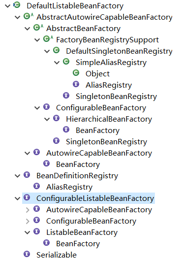
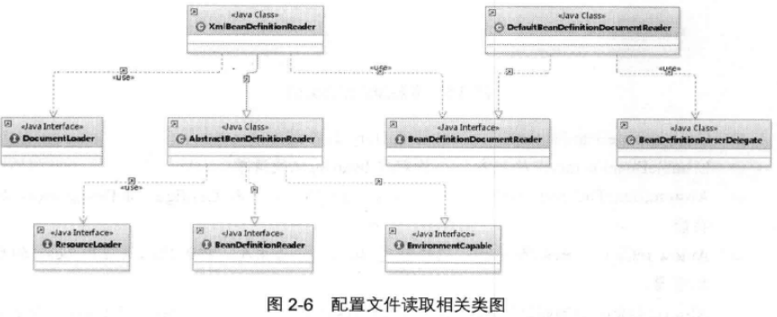
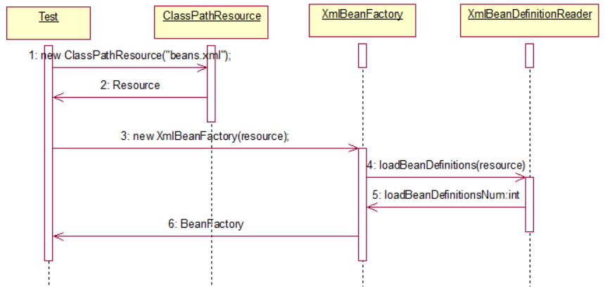
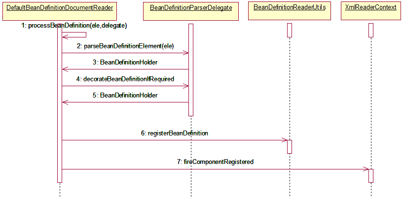
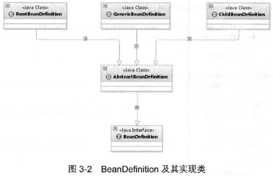
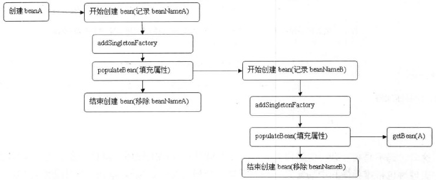
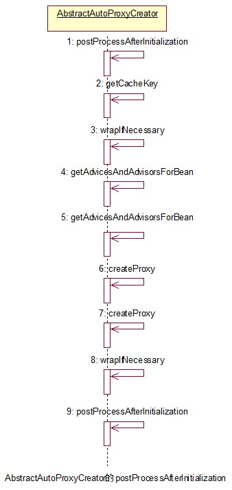

# 第2章 容器的基本实现

## 2.4 Spring的结构组成

### 2.4.2 核心类介绍

#### 1. DefaultListableBeanFactory

XmlBeanFactory继承自DefaultListableBeanFactory，而DefaultListableBeanFactory是整个bean加载的核心部分，是Spring注册及加载bean的默认实现。而对于XmlBeanFactory与DefaultListableBeanFactory不同的地方是在XMLBeanFactory中使用了自定义的XML读取器XmlBeanDefinitionReader，实现了个性化的BeanDefinitionReader读取。DefaultListableBeanFactory继承了AbstractAutowireCapableBeanFactory并实现了ConfigurableListableBeanFactory以及BeanDefinitionRegistry接口，以下是ConfigurableListableBeanFactory的层次结构图：



（1）AliasRegistry：定义对alias的简单增删改等操作。

（2）SimpleAliasRegistry：主要使用map作为alias的缓存，并对接口AliasRegistry进行实现。

（3）SingletonBeanRegistry：定义对单例的注册及获取。

（4）BeanFactory：定义获取bean及bean的各种属性。

（5）HierarchicalBeanFactory：继承BeanFactory，也就是在BeanFactory定义的功能的基础上增加了对parentFactory的支持。

（6）BeanDefinitionRegistry：定义对BeanDefinition的各种增删改操作。

（7）FactoryBeanRegistrySupport：在DefaultSingletonBeanRegistry基础上增加了对FactoryBean的特殊处理功能。

（8）ConfigurableBeanFactory：提供配置Factory的各种方法。

（9）ListableBeanFactory：根据各种条件获取bean的配置清单。

（10）AbstractBeanFactory：综合FactoryBeanRegistrySupport和ConfigurableBeanFactory的功能。

（11）AutowireCapableBeanFactory：提供创建bean、自动注入、初始化以及应用bean的后处理器。

（12）AbstractAutowireCapableBeanFactory：综合AbstractBeanFactory并对接口AutowireCapableBeanFactory进行实现。

（13）ConfigurableListableBeanFactory：BeanFactory配置清单，指定忽略类型及接口等。

（14）DefaultListableBeanFactory综合上面所有功能，主要是对Bean注册后的处理。

XmlBeanFactory对DefaultListableBeanFactory类进行了扩展，主要用于从XML文档中读取BeanDefinition。对于注册及获取Bean都是使用父类DefaultListableBeanFactory继承的方法去实现，而唯独与父类不同的个性化实现就是增加了XmlBeanDefinitionReader类型的reader属性。在XmlBeanFactory中主要使用reader属性对资源文件进行读取和注册。

#### 2. XmlBeanDefinitionReader

XML配置文件的读取是Spring中重要的功能，因为Spring的大部分功能都是以配置作为切入点的。XmlBeanDefinitionReader和父类及属性的功能：

（1）ResourceLoader：定义资源加载器，主要应用于根据给定的资源文件地址返回对应的Resource。

（2）BeanDefinitionReader：主要定义资源文件读取并转换为BeanDefinition的各个功能。

（3）EnvironmentCapable：定义获取Environment方法。

（4）DocumentLoader：定义从资源文件加载到转换为Document的功能。

（5）AbstractBeanDefinitionReader：对EnvironmentCapable、BeanDefinitionReader类定义的功能进行实现。

（6）BeanDefinitionDocumentReader：定义读取Document并注册BeanDefinition功能。

（7）BeanDefinitionParserDelegate：定义解析Element的功能方法。



XML配置文件读取的大致流程：

（1）通过继承AbstractBeanDefinitionReader中的方法，来使用ResourceLoader将资源文件路径转化为对应的Resource文件。

（2）通过DocumentLoader对Resource文件进行转化，将Resource文件转化为Document文件。

（3）通过实现接口BeanDefinitionDocumentReader的DefaultBeanDefinitionDocumentReader类对Document进行解析，并使用BeanDefinitionParserDelegate对Element进行解析。

## 2.5 容器的基础XmlBeanFactory



## 2.8 解析及注册BeanDefinitions

```java
public int registerBeanDefinitions(Document doc, Resource resource) throws BeanDefinitionStoreException {
    // 使用DefaultBeanDefinitionDocumentReader实例化BeanDefinitionDocumentReader
    BeanDefinitionDocumentReader documentReader = createBeanDefinitionDocumentReader();
    int countBefore = getRegistry().getBeanDefinitionCount();
    documentReader.registerBeanDefinitions(doc, createReaderContext(resource));
    return getRegistry().getBeanDefinitionCount() - countBefore;
}
// ...
protected void doRegisterBeanDefinitions(Element root) {
    // 专门处理解析
    BeanDefinitionParserDelegate parent = this.delegate;
    this.delegate = createDelegate(getReaderContext(), root, parent);

    if (this.delegate.isDefaultNamespace(root)) {
        // 处理profile属性
        String profileSpec = root.getAttribute(PROFILE_ATTRIBUTE);
        if (StringUtils.hasText(profileSpec)) {
            String[] specifiedProfiles = StringUtils.tokenizeToStringArray(
                profileSpec, 
                BeanDefinitionParserDelegate.MULTI_VALUE_ATTRIBUTE_DELIMITERS);
            if (!getReaderContext().getEnvironment().acceptsProfiles(specifiedProfiles)){
                return;
            }
        }
    }
    // 解析钱处理，留给子类实现
    preProcessXml(root);
    // 解析真正的逻辑
    parseBeanDefinitions(root, this.delegate);
    // 解析后处理，留给子类实现
    postProcessXml(root);

    this.delegate = parent;
}
```

### 2.8.2 解析并注册BeanDefinition

```java
protected void parseBeanDefinitions(Element root, BeanDefinitionParserDelegate delegate){
    if (delegate.isDefaultNamespace(root)) {
        NodeList nl = root.getChildNodes();
        for (int i = 0; i < nl.getLength(); i++) {
            Node node = nl.item(i);
            if (node instanceof Element) {
                Element ele = (Element) node;
                if (delegate.isDefaultNamespace(ele)) {
                    // 对bean的处理，Spring默认的配置
                    parseDefaultElement(ele, delegate);
                }
                else {
                    // 对bean的处理，用户自定义的配置
                    delegate.parseCustomElement(ele);
                }
            }
        }
    }
    else {
        delegate.parseCustomElement(root);
    }
}
```

Spring的XML配置里面有两大类Bean声明：

```xml
<!-- 默认的 -->
<bean id="test" class="test.TestBean"/>
<!-- 自定义 -->
<tx:annotation-drivern>
```

默认的配置Spring知道该怎么做，但是如果是自定义的，那就需要用户实现一些接口及配置了。对于根节点或者子节点如果是默认命名空间的话，则采用parseDefaultElement方法进行解析，否则使用delegate.parseCustomElement方法对自定义命名空间进行解析。

判断是否默认命名空间还是自定义命名空间的办法是使用node.getNamespaceURI()获取命名空间，并与Spring中固定的命名空间进行比对，如果一致则认为是默认，否则就认为是自定义。

# 第3章 默认标签的解析

默认标签的解析是在parseDefaultElement函数中进行的，函数中的功能逻辑是分别对4种不同标签（import、alias、bean和beans）做了不同的处理。

```java
private void parseDefaultElement(Element ele, BeanDefinitionParserDelegate delegate) {
   	// 对import标签的处理
    if (delegate.nodeNameEquals(ele, IMPORT_ELEMENT)) {
        importBeanDefinitionResource(ele);
    }
    // 对alias标签的处理
    else if (delegate.nodeNameEquals(ele, ALIAS_ELEMENT)) {
        processAliasRegistration(ele);
    }
    // 对bean标签的处理
    else if (delegate.nodeNameEquals(ele, BEAN_ELEMENT)) {
        processBeanDefinition(ele, delegate);
    }
    // 对beans标签的处理
    else if (delegate.nodeNameEquals(ele, NESTED_BEANS_ELEMENT)) {
        doRegisterBeanDefinitions(ele);
    }
}
```

## 3.1 bean标签的解析及注册

```java
protected void processBeanDefinition(Element ele, BeanDefinitionParserDelegate delegate){
    // 委托BeanDefinitionParserDelegate类的parseBeanDefinitionElement方法进行元素解析
    BeanDefinitionHolder bdHolder = delegate.parseBeanDefinitionElement(ele);
    if (bdHolder != null) {
        // 若存在默认标签的子节点下再有自定义属性，还需要再次对自定义标签进行解析。
        bdHolder = delegate.decorateBeanDefinitionIfRequired(ele, bdHolder);
        // 解析完成后，需要对解析后的bdHolder进行注册
        BeanDefinitionReaderUtils.registerBeanDefinition(bdHolder,
                                                       getReaderContext().getRegistry());
    }
        // 发出响应时间，通知相关的监听器
        getReaderContext().fireComponentRegistered(
            new BeanComponentDefinition(bdHolder));
    }
}
```


（1）首先委托BeanDefinitionParserDelegate类的parseBeanDefinitionElement方法进行元素解析，返回BeanDefinitionHolder类型的实例bdHolder，经过这个方法后，bdHolder实例已经包含配置文件中配置的各种属性了，如：class、name、id等。

（2）当返回的bdHolder不为空的情况下，若存在默认标签的子节点下再有自定义属性，还需要再次对自定义标签进行解析。

（3）解析完成后，需要对解析后的bdHolder进行注册，同样注册操作委托给了BeanDefinitionReaderUtils.registerBeanDefinition方法。

（4）发出响应时间，通知相关的监听器，这个bean已经加载完成了。



### 3.1.1 解析BeanDefinition

在BeanDefinitionParserDelegate#parseBeanDefinitionElement(Element, BeanDefinition)中是对默认标签解析的全过程：

（1）提取元素中的id以及name属性。

（2）进一步解析其他所有属性并统一封装至GenericBeanDefinition类型的实例中。

（3）如果检测到bean没有指定beanName，那么使用默认规则为此Bean生成beanName。

（4）将获取到的信息封装到BeanDefinitionHolder的实例中。

#### 1. 创建用于属性承载的BeanDefinition

BeanDefinition是一个借口，在Spring中存在三种实现：RootBeanDefinition、ChildBeanDefinition以及GenericBeanDefinition。三种实现均继承了AbstractBeanDefinition，其中BeanDefinition是配置文件\<bean>元素标签在容器中的内部表示形式。

\<bean>元素标签拥有class、scope、lazy-init等配置属性，BeanDefinition则提供了相应的beanClass、scope、lazyInit属性，BeanDefinition和\<bean>中的属性是一一对应的。其中RootBeanDefinition是最常用的实现类，它对应一般性的\<bean>元素标签。

在配置文件中可以定义父\<bean>和子\<bean>，父\<bean>用RootBeanDefinition表示，而子\<bean>用ChildBeanDefinition表示。

Spring通过BeanDefinition将配置文件中的\<bean>配置信息转换为容器的内部表示，并将这些BeanDefinition注册到BeanDefinitionRegistry中。Spring容器的BeanDefinitionRegistry就像Spring配置信息的内存数据库，主要是以map的形式保存，后续操作直接从BeanDefinitionRegistry中读取配置信息。



要解析属性首先要创建用于承载属性的实例，也就是创建GenericBeanDefinition类型的实例。BeanDefinitionParserDelegate#createBeanDefinition的作用就是实现此功能。

#### 2. 解析各种属性

当创建了bean信息的承载实例BeanDefinition后，便可以进行bean信息的各种属性解析了。BeanDefinitionParserDelegate#parseBeanDefinitionAttributes方法是对element所有元素属性进行解析。

#### 3. 解析子元素meta

元数据meta属性的使用：

```xml
<bean id="testBean" class="bean.TestBean">
	<meta key="testStr" value="aaa"/>
</bean>
```

这段代码不会体现在TestBean的属性当中，而是一个额外的声明，当需要使用里面的信息的时候可以通过BeanDefinition的getAttribute(key)方法进行获取。

BeanDefinitionParserDelegate#parseMetaElements方法用于解析子元素meta。

#### 4. 解析子元素lookup-method

#### 5. 解析子元素replaced-method

#### 6. 解析子元素constructor-arg

#### 7. 解析子元素property

#### 8. 解析子元素qualifier

### 3.1.2 AbstractBeanDefinition属性

XML中所有的配置都可以在GenericBeanDefinition的实例类中找到对应的配置。GenericBeanDefinition只是子类实现，而大部分的通用属性都保存在了AbstractBeanDefinition中。

### 3.1.3 解析默认标签中的自定义标签元素

对于BeanDefinitionParserDelegate#decorateBeanDefinitionIfRequired(Element, BeanDefinitionHolder)方法，当Spring中的bean使用的是默认标签配置，但其中的子元素却使用了自定义的配置时，此函数就会起作用。

```xml
<bean id="test" class="test.MyClass">
	<mybean:user username="aaa"/>
</bean>
```

跟踪源码：

```java
public BeanDefinitionHolder decorateBeanDefinitionIfRequired(
			Element ele, BeanDefinitionHolder definitionHolder, 
    		BeanDefinition containingBd) {

    BeanDefinitionHolder finalDefinition = definitionHolder;
    NamedNodeMap attributes = ele.getAttributes();
    // 遍历所有的属性，看看是否有适合用于修饰的属性
    for (int i = 0; i < attributes.getLength(); i++) {
        Node node = attributes.item(i);
        finalDefinition = decorateIfRequired(node, finalDefinition, containingBd);
    }
    NodeList children = ele.getChildNodes();
    // 遍历所有的子节点，看看是否有适用于修饰的子元素
    for (int i = 0; i < children.getLength(); i++) {
        Node node = children.item(i);
        if (node.getNodeType() == Node.ELEMENT_NODE) {
            finalDefinition = decorateIfRequired(node, finalDefinition, containingBd);
        }
    }
    return finalDefinition;
}
public BeanDefinitionHolder decorateIfRequired(
    Node node, BeanDefinitionHolder originalDef, BeanDefinition containingBd) {
    // 获取自定义标签的命名空间
    String namespaceUri = getNamespaceURI(node);
    // 对于非默认标签进行修饰
    if (!isDefaultNamespace(namespaceUri)) {
        // 根据命名空间找到对应的处理器
        NamespaceHandler handler = 
            this.readerContext.getNamespaceHandlerResolver().resolve(namespaceUri);
        if (handler != null) {
            // 进行修饰
            return handler.decorate(node, originalDef, new ParserContext(
                this.readerContext, this, containingBd));
        }
    }
    return originalDef;
}
```

上述的代码是：首先获取属性或者元素的命名空间，以此来判断该元素或者属性是否适用于自定义标签的解析条件，找出自定义类型所对应的NamespaceHandler并进行进一步解析。

对于decorateBeanDefinitionIfRequired方法，对于程序默认的标签的处理死直接略过的，因为默认的标签到这里就已经处理完了。在方法中实现了寻找自定义标签并根据自定义标签寻找命名空间处理器，并进行进一步的解析。

### 3.1.4 注册解析的BeanDefinition

```java
public static void registerBeanDefinition( BeanDefinitionHolder definitionHolder, 
                   BeanDefinitionRegistry registry) throws BeanDefinitionStoreException {
	// 使用beanName做唯一标识注册
    String beanName = definitionHolder.getBeanName();
    registry.registerBeanDefinition(beanName, definitionHolder.getBeanDefinition());
    // 注册所有的别名
    String[] aliases = definitionHolder.getAliases();
    if (aliases != null) {
        for (String alias : aliases) {
            registry.registerAlias(beanName, alias);
        }
    }
}
```

解析的BeanDefinition都会被注册到BeanDefinitionRegistry类型的实例中，而对于BeanDefinition的注册分成了两部分：通过beanName的注册和通过别名的注册。

#### 1. 通过beanname注册BeanDefinition

```java
public void registerBeanDefinition(String beanName, BeanDefinition beanDefinition)
			throws BeanDefinitionStoreException {
    // ...
}
```

对于bean的注册处理方式上，主要进行了几个步骤：

（1）对于AbstractBeanDefinition的校验。此处的校验时针对于AbstractBeanDefinition的methodOvrride属性的。

（2）对beanName已经注册的情况的处理。如果设置了不允许bean的覆盖，则需要抛出异常，否则直接覆盖。

（3）加入map缓存。

（4）清除解析之前留下的对应beanName的缓存。

#### 2. 通过别名注册BeanDefinition

```java
public void registerAlias(String name, String alias) {
    synchronized (this.aliasMap) {
        // 如果beanName与alias相同的话，不记录alias，并删除对应的alias
        if (alias.equals(name)) {
            this.aliasMap.remove(alias);
        }
        else {
            // 如果alias不允许被覆盖，则抛出异常
            String registeredName = this.aliasMap.get(alias);
            if (registeredName != null) {
                if (registeredName.equals(name)) {
                    return;
                }
                if (!allowAliasOverriding()) {
                    throw new IllegalStateException("...");
                }
            }
            // 当A->B存在时，若再次出现A->C->B时候，则会抛出异常
            checkForAliasCircle(name, alias);
            this.aliasMap.put(alias, name);
        }
    }
}
```

注册alias的步骤如下：

（1）alias与beanName相同情况处理。若alias与beanName并名称相同，则不需要处理并删除掉原有alias。

（2）alias覆盖处理。若aliasName已经使用并已经指向了另一个beanName，则需要用户的设置进行处理。

（3）alias循环检查。当A->B存在时，若再次出现A->C->B时候，则会抛出异常。

### 3.1.5 通知监听器解析及注册完成

通过代码getReaderContext().fireComponentRegistered(new BeanComponentDefinition(bdHolder));完成此工作。这里的实现只是为扩展，当程序开发人员需要对注册BeanDefinition事件进行监听时，可以通过注册监听器的方式并将处理逻辑写入监听器中，目前在Spring中并没有对此事件做任何逻辑处理。

## 3.2 alias标签的解析

在对bean进行定义时，除了使用id属性来指定名称之外，为了提供多个名称，可以使用alias标签来指定。而所有的这些名称都指向同一个bean。在某些情况下提供别名非常有用，比如为了让应用的每一个组件能更容易地对公共组件进行引用。

在定义bean时就指定所有的别名并不是总是恰当的。有时候期望能在当前位置为那些在别处定义的bean引入别名。在XML配置文件中，可以单独的\<alias/>元素来完成bean别名的定义。如配置文件中定义了一个JavaBean：

```xml
<bean id="testBean" class="com.TestBean"/>
```

要给这个JavaBean增加别名，以便不同对象来调用。可以直接使用bean标签中的name属性：

```xml
<bean id="testBean" name="testBean,testBean2" class="com.TestBean"/>
```

同时Spring还提供了另一种声明别名的方式：

```xml
<bean id="testBean" class="com.TestBean"/>
<alias nam"testBean" alias="testBean,testBean2"/>
```

考虑一个更为具体的例子：组件A在XML配置文件中定义了一个名为componentA的DataSource类型的bean，但组件B却想在其XML文件中以componentB命名来引用此bean。而且在主程序MyApp的XML配置文件中，希望以myApp的名字来引用此bean。最后容器加载3个XML文件来生成最终的ApplicationContext。在此情形下，可通过在配置文件中添加下列alias元素来实现：

```xml
<alias nam"componentA" alias="componentB"/>
<alias nam"componentA" alias="myApp"/>
```

这样一来，每个组件及主程序就可以通过唯一名字来引用同一个数据源而互不干扰。

## 3.3 import标签的解析

## 3.4 嵌入式beans标签的解析

# 第4章 自定义标签的解析

## 4.1 自定义标签使用

Spring提供了可扩展Schema的支持，扩展Spring自定义标签配置大致需要以下几个步骤：

（1）创建一个需要扩展的组件。

（2）定义一个XSD文件描述组件内容。

（3）创建一个文件，实现BeanDefinitionParser接口，用来解析XSD文件中的定义和组件定义。

（4）创建一个Handler文件，扩展自NamespaceHandlerSupport，目的是将组件注册到Spring容器。

（5）编写Spring.handlers和Spring.schemas文件。

1. 创建一个普通的POJO类

这个POJO类没有任何特别之处，只是用来接收配置文件：

```java
@Data
public class UserBean {
	private String username;
	private String email;
}
```

2. 定义一个XSD文件描述组件内容

```xml
<?xml version="1.0" encoding="UTF-8"?>
<schema xmlns="http://www.w3.org/2001/XMLSchema"
	targetNamespace="http://www.lexueba.com/schema/user"
	xmlns:tns="http://www.lexueba.com/schema/user"
	elementFormDefault="qualified">
	<element name="user">
		<complexType>
			<attribute name="id" type="string"/>
			<attribute name="username" type="string"/>
			<attribute name="email" type="string"/>
		</complexType>
	</element>
</schema>
```

3. 创建实现BeanDefinitionParser接口的Java类

这个Java类用来解析XSD文件中的定义和组件定义：

```java
public class UserBeanDefinitionParser extends AbstractSingleBeanDefinitionParser {

	@Override
	protected Class<?> getBeanClass(Element element) {
		return UserBean.class;
	}
	
	@Override
	protected void doParse(Element element, BeanDefinitionBuilder builder) {
		String userName = element.getAttribute("userName");
		String email = element.getAttribute("email");
		if(StringUtils.hasText(userName)) {
			builder.addPropertyValue("userName", userName);
		}
		if(StringUtils.hasText(email)) {
			builder.addPropertyValue("email", email);
		}
	}
}
```

4. 创建一个扩展NamespaceHandlerSupport的Java类

这个类扩展自NamespaceHandlerSupport，目的是将组件注册到Spring容器。

```java
public class UserNamespaceHandler extends NamespaceHandlerSupport {

	@Override
	public void init() {
		registerBeanDefinitionParser("user", new UserBeanDefinitionParser());
	}

}
```

5. 编写Spring.handlers和Spring.schemas文件，默认位置是在工程的/META-INF/文件夹下，也可以通过Spring的扩展或者修改源码的方式改变路径。

（1）Spring.handlers

```xml
http\://www.lexueba.com/schema/user=spring.handler.UserNamespaceHandler
```

（2）Spring.schemas

```xml
http\://www.lexueba.com/schema/user.xsd=META-INF/spring-test.xsd
```

6. 创建测试配置文件，在配置文件中引入对应的命名空间以及XSD后，便可以直接使用自定义标签了

```xml
<?xml version="1.0" encoding="UTF-8"?>
<beans xmlns="http://www.springframework.org/schema/beans"
	xmlns:xsi="http://www.w3.org/2001/XMLSchema-instance"
	xmlns:myname="http://www.lexueba.com/schema/user"
	xsi:schemaLocation="http://www.springframework.org/schema/beans
    http://www.springframework.org/schema/beans/spring-beans-4.1.xsd
    http://www.lexueba.com/schema/user
    http://www.lexueba.com/schema/user/user.xsd">

	<myname:user id="testBean" userName="aaa" email="bbb"/>
	
</beans>
```

7. 测试

```java
public class Test {

	public static void main(String[] args) {

		ApplicationContext context = new ClassPathXmlApplicationContext("");
		UserBean userBean = context.getBean("testBean", UserBean.class);
		
		System.out.println(userBean);
		
	}
}
```

## 4.2 自定义标签解析

```java
public BeanDefinition parseCustomElement(Element ele, BeanDefinition containingBd) {
    // 获取对应的命名空间
    String namespaceUri = getNamespaceURI(ele);
    // 根据命名空间找到对应的NamespaceHandler
    NamespaceHandler handler = 
        this.readerContext.getNamespaceHandlerResolver().resolve(namespaceUri);
    if (handler == null) {
        return null;
    }
    // 调用自定义的NamespaceHandler进行解析
    return handler.parse(ele, new ParserContext(this.readerContext, this, containingBd));
}
```

自定义标签的实现的思路：根据对应的bean获取对应的命名空间，根据命名空间解析对应的处理器，然后根据用户自定义的处理器进行解析。

# 第5章 bean的加载

bean的加载入口为：AbstractBeanFactory#getBean(String)：

```java
protected <T> T doGetBean( final String name, final Class<T> requiredType, 
                  final Object[] args, boolean typeCheckOnly)throws BeansException {
    // 提取对应的beanName
    final String beanName = transformedBeanName(name);
    Object bean;
    /*
    检查缓存中或者实例工厂中是否有对应的实例。因为在创建单例bean的时候会后会存在依赖注入的情况，而在创建
    依赖的时候为了避免循环依赖，Spring创建bean的原则是不等bean创建完成就会将创建bean的ObjectFactory
    提早暴露，也就是将ObjectFactory加入到缓存中，一旦下个bean创建时候需要依赖上个bean，则直接使用
    ObjectFactory
    */
    // 直接尝试从缓存获取或者singletonFactories中的ObjectFactory中获取
	Object sharedInstance = getSingleton(beanName);
    if (sharedInstance != null && args == null) {
        // 返回对应的实例，有时候存在诸如BeanFactory的情况并不是直接返回实例本身，而是返回指定方法
        // 返回的实例
        bean = getObjectForBeanInstance(sharedInstance, name, beanName, null);
    } else {
        /*
        只有在单例情况才会尝试解决循环依赖，原型模式情况下，如果存在A中有B的属性，B中有A的属性，那么当
        依赖注入的是偶，就会产生当A还未创建完的时候因为对于B的创建再次返回创建A，造成循环依赖
        */
        if (isPrototypeCurrentlyInCreation(beanName)) {
            throw new BeanCurrentlyInCreationException(beanName);
        }
        BeanFactory parentBeanFactory = getParentBeanFactory();
        // 如果beanDefinitionMap中也就是在所有已经加载的类中不包括beanName，则尝试从
        // parentBeanFactory中检测
        if (parentBeanFactory != null && !containsBeanDefinition(beanName)) {
            String nameToLookup = originalBeanName(name);
            // 递归到BeanFactory中寻找
            if (args != null) {
                return (T) parentBeanFactory.getBean(nameToLookup, args);
            }
            else {
                return parentBeanFactory.getBean(nameToLookup, requiredType);
            }
        }
        // 如果不是仅仅做类型检查，则是创建bean，这里要进行记录
        if (!typeCheckOnly) {
            markBeanAsCreated(beanName);
        }
        final RootBeanDefinition mbd = getMergedLocalBeanDefinition(beanName);
        checkMergedBeanDefinition(mbd, beanName, args);

        // Guarantee initialization of beans that the current bean depends on.
        String[] dependsOn = mbd.getDependsOn();
        // 若存在依赖，则需要递归实例化依赖的bean
        if (dependsOn != null) {
            for (String dep : dependsOn) {
                if (isDependent(beanName, dep)) {
                    throw new BeanCreationException("...");
                }
                // 缓存依赖调用
                registerDependentBean(dep, beanName);
                try {
                    getBean(dep);
                }
                catch (NoSuchBeanDefinitionException ex) {
                    throw new BeanCreationException("...");
                }
            }
        }
        // 实例化依赖的bean后便可以实例化mbd本身了
        // singleton模式的创建
        if (mbd.isSingleton()) {
            sharedInstance = getSingleton(beanName, new ObjectFactory<Object>() {
                @Override
                public Object getObject() throws BeansException {
                    try {
                        return createBean(beanName, mbd, args);
                    }
                    catch (BeansException ex) {
                        destroySingleton(beanName);
                        throw ex;
                    }
                }
            });
            bean = getObjectForBeanInstance(sharedInstance, name, beanName, mbd);
        }
        else if (mbd.isPrototype()) {
            // prototype模式的创建(new)
            Object prototypeInstance = null;
            try {
                beforePrototypeCreation(beanName);
                prototypeInstance = createBean(beanName, mbd, args);
            }
            finally {
                afterPrototypeCreation(beanName);
            }
            bean = getObjectForBeanInstance(prototypeInstance, name, beanName, mbd);
        } else {
            // 指定的scope上实例化bean
            String scopeName = mbd.getScope();
            final Scope scope = this.scopes.get(scopeName);
            if (scope == null) {
                throw new IllegalStateException("...");
            }
            try {
                Object scopedInstance = scope.get(beanName, new ObjectFactory<Object>() {
                    @Override
                    public Object getObject() throws BeansException {
                        beforePrototypeCreation(beanName);
                        try {
                            return createBean(beanName, mbd, args);
                        }
                        finally {
                            afterPrototypeCreation(beanName);
                        }
                    }
                });
                bean = getObjectForBeanInstance(scopedInstance, name, beanName, mbd);
            }
            catch (IllegalStateException ex) {
                throw new BeanCreationException("...");
            }
        }
    }
    // 检查需要的类型是否符合bean的实例类型
    if (requiredType != null && bean != null && !requiredType.isInstance(bean)) {
        try {
            return getTypeConverter().convertIfNecessary(bean, requiredType);
        }
        catch (TypeMismatchException ex) {
            throw new BeanNotOfRequiredTypeException("...");
        }
    }
    return (T) bean;
}
```

从上述代码来看，bean的加载经历了一个相当复杂的过程，其中涉及到各种各样的考虑。对于加载过程中涉及的步骤大致如下：

（1）转换对应beanName。传入的参数可能是别名，也可能是FactoryBean，所以需要进行一系列的解析，解析内容包括如下：

​		1）去除FactoryBean的修饰符，也就是如果name="&aa"，那么会首先去除&而使name="aa"。

​		2）取指定alias所表示的最终beanName，如别名A指向名称为B的bean，则返回B；若别名A指向别名B，别名B又指向名称C的bean，则返回C。

（2）尝试从缓存中加载单例。单例在Spring的同一个容器内只会被创建一次，后续再获取bean，就直接从单例缓存中获取了。首先尝试从缓存中加载，如果加载不成功则再次尝试从singletonFactories中加载。因为在创建单例bean的时候会存在依赖注入的情况，而在创建依赖的时候为了避免循环依赖，在Spring中创建bean的原则是不等bean创建完成就会将创建bean的ObjectFactory提早曝光加入到缓存中，一旦下一个bean创建时候需要依赖上一个bean，则直接使用ObjectFactory。

（3）bean的实例化。如果从缓存中得到了bean的原始状态，则需要对bean进行实例化。缓存中记录的只是最原始的bean状态，并不一定是最终想要的bean。如：需要对工厂bean进行处理，那么这里得到的其实是工厂bean的初始状态，但是真正需要的是工厂bean中定义的factory-method方法中返回的bean，而getObjectForBeanInstance就是完成这个工作的。

（4）原形模式的依赖检查。只有在单例情况下才会尝试解决循环依赖，如果存在A中有B的属性，B中有A的属性，那么当依赖注入的时候，就会产生当A还未创建完的时候因为对于B的创建再次返回创建A，造成循环依赖。即：isPrototypeCurrentlyInCreation(beanName)为true。

（5）检测parentBeanFactory。如果缓存没有数据的话，直接转到父类工厂加载。

（6）将存储XML配置文件的GenericBeanDefinition转换为RootBeanDefinition。因为从XML配置文件中读取到的Bean信息是存储在GenericBeanDefinition中的，但是所有的Bean后续处理都是针对于RootBeanDefinition的，所以这里需要进行一个转换，转换的同时如果父类bean不为空的话，则会一并合并父类的属性。

（7）寻找依赖。因为bean的初始化过程中很可能会用到某些属性，而某些属性很可能是动态配置的，并且配置成依赖于其他的bean，那么这个时候就有必要加载依赖的bean。所以在Spring的加载顺序中，在初始化某一个bean的时候首先会初始化这个bean所对应的依赖。

（8）针对不同的scope进行bean的创建。

（9）类型转换。将返回的bean转换为requiredType所指定的类型。即：getTypeConverter().convertIfNecessary(bean, requiredType)。

## 5.1 FactoryBean的使用

一般情况下，Spring通过反射机制利用bean的class属性指定实现类来实例化bean。在某些情况下，实例化bean过程比较复杂，如果按照传统的方式，则需要在\<bean>中提供大量的配置信息，配置方式的灵活性是受限的，这时采用编码的方式会比较简单。

Spring为此提供了一个org.springframework.beans.factory.FactoryBean的工厂接口，用户可以通过实现该接口定制实例化bean的逻辑。

```java
public interface FactoryBean<T> {
	// 返回由FactoryBean创建的bean实例，如果isSingleton()返回true，则该实例会放到Spring容器单例
    // 缓存池中
	T getObject() throws Exception;
    // 返回FactoryBean创建的bean类型
	Class<?> getObjectType();
    // 返回由FactoryBean创建的bean实例的作用域是singleton还是prototype
	boolean isSingleton();
}
```

当配置文件中\<bean>的class属性配置的实现类是FactoryBean时，通过getBean()方法返回的不是FactoryBean本身，而是FactoryBean#getObject()方法所返回的对象，相当于FactoryBean#getObject()代理了getBean()方法。当调用getBean()方法时，Spring通过反射机制发现该bean实现了FactoryBean的接口，这时Spring容器就调用接口方法FactoryBean#getObject()方法返回真实的bean实例。如果希望获取FactoryBean实例，则需要在使用getBean(beanName)方法时再beanName前显式的加上"&"前缀，如：getBean("&car")。

## 5.2 缓存中获取单例bean

单例在Spring的同一个容器中只会被创建一次，后续再获取bean直接从单例缓存中获取。当然这里也只是尝试加载，首先尝试从缓存中加载，然后再次尝试从singletonFactories中加载。因为在创建单例bean的时候，会存在依赖注入的情况，而在创建依赖的时候为了避免循环依赖，Spring创建bean的原则是不等bean创建完成就会创建bean的ObjectFactory提早曝光加入到缓存中，一旦下一个bean创建时需要依赖上个bean，则直接使用ObjectFactory。

```java
// DefaultSingletonBeanRegistry#getSingleton(java.lang.String, boolean)
protected Object getSingleton(String beanName, boolean allowEarlyReference) {
    // 检查缓存中是否存在实例
    Object singletonObject = this.singletonObjects.get(beanName);
    // 如果为空，则锁定全局变量并进行处理
    if (singletonObject == null && isSingletonCurrentlyInCreation(beanName)) {
        synchronized (this.singletonObjects) {
            // 如果此bean正在加载，则不处理
            singletonObject = this.earlySingletonObjects.get(beanName);
            if (singletonObject == null && allowEarlyReference) {
                // 当某些方法需要提前初始化的时候，则会调用addSingletonFactory方法将对应的
                // ObjectFactory初始化策略存储在singletonFactories
                ObjectFactory<?> singletonFactory = 
                    this.singletonFactories.get(beanName);
                if (singletonFactory != null) {
                    // 调用预先设定的getObject方法
                    singletonObject = singletonFactory.getObject();
                    // 记录在缓存中，earlySingletonObjects和singletonFactories互斥
                    this.earlySingletonObjects.put(beanName, singletonObject);
                    this.singletonFactories.remove(beanName);
                }
            }
        }
    }
    return (singletonObject != NULL_OBJECT ? singletonObject : null);
}
```

这个方法首先尝试从singletonObjects里面获取实例，如果获取不到再从earlySingletonObjects里面获取，如果还获取不到，再尝试从singletonFactories里面获取beanName对应的ObjectFactory，然后调用这个ObjectFactory的getObject来创建bean，并放到earlySingletonObjects里面去，并且从SingletonFactories里面remove掉这个ObjectFactory，而对于后续的所有内存操作都只是为了循环依赖检测时候使用，也就是在allowEarlyReference为true的情况下才会使用。

注：对于涉及用于存储bean的不同的map，分别进行说明：

（1）singletonObjects：用于保存BeanName和创建bean实例之前的关系，bean name -> bean instance。

（2）singletonFactories：用于保存BeanName和创建bean的工厂之间的关系，bean name -> ObjectFactory。

（3）earlySingletonObjects：保存BeanName和创建bean实例之间的关系，与singletonObjects的不同之处在于，当一个单例bean被放到这里面后，那么当bean还在创建过程中，就可以通过getBean方法获取到，其目的是用来检测循环引用。

（4）registerSingletons：用来保存当前所有已注册的bean。（Set，保存beanName）

## 5.3 从bean的实例中获取对象

getObjectForBeanInstance方法用于检测当前bean是否是FactoryBean类型的bean，如果是，那么需要调用该bean对应的FactoryBean实例的getObject()作为返回值。

无论是从缓存中获取到的bean还是通过不同的scope策略加载的bean，都只是最原始的bean状态，并不一定是最终想要的bean。

```java
//AbstractBeanFactory.getObjectForBeanInstance(Object,String, String,RootBeanDefinition)
protected Object getObjectForBeanInstance(
			Object beanInstance, String name, String beanName, RootBeanDefinition mbd) {
    // 如果指定的name是工厂相关（以&为前缀）且beanInstance又不是FactoryBean类型，则验证不通过
    if (BeanFactoryUtils.isFactoryDereference(name) && 
        !(beanInstance instanceof FactoryBean)) {
        throw new BeanIsNotAFactoryException("...");
    }
    //对于beanInstance实例，这个实例可能会使正常的bean或者是FactoryBean。如果是FactoryBean，使用它
    // 创建实例；但是如果用户想要直接获取工厂实例而不是工厂的getObject方法对应的实例，那么传入name应该
    // 加入前缀&
    if (!(beanInstance instanceof FactoryBean) 
        || BeanFactoryUtils.isFactoryDereference(name)) {
        return beanInstance;
    }
    // 加载FactoryBean
    Object object = null;
    if (mbd == null) {
        // 尝试从缓存中加载bean
        object = getCachedObjectForFactoryBean(beanName);
    }
    if (object == null) {
        // 到这里就已经明确知道beanInstance一定是FactoryBean类型
        FactoryBean<?> factory = (FactoryBean<?>) beanInstance;
        // containsBeanDefinition检测BeanDefinitionMap中也就是所有已经加载的类中检测是否定义
        // beanName
        if (mbd == null && containsBeanDefinition(beanName)) {
            mbd = getMergedLocalBeanDefinition(beanName);
        }
        // 是否是用户定义的而不是应用程序本身定义的
        boolean synthetic = (mbd != null && mbd.isSynthetic());
        object = getObjectFromFactoryBean(factory, beanName, !synthetic);
    }
    return object;
}
```

上面的代码中真正的核心代码委托给了getObjectFromFactoryBean，getObjectForBeanInstance所做的工作：

（1）对FactoryBean正确性的验证。

（2）对非FactoryBean不做任何处理。

（3）对bean进行转换。

（4）将Factory中解析bean的工作委托给getObjectFromFactoryBean。

```java
// FactoryBeanRegistrySupport#getObjectFromFactoryBean(FactoryBean,String, boolean)
protected Object getObjectFromFactoryBean(FactoryBean<?> factory, String beanName, 
                                          boolean shouldPostProcess) {
    // 如果是单例模式
    if (factory.isSingleton() && containsSingleton(beanName)) {
        synchronized (getSingletonMutex()) {
            Object object = this.factoryBeanObjectCache.get(beanName);
            if (object == null) {
                object = doGetObjectFromFactoryBean(factory, beanName);
                if (containsSingleton(beanName)) {
                    this.factoryBeanObjectCache.put(beanName, 
                                             (object != null ? object : NULL_OBJECT));
                }
            }
            return (object != NULL_OBJECT ? object : null);
        }
    } else {
        Object object = doGetObjectFromFactoryBean(factory, beanName);
			if (object != null && shouldPostProcess) {
				try {
                    // 调用ObjectFactory的后处理器
					object = postProcessObjectFromFactoryBean(object, beanName);
				}
				catch (Throwable ex) {
					throw new BeanCreationException("...");
				}
			}
			return object;
		}
    }
}

// doGetObjectFromFactoryBean(final FactoryBean<?> factory, final String beanName)
private Object doGetObjectFromFactoryBean(final FactoryBean<?> factory, 
           						final String beanName) throws BeanCreationException {
    Object object;
    // 需要权限验证
    if (System.getSecurityManager() != null) {
        AccessControlContext acc = getAccessControlContext();
        try {
            object = AccessController.doPrivileged(
             new PrivilegedExceptionAction<Object>() {
                @Override
                public Object run() throws Exception {
                    return factory.getObject();
                }
            }, acc);
        }
        catch (PrivilegedActionException pae) {
            throw pae.getException();
        }
    }
    else {
        // 直接调用getObject方法
        object = factory.getObject();
    }
    if (object == null && isSingletonCurrentlyInCreation(beanName)) {
        throw new BeanCurrentlyInCreationException("...");
    }
    return object;
}
```

从上面的代码可以看到，除了调用object=factory.getObject()得到想要的结果后并没有直接返回，而是接下来又做了些后置处理的操作。跟踪FactoryBeanRegistrySupport#postProcessObjectFromFactoryBean代码：

```java
public Object applyBeanPostProcessorsAfterInitialization(Object existingBean, 
                               String beanName) throws BeansException {
	// 使用后置处理器对bean进行增强
    Object result = existingBean;
    for (BeanPostProcessor beanProcessor : getBeanPostProcessors()) {
        result = beanProcessor.postProcessAfterInitialization(result, beanName);
        if (result == null) {
            return result;
        }
    }
    return result;
}
```

## 5.4 获取单例

如果缓存中不存在已经加载的单例bean，就需要从头开始bean的加载过程。Spring中使用getSingleton的重载方法实现bean的加载过程：

```java
// DefaultSingletonBeanRegistry#getSingleton(String, ObjectFactory<?>)
public Object getSingleton(String beanName, ObjectFactory<?> singletonFactory) {
    // 全局变量需要同步
	synchronized (this.singletonObjects) {
        // 先检查对应的bean是否已经加载过
        Object singletonObject = this.singletonObjects.get(beanName);
        // 如果为空才可以进行singleton的bean的初始化
        if (singletonObject == null) {
            if (this.singletonsCurrentlyInDestruction) {
                throw new BeanCreationNotAllowedException("...");
            }
            // 记录该bean正在加载状态
            beforeSingletonCreation(beanName);
            boolean newSingleton = false;
            boolean recordSuppressedExceptions = (this.suppressedExceptions == null);
            if (recordSuppressedExceptions) {
                this.suppressedExceptions = new LinkedHashSet<Exception>();
            }
            try {
                // 初始化bean
                singletonObject = singletonFactory.getObject();
                newSingleton = true;
            }
            catch (IllegalStateException ex) {
                singletonObject = this.singletonObjects.get(beanName);
                if (singletonObject == null) {
                    throw ex;
                }
            }
            catch (BeanCreationException ex) {
                if (recordSuppressedExceptions) {
                    for (Exception suppressedException : this.suppressedExceptions) {
                        ex.addRelatedCause(suppressedException);
                    }
                }
                throw ex;
            }
            finally {
                if (recordSuppressedExceptions) {
                    this.suppressedExceptions = null;
                }
                // 加载结束后，移除缓存中对该bean的正在加载状态的记录
                afterSingletonCreation(beanName);
            }
            // 加入缓存
            if (newSingleton) {
                addSingleton(beanName, singletonObject);
            }
        }
        return (singletonObject != NULL_OBJECT ? singletonObject : null);
    }
}
```

上述代码中是使用了回调方法，使得程序可以在单例创建的前后做一些准备以及处理操作，而真正获取单例bean的方法其实并不是在此方法中实现，其实现逻辑是在ObjectFactory类型的实例singleFactory中实现的。这些准备及处理操作包括如下内容：

（1）检查缓存是否已经加载过。

（2）若没有加载，则记录beanName正在加载状态。

（3）加载单例前记录加载状态。

（4）通过调用参数传入的ObjectFactory的个体Object方法实例化bean。

（5）加载单例后的处理方法调用。

（6）将结果记录至缓存并删除加载bean过程中所记录的各种辅助状态。

（7）返回处理结果。

## 5.5 准备创建bean

bean的创建方法AbstractAutowireCapableBeanFactory#createBean(String, RootBeanDefinition, Object[])：

```java
protected Object createBean(String beanName, RootBeanDefinition mbd, 
                            Object[] args) throws BeanCreationException {
	RootBeanDefinition mbdToUse = mbd;
    Class<?> resolvedClass = resolveBeanClass(mbd, beanName);
    // 锁定class，根据设置的class属性或者根据className来解析Class
    if (resolvedClass != null && !mbd.hasBeanClass() && mbd.getBeanClassName() != null) {
        mbdToUse = new RootBeanDefinition(mbd);
        mbdToUse.setBeanClass(resolvedClass);
    }
    // 验证及准备覆盖的方法
    try {
        mbdToUse.prepareMethodOverrides();
    }
    catch (BeanDefinitionValidationException ex) {
        throw new BeanDefinitionStoreException("...");
    }
    try {
        // 给BeanPostProcessor一个机会来返回代理来替代真正的实例
        Object bean = resolveBeforeInstantiation(beanName, mbdToUse);
        if (bean != null) {
            return bean;
        }
    }
}
```

从代码可以总结出函数完成的具体步骤及功能：

（1）根据设置的class属性或者根据className来解析Class。

（2）对override属性进行标记及验证。

（3）应用初始化前的后处理器，解析指定bean是否存在初始化的短路操作。

（4）创建bean。

### 5.5.1 处理override属性

查看源码中AbstractBeanDefinition类的prepareMethodOverride方法：

```java
public void prepareMethodOverrides() throws BeanDefinitionValidationException {
    MethodOverrides methodOverrides = getMethodOverrides();
    if (!methodOverrides.isEmpty()) {
        Set<MethodOverride> overrides = methodOverrides.getOverrides();
        synchronized (overrides) {
            for (MethodOverride mo : overrides) {
                prepareMethodOverride(mo);
            }
        }
    }
}

protected void prepareMethodOverride(MethodOverride mo) 
    										throws BeanDefinitionValidationException {
    // 获取对应类中对应方法名的个数
    int count = ClassUtils.getMethodCountForName(getBeanClass(), mo.getMethodName());
    if (count == 0) {
        throw new BeanDefinitionValidationException("...");
    }
    else if (count == 1) {
        // 标记MethodOverride暂未被覆盖，边参数类型检查的开销
        mo.setOverloaded(false);
    }
}
```

在Spring配置中存在lookup-method和replace-method两个配置功能，而这两个配置的加载其实就是将配置统一存放在BeanDefinition中的methodOverrides属性中。这两个功能实现原理其实就是在bean实例化的时候如果检测到存在methodOverrides属性，会动态地为当前bean生成代理并使用对应的拦截器为bean做增强处理。

如果一个类中存在若干个重载方法，那么在函数调用及增强的时候还需要根据阐述类型进行配置，来最终确认当前调用的到底是哪个函数。Spring将一部分匹配工作在这里完成了，如果当前类中的方法只有一个，那么就设置重载该方法每一被重载，这样在后续调用的时候便可以直接使用找到的方法，而不需要进行方法的参数匹配验证了，还可以提前对方法存在性进行验证。

### 5.5.2 实例化的前置处理

在真正调用doCreateBean方法创建bean的实例前使用了这样一个方法：resolveBeforeInstantiation(beanName, mbd)对BeanDefinition中的属性做些前置处理。在函数执行完后还有一个短路判断。

```java
Object bean = resolveBeforeInstantiation(beanName, mbdToUse);
if (bean != null) {
    return bean;
}
```

当经过前置处理后返回的结果如果不为空，那么会直接略过后续的Bean的创建而直接返回结果。

```java
protected Object resolveBeforeInstantiation(String beanName, RootBeanDefinition mbd) {
    Object bean = null;
    if (!Boolean.FALSE.equals(mbd.beforeInstantiationResolved)) {
        if (!mbd.isSynthetic() && hasInstantiationAwareBeanPostProcessors()) {
            Class<?> targetType = determineTargetType(beanName, mbd);
            if (targetType != null) {
                bean = applyBeanPostProcessorsBeforeInstantiation(targetType, beanName);
                if (bean != null) {
                    bean = applyBeanPostProcessorsAfterInitialization(bean, beanName);
                }
            }
        }
        mbd.beforeInstantiationResolved = (bean != null);
    }
    return bean;
}
```

#### 1. 实例化前的后处理器应用

​	bean的实例化前调用，也就是将AbstractBeanDefinition转换为BeanWrapper前的处理。给子类一个修改BeanDefinition的机会，也就是说当程序经过这个方法后，bean可能已经不是之前定义的bean了，而是或许成为了一个经过处理的代理bean。

```java
protected Object applyBeanPostProcessorsBeforeInstantiation(Class<?> beanClass, 
                                                            String beanName) {
    for (BeanPostProcessor bp : getBeanPostProcessors()) {
        if (bp instanceof InstantiationAwareBeanPostProcessor) {
            InstantiationAwareBeanPostProcessor ibp =
                (InstantiationAwareBeanPostProcessor) bp;
            Object result = ibp.postProcessBeforeInstantiation(beanClass, beanName);
            if (result != null) {
                return result;
            }
        }
    }
    return null;
}
```

#### 2. 实例化后的处理器应用

​	如果applyBeanPostProcessorsBeforeInstantiation方法执行完后返回的结果不为空，那么接着会执行applyBeanPostProcessorsAfterInitialization方法：

```java
public Object applyBeanPostProcessorsAfterInitialization(Object existingBean, 
                              			String beanName) throws BeansException {

    Object result = existingBean;
    for (BeanPostProcessor beanProcessor : getBeanPostProcessors()) {
        result = beanProcessor.postProcessAfterInitialization(result, beanName);
        if (result == null) {
            return result;
        }
    }
    return result;
}
```

## 5.6 循环依赖

### 5.6.1 什么是循环依赖

循环依赖就是循环引用，就是两个或多个bean相互之前的持有对方，如A引用B，B引用C，C引用A，则它们最终反映为一个环。

### 5.6.2 Spring如何解决循环依赖

Spring容器循环依赖包括构造器循环依赖和setter循环依赖。在Spring中将循环依赖的处理分为了3中情况。

#### 1. 构造器循环依赖

表示通过构造器注入构造的循环依赖，此依赖是无法解决的，只能跑出BeanCurrentlyIncreationException异常表示循环依赖。

在创建TestA类时，构造器需要TestB类，那将去创建TestB，在创建TestB类时又发现需要TestC类，则又去创建TestC，最终在创建TestC时发现又需要TestA，从而形成一个环，没办法创建。

Spring容器将每一个正在创建的bean标识符放在一个“当前创建bean池”中，bean标识符在创建过程中将一直保持在这个池中，因此如果在创建bean过程中发现自己已经在“当前创建bean池”里时，将抛出BeanCurrentlyIncreationException异常表示循环依赖；而对于创建完毕的bean将从“当前创建bean池”中清除。

通过一个直观的测试用例来进行分析：

```xml
<bean id="testA" class="com.bean.TestA">
    <constructor-arg index="0" ref="testB"/>
</bean>
<bean id="testB" class="com.bean.TestB">
    <constructor-arg index="0" ref="testC"/>
</bean>
<bean id="testC" class="com.bean.TestC">
    <constructor-arg index="0" ref="testA"/>
</bean>
```

（1）Spring容器创建“testA”bean，首先去“当前创建bean池”查找是否当前bean正在创建，如果没发现， 则继续准备其需要的构造器参数“testB”，并将“testA”标识符放到“当前创建bean池”。

（2）Spring容器创建“testB”bean，首先去“当前创建bean池”查找是否当前bean正在创建，如果没发现， 则继续准备其需要的构造器参数“testC”，并将“testB”标识符放到“当前创建bean池”。

（3）Spring容器创建“testC”bean，首先去“当前创建bean池”查找是否当前bean正在创建，如果没发现， 则继续准备其需要的构造器参数“testA”，并将“testC”标识符放到“当前创建bean池”。

（4）到止为止Spring容器要去创建“testA”bean，发现该bean标识符在“当前创建bean池”中，因为表示循环依赖，抛出BeanCurrentlyIncreationException。

注：“当前创建bean池”逻辑如下：

```java
protected void beforeSingletonCreation(String beanName) {
    if (!this.inCreationCheckExclusions.contains(beanName) && 
        !this.singletonsCurrentlyInCreation.add(beanName)) {
        throw new BeanCurrentlyInCreationException(beanName);
    }
}
```

如果this.singletonsCurrentlyInCreation.add(beanName)=false，即：已经存在了beanName，则会抛出异常。

#### 2. setter循环依赖

表示通过setter注入方式构成的循环依赖。对于setter注入造成的依赖是通过Spring容器体检暴露刚完成构造器注入但未完成其他步骤（如setter注入）的bean来完成的，而且只能解决单例作用域的bean循环依赖。通过提前暴露一个单例工厂方法，从而使其他bean能引用到该bean：

```java
addSingletonFactory(beanName, new ObjectFactory<Object>() {
    @Override
    public Object getObject() throws BeansException {
        return getEarlyBeanReference(beanName, mbd, bean);
    }
});
```

XML配置如下：

```xml
<bean id="testA" class="com.bean.TestA">
    <property name="testB" ref="testB"/>
</bean>
<bean id="testB" class="com.bean.TestB">
    <property name="testC" ref="testC"/>
</bean>
<bean id="testC" class="com.bean.TestC">
    <property name="testA" ref="testA"/>
</bean>
```

具体步骤如下：

（1）Spring容器创建单例“testA”bean，首先根据无参构造器创建bean，并暴露一个“ObjectFactory”用于返回一个提前暴露一个创建中的bean，并将“testA”标识符放到“当前创建bean池”，然后进行setter注入“testB”。

（2）Spring容器创建单例“testB”bean，首先根据无参构造器创建bean，并暴露一个“ObjectFactory”用于返回一个提前暴露一个创建中的bean，并将“testB”标识符放到“当前创建bean池”，然后进行setter注入“testC”。

（3）Spring容器创建单例“testC”bean，首先根据无参构造器创建bean，并暴露一个“ObjectFactory”用于返回一个提前暴露一个创建中的bean，并将“testA”标识符放到“当前创建bean池”，然后进行setter注入“testA”。进行注入“testA”时由于提前暴露了“ObjectFactory”工厂，从而使用它返回提前暴露一个创建中的bean。

（4）最后在依赖注入“testB”和“testA”，完成setter注入。

#### 3. prototype范围的依赖处理

对于“prototype”作用域bean，Spring容器无法完成依赖注入，因为Spring容器不尽兴缓存“prototype”作用域的bean，因此无法提前暴露一个创建中的bean。

```xml
<bean id="testA" class="com.bean.TestA" scope="prototype">
    <property name="testB" ref="testB"/>
</bean>
<bean id="testB" class="com.bean.TestB" scope="prototype">
    <property name="testC" ref="testC"/>
</bean>
<bean id="testC" class="com.bean.TestC" scope="prototype">
    <property name="testA" ref="testA"/>
</bean>
```

## 5.7 创建bean

当经历过resolveBeforeInstantiation方法后，程序有两个选择，如果resolveBeforeInstantiation方法返回的bean不为null，则直接返回；否则需要在AbstractAutowireCapableBeanFactory#doCreateBean方法中进行常规bean的创建。

```java
protected Object doCreateBean(final String beanName, final RootBeanDefinition mbd, 
                              final Object[] args) throws BeanCreationException {
	BeanWrapper instanceWrapper = null;
    if (mbd.isSingleton()) {
        instanceWrapper = this.factoryBeanInstanceCache.remove(beanName);
    }
    if (instanceWrapper == null) {
        // 根据指定bean使用对应的策略创建新的实例，如工厂方法、构造函数自动注入、简单初始化
        instanceWrapper = createBeanInstance(beanName, mbd, args);
    }
    final Object bean = (instanceWrapper != null ? 
                         instanceWrapper.getWrappedInstance() : null);
    Class<?> beanType = (instanceWrapper != null ? 
                         instanceWrapper.getWrappedClass() : null);
    mbd.resolvedTargetType = beanType;
    synchronized (mbd.postProcessingLock) {
        if (!mbd.postProcessed) {
            // 应用MergedBeanDefinitionPostProcessors
            applyMergedBeanDefinitionPostProcessors(mbd, beanType, beanName);
            mbd.postProcessed = true;
        }
    }
    // 是否需要提早曝光：单例&允许循环依赖&当前bean正在创建中，检测循环依赖
    boolean earlySingletonExposure = (mbd.isSingleton() && this.allowCircularReferences 
                                      && isSingletonCurrentlyInCreation(beanName));
    if (earlySingletonExposure) {
        // 为避免后期循环依赖，可以在bean初始化完成前创建实例的ObjectFactory加入工厂
        addSingletonFactory(beanName, new ObjectFactory<Object>() {
            @Override
            public Object getObject() throws BeansException {
                // 对bean再一次依赖引用，主要应用SmartInstantiationAwareBeanPostProcessor，
                // 其中熟知的AOP就是在这里床advice动态织入bean中，若没有则直接返回bean，不做任何处理
                return getEarlyBeanReference(beanName, mbd, bean);
            }
        });
    }
    Object exposedObject = bean;
    // 对bean进行填充，将各个属性值注入，其中可能存在依赖于其他bean属性，则会递归初始化依赖bean
    populateBean(beanName, mbd, instanceWrapper);
    if (exposedObject != null) {
        // 调用初始化方法，比如：init-method
        exposedObject = initializeBean(beanName, exposedObject, mbd);
    }	
    if (earlySingletonExposure) {
        // earlySingletonReference只有在检测到有循环的情况下才会不为空
        Object earlySingletonReference = getSingleton(beanName, false);
        if (earlySingletonReference != null) {
            // 如果exposedObject没有在初始化方法中被改变，也就是没有被增强
            if (exposedObject == bean) {
                exposedObject = earlySingletonReference;
            }
            else if (!this.allowRawInjectionDespiteWrapping 
                     && hasDependentBean(beanName)) {
                String[] dependentBeans = getDependentBeans(beanName);
                Set<String> actualDependentBeans = 
                    new LinkedHashSet<String>(dependentBeans.length);
                for (String dependentBean : dependentBeans) {
                    // 检测依赖
                    if (!removeSingletonIfCreatedForTypeCheckOnly(dependentBean)) {
                        actualDependentBeans.add(dependentBean);
                    }
                }
                // 因为bean创建后其所依赖的bean一定是已经创建的，actualDependentBeans不为空，
                // 则表示当前bean创建后其依赖的bean却没有没完全创建完，即存在循环依赖
                if (!actualDependentBeans.isEmpty()) {
                    throw new BeanCurrentlyInCreationException("...");
                }
            }
        }
    }
    try {
        // 根据scope注册bean
        registerDisposableBeanIfNecessary(beanName, bean, mbd);
    }
    catch (BeanDefinitionValidationException ex) {
        throw new BeanCreationException("...");
    }

    return exposedObject;
}
```

整个函数的概要思路：

（1）如果是单例，则需要首先清除缓存。

（2）实例化bean，将BeanDefinition转换为BeanWrapper。转换是一个复杂的过程，可以概况大致的功能：

​		1）如果存在工厂方法，则使用工厂方法进行初始化。

​		2）一个类有多个构造函数，每个构造函数都有不同的参数，所以需要根据参数锁定构造函数并进行初始化。

​		3）如果即不存在工厂方法，也不存在带有参数的构造函数，则使用默认的构造函数进行bean的实例化。

（3）MergedBeanDefinitionPostProcessor的应用。bean合并后的处理，Autowired注解正是通过此方法实现诸如类型的预解析。

（4）依赖处理。在Spring中会有循环依赖的情况，如：当A中含有B的属性，而B中又含有A的属性时就会构成一个循环依赖，此时如果A和B都是单例，那么在Spring中的处理方式就是当创建B的时候，涉及自动注入A的步骤时，并不是直接去再次创建A，而是通过放入缓存中的ObjectFactory来创建实例，这样就解决了循环依赖问题。

（5）属性填充。将所有属性填充至bean的实例中。

（6）循环依赖检查。在Spring中解决循环依赖只对单例有效，而对于prototype的bean，Spring没有好的解决办法，唯一要做的就是抛出异常。在这个步骤里面会检测已经加载的bean是否已经出现了依赖循环，并判断是否需要抛出异常。

（7）注册DisposableBean。如果配置了destroy-method，这里需要注册以便在销毁的时候调用。

（8）完成创建并返回。

### 5.7.1 创建bean的实例

深入分析创建bean的每个步骤，从AbstractAutowireCapableBeanFactory#createBeanInstance方法开始：

```java
protected BeanWrapper createBeanInstance(String beanName, RootBeanDefinition mbd, 
                                         Object[] args) {
    // 解析Class
	Class<?> beanClass = resolveBeanClass(mbd, beanName);
    if (beanClass != null && !Modifier.isPublic(beanClass.getModifiers()) 
        && !mbd.isNonPublicAccessAllowed()) {
        throw new BeanCreationException("...");
    }
	// 如果工厂方法不为空，则使用工厂方法初始化策略
    if (mbd.getFactoryMethodName() != null)  {
        return instantiateUsingFactoryMethod(beanName, mbd, args);
    }
    boolean resolved = false;
    boolean autowireNecessary = false;
    if (args == null) {
        synchronized (mbd.constructorArgumentLock) {
            // 一个类有多个构造函数，每个构造函数都有不同的参数，所以调用前需要先根据参数锁定构造函数或
            // 对应的工厂方法
            if (mbd.resolvedConstructorOrFactoryMethod != null) {
                resolved = true;
                autowireNecessary = mbd.constructorArgumentsResolved;
            }
        }
    }
    // 如果已经解析过则使用解析好的构造函数方法不需要再次锁定
    if (resolved) {
        if (autowireNecessary) {
            // 构造函数自动注入
            return autowireConstructor(beanName, mbd, null, null);
        } else {
            // 使用默认构造函数构造
            return instantiateBean(beanName, mbd);
        }
    }
    Constructor<?>[] ctors = determineConstructorsFromBeanPostProcessors(
        														beanClass, beanName);
    // 根据参数解析构造函数
    if (ctors != null || mbd.getResolvedAutowireMode() == 
        RootBeanDefinition.AUTOWIRE_CONSTRUCTOR 
      			|| mbd.hasConstructorArgumentValues() || !ObjectUtils.isEmpty(args))  {
        // 构造函数自动注入
        return autowireConstructor(beanName, mbd, ctors, args);
    }
    // 使用默认构造函数构造
    return instantiateBean(beanName, mbd);
}
```

在createBeanInstance方法中的实例化逻辑：

（1）如果在RootBeanDefinition中存在factoryMethodName属性，或者说在配置文件中配置了factory-method，那么Spring会尝试使用instantiateUsingFactoryMethod(beanName, mbd, args)方法根据RootBeanDefinition中的配置生成bean的实例。

（2）解析构造函数并进行构造函数的实例化。因为一个bean对应的类中可能会有多个构造函数，而每个构造函数的参数不同，Spring在根据参数类型取判断最终会使用哪个构造函数进行实例化。但是判断的过程是个比较耗时的不走，所以采用缓存机制，如果已经解析过则不需要重复解析，而是直接从RootBeanDefinition中的属性resolvedConstructorOrFactoryMethod缓存的值去取，否则需要再次解析，并将解析的结果添加至RootBeanDefinition中的属性resolvedConstructorOrFactoryMethod中。

#### 1. autowireConstructor

对于实例的创建Spring总分成了两种情况，一种是通用的实例化，另一种是带有参数的实例化。带有参数的实例化过程很复杂，因为存在着不确定性，所以在判断对应参数上做了大量工作。

```java
public BeanWrapper autowireConstructor(final String beanName, 
                             final RootBeanDefinition mbd, Constructor<?>[] chosenCtors, 
                                       final Object[] explicitArgs) {
	BeanWrapperImpl bw = new BeanWrapperImpl();
    this.beanFactory.initBeanWrapper(bw);
    Constructor<?> constructorToUse = null;
    ArgumentsHolder argsHolderToUse = null;
    Object[] argsToUse = null;
    // explicitArgs通过getBean方法传入，如果在getBean方法时候指定方法参数，那么直接使用
    if (explicitArgs != null) {
        argsToUse = explicitArgs;
    } else {
        // 如果在getBean方法时候没有指定，则尝试从配置文件中解析
        Object[] argsToResolve = null;
        // 尝试从缓存中获取
        synchronized (mbd.constructorArgumentLock) {
            constructorToUse = (Constructor<?>) mbd.resolvedConstructorOrFactoryMethod;
            if (constructorToUse != null && mbd.constructorArgumentsResolved) {
                // 从缓存中取
                argsToUse = mbd.resolvedConstructorArguments;
                if (argsToUse == null) {
                    // 配置的构造函数参数
                    argsToResolve = mbd.preparedConstructorArguments;
                }
            }
        }
        // 如果缓存中存在
        if (argsToResolve != null) {
            // 解析参数类型，给定方法的构造函数A(int, int)，则通过此方法就会把配置中的("1","1")转化
            // 为(1,1)，缓存中的值可能是原始值，也可能是最终值
            argsToUse = resolvePreparedArguments(beanName, mbd, bw, 
                                                 constructorToUse, argsToResolve);
        }
        // 没有被缓存
        if (constructorToUse == null) {
			boolean autowiring = (chosenCtors != null || mbd.getResolvedAutowireMode() 
                                  == RootBeanDefinition.AUTOWIRE_CONSTRUCTOR);
			ConstructorArgumentValues resolvedValues = null;
        }
        int minNrOfArgs;
        if (explicitArgs != null) {
            minNrOfArgs = explicitArgs.length;
        } else {
            // 提取配置文件中的构造函数参数
            ConstructorArgumentValues cargs = mbd.getConstructorArgumentValues();
            // 用于承载解析后的构造函数的值
            resolvedValues = new ConstructorArgumentValues();
            // 能解析到的参数个数
            minNrOfArgs = resolveConstructorArguments(beanName, mbd, bw, cargs, 
                                                      resolvedValues);
        }
        Constructor<?>[] candidates = chosenCtors;
        if (candidates == null) {
            Class<?> beanClass = mbd.getBeanClass();
                candidates = (mbd.isNonPublicAccessAllowed() ?
                    beanClass.getDeclaredConstructors() :  beanClass.getConstructors());
        }
        // 排序给定的构造函数，public构造函数优先参数数量降序、非public构造函数参数数量降序
        AutowireUtils.sortConstructors(candidates);
        int minTypeDiffWeight = Integer.MAX_VALUE;
        Set<Constructor<?>> ambiguousConstructors = null;
        LinkedList<UnsatisfiedDependencyException> causes = null;
        for (Constructor<?> candidate : candidates) {
            Class<?>[] paramTypes = candidate.getParameterTypes();
            // 如果已经找到选用的构造函数或者需要的参数个数小于当前的构造函数参数个数则终止，因为已经
            // 按照参数个数降序排列
            if (constructorToUse != null && argsToUse.length > paramTypes.length) {
                break;
            }
            if (paramTypes.length < minNrOfArgs) {
                // 参数个数不相等
                continue;
            }
            ArgumentsHolder argsHolder;
            // 有参数则根据值构造对应参数类型的参数
            if (resolvedValues != null) {
                try {
                    // 获取参数名称
                    String[] paramNames = ConstructorPropertiesChecker.evaluate(
                        candidate, paramTypes.length);
                    if (paramNames == null) {
                        // 获取参数名称探索器
                        ParameterNameDiscoverer pnd = 
                            this.beanFactory.getParameterNameDiscoverer();
                        if (pnd != null) {
                            // 获取指定构造函数的参数名称
                            paramNames = pnd.getParameterNames(candidate);
                        }
                    }
                    // 根据名称和数据类型创建参数持有者
                    argsHolder = createArgumentArray(beanName, mbd, resolvedValues, 
                                                     bw, paramTypes, paramNames,
                                    getUserDeclaredConstructor(candidate), autowiring);
                }
                catch (UnsatisfiedDependencyException ex) {
                    if (causes == null) {
                        causes = new LinkedList<UnsatisfiedDependencyException>();
                    }
                    causes.add(ex);
                    continue;
                }
            }
            else {
                if (paramTypes.length != explicitArgs.length) {
                    continue;
                }
                // 构造函数没有参数的情况
                argsHolder = new ArgumentsHolder(explicitArgs);
            }
            // 探测是否有不确定性的构造函数存在，如不同的构造函数的参数为父子关系
            int typeDiffWeight = (mbd.isLenientConstructorResolution() ?
                                  argsHolder.getTypeDifferenceWeight(paramTypes) : 
                                  argsHolder.getAssignabilityWeight(paramTypes));
            // 如果它代表着当前最接近的匹配，则选择作为构造函数
            if (typeDiffWeight < minTypeDiffWeight) {
                constructorToUse = candidate;
                argsHolderToUse = argsHolder;
                argsToUse = argsHolder.arguments;
                minTypeDiffWeight = typeDiffWeight;
                ambiguousConstructors = null;
            }
            else if (constructorToUse != null && typeDiffWeight == minTypeDiffWeight) {
                if (ambiguousConstructors == null) {
                    ambiguousConstructors = new LinkedHashSet<Constructor<?>>();
                    ambiguousConstructors.add(constructorToUse);
                }
                ambiguousConstructors.add(candidate);
            }
        }
        if (explicitArgs == null) {
            // 将解析的构造函数加入缓存
            argsHolderToUse.storeCache(mbd, constructorToUse);
        }
    }
    
    Object beanInstance;
    if (System.getSecurityManager() != null) {
        final Constructor<?> ctorToUse = constructorToUse;
        final Object[] argumentsToUse = argsToUse;
        beanInstance = AccessController.doPrivileged(new PrivilegedAction<Object>() {
            @Override
            public Object run() {
                return beanFactory.getInstantiationStrategy().instantiate(
                    mbd, beanName, beanFactory, ctorToUse, argumentsToUse);
            }
        }, beanFactory.getAccessControlContext());
    }
    else {
        beanInstance = this.beanFactory.getInstantiationStrategy().instantiate(
            mbd, beanName, this.beanFactory, constructorToUse, argsToUse);
    }
	// 将构建的实例加入BeanWrapper中
    bw.setBeanInstance(beanInstance);
    return bw;
}
```

该函数的实现功能有以下几方面考虑：

（1）构造函数参数的确定。

​		1）根据explicitArgs参数判断。如果传入的参数explicitArgs不为空，那可以直接确定参数，因为explicitArgs参数是在调用bean的时候用户指定的，在BeanFactory类中存在这样的方法：

```java
Object getBean(String name, Object... args) throws BeansException;
```

在获取bean的时候，用户不但可以指定bean的名称，还可以指定bean所对应的构造函数或者工厂方法的方法参数，主要用于静态工厂方法的调用，而这里是需要给定完全匹配的参数的，所以便可以判断，如果传入参数explicitArgs不为空，则可以确定构造函数参数就是它。

​		2）缓存中获取。如果确定参数的方法之前已经分析过，即构造函数已经记录在缓存中，那么便可以直接拿来使用。在缓存中缓存的可能是参数的最终类型也可能是参数的初始类型，如：构造函数参数要求的是int类型，但是原始的参数值可能是String类型的“1”，那么即使在缓存中得到了参数，也需要经过类型转换器的过滤以确保参数类型与对应的构造函数参数类型完全对应。

​		3）配置文件获取。如果不能根据传入的参数explicitArgs确定构造函数的参数，也无法在缓存中得到相关信息，那么只能开始新一轮的分析了。

（2）构造函数的确定。经过第一步后已经确定了构造函数的参数，接下来的任务就是根据构造函数参数在所有构造函数中锁定对应的构造函数，而匹配的方法就是根据参数个数匹配，所以在匹配之前需要先对构造函数按照public构造函数优先参数数量降序、非public构造函数参数数量降序。这样可以在遍历的情况下迅速判断排在后面的构造函数参数个数是否符合条件。由于在配置文件中并不是唯一限制使用参数位置索引的方式去创建，同样还支持指定参数名称进行设定参数值的情况，如：\<constructor-arg name="aa">，那么这种情况就需要首先确定构造函数中的参数名称。获得参数名称可以有两种方式，一是通过注解的方式直接获取，另一种是使用Spring提供的工具类ParameterNameDiscoverer来获取。构造函数、参数名称、参数类型、参数值都确定后就可以锁定构造函数以及转换对应的参数类型了。

（3）根据确定的构造函数转换对应的参数类型。主要是使用Spring中提供的类型转换器或者用户提供的自定义类型转换器进行转换。

（4）构造函数不确定性的验证。有时候即使构造函数、参数名称、参数类型、参数值都确定后也不一定会直接锁定构造函数，不同构造函数的参数为父子关系，所以Spring在最后又做了一次验证。

（5）根据实例化策略以及得到的构造函数及构造函数参数实例化Bean。

#### 2. instantiateBean

```java
protected BeanWrapper instantiateBean(final String beanName, 
                                      final RootBeanDefinition mbd) {
    Object beanInstance;
    final BeanFactory parent = this;
    if (System.getSecurityManager() != null) {
        beanInstance = AccessController.doPrivileged(new PrivilegedAction<Object>() {
            @Override
            public Object run() {
                return getInstantiationStrategy().instantiate(mbd, beanName, parent);
            }
        }, getAccessControlContext());
    }
    else {
        beanInstance = getInstantiationStrategy().instantiate(mbd, beanName, parent);
    }
    BeanWrapper bw = new BeanWrapperImpl(beanInstance);
    initBeanWrapper(bw);
    return bw;
}
```

此方法没有什么实质性的逻辑，带有参数的实例构造中，Spring把经理都放在构造函数以及参数的匹配上，如果没有参数的话，直接调用实例化策略进行实例化即可。

#### 3. 实例化策略

SimpleInstantiationStrategy#instantiate(RootBeanDefinition, String, BeanFactory)

### 5.7.2 记录创建bean的ObjectFactory

在AbstractAutowireCapableBeanFactory#doCreateBean方法中：

```java
boolean earlySingletonExposure = (mbd.isSingleton() && this.allowCircularReferences 
										&& isSingletonCurrentlyInCreation(beanName));
if (earlySingletonExposure) {
    addSingletonFactory(beanName, new ObjectFactory<Object>() {
        @Override
        public Object getObject() throws BeansException {
            return getEarlyBeanReference(beanName, mbd, bean);
        }
    });
}
```

这段代码的含义：

（1）earlySingletonExposure：从字面的意思理解就是提早曝光的单例。

（2）mbd.isSingleton()：此RootBeanDefinition代表的是否是单例。

（3）this.allowCircularReferences：是否允许循环依赖。在配置文件中没有相关配置，但是在AbstractRefreshableApplicationContext中提供了设置函数，可以通过硬编码的方式进行设置或者可以通过自定义命名空间进行配置：

```java
ClassPathXmlApplicationContext bf = new ClassPathXmlApplicationContext("beans.xml");
bf.setAllowBeanDefinitionOverriding(false);
```

（4）isSingletonCurrentlyInCreation(beanName)：该bean是否在创建中。在Spring中，会有个专门的属性默认为DefaultSingleBeanRegistry是singletonCurrentlyInCreation来记录bean的加载状态，在bean开始创建前会将beanName记录在属性中，在bean创建结束后会将beanName从属性中移除。在singleton下记录属性的函数是在DefaultSingleBeanRegistry的getSingleton(String beanName, ObjectFactory<?> singletonFactory)函数的beforeSingletonCreation(beanName)和afterSingletonCreation(beanName)中，在这两段函数中分别this.inCreationCheckExclusions.contains(beanName)与this.inCreationCheckExclusions.contains(beanName)来进行状态的记录与移除。

当这3个条件都满足时，会执行addSingletonFactory操作。

那么加入SingletonFactory的作用是什么，又在什么时候调用呢？



从上图可以看到，在创建A的时候首先会记录类A所对应的beanName，并将beanA的创建工厂加入缓存中，而在对A的属性填充也就是调用populate方法的时候又会再一次的对B进行递归创建。同样的，因为在B中同样存在A属性，因此在实例化B的populate方法中又会再次地初始化B，也就是图形的最后，调用getBean(A)。在这个函数中并不是直接去实例化A，而是先去检测缓存中是否有已经创建好的对应的bean，或者是否已经创建好的ObjectFactory，而此时对于A的ObjectFactory早已创建，所以便不会再去向后执行，而是直接调用ObjectFactory取创建A。这里最关键的是ObjectFactory的实现：

```java
addSingletonFactory(beanName, new ObjectFactory<Object>() {
    @Override
    public Object getObject() throws BeansException {
        // 对bean再一次依赖引用，主要应用SmartInstantiationAwareBeanPostProcessor，其中AOP就是在
        // 这里将advice动态织入bean中，若没有则直接返回bean，不做任何处理
        return getEarlyBeanReference(beanName, mbd, bean);
    }
});

protected Object getEarlyBeanReference(String beanName, RootBeanDefinition mbd, 
                                       Object bean) {
    Object exposedObject = bean;
    if (bean != null && !mbd.isSynthetic() && hasInstantiationAwareBeanPostProcessors()){
        for (BeanPostProcessor bp : getBeanPostProcessors()) {
            if (bp instanceof SmartInstantiationAwareBeanPostProcessor) {
                SmartInstantiationAwareBeanPostProcessor ibp = 
                    (SmartInstantiationAwareBeanPostProcessor) bp;
                exposedObject = ibp.getEarlyBeanReference(exposedObject, beanName);
                if (exposedObject == null) {
                    return null;
                }
            }
        }
    }
    return exposedObject;
}
```

在getEarlyBeanReference函数中并没有太多的逻辑处理，后者说除了后处理器的调用外没有别的处理工作。在B中创建依赖A时通过ObjectFactory提供的实例化方法来中断A中的属性填充，使B中持有的A仅仅是刚刚初始化并没有填充任何属性的A，而这正初始化A的步骤还是在最开始创建A的时候进行的。但是因为A与B中的A所表示的属性地址是一样的，所以在A中创建好的属性填充自然可以通过B中的A获取，这样就解决了循环依赖的问题。

### 5.7.3 属性注入

分析完循环依赖之后，对于属性填充，由AbstractAutowireCapableBeanFactory#populateBean完成：

```java
protected void populateBean(String beanName, RootBeanDefinition mbd, BeanWrapper bw) {
    PropertyValues pvs = mbd.getPropertyValues();
    if (bw == null) {
        if (!pvs.isEmpty()) {
            throw new BeanCreationException("...");
        } else {
            // 没有可填充的属性
            return;
        }
    }
    boolean continueWithPropertyPopulation = true;
	if (!mbd.isSynthetic() && hasInstantiationAwareBeanPostProcessors()) {
        for (BeanPostProcessor bp : getBeanPostProcessors()) {
            if (bp instanceof InstantiationAwareBeanPostProcessor) {
                InstantiationAwareBeanPostProcessor ibp = 
                    (InstantiationAwareBeanPostProcessor) bp;
                // 返回值为是否继续填充bean
                if (!ibp.postProcessAfterInstantiation(bw.getWrappedInstance(), 
                                                       beanName)) {
                    continueWithPropertyPopulation = false;
                    break;
                }
            }
        }
    }
    // 如果后处理器发出停止填充命令，则终止后续的执行
    if (!continueWithPropertyPopulation) {
        return;
    }

    if (mbd.getResolvedAutowireMode() == RootBeanDefinition.AUTOWIRE_BY_NAME ||
        mbd.getResolvedAutowireMode() == RootBeanDefinition.AUTOWIRE_BY_TYPE) {
        MutablePropertyValues newPvs = new MutablePropertyValues(pvs);
        // 根据名称自动站注入
        if (mbd.getResolvedAutowireMode() == RootBeanDefinition.AUTOWIRE_BY_NAME) {
            autowireByName(beanName, mbd, bw, newPvs);
        }
        // 根据类型自动注入
        if (mbd.getResolvedAutowireMode() == RootBeanDefinition.AUTOWIRE_BY_TYPE) {
            autowireByType(beanName, mbd, bw, newPvs);
        }
        pvs = newPvs;
    }
    // 后处理器已经初始化
    boolean hasInstAwareBpps = hasInstantiationAwareBeanPostProcessors();
    // 需要依赖检查
    boolean needsDepCheck = (mbd.getDependencyCheck() != 
                             RootBeanDefinition.DEPENDENCY_CHECK_NONE);
    if (hasInstAwareBpps || needsDepCheck) {
        PropertyDescriptor[] filteredPds = 
            filterPropertyDescriptorsForDependencyCheck(bw, mbd.allowCaching);
        if (hasInstAwareBpps) {
            for (BeanPostProcessor bp : getBeanPostProcessors()) {
                if (bp instanceof InstantiationAwareBeanPostProcessor) {
                    InstantiationAwareBeanPostProcessor ibp = 
                        (InstantiationAwareBeanPostProcessor) bp;
                    // 对所有需要依赖检查的属性进行后处理
                    pvs = ibp.postProcessPropertyValues(pvs, filteredPds, 
                                                    bw.getWrappedInstance(), beanName);
                    if (pvs == null) {
                        return;
                    }
                }
            }
        }
        if (needsDepCheck) {
            // 依赖检查，对depends-on属性，3.0已经弃用此属性
            checkDependencies(beanName, mbd, filteredPds, pvs);
        }
    }
	// 将属性应用到bean中
    applyPropertyValues(beanName, mbd, bw, pvs);
}
```

在populateBean函数中提供了这样的处理流程：

（1）InstantiationAwareBeanPostProcessor处理器的postProcessAfterInstantiation函数的应用，此函数可以控制程序是否继续进行属性填充。

（2）根据注入类型（byName/byType），提取依赖的bean，并统一存入PropertyValues中。

（3）应用InstantiationAwareBeanPostProcessor处理器的postProcessPropertyValues方法，对属性获取完毕填充前对属性的再次处理，典型应用时RequiredAnnotationBeanPostProcessor类中对属性的验证。

（4）将所有PropertyValues中的属性填充至BeanWrapper中。

#### 1. autowireByName

了解byName功能是如何实现的：

```java
protected void autowireByName(String beanName, AbstractBeanDefinition mbd, 
                              BeanWrapper bw, MutablePropertyValues pvs) {
	// 寻找bw中需要依赖注入的属性
    String[] propertyNames = unsatisfiedNonSimpleProperties(mbd, bw);
    for (String propertyName : propertyNames) {
        if (containsBean(propertyName)) {
            // 递归初始化相关的bean
            Object bean = getBean(propertyName);
            pvs.add(propertyName, bean);
            // 注册依赖
            registerDependentBean(propertyName, beanName);
        }
    }
}
```

上述函数的功能是将传入的参数pvs中找出已经加载的bean，并递归实例化，进而加入到pvs中。

#### 2. autowireByType

```java
protected void autowireByType( String beanName, AbstractBeanDefinition mbd, 
                              BeanWrapper bw, MutablePropertyValues pvs) {
    TypeConverter converter = getCustomTypeConverter();
    if (converter == null) {
        converter = bw;
    }
    Set<String> autowiredBeanNames = new LinkedHashSet<String>(4);
    // 寻找bw中需要依赖注入的属性
    String[] propertyNames = unsatisfiedNonSimpleProperties(mbd, bw);
    for (String propertyName : propertyNames) {
        PropertyDescriptor pd = bw.getPropertyDescriptor(propertyName);
        if (Object.class != pd.getPropertyType()) {
            // 探测指定属性的set方法
            MethodParameter methodParam = BeanUtils.getWriteMethodParameter(pd);
            boolean eager = 
                !PriorityOrdered.class.isAssignableFrom(bw.getWrappedClass());
            DependencyDescriptor desc = 
                new AutowireByTypeDependencyDescriptor(methodParam, eager);
            // 解析指定beanName的属性所匹配的值，并把解析到的属性名称存储在autowiredNames中，
            // 当属性存在多个封装bean时，如：@Autowired private List<A> aList; 将会找到所有
            // 匹配A类型的bean并将其注入
            Object autowiredArgument = 
                resolveDependency(desc, beanName, autowiredBeanNames, converter);
            if (autowiredArgument != null) {
                pvs.add(propertyName, autowiredArgument);
            }
            for (String autowiredBeanName : autowiredBeanNames) {
                // 注册依赖
                registerDependentBean(autowiredBeanName, beanName);
            }
            autowiredBeanNames.clear();
        }
    }
}
```

实现根据名称自动匹配的第一步就是寻找bw中需要依赖注入的属性，同时对于根据类型自动匹配到的实现来讲，第一步也是寻找bw需要依赖注入的属性，然后遍历这些属性并寻找类型匹配的bean，其中最复杂的就是寻找类型匹配的bean。同时，Spring中提供了对集合的类型注入的支持，如使用注解的方式：

```java
@Autowired
private List<Test> tests;
```

Spring将会把所有与Test匹配的类型找出来并注入到tests属性中，正式由于这一因素，所以在autowireByType函数中，新建了局部遍历autowiredBeanNames，用于存储所有依赖的bean，如果只是对非集合类的属性注入来说，此属性并无用处。

#### 3. applyPropertyValues

程序运行到这里，已经完成了对所有注入属性的获取，但是获取的属性是以PropertyValues形式存在的，还没有应用到已经实例化的bean中，这一工作是在applyPropertyValues中。

```java
protected void applyPropertyValues(String beanName, BeanDefinition mbd, 
                                   BeanWrapper bw, PropertyValues pvs) {
	if (pvs == null || pvs.isEmpty()) {
        return;
    }

    if (System.getSecurityManager() != null && bw instanceof BeanWrapperImpl) {
        ((BeanWrapperImpl) bw).setSecurityContext(getAccessControlContext());
    }
    MutablePropertyValues mpvs = null;
    List<PropertyValue> original;

    if (pvs instanceof MutablePropertyValues) {
        mpvs = (MutablePropertyValues) pvs;
        if (mpvs.isConverted()) {
            bw.setPropertyValues(mpvs);
            return;
        }
        original = mpvs.getPropertyValueList();
    }
    else {
        original = Arrays.asList(pvs.getPropertyValues());
    }
    TypeConverter converter = getCustomTypeConverter();
    if (converter == null) {
        converter = bw;
    }
    // 获取对应的解析器
    BeanDefinitionValueResolver valueResolver = 
        new BeanDefinitionValueResolver(this, beanName, mbd, converter);
    List<PropertyValue> deepCopy = new ArrayList<PropertyValue>(original.size());
    boolean resolveNecessary = false;
    // 遍历属性，将属性转换为对应类的对应属性的类型
    for (PropertyValue pv : original) {
        if (pv.isConverted()) {
            deepCopy.add(pv);
        }
        else {
            String propertyName = pv.getName();
            Object originalValue = 
                valueResolver.resolveValueIfNecessary(pv, originalValue);
            Object convertedValue = resolvedValue;
            boolean convertible = bw.isWritableProperty(propertyName) &&
                !PropertyAccessorUtils.isNestedOrIndexedProperty(propertyName);
            if (convertible) {
                convertedValue = convertForProperty(resolvedValue, 
                                                    propertyName, bw, converter);
            }
            if (resolvedValue == originalValue) {
                if (convertible) {
                    pv.setConvertedValue(convertedValue);
                }
                deepCopy.add(pv);
            } else if (convertible && originalValue instanceof TypedStringValue 
                       && !((TypedStringValue) originalValue).isDynamic() 
                       && !(convertedValue instanceof Collection || 
                            ObjectUtils.isArray(convertedValue))) {
                pv.setConvertedValue(convertedValue);
                deepCopy.add(pv);
            } else {
                resolveNecessary = true;
                deepCopy.add(new PropertyValue(pv, convertedValue));
            }
        }
    }
    if (mpvs != null && !resolveNecessary) {
        mpvs.setConverted();
    }
    bw.setPropertyValues(new MutablePropertyValues(deepCopy));
}
```

### 5.7.4 初始化bean

在bean配置时，bean有一个init-method的属性，这个属性的作用是在bean实例化前调用init-method指定的方法来根据用户进行相应的实例化。这个方法的执行位置是在Spring中程序已经执行过bean的实例化，并且进行了属性的填充，而就在这时将会调用用户设定的初始化方法：

```java
protected Object initializeBean(final String beanName, final Object bean, 
                                RootBeanDefinition mbd) {
    if (System.getSecurityManager() != null) {
        AccessController.doPrivileged(new PrivilegedAction<Object>() {
            @Override
            public Object run() {
                invokeAwareMethods(beanName, bean);
                return null;
            }
        }, getAccessControlContext());
    }
    else {
        // 对特殊的bean处理：Aware、BeanClassLoaderAware、BeanFactoryAware
        invokeAwareMethods(beanName, bean);
    }

    Object wrappedBean = bean;
    if (mbd == null || !mbd.isSynthetic()) {
        // 应用后处理器
        wrappedBean = applyBeanPostProcessorsBeforeInitialization(wrappedBean, beanName);
    }
    // 激活用户自定义的init方法
    invokeInitMethods(beanName, wrappedBean, mbd);
    if (mbd == null || !mbd.isSynthetic()) {
        // 后处理器应用
        wrappedBean = applyBeanPostProcessorsAfterInitialization(wrappedBean, beanName);
    }
    return wrappedBean;
}
```

#### 1. 激活Aware方法

Spring中提供一些Aware相关接口，比如BeanFactoryAware、ApplicationContextAware等，实现这些Aware接口的bean在被初始化之后，可以取得一些相对应的资源，如：实现BeanFactoryAware的bean在初始化后，Spring容器将会注入BeanFactory的实例。

```java
private void invokeAwareMethods(final String beanName, final Object bean) {
    if (bean instanceof Aware) {
        if (bean instanceof BeanNameAware) {
            ((BeanNameAware) bean).setBeanName(beanName);
        }
        if (bean instanceof BeanClassLoaderAware) {
            ((BeanClassLoaderAware) bean).setBeanClassLoader(getBeanClassLoader());
        }
        if (bean instanceof BeanFactoryAware) {
            ((BeanFactoryAware)  
             bean).setBeanFactory(AbstractAutowireCapableBeanFactory.this);
        }
    }
}
```

#### 2. 处理器的应用

BeanPostProcessor是Spring中开发式架构中一个必不可少的亮点，给用户充足的权限去更改或者扩展Spring，而除了BeanPostProcessor外还有很多其他的PostProcessor，大部分都是以此为基础，继承自BeanPostProcessor。BeanPostProcessor的使用位置就在这里，在调用客户自定义初始化方法前以及调用自定义初始化方法后分别会调用BeanPostProcessor的postProcessBeforeInitialization和postProcessAfterInitialization方法，使用户可以根据自己的业务需求进行响应的处理。

#### 3. 激活自定义的init方法

客户定制的初始化方法除了熟知的使用配置init-method外，还有使用自定义的bean实现InitializingBean接口，并在afterPropertiesSet都是在初始化bean时执行，执行顺序是afterPropertiesSet先执行，而init-method后执行。

在invokeInitMethods方法中实现了这两个步骤的初始化方法调用：

```java
protected void invokeInitMethods(String beanName, final Object bean, 
                                 RootBeanDefinition mbd) throws Throwable {
	// 首先检查是否是InitializingBean，如果是的话，调用afterPropertiesSet方法
    boolean isInitializingBean = (bean instanceof InitializingBean);
    if (isInitializingBean && (mbd == null || 
                             !mbd.isExternallyManagedInitMethod("afterPropertiesSet"))) {
        if (System.getSecurityManager() != null) {
            try {
                AccessController.doPrivileged(new PrivilegedExceptionAction<Object>() {
                    @Override
                    public Object run() throws Exception {
                        ((InitializingBean) bean).afterPropertiesSet();
                        return null;
                    }
                }, getAccessControlContext());
            }
            catch (PrivilegedActionException pae) {
                throw pae.getException();
            }
        }
        else {
            // 属性初始化后的处理
            ((InitializingBean) bean).afterPropertiesSet();
        }
    }

    if (mbd != null) {
        String initMethodName = mbd.getInitMethodName();
        if (initMethodName != null && !(isInitializingBean 
                              && "afterPropertiesSet".equals(initMethodName)) 
            				 && !mbd.isExternallyManagedInitMethod(initMethodName)) {
            // 调用自定义初始化方法
            invokeCustomInitMethod(beanName, bean, mbd);
        }
    }
}
```

### 5.7.5 注册DisposableBean

Spring中不但提供了对于初始化方法的扩展接口，同样也提供了销毁方法的扩展接口。对于销毁方法的扩展，除了熟知的配置属性destroy-method方法外，用户还可以注册后处理器DestructionAwareBeanPostProcessor来统一处理bean的销毁方法：

```java
protected void registerDisposableBeanIfNecessary(String beanName, Object bean,
                                                 RootBeanDefinition mbd) {
    AccessControlContext acc = (System.getSecurityManager() != null 
                                ? getAccessControlContext() : null);
    if (!mbd.isPrototype() && requiresDestruction(bean, mbd)) {
        if (mbd.isSingleton()) {
            /*
            单例模式下注册需要销毁的bean，此方法中会处理实现DisposableBean的bean，并且对所有的bean
            使用DestructionAwareBeanPostProcessor处理DisposableBean
            */
            registerDisposableBean(beanName, new DisposableBeanAdapter(
                					bean, beanName, mbd, getBeanPostProcessors(), acc));
        }
        else {
            // 自定义scope的处理
            Scope scope = this.scopes.get(mbd.getScope());
            if (scope == null) {
                throw new IllegalStateException("...");
            }
            scope.registerDestructionCallback(beanName, new DisposableBeanAdapter(
                					bean, beanName, mbd, getBeanPostProcessors(), acc));
        }
    }
}
```

# 第6章 容器的功能扩展

Spring提供了一个接口ApplicationContext，用于扩展BeanFactory中现有的功能。ApplicationContext提供了更多的扩展功能，即：ApplicationContext包含BeanFactory的所有功能。

## 6.2 扩展功能

设置了路径之后，便可以根据路径做配置文件的解析以及各种功能的实现了。在AbstractApplicationContext#refresh()函数中包含了几乎ApplicationContext中提供的全部功能，而且此函数中逻辑清晰明了：

```java
public void refresh() throws BeansException, IllegalStateException {
    synchronized (this.startupShutdownMonitor) {
        // 准备刷新上下文环境
        prepareRefresh();
        // 初始化BeanFactory，并进行XML文件读取
        ConfigurableListableBeanFactory beanFactory = obtainFreshBeanFactory();
        // 对BeanFactory进行各种功能填充
        prepareBeanFactory(beanFactory);
        try {
            // 子类覆盖方法做额外的处理
            postProcessBeanFactory(beanFactory);
            // 激活各种BeanFactory处理器
            invokeBeanFactoryPostProcessors(beanFactory);
            // 注册拦截bean，创建bean处理器，这里只是注册，真正的调用是在getBean时候
            registerBeanPostProcessors(beanFactory);
            // 为上下文初始化Message源，即不同语言的消息体，国际化处理
            initMessageSource();
            // 初始化应用消息广播器，并放入"applicationEventMulticaster"bean中
            initApplicationEventMulticaster();
            // 留给子类来初始化其他的bean
            onRefresh();
            // 在所有注册的bean中查找Listener bean，注册到消息广播器中
            registerListeners();
            // 初始化剩下的单实例（非惰性的）
            finishBeanFactoryInitialization(beanFactory);
            // 完成刷新过程，通过生命周期处理器lifecycleProcessor刷新过程，同时发出
            // ContextRefreshEvent通知别人
            finishRefresh();
        } catch (BeansException ex) {
            // 销毁已经创建的单例bean
            destroyBeans();
            // Reset 'active' flag.
            cancelRefresh(ex);
            throw ex;
        } finally {
            resetCommonCaches();
        }
    }
}
```

概括ClassPathXmlApplicationContext初始化的步骤：

（1）初始化前的准备工作，如：对系统属性或者环境变量进行准备及验证。

在某些情况下，项目的使用需要读取某些系统变量，而这个变量的设置很可能会影响着系统的正确性，那么这个初始化前的准备工作就显得非常必要，它可以在Spring启动的时候提前对必须的变量进行存在性校验。

（2）初始化BeanFactory，并进行XML文件读取。

（3）对BeanFactory进行各种功能填充。

（4）子类覆盖方法做额外的处理。

（5）激活各种BeanFactory处理器。

（6）注册拦截bean创建的bean处理器，这里只是注册，真正的调用是在getBean时候。

（7）为上下文初始化Message源，即对不同语言的消息体进行国际化处理。

（8）初始化应用消息广播器，并放入“applicationEventMulticaster”bean中。

（9）留给子类来初始化其他的bean。

（10）在所有注册的bean中查找listener bean，注册到消息广播器中。

（11）初始化剩下的单实例（非惰性的）。

（12）完成刷新过程，通知生命周期处理器lifeProcessor刷新过程，同时发出ContextRefreshEvent通知别人。

## 6.3 环境准备

AbstractApplicationContext#prepareRefresh()函数主要是做准备工作，如：对系统属性及环境变量的初始化及验证。

```java
protected void prepareRefresh() {
    this.startupDate = System.currentTimeMillis();
    // 留给子类覆盖
    initPropertySources();
    // 验证需要的属性文件是否都已经放入环境中
    getEnvironment().validateRequiredProperties();
    this.earlyApplicationEvents = new LinkedHashSet<ApplicationEvent>();
}
```

## 6.4 加载BeanFactory

```java
protected ConfigurableListableBeanFactory obtainFreshBeanFactory() {
    refreshBeanFactory();
    // 返回当前实体的beanFactory属性
    ConfigurableListableBeanFactory beanFactory = getBeanFactory();
    return beanFactory;
}
```

方法中将核心实现委托给了refreshBeanFactory方法：

```java
protected final void refreshBeanFactory() throws BeansException {
    if (hasBeanFactory()) {
        destroyBeans();
        closeBeanFactory();
    }
    try {
        // 创建DefaultListableBeanFactory
        DefaultListableBeanFactory beanFactory = createBeanFactory();
        // 为了序列化指定id，如果需要的话，让这个BeanFactory从id反序列化到BeanFactory对象
        beanFactory.setSerializationId(getId());
        // 定制BeanFactory设置相关属性，包括是否允许覆盖同名称的不同定义的对象以及循环依赖以及
        // 设置@Autowired和@Qualifer注解器QualiferAnnotationAutowireCandidateResolver
        customizeBeanFactory(beanFactory);
        // 初始化DocumentReader，并进行XML文件读取及解析
        loadBeanDefinitions(beanFactory);
        synchronized (this.beanFactoryMonitor) {
            this.beanFactory = beanFactory;
        }
    }
    catch (IOException ex) {
        throw new ApplicationContextException("...");
    }
}
```

上述代码的步骤的功能如下：

（1）创建DefaultListableBeanFactory。

DefaultListableBeanFactory是容器的基础。这里是实例化DefaultListableBeanFactory的步骤。

（2）指定序列化ID。

（3）定制BeanFactory。

（4）加载BeanDefinition。

（5）使用全局变量记录BeanFactory类实例。

### 6.4.1 定制BeanFactory

在基本容器的基础上，增加了是否允许覆盖、是否允许扩展的设置。

```java
protected void customizeBeanFactory(DefaultListableBeanFactory beanFactory) {
    //如果属性allowBeanDefinitionOverride不为空，设置给beanFactory对象相应的属性，此属性的含义是：
    // 是否允许覆盖同名的不同意义的对象
    if (this.allowBeanDefinitionOverriding != null) {
        beanFactory.setAllowBeanDefinitionOverriding(this.allowBeanDefinitionOverriding);
    }
    // 如果属性allowCircularReferences不为空，设置给beanFactory对象相应属性，此属性的含义：
    // 是否允许bean之间存在循环依赖
    if (this.allowCircularReferences != null) {
        beanFactory.setAllowCircularReferences(this.allowCircularReferences);
    }
}
```

### 6.4.2 加载BeanDefinition

```java
protected void loadBeanDefinitions(DefaultListableBeanFactory beanFactory) throws BeansException, IOException {
    // 指定beanFactory创建XmlBeanDefinitionReader
    XmlBeanDefinitionReader beanDefinitionReader = new XmlBeanDefinitionReader(beanFactory);

    // 对beanDefinitionReader进行环境变量的设置
    beanDefinitionReader.setEnvironment(this.getEnvironment());
    beanDefinitionReader.setResourceLoader(this);
    beanDefinitionReader.setEntityResolver(new ResourceEntityResolver(this));

    // 对BeanDefinitionReader进行设置，可以覆盖
    initBeanDefinitionReader(beanDefinitionReader);
    // 配置文件的读取
    loadBeanDefinitions(beanDefinitionReader);
}
```

在初始化了DefaultListableBeanFactory和XMLBeanDefinitionReader后就可以进行配置文件的读取了。

```java
protected void loadBeanDefinitions(XmlBeanDefinitionReader reader) 
    throws BeansException, IOException {
    Resource[] configResources = getConfigResources();
    if (configResources != null) {
        reader.loadBeanDefinitions(configResources);
    }
    String[] configLocations = getConfigLocations();
    if (configLocations != null) {
        reader.loadBeanDefinitions(configLocations);
    }
}
```

在XMLBeanDefinitionReader初始化的时候，就已经将DefaultListableBeanFactory注册了，所以XMLBeanDefinitionReader所读取的BeanDefinitionHolder都会注册到DefaultListableBeanFactory中。经过此步骤，类型DefaultListableBeanFactory的变量beanFactory已经包含了所有解析好的配置。

## 6.5 功能扩展

执行完obtainFreshBeanFactory方法后，Spring已经完成了对配置的解析，而ApplicationContext在功能上的扩展也由此展开：

```java
protected void prepareBeanFactory(ConfigurableListableBeanFactory beanFactory) {
	// 设置beanFactory的ClassLoader为当前context的classLoader
    beanFactory.setBeanClassLoader(getClassLoader());
    // 设置beanFactory的表达式语言处理器，默认可以使用#{xxx}的形式来调用相关属性值。
    beanFactory.setBeanExpressionResolver(
        new StandardBeanExpressionResolver(beanFactory.getBeanClassLoader()));
    // 为beanFactory增加一个默认的propertyEditor主要是对bean的属性设置管理的一个工具
    beanFactory.addPropertyEditorRegistrar(
        new ResourceEditorRegistrar(this, getEnvironment()));
    // 添加BeanPostProcessor
    beanFactory.addBeanPostProcessor(new ApplicationContextAwareProcessor(this));
    // 设置了几个忽略自动装配的接口
    beanFactory.ignoreDependencyInterface(EnvironmentAware.class);
    beanFactory.ignoreDependencyInterface(EmbeddedValueResolverAware.class);
    beanFactory.ignoreDependencyInterface(ResourceLoaderAware.class);
    beanFactory.ignoreDependencyInterface(ApplicationEventPublisherAware.class);
    beanFactory.ignoreDependencyInterface(MessageSourceAware.class);
    beanFactory.ignoreDependencyInterface(ApplicationContextAware.class);
    // 设置了几个自动装配的特殊规则
    beanFactory.registerResolvableDependency(BeanFactory.class, beanFactory);
    beanFactory.registerResolvableDependency(ResourceLoader.class, this);
    beanFactory.registerResolvableDependency(ApplicationEventPublisher.class, this);
    beanFactory.registerResolvableDependency(ApplicationContext.class, this);
    
    beanFactory.addBeanPostProcessor(new ApplicationListenerDetector(this));
    
    // 增加对AspectJ的支持
    if (beanFactory.containsBean(LOAD_TIME_WEAVER_BEAN_NAME)) {
        beanFactory.addBeanPostProcessor(new LoadTimeWeaverAwareProcessor(beanFactory));
        beanFactory.setTempClassLoader(
            new ContextTypeMatchClassLoader(beanFactory.getBeanClassLoader()));
    }
    // 添加默认的系统环境bean
    if (!beanFactory.containsLocalBean(ENVIRONMENT_BEAN_NAME)) {
        beanFactory.registerSingleton(ENVIRONMENT_BEAN_NAME, getEnvironment());
    }
    if (!beanFactory.containsLocalBean(SYSTEM_PROPERTIES_BEAN_NAME)) {
        beanFactory.registerSingleton(SYSTEM_PROPERTIES_BEAN_NAME, 
                                      getEnvironment().getSystemProperties());
    }
    if (!beanFactory.containsLocalBean(SYSTEM_ENVIRONMENT_BEAN_NAME)) {
        beanFactory.registerSingleton(SYSTEM_ENVIRONMENT_BEAN_NAME, 
                                      getEnvironment().getSystemEnvironment());
    }
}
```

上面的代码主要进行了几个方面的扩展：

（1）增加对SpEL语言的支持。

（2）增加对属性编辑器的支持。

（3）增加对一些内置类，如EnvironmentAware、MessageSourceAware的信息注入。

（4）设置了依赖功能可忽略的接口。

（5）注册一些固定的依赖的属性。

（6）增加AspectJ的支持。

（7）将相关环境变量及属性注册以单例模式注册。

### 6.5.1 增加SpEL语言的支持

通过代码beanFactory.setBeanExpressionResolver(new StandardBeanExpressionResolver())注册语言解析器，就可以对SpEL进行解析了。

那么在注册解析器后Spring又是在什么时候调用这个解析器进行解析呢？

Spring在bean进行初始化的时候会有属性填充的步骤，而在这一步中Spring会调用AbstractAutowireCapableBeanFactory类的applyPropertyValues函数来完成功能。就在这个函数中，会通过构造BeanDefinitionValueResolver类型实例valueResolver来进行属性值的解析。同时也是在这个步骤中一般通过AbstractBeanFactory中的evaluateBeanDefinitionString方法去完成SpEL的解析。

```java
protected Object evaluateBeanDefinitionString(String value, BeanDefinition beanDefinition) {
    if (this.beanExpressionResolver == null) {
        return value;
    }
    Scope scope = (beanDefinition != null ? 
                   getRegisteredScope(beanDefinition.getScope()) : null);
    return this.beanExpressionResolver.evaluate(value, 
                                                new BeanExpressionContext(this, scope));
}
```

当调用这个方法时会判断是否存在语言解析器，如果存在则调用语言解析器的方法进行解析，解析的过程是在Spring的expression的包内。evaluateBeanDefinitionString方法的调用层次可以看出，应用语言解析器的调用主要是在解析依赖注入bean的时候，以及在完成bean的初始化和属性获取后进行属性填充的时候。

### 6.5.2 增加属性注册编辑器

Spring在DI注入的时候，可以对普通属性进行注入。但是对于像Date类型就无法识别，因为date属性是Date类型，而在XML中却是String类型的，所以会报类型转换异常。

Spring对此问题提供了两种解决办法。

#### 1. 使用自定义属性编辑器

使用自定义属性编辑器，荣光继承PropertyEditorSupport，重写setAsText方法：

（1）编写自定义属性编辑器：

```java
public class MyDatePropertyEditor extends PropertyEditorSupport {

	private String format;

	public void setFormat(String format) {
		this.format = format;
	}

	@Override
	public void setAsText(String text) throws IllegalArgumentException {
		SimpleDateFormat sdf = new SimpleDateFormat(format);
		try {
			Date date = sdf.parse(text);
			this.setValue(date);
		} catch (ParseException e) {
			e.printStackTrace();
		}
	}
}
```

（2）将自定义属性编辑器注册到Spring中：

```xml
<bean class="org.springframework.beans.factory.config.CustomEditorConfigurer">
    <property name="customEditors">
        <map>
            <entry key="java.util.Date">
                <bean class="com.test.MyDatePropertyEditor">
                    <property name="format" value="yyyy-MM-dd"/>
                </bean>
            </entry>
        </map>
    </property>
</bean>
```

在配置文件中引入类型为CustomEditorConfigurer的bean，并在属性customEditors中加入自定义的属性编辑器，其中key为属性编辑器所对应的类型，通过这样的配置，当Spring在注入bean的时候，一旦遇到了java.util.Date类型的属性会自动调用自定义的DatePropertyEditor解析器进行解析，并用解析结果代替属性进行注入。

#### 2. 注册Spring自带的属性编辑器CustomDateEditor

通过注册Spring自带的属性编辑器CustomDateEditor：

（1）定义属性编辑器：

```java
public class DatePropertyEditorRegister implements PropertyEditorRegistrar {

    @Override
    public void registerCustomEditors(PropertyEditorRegistry registry) {
        registry.registerCustomEditor(Date.class, new CustomDateEditor(
            new SimpleDateFormat("yyyy-MM-dd"), true));
    }
}
```

（2）注册到Spring中：  	

```xml
<bean class="org.springframework.beans.factory.config.CustomEditorConfigurer">
    	<property name="propertyEditorRegistrars">
    		<list>
    			<bean class="com.test.DatePropertyEditorRegister"/>
    		</list>
    	</property>
<bean/>  
```

通过在配置文件中将自定义的DatePropertyEditorRegister注册进入CustomEditorConfigurer的propertyEditorRegistrars属性中，可以具有与方式1同样的效果。

在注册自定义属性编辑器的时候，使用的是PropertyEditorRegistry的registerCustomEditor方法。在AbstractApplicationContext#prepareBeanFactory方法中，为beanFactory增加一个默认的propertyEditor主要是对bean的属性设置管理的一个工具：

```java
beanFactory.addPropertyEditorRegistrar(new ResourceEditorRegistrar(this, 
                                                                   getEnvironment()));
```

进入ResourceEditorRegistrar#registerCustomEditor方法的内部实现了解实现原理：

```java
public void registerCustomEditors(PropertyEditorRegistry registry) {
    ResourceEditor baseEditor = new ResourceEditor(this.resourceLoader, 
                                                   this.propertyResolver);
    doRegisterEditor(registry, Resource.class, baseEditor);
    doRegisterEditor(registry, ContextResource.class, baseEditor);
    doRegisterEditor(registry, InputStream.class, new InputStreamEditor(baseEditor));
    doRegisterEditor(registry, InputSource.class, new InputSourceEditor(baseEditor));
    doRegisterEditor(registry, File.class, new FileEditor(baseEditor));
    if (pathClass != null) {
        doRegisterEditor(registry, pathClass, new PathEditor(baseEditor));
    }
    doRegisterEditor(registry, Reader.class, new ReaderEditor(baseEditor));
    doRegisterEditor(registry, URL.class, new URLEditor(baseEditor));

    ClassLoader classLoader = this.resourceLoader.getClassLoader();
    doRegisterEditor(registry, URI.class, new URIEditor(classLoader));
    doRegisterEditor(registry, Class.class, new ClassEditor(classLoader));
    doRegisterEditor(registry, Class[].class, new ClassArrayEditor(classLoader));

    if (this.resourceLoader instanceof ResourcePatternResolver) {
        doRegisterEditor(registry, Resource[].class,
         new ResourceArrayPropertyEditor((ResourcePatternResolver) this.resourceLoader, 
                                                 	this.propertyResolver));
    }
    private void doRegisterEditor(PropertyEditorRegistry registry, Class<?> requiredType,
                                  PropertyEditor editor) {
		if (registry instanceof PropertyEditorRegistrySupport) {
			((PropertyEditorRegistrySupport) registry).overrideDefaultEditor(
                requiredType, editor);
		} else {
			registry.registerCustomEditor(requiredType, editor);
		}
	}
}
```

在doRegisterEditor函数中，可以看到在之前提到的自定义属性中使用的关键代码：

```java
registry.registerCustomEditor(requiredType, editor);
```

ResourceEditorRegistrar#registerCustomEditor方法的核心功能，无非是注册一系列的常用类型属性编辑器，如：ResourceEditorRegistrar#doRegisterEditor实现的功能就是注册Class类对应的属性编辑器。注册后，一旦某个实体bean中存在一些Class类型的属性，那么Spring会调用ClassEditor将配置中心定义的String类型转换为Class类型并进行赋值。

虽说ResourceEditorRegister类的registerCustomEditors方法实现了批量注册的功能，但是beanFactory.addPropertyEditorRegistrar(new ResourceEditorRegistrar(this, getEnvironment()))仅仅是注册了ResourceEditorRegistrar实例，却没有调用ResourceEditorRegistrar的registerCustomEditors方法进行注册，那么到底是在什么时候进行注册呢？

在AbstractBeanFactory#initBeanWrapper方法中，可以看到会调用AbstractBeanFactory#registerCustomEditors方法，即：在bean的初始化后会调用ResourceEditorRegistrar#registerCustomEditors方法进行批量的通用属性编辑器注册。注册后，在属性填充的环节便可以直接让Spring使用这些编辑器进行属性的解析了。

Spring用于封装bean的是BeanWrapper类型，而它又间接继承了PropertyEditorRegistry类型，即：registerCustomEditors(PropertyEditorRegistry registry)中的PropertyEditorRegistry registry。BeanWrapper的默认实现是BeanWrapperImpl，而BeanWrapper除了实现BeanWrapper接口外，还继承了PropertyEditorRegistrySupport。在PropertyEditorRegistrySupport中有这样一个方法：

```java
private void createDefaultEditors() {
    this.defaultEditors = new HashMap<Class<?>, PropertyEditor>(64);

    this.defaultEditors.put(Charset.class, new CharsetEditor());
    this.defaultEditors.put(Class.class, new ClassEditor());
    this.defaultEditors.put(Class[].class, new ClassArrayEditor());
    this.defaultEditors.put(Currency.class, new CurrencyEditor());
    this.defaultEditors.put(File.class, new FileEditor());
    this.defaultEditors.put(InputStream.class, new InputStreamEditor());
    this.defaultEditors.put(InputSource.class, new InputSourceEditor());
    this.defaultEditors.put(Locale.class, new LocaleEditor());
    if (pathClass != null) {
        this.defaultEditors.put(pathClass, new PathEditor());
    }
    this.defaultEditors.put(Pattern.class, new PatternEditor());
    this.defaultEditors.put(Properties.class, new PropertiesEditor());
    this.defaultEditors.put(Reader.class, new ReaderEditor());
    this.defaultEditors.put(Resource[].class, new ResourceArrayPropertyEditor());
    this.defaultEditors.put(TimeZone.class, new TimeZoneEditor());
    this.defaultEditors.put(URI.class, new URIEditor());
    this.defaultEditors.put(URL.class, new URLEditor());
    this.defaultEditors.put(UUID.class, new UUIDEditor());
    if (zoneIdClass != null) {
        this.defaultEditors.put(zoneIdClass, new ZoneIdEditor());
    }
    this.defaultEditors.put(Collection.class, new CustomCollectionEditor(Collection.class));
    this.defaultEditors.put(Set.class, new CustomCollectionEditor(Set.class));
    this.defaultEditors.put(SortedSet.class, new CustomCollectionEditor(SortedSet.class));
    this.defaultEditors.put(List.class, new CustomCollectionEditor(List.class));
    this.defaultEditors.put(SortedMap.class, new CustomMapEditor(SortedMap.class));
    
    this.defaultEditors.put(byte[].class, new ByteArrayPropertyEditor());
    this.defaultEditors.put(char[].class, new CharArrayPropertyEditor());

    this.defaultEditors.put(char.class, new CharacterEditor(false));
    this.defaultEditors.put(Character.class, new CharacterEditor(true));

    this.defaultEditors.put(boolean.class, new CustomBooleanEditor(false));
    this.defaultEditors.put(Boolean.class, new CustomBooleanEditor(true));

    this.defaultEditors.put(byte.class, new CustomNumberEditor(Byte.class, false));
    this.defaultEditors.put(Byte.class, new CustomNumberEditor(Byte.class, true));
    this.defaultEditors.put(short.class, new CustomNumberEditor(Short.class, false));
    this.defaultEditors.put(Short.class, new CustomNumberEditor(Short.class, true));
    this.defaultEditors.put(int.class, new CustomNumberEditor(Integer.class, false));
    this.defaultEditors.put(Integer.class, new CustomNumberEditor(Integer.class, true));
    this.defaultEditors.put(long.class, new CustomNumberEditor(Long.class, false));
    this.defaultEditors.put(Long.class, new CustomNumberEditor(Long.class, true));
    this.defaultEditors.put(float.class, new CustomNumberEditor(Float.class, false));
    this.defaultEditors.put(Float.class, new CustomNumberEditor(Float.class, true));
    this.defaultEditors.put(double.class, new CustomNumberEditor(Double.class, false));
    this.defaultEditors.put(Double.class, new CustomNumberEditor(Double.class, true));
    this.defaultEditors.put(BigDecimal.class, new CustomNumberEditor(BigDecimal.class, true));
    this.defaultEditors.put(BigInteger.class, new CustomNumberEditor(BigInteger.class, true));

    if (this.configValueEditorsActive) {
        StringArrayPropertyEditor sae = new StringArrayPropertyEditor();
        this.defaultEditors.put(String[].class, sae);
        this.defaultEditors.put(short[].class, sae);
        this.defaultEditors.put(int[].class, sae);
        this.defaultEditors.put(long[].class, sae);
    }
}
```

通过这个方法，在Spring中定义了上面一系列常用的属性编辑器可以方便地进行配置。如果定义的bean中的某个属性的类型不在上面的常用配置，才需要进行个性化属性编辑器的注册。

### 6.5.3 添加ApplicationContextAwareProcessor处理器

对于beanFactory.addBeanPostProcessor(new ApplicationContextAwareProcessor(this))，其主要目的就是注册个BeanPostProcessor，而真正的逻辑还是在ApplicationContextAwareProcessor中。

ApplicationContextAwareProcessor实现BeanPostProcessor。实现此接口的bean会在Spring激活bean的init-method的前后，会调用BeanPostProcessor的postProcessBeforeInitialization方法和postProcessAfterInitialization方法。

其中postProcessBeforeInitialization方法做了业务处理：

```java
public Object postProcessBeforeInitialization(final Object bean, String beanName) 
    throws BeansException {
    AccessControlContext acc = null;
    if (System.getSecurityManager() != null &&
        (bean instanceof EnvironmentAware || 
         bean instanceof EmbeddedValueResolverAware ||
         bean instanceof ResourceLoaderAware || 
         bean instanceof ApplicationEventPublisherAware ||
         bean instanceof MessageSourceAware || 
         bean instanceof ApplicationContextAware)) {
        acc = this.applicationContext.getBeanFactory().getAccessControlContext();
    }
    if (acc != null) {
        AccessController.doPrivileged(new PrivilegedAction<Object>() {
            @Override
            public Object run() {
                invokeAwareInterfaces(bean);
                return null;
            }
        }, acc);
    } else {
        invokeAwareInterfaces(bean);
    }

    return bean;
}

private void invokeAwareInterfaces(Object bean) {
    if (bean instanceof Aware) {
        if (bean instanceof EnvironmentAware) {
            ((EnvironmentAware) bean)
            .setEnvironment(this.applicationContext.getEnvironment());
        }
        if (bean instanceof EmbeddedValueResolverAware) {
            ((EmbeddedValueResolverAware) bean).
                setEmbeddedValueResolver(this.embeddedValueResolver);
        }
        if (bean instanceof ResourceLoaderAware) {
            ((ResourceLoaderAware) bean).setResourceLoader(this.applicationContext);
        }
        if (bean instanceof ApplicationEventPublisherAware) {
            ((ApplicationEventPublisherAware) bean).
                setApplicationEventPublisher(this.applicationContext);
        }
        if (bean instanceof MessageSourceAware) {
            ((MessageSourceAware) bean).setMessageSource(this.applicationContext);
        }
        if (bean instanceof ApplicationContextAware) {
            ((ApplicationContextAware) bean).
                setApplicationContext(this.applicationContext);
        }
    }
}
```

postProcessBeforeInitialization方法调用的invokeAwareInterfaces方法中，对bean在初始化后，可以取得一些对应的资源。

### 6.5.4 设置忽略依赖

当Spring将ApplicationContextAwareProcessor注册后，那么在invokeAwareInterfaces方法中间调用的Aware类已经不是普通的bean了，如：ResourceLoaderAware等，那么需要在Spring做bean的依赖注入的时候忽略他们。而ignoreDependencyInterface的作用正式如此：

```java
beanFactory.ignoreDependencyInterface(EnvironmentAware.class);
beanFactory.ignoreDependencyInterface(EmbeddedValueResolverAware.class);
beanFactory.ignoreDependencyInterface(ResourceLoaderAware.class);
beanFactory.ignoreDependencyInterface(ApplicationEventPublisherAware.class);
beanFactory.ignoreDependencyInterface(MessageSourceAware.class);
beanFactory.ignoreDependencyInterface(ApplicationContextAware.class);
```

### 6.5.5 注册依赖

Spring中有了忽略依赖的功能，当然也必不可少地会有注册依赖的功能：

```java
beanFactory.registerResolvableDependency(BeanFactory.class, beanFactory);
beanFactory.registerResolvableDependency(ResourceLoader.class, this);
beanFactory.registerResolvableDependency(ApplicationEventPublisher.class, this);
beanFactory.registerResolvableDependency(ApplicationContext.class, this);
```

当注册了依赖解析后，如：当注册了对BeanFactory.class的解析依赖后，当bean的属性注入的时候，一旦检测到属性为BeanFactory类便会将beanFactory的实例注入进去。

## 6.6 BeanFactory的后处理

### 6.6.1 激活注册的BeanFactoryPostProcessor

BeanFactoryPostProcessor接口跟BeanPostProcessor类似，可以对bean的定义（配置元数据）进行处理。Spring IoC容器允许BeanFactoryPostProcessor在容器实际实例化任何其他的bean之前读取配置元数据，并可能修改它。

如果想改变实际的bean实例，那么最好使用BeanPostProcessor。同样，BeanFactoryPostProcessor的作用域是容器级的，它之和所使用的容器有关。如果在容器中定义一个BeanFactoryPostProcessor，它仅仅对此容器中的bean进行后置处理。BeanFactoryPostProcessor不会对定义在另一个容器的bean进行后置处理，即使这两个容器都是在同一层次上。

#### 1. BeanFactoryPostProcessor的典型应用：PropertyPlaceholderConfigurer

```xml
<bean id="message" class="bean.HelloMessage">
	<property name="mes">
    	<value>${bean.message}</value>
    </property>
</bean>
```

对于${bean.message}，Spring会在配置文件中查询key为bean.message的指定值如bean.message=Hi,Can you find me?，然后将指定值替换${bean.message}为Hi,Can you find me?。当访问名为message的bean时，mes属性就会被置为字符串“Hi,Can you find me?”，但Spring框架是怎么知道存在这样的配置呢？这就要靠PropertyPlaceholderConfigurer这个类：

```xml
<bean class="org.springframework.beans.factory.config.PropertyPlaceholderConfigurer">
    <property name="locations">
        <list>
            <value>config/message.properties</value>
        </list>
    </property>
</bean>
```

PropertyPlaceholderConfigurer间接继承了BeanFactoryPostProcessor接口，Spring加载任何实现了这个接口的bean的配置时，都会在bean工厂载入所有bean的配置之后执行PropertyResourceConfigurer#postProcessBeanFactory方法：

```java
public void postProcessBeanFactory(ConfigurableListableBeanFactory beanFactory) 
    throws BeansException {
    try {
        Properties mergedProps = mergeProperties();
        convertProperties(mergedProps);
        processProperties(beanFactory, mergedProps);
    }
    catch (IOException ex) {
        throw new BeanInitializationException("Could not load properties", ex);
    }
}
```

在此方法中先后调用了mergeProperties、convertProperties、processProperties这3个方法，分别得到配置，将得到的配置转换为合适的类型，字后将配置内容告知BeanFactory。

正是通过实现BeanFactoryPostProcessor接口，BeanFactory会在实例化任何bean之前获得配置信息，从而能够正确解析bean描述文件中的变量引用。

#### 2. 使用自定义BeanFactoryPostProcessor

AbstractApplicationContext#invokeBeanFactoryPostProcessors

```java
public static void invokeBeanFactoryPostProcessors(
        ConfigurableListableBeanFactory beanFactory, 
    List<BeanFactoryPostProcessor> beanFactoryPostProcessors) {
    Set<String> processedBeans = new HashSet<String>();
   //1.判断beanFactory是否为BeanDefinitionRegistry，beanFactory为DefaultListableBeanFactory,
    // 而DefaultListableBeanFactory实现了BeanDefinitionRegistry接口，因此这边为true
    if (beanFactory instanceof BeanDefinitionRegistry) {
        BeanDefinitionRegistry registry = (BeanDefinitionRegistry) beanFactory;
        // 用于存放普通的BeanFactoryPostProcessor
        List<BeanFactoryPostProcessor> regularPostProcessors = new LinkedList<BeanFactoryPostProcessor>();
        // 用于存放BeanDefinitionRegistryPostProcessor
        List<BeanDefinitionRegistryPostProcessor> registryProcessors = new LinkedList<BeanDefinitionRegistryPostProcessor>();
        // 2.首先处理入参中的beanFactoryPostProcessors
        // 遍历所有的beanFactoryPostProcessors, 将BeanDefinitionRegistryPostProcessor和普通
        // BeanFactoryPostProcessor区分开
        for (BeanFactoryPostProcessor postProcessor : beanFactoryPostProcessors) {
            if (postProcessor instanceof BeanDefinitionRegistryPostProcessor) {
                // 2.1 如果是BeanDefinitionRegistryPostProcessor
                BeanDefinitionRegistryPostProcessor registryProcessor =
                        (BeanDefinitionRegistryPostProcessor) postProcessor;
                // 2.1.1 直接执行BeanDefinitionRegistryPostProcessor接口的
                // postProcessBeanDefinitionRegistry方法
                registryProcessor.postProcessBeanDefinitionRegistry(registry);
                // 2.1.2 添加到registryProcessors(用于最后执行postProcessBeanFactory方法)
                registryProcessors.add(registryProcessor);
            } else {
                // 2.2 否则，只是普通的BeanFactoryPostProcessor
                // 2.2.1 添加到regularPostProcessors(用于最后执行postProcessBeanFactory方法)
                regularPostProcessors.add(postProcessor);
            }
        }
        // 用于保存本次要执行的BeanDefinitionRegistryPostProcessor
        List<BeanDefinitionRegistryPostProcessor> currentRegistryProcessors = new ArrayList<BeanDefinitionRegistryPostProcessor>();
        // 3.调用所有实现PriorityOrdered接口的BeanDefinitionRegistryPostProcessor实现类
        // 3.1 找出所有实现BeanDefinitionRegistryPostProcessor接口的Bean的beanName
        String[] postProcessorNames = beanFactory.getBeanNamesForType(
            BeanDefinitionRegistryPostProcessor.class, true, false);
        // 3.2 遍历postProcessorNames
        for (String ppName : postProcessorNames) {
            // 3.3 校验是否实现了PriorityOrdered接口
            if (beanFactory.isTypeMatch(ppName, PriorityOrdered.class)) {
                // 3.4 获取ppName对应的bean实例, 添加到currentRegistryProcessors中,
                // beanFactory.getBean: 这边getBean方法会触发创建ppName对应的bean对象, 
                // 目前暂不深入解析
                currentRegistryProcessors.add(beanFactory.getBean(
                    ppName, BeanDefinitionRegistryPostProcessor.class));
                // 3.5 将要被执行的加入processedBeans，避免后续重复执行
                processedBeans.add(ppName);
            }
        }
        // 3.6 进行排序(根据是否实现PriorityOrdered、Ordered接口和order值来排序)
        sortPostProcessors(currentRegistryProcessors, beanFactory);
        // 3.7 添加到registryProcessors(用于最后执行postProcessBeanFactory方法)
        registryProcessors.addAll(currentRegistryProcessors);
        // 3.8 遍历currentRegistryProcessors, 执行postProcessBeanDefinitionRegistry方法
        invokeBeanDefinitionRegistryPostProcessors(currentRegistryProcessors, registry);
        // 3.9 执行完毕后, 清空currentRegistryProcessors
        currentRegistryProcessors.clear();
        // 4.调用所有实现了Ordered接口的BeanDefinitionRegistryPostProcessor实现类（过程跟上面的步骤3基本一样）
        // 4.1 找出所有实现BeanDefinitionRegistryPostProcessor接口的类, 这边重复查找是因为执行完上面的BeanDefinitionRegistryPostProcessor,
        // 可能会新增了其他的BeanDefinitionRegistryPostProcessor, 因此需要重新查找
        postProcessorNames = beanFactory.getBeanNamesForType(BeanDefinitionRegistryPostProcessor.class, true, false);
        for (String ppName : postProcessorNames) {
            // 校验是否实现了Ordered接口，并且还未执行过
            if (!processedBeans.contains(ppName) 
                && beanFactory.isTypeMatch(ppName, Ordered.class)) {
                currentRegistryProcessors.add(beanFactory.getBean(
                    ppName, BeanDefinitionRegistryPostProcessor.class));
                processedBeans.add(ppName);
            }
        }
        sortPostProcessors(currentRegistryProcessors, beanFactory);
        registryProcessors.addAll(currentRegistryProcessors);
        // 4.2 遍历currentRegistryProcessors, 执行postProcessBeanDefinitionRegistry方法
        invokeBeanDefinitionRegistryPostProcessors(currentRegistryProcessors, registry);
        currentRegistryProcessors.clear();
        // 5.最后, 调用所有剩下的BeanDefinitionRegistryPostProcessors
        boolean reiterate = true;
        while (reiterate) {
            reiterate = false;
            // 5.1 找出所有实现BeanDefinitionRegistryPostProcessor接口的类
            postProcessorNames = beanFactory.getBeanNamesForType(
                BeanDefinitionRegistryPostProcessor.class, true, false);
            for (String ppName : postProcessorNames) {
                // 5.2 跳过已经执行过的
                if (!processedBeans.contains(ppName)) {
                    currentRegistryProcessors.add(beanFactory.getBean(
                        ppName, BeanDefinitionRegistryPostProcessor.class));
                    processedBeans.add(ppName);
                    // 5.3 如果有BeanDefinitionRegistryPostProcessor被执行, 
                    // 则有可能会产生新的BeanDefinitionRegistryPostProcessor,
                    // 因此这边将reiterate赋值为true, 代表需要再循环查找一次
                    reiterate = true;
                }
            }
            sortPostProcessors(currentRegistryProcessors, beanFactory);
            registryProcessors.addAll(currentRegistryProcessors);
            // 5.4 遍历currentRegistryProcessors, 执行postProcessBeanDefinitionRegistry方法
            invokeBeanDefinitionRegistryPostProcessors(
                currentRegistryProcessors, registry);
            currentRegistryProcessors.clear();
        }

        // 6.调用所有BeanDefinitionRegistryPostProcessor的postProcessBeanFactory方法
        // (BeanDefinitionRegistryPostProcessor继承自BeanFactoryPostProcessor)
        invokeBeanFactoryPostProcessors(registryProcessors, beanFactory);
        // 7.最后, 调用入参beanFactoryPostProcessors中的普通BeanFactoryPostProcessor的
        // postProcessBeanFactory方法
        invokeBeanFactoryPostProcessors(regularPostProcessors, beanFactory);
    } else {
        // Invoke factory processors registered with the context instance.
        invokeBeanFactoryPostProcessors(beanFactoryPostProcessors, beanFactory);
    }
 
    // 到这里 , 入参beanFactoryPostProcessors和容器中的所BeanDefinitionRegistryPostProcessor
    // 已经全部处理完毕,下面开始处理容器中的所有BeanFactoryPostProcessor
    // 8.找出所有实现BeanFactoryPostProcessor接口的类
    String[] postProcessorNames =
            beanFactory.getBeanNamesForType(BeanFactoryPostProcessor.class, true, false);

    // 用于存放实现了PriorityOrdered接口的BeanFactoryPostProcessor
    List<BeanFactoryPostProcessor> priorityOrderedPostProcessors = 
        new ArrayList<BeanFactoryPostProcessor>();
    // 用于存放实现了Ordered接口的BeanFactoryPostProcessor的beanName
    List<String> orderedPostProcessorNames = new ArrayList<String>();
    // 用于存放普通BeanFactoryPostProcessor的beanName
    List<String> nonOrderedPostProcessorNames = new ArrayList<String>();
    // 8.1 遍历postProcessorNames, 将BeanFactoryPostProcessor按
    // 实现PriorityOrdered、实现Ordered接口、普通三种区分开
    for (String ppName : postProcessorNames) {
        // 8.2 跳过已经执行过的
        if (processedBeans.contains(ppName)) {
            // skip - already processed in first phase above
        } else if (beanFactory.isTypeMatch(ppName, PriorityOrdered.class)) {
            // 8.3 添加实现了PriorityOrdered接口的BeanFactoryPostProcessor
            priorityOrderedPostProcessors.add(
                beanFactory.getBean(ppName, BeanFactoryPostProcessor.class));
        } else if (beanFactory.isTypeMatch(ppName, Ordered.class)) {
            // 8.4 添加实现了Ordered接口的BeanFactoryPostProcessor的beanName
            orderedPostProcessorNames.add(ppName);
        } else {
            // 8.5 添加剩下的普通BeanFactoryPostProcessor的beanName
            nonOrderedPostProcessorNames.add(ppName);
        }
    }
    // 9.调用所有实现PriorityOrdered接口的BeanFactoryPostProcessor
    // 9.1 对priorityOrderedPostProcessors排序
    sortPostProcessors(priorityOrderedPostProcessors, beanFactory);
    // 9.2 遍历priorityOrderedPostProcessors, 执行postProcessBeanFactory方法
    invokeBeanFactoryPostProcessors(priorityOrderedPostProcessors, beanFactory);
    // 10.调用所有实现Ordered接口的BeanFactoryPostProcessor
    List<BeanFactoryPostProcessor> orderedPostProcessors = 
        new ArrayList<BeanFactoryPostProcessor>();
    for (String postProcessorName : orderedPostProcessorNames) {
        // 10.1 获取postProcessorName对应的bean实例, 添加到orderedPostProcessors, 准备执行
        orderedPostProcessors.add(
            beanFactory.getBean(postProcessorName, BeanFactoryPostProcessor.class));
    }
    // 10.2 对orderedPostProcessors排序
    sortPostProcessors(orderedPostProcessors, beanFactory);
    // 10.3 遍历orderedPostProcessors, 执行postProcessBeanFactory方法
    invokeBeanFactoryPostProcessors(orderedPostProcessors, beanFactory);
    // 11.调用所有剩下的BeanFactoryPostProcessor
    List<BeanFactoryPostProcessor> nonOrderedPostProcessors = 
        new ArrayList<BeanFactoryPostProcessor>();
    for (String postProcessorName : nonOrderedPostProcessorNames) {
        // 11.1 获取postProcessorName对应的bean实例, 添加到nonOrderedPostProcessors, 准备执行
        nonOrderedPostProcessors.add(
            beanFactory.getBean(postProcessorName, BeanFactoryPostProcessor.class));
    }
    // 11.2 遍历nonOrderedPostProcessors, 执行postProcessBeanFactory方法
    invokeBeanFactoryPostProcessors(nonOrderedPostProcessors, beanFactory);
    // 12.清除元数据缓存（mergedBeanDefinitions、allBeanNamesByType、
    // singletonBeanNamesByType），
    // 因为后处理器可能已经修改了原始元数据，例如， 替换值中的占位符...
    beanFactory.clearMetadataCache();
}
```

记录后处理器主要使用了三个List完成：

（1）registryPpostProcessors：记录通过硬编码方式注册的BeanDefinitionRegistryPostProcessor类型的处理器。

（2）regularPostProcessors：记录通过硬编码方式注册的BeanFactoryPostProcessor类型的处理器。

（3）registryPostProcessorBeans：记录通过配置方式注册的BeanDefinitionRegistryPostProcessor类型的处理器。

BeanDefinitionRegistryPostProcessor只对BeanDefinitionRegistry类型的ConfigurableListableBeanFactory有效，所以如果判断所示的BeanFactory并不是BeanDefinitionRegistry，那么便可以忽略BeanDefinitionRegistryPostProcessor，而直接处理BeanFactoryPostProcessor。

### 6.6.2 注册BeanPostProcessor

Spring中大部分功能都是通过后处理器的方式进行扩展的，这是Spring框架的一个特性。但是在BeanFactory中其实并没有实现后处理器的自动注册，所以在调用的时候如果没有进行手动注册其实是不能使用的。但是在ApplicationContext中却添加了自动注册功能。如自定义一个后处理器：

```java
public class MyInstantiationAwareBeanPostProcessor implements InstantiationAwareBeanPostProcessor {

	@Override
	public Object postProcessBeforeInitialization(Object bean, String beanName) throws BeansException {
		System.out.println("=====");
		return null;
	}
	// ...
}
```

在配置文件中添加配置：

```xml
<bean class="com.test.MyInstantiationAwareBeanPostProcessor"/>
```

如果使用BeanFactory方式进行Spring的bean加载时是不会有任何改变的，但是使用ApplicationContext方式获取bean的时候回在获取每个bean时打印出"===="，而这个特性是在registerBeanPostProcessor方法中完成的。

```java
public static void registerBeanPostProcessors(
        ConfigurableListableBeanFactory beanFactory, AbstractApplicationContext applicationContext) {
    // 1.找出所有实现BeanPostProcessor接口的类
    String[] postProcessorNames = 
        beanFactory.getBeanNamesForType(BeanPostProcessor.class, true, false);
    // BeanPostProcessor的目标计数
    int beanProcessorTargetCount = 
        beanFactory.getBeanPostProcessorCount() + 1 + postProcessorNames.length;
    // 2.添加BeanPostProcessorChecker(主要用于记录信息)到beanFactory中
    beanFactory.addBeanPostProcessor(
        new BeanPostProcessorChecker(beanFactory, beanProcessorTargetCount));
    // 3.定义不同的变量用于区分: 实现PriorityOrdered接口的BeanPostProcessor、实现Ordered接口的BeanPostProcessor、普通BeanPostProcessor
    // 3.1 priorityOrderedPostProcessors: 用于存放实现PriorityOrdered接口的BeanPostProcessor
    List<BeanPostProcessor> priorityOrderedPostProcessors = 
        new ArrayList<BeanPostProcessor>();
    // 3.2 internalPostProcessors: 用于存放Spring内部的BeanPostProcessor
    List<BeanPostProcessor> internalPostProcessors = new ArrayList<BeanPostProcessor>();
    // 3.3 orderedPostProcessorNames: 用于存放实现Ordered接口的BeanPostProcessor的beanName
    List<String> orderedPostProcessorNames = new ArrayList<String>();
    // 3.4 nonOrderedPostProcessorNames: 用于存放普通BeanPostProcessor的beanName
    List<String> nonOrderedPostProcessorNames = new ArrayList<String>();
    // 4.遍历postProcessorNames, 将BeanPostProcessors按3.1 - 3.4定义的变量区分开
    for (String ppName : postProcessorNames) {
        if (beanFactory.isTypeMatch(ppName, PriorityOrdered.class)) {
            // 4.1 如果ppName对应的Bean实例实现了PriorityOrdered接口, 则拿到ppName对应的Bean实例并添加到priorityOrderedPostProcessors
            BeanPostProcessor pp = beanFactory.getBean(ppName, BeanPostProcessor.class);
            priorityOrderedPostProcessors.add(pp);
            if (pp instanceof MergedBeanDefinitionPostProcessor) {
                // 4.2 如果ppName对应的Bean实例也实现了MergedBeanDefinitionPostProcessor接口,
                // 则将ppName对应的Bean实例添加到internalPostProcessors
                internalPostProcessors.add(pp);
            }
        } else if (beanFactory.isTypeMatch(ppName, Ordered.class)) {
            // 4.3 如果ppName对应的Bean实例没有实现PriorityOrdered接口, 但是实现了Ordered接口, 则将ppName添加到orderedPostProcessorNames
            orderedPostProcessorNames.add(ppName);
        } else {
            // 4.4 否则, 将ppName添加到nonOrderedPostProcessorNames
            nonOrderedPostProcessorNames.add(ppName);
        }
    }
    // 5.首先, 注册实现PriorityOrdered接口的BeanPostProcessors
    // 5.1 对priorityOrderedPostProcessors进行排序
    sortPostProcessors(priorityOrderedPostProcessors, beanFactory);
    // 5.2 注册priorityOrderedPostProcessors
    registerBeanPostProcessors(beanFactory, priorityOrderedPostProcessors);
    // 6.接下来, 注册实现Ordered接口的BeanPostProcessors
    List<BeanPostProcessor> orderedPostProcessors = new ArrayList<BeanPostProcessor>();
    for (String ppName : orderedPostProcessorNames) {
        // 6.1 拿到ppName对应的BeanPostProcessor实例对象
        BeanPostProcessor pp = beanFactory.getBean(ppName, BeanPostProcessor.class);
        // 6.2 将ppName对应的BeanPostProcessor实例对象添加到orderedPostProcessors, 准备执行注册
        orderedPostProcessors.add(pp);
        if (pp instanceof MergedBeanDefinitionPostProcessor) {
            // 6.3 如果ppName对应的Bean实例也实现了MergedBeanDefinitionPostProcessor接口,
            // 则将ppName对应的Bean实例添加到internalPostProcessors
            internalPostProcessors.add(pp);
        }
    }
    // 6.4 对orderedPostProcessors进行排序
    sortPostProcessors(orderedPostProcessors, beanFactory);
    // 6.5 注册orderedPostProcessors
    registerBeanPostProcessors(beanFactory, orderedPostProcessors);
    // 7.注册所有常规的BeanPostProcessors（过程与6类似）
    List<BeanPostProcessor> nonOrderedPostProcessors = 
        new ArrayList<BeanPostProcessor>();
    for (String ppName : nonOrderedPostProcessorNames) {
        BeanPostProcessor pp = beanFactory.getBean(ppName, BeanPostProcessor.class);
        nonOrderedPostProcessors.add(pp);
        if (pp instanceof MergedBeanDefinitionPostProcessor) {
            internalPostProcessors.add(pp);
        }
    }
    registerBeanPostProcessors(beanFactory, nonOrderedPostProcessors);
    // 8.最后, 重新注册所有内部BeanPostProcessors（相当于内部的BeanPostProcessor会被移到处理器链的末尾）
    // 8.1 对internalPostProcessors进行排序
    sortPostProcessors(internalPostProcessors, beanFactory);
    // 8.2注册internalPostProcessors
    registerBeanPostProcessors(beanFactory, internalPostProcessors);
    // 9.重新注册ApplicationListenerDetector（跟8类似，主要是为了移动到处理器链的末尾）
    beanFactory.addBeanPostProcessor(
        new ApplicationListenerDetector(applicationContext));
}
```

对于BeanPostProcessor的处理与BeanFactoryPostProcessor的处理极为相似，但是也存在不一样的地方。BeanFactoryPostProcessor的处理要区分两种情况：一种是通过硬编码方式的处理，另一种是通过配置文件方式的处理。BeanPostProcessor的处理中只考虑了配置文件的方式二不考虑硬编码的方式。

对于BeanFactoryPostProcessor的处理，不但要实现注册功能，而且要实现对后处理器的激活操作，所以需要载入配置中的定义，并进行激活；而对于BeanPostProcessor并不需要马上调用，硬编码的方式实现的功能是将后处理器提取并调用，所以BeanPostProcessor不需要硬编码的方式，只需要将配置文件的BeanPostProcessor提取出来注册进入BeanFactory即可。

对于BeanPostProcessor的BeanFactory注册，也不是直接注册。在Spring中支持对BeanPostProcessor的排序，如ProrityOrdered进行排序、根据Ordered进行排序或者无序，而Spring在BeanPostProcessor的激活顺序地时候也会考虑对于顺序地问题而进行排序。

### 6.6.4 初始化ApplicationEventMulticaster

Spring的实践监听的简单用法：

（1）定义监听事件：

```java
public class TestEvent extends ApplicationEvent {

	private static final long serialVersionUID = -2906872824657700934L;
	
	public String msg;
	
	public TestEvent(Object source) {
		super(source);
	}

	public TestEvent(Object source, String msg) {
		super(source);
		this.msg = msg;
	}

	public void print() {
		System.out.println(msg);
	}
}
```

（2）定义监听器：

```java
public class TestListener implements ApplicationListener<ApplicationEvent> {

	@Override
	public void onApplicationEvent(ApplicationEvent event) {
		if(event instanceof TestEvent) {
			TestEvent testEvent = (TestEvent) event;
			testEvent.print();
		}
	}
}
```

（3）添加配置文件：

```xml
<bean id="testListener" class="com.test.TestListener" />
```

（4）测试：

```java
public class Test {
	public static void main(String[] args) {
		ApplicationContext context = new ClassPathXmlApplicationContext("beans2.xml");
		context.publishEvent(new TestEvent("hello", "msg"));	
	}
}
```

当程序运行时，Spring会将发出的TestEvent事件转给自定义的TestListener进行进一步处理。

AbstractApplicationContext#initApplicationEventMulticaster方法定义了ApplicationEventMulticaster的初始化和确保功能的正确运行：

```java
protected void initApplicationEventMulticaster() {
		ConfigurableListableBeanFactory beanFactory = getBeanFactory();
		if (beanFactory.containsLocalBean(APPLICATION_EVENT_MULTICASTER_BEAN_NAME)) {
			this.applicationEventMulticaster = beanFactory.getBean(
                APPLICATION_EVENT_MULTICASTER_BEAN_NAME, 
                ApplicationEventMulticaster.class);
			}
		} else {
			this.applicationEventMulticaster = 
                new SimpleApplicationEventMulticaster(beanFactory);
			beanFactory.registerSingleton(APPLICATION_EVENT_MULTICASTER_BEAN_NAME, 
                                          this.applicationEventMulticaster);
		}
	}
```

（1）如果用户自定义了事件广播器，那么使用用户自定义的事件广播器。

（2）如果用户没有自定义事件广播器，那么使用系统默认的SimpleApplicationEventMulticaster。

作为广播器，一定适用于存放监听器并在合适的时候调用监听器。当产生Spring事件的时候，会默认使用SimpleApplicationEventMulticaster#multicastEvent来广播事件，遍历所有监听器，并使用监听器中的onApplicationEvent方法来进行监听器的处理。而对于每个监听器来说其实都可以获取得到产生的事件，但是是否进行处理则由事件监听器来决定。

### 6.6.5 注册监听器

在AbstractApplicationContext#registerListeners中对监听器进行注册：

```java
protected void registerListeners() {
    // 硬编码方式注册的监听器处理
    for (ApplicationListener<?> listener : getApplicationListeners()) {
        getApplicationEventMulticaster().addApplicationListener(listener);
    }
    // 配置文件注册的监听器处理
    String[] listenerBeanNames = getBeanNamesForType(ApplicationListener.class, true, false);
    for (String listenerBeanName : listenerBeanNames) {
        getApplicationEventMulticaster().addApplicationListenerBean(listenerBeanName);
    }
    Set<ApplicationEvent> earlyEventsToProcess = this.earlyApplicationEvents;
    this.earlyApplicationEvents = null;
    if (earlyEventsToProcess != null) {
        for (ApplicationEvent earlyEvent : earlyEventsToProcess) {
            getApplicationEventMulticaster().multicastEvent(earlyEvent);
        }
    }
}
```

## 6.7 初始化非延迟加载单例

在AbstractApplicationContext#finishBeanFactoryInitialization中完成BeanFactory的初始化工作，其中包括ConversionService的设置、配置冻结以及非延迟加载bean的初始化工作。

```java
protected void finishBeanFactoryInitialization(ConfigurableListableBeanFactory beanFactory) {
    if (beanFactory.containsBean(CONVERSION_SERVICE_BEAN_NAME) &&
        beanFactory.isTypeMatch(CONVERSION_SERVICE_BEAN_NAME, ConversionService.class)) {
        beanFactory.setConversionService(
            beanFactory.getBean(CONVERSION_SERVICE_BEAN_NAME, ConversionService.class));
    }
    if (!beanFactory.hasEmbeddedValueResolver()) {
        beanFactory.addEmbeddedValueResolver(new StringValueResolver() {
            @Override
            public String resolveStringValue(String strVal) {
                return getEnvironment().resolvePlaceholders(strVal);
            }
        });
    }
    String[] weaverAwareNames = beanFactory.getBeanNamesForType(LoadTimeWeaverAware.class, false, false);
    for (String weaverAwareName : weaverAwareNames) {
        getBean(weaverAwareName);
    }
    beanFactory.setTempClassLoader(null);
    // 冻结所有的bean定义，说明注册的bean定义将不被修改或任何进一步的处理
    beanFactory.freezeConfiguration();
    // 初始化剩下的单实例（非惰性的）
    beanFactory.preInstantiateSingletons();
}
```

#### 1. ConversionService的设置

除了自定义类型转换器从String转换为Date的方式，那么在Spring中还提供了另一种转换方式：使用Converter。

（1）定义转换器：

```java
public class String2DateConverter implements Converter<String, Date> {

	@Override
	public Date convert(String source) {
		SimpleDateFormat sdf = new SimpleDateFormat("yyyy-MM-dd");
		try {
			sdf.parse(source);
		} catch (ParseException e) {
			e.printStackTrace();
		}
		return null;
	}
}
```

（2）注册：

```xml
<!-- ConversionServiceFactoryBean的id必须为conversionService -->
<bean id="conversionService" 
      class="org.springframework.context.support.ConversionServiceFactoryBean">
    <property name="converters">
        <set>
            <bean class="com.test.String2DateConverter"/>
        </set>
    </property>
</bean>
```

#### 2. 冻结配置

DefaultListableBeanFactory#freezeConfiguration方法将冻结所有的bean定义，说明注册的bean定义将不被修改或进行任何进一步的处理。

```java
public void freezeConfiguration() {
    this.configurationFrozen = true;
    this.frozenBeanDefinitionNames = StringUtils.toStringArray(this.beanDefinitionNames);
}
```

#### 3. 初始化非延迟加载

ApplicationContext实现的默认行为就是在启动时将所有单例bean提前进行实例化。提前实例化意味着作为初始化过程的一部分，ApplicationContext实例胡其创建并配置所有的单例bean。

ConfigurableListableBeanFactory#preInstantiateSingletons方法进行初始化非延迟加载。

## 6.8 finishRefresh

在Spring中还提供了Lifecycle接口，Lifecycle中包含start/stop方法，实现此接口后Spring会保证在启动的时候调用其start方法开始生命手气，并在Spring关闭的时候调用stop方法来结束生命周期。

AbstractApplicationContext#finishRefresh方法完成此功能的逻辑。

```java
protected void finishRefresh() {
    // 当ApplicationContext启动或停止后，它会通过LifecycleProcessor来与所有生命的bean的周期做状态更新，而在LifecycleProcessor的使用前首先需要初始化。
    initLifecycleProcessor();

    // 启动所有实现了Lifecycle接口的bean
    getLifecycleProcessor().onRefresh();

    // 当完成ApplicationContext初始化的时候，要通过Spring中的事件发布机制来发出ContextRefreshedEvent，以保证对应的监听器可以做进一步的逻辑处理。
    publishEvent(new ContextRefreshedEvent(this));
}
```

# 第7章 AOP

## 7.1 动态AOP使用示例

（1）创建用于拦截的bean

```java
@Data
public class TestBean {

    private String testStr = "testStr";

    public void test(){
        System.out.println("test");
    }
}
```

（2）创建Advisor

```java
@Aspect
public class AspectTest {

	@Pointcut("execution(* *.test(..))")
	public void test() {
	}
    
	@Before("test()")
	public void beforeTest() {
		System.out.println("beforeTest");
	}
	
	@After("test()")
	public void afterTest() {
		System.out.println("afterTest");
	}
	
	@Around("test()")
	public Object aroundTest(ProceedingJoinPoint point) throws Throwable {
		System.out.println("aroundBeforeTest");
		Object object = point.proceed();
		System.out.println("aroundAfterTest");
		return object;
	}
}
```

（3）创建配置文件

```xml
<?xml version="1.0" encoding="UTF-8"?>
<beans xmlns="http://www.springframework.org/schema/beans"
	xmlns:xsi="http://www.w3.org/2001/XMLSchema-instance"
	xmlns:aop="http://www.springframework.org/schema/aop"
	xsi:schemaLocation="http://www.springframework.org/schema/beans 
		http://www.springframework.org/schema/beans/spring-beans.xsd
		http://www.springframework.org/schema/aop 
		http://www.springframework.org/schema/aop/spring-aop-4.3.xsd">

	<aop:aspectj-autoproxy/>

	<bean id="testBean" class="beans.TestBean"/>
	
	<bean id="aspectTest" class="aspect.AspectTest"/>

</beans>
```

（4）测试

```java
public class Test {

	public static void main(String[] args) {
		
		ClassPathXmlApplicationContext context = new ClassPathXmlApplicationContext("beans.xml");
		
		TestBean testBean = context.getBean("testBean", TestBean.class);
		
		testBean.test();
	}
}
```

在控制台打印：

```java
aroundBeforeTest
beforeTest
test
aroundAfterTest
afterTest
```

Spring是否支持注解的AOP是由一个配置文件控制的，即：\<aop:aspectj-autoproxy />，当在配置文件中声明了这句配置的时候，Spring就会支持注解AOP。

## 7.2 动态AOP自定义标签

\<aop:aspectj-autoproxy/>是一个自定义标签，所以在NamespaceHandler实现类中发现AopNamespaceHandler#init方法会对\<aop:aspectj-autoproxy/>自定义标签进行解析：

```java
public void init() {
    this.registerBeanDefinitionParser("config", new ConfigBeanDefinitionParser());
    this.registerBeanDefinitionParser("aspectj-autoproxy", 
                                      new AspectJAutoProxyBeanDefinitionParser());
    this.registerBeanDefinitionDecorator("scoped-proxy", 
                                         new ScopedProxyBeanDefinitionDecorator());
    this.registerBeanDefinitionParser("spring-configured", 
                                      new SpringConfiguredBeanDefinitionParser());
}
```

当解析配置文件的时候，遇到“aspectj-autoproxy”注解时就会使用解析器AspectJAutoProxyBeanDefinitionParser进行解析。

### 7.2.1 注册AspectJAutoProxyBeanDefinitionParser

所有的解析器都是实现了BeanDefinitionParser接口，所以入口都是从parse方法开始的：

```java
// AspectJAutoProxyBeanDefinitionParser.parse(Element, ParserContext)
public BeanDefinition parse(Element element, ParserContext parserContext) {
    // 注册AnnotationAwareAspectJAutoProxyCreator
    AopNamespaceUtils.registerAspectJAnnotationAutoProxyCreatorIfNecessary(
        parserContext, element);
    // 对于注解中子类的处理
    extendBeanDefinition(element, parserContext);
    return null;
}
```

AopNamespaceUtils#registerAspectJAnnotationAutoProxyCreatorIfNecessary方法的逻辑实现：

```java
public static void registerAspectJAnnotationAutoProxyCreatorIfNecessary(ParserContext parserContext, Element sourceElement) {
    // 注册或升级AutoProxyCreator定义beanName为org.springframework.aop.config.internalAutoProxyCreator的BeanDefinition
    BeanDefinition beanDefinition = AopConfigUtils.registerAspectJAnnotationAutoProxyCreatorIfNecessary(parserContext.getRegistry(), parserContext.extractSource(sourceElement));
    // 对于proxy-target-class以及expose-proxy属性的处理
    useClassProxyingIfNecessary(parserContext.getRegistry(), sourceElement);
    // 注册组件并通知，便于监听器做进一步处理
    registerComponentIfNecessary(beanDefinition, parserContext);
}
```

在registerAspectJAnnotationAutoProxyCreatorIfNecessary方法中主要完成了3件事情。

#### 1. 注册或升级AnnotationAwareAspectJAutoProxyCreator

对于AOP的实现，基本上都靠AnnotationAwareAspectJAutoProxyCreator去完成，它可以根据@Point注解定义的切点来自动代理相匹配的bean。但是为了配置简便，Spring使用了自定义配置来帮助注册AnnotationAwareAspectJAutoProxyCreator，其注册过程如下：

```java
public static BeanDefinition registerAspectJAnnotationAutoProxyCreatorIfNecessary(
    BeanDefinitionRegistry registry, Object source) {
    return registerOrEscalateApcAsRequired(
        AnnotationAwareAspectJAutoProxyCreator.class, registry, source);
}
private static BeanDefinition registerOrEscalateApcAsRequired(Class<?> cls, BeanDefinitionRegistry registry, Object source) {
    // 如果已经存在了自动代理创建器且存在的自动代理创建器与现在的不一致，那么需要根据优先级来判断到底需要使用哪个
    if (registry.containsBeanDefinition(
        "org.springframework.aop.config.internalAutoProxyCreator")) {
        BeanDefinition apcDefinition = registry.getBeanDefinition(
            "org.springframework.aop.config.internalAutoProxyCreator");
        if (!cls.getName().equals(apcDefinition.getBeanClassName())) {
            int currentPriority = findPriorityForClass(apcDefinition.getBeanClassName());
            int requiredPriority = findPriorityForClass(cls);
            // 改变bean最重要的就是改变bean对应的className属性
            if (currentPriority < requiredPriority) {
                apcDefinition.setBeanClassName(cls.getName());
            }
        }
		// 如果已经存在自动代理创建器并且与将要创建的一致，那么无需再次创建
        return null;
    } else {
        RootBeanDefinition beanDefinition = new RootBeanDefinition(cls);
        beanDefinition.setSource(source);
        beanDefinition.getPropertyValues().add("order", -2147483648);
        beanDefinition.setRole(2);
        registry.registerBeanDefinition(
            "org.springframework.aop.config.internalAutoProxyCreator", beanDefinition);
        return beanDefinition;
    }
}
```

如果已经存在了自动代理创建器，而且存在的自动代理创建器与实现的不一致，那么需要根据优先级来判断到底需要使用哪个。

#### 2. 处理proxy-target-class以及expose-proxy属性

useClassProxyingIfNecessary方法实现了proxy-target-class以及expose-proxy属性的处理：

```java
private static void useClassProxyingIfNecessary(BeanDefinitionRegistry registry, Element sourceElement) {
    if (sourceElement != null) {
        // 对于proxy-target-class属性的处理
        boolean proxyTargetClass = 
            Boolean.parseBoolean(sourceElement.getAttribute("proxy-target-class"));
        if (proxyTargetClass) {
            AopConfigUtils.forceAutoProxyCreatorToUseClassProxying(registry);
        }
		// 对于expose-proxy属性的处理
        boolean exposeProxy = 
            Boolean.parseBoolean(sourceElement.getAttribute("expose-proxy"));
        if (exposeProxy) {
            AopConfigUtils.forceAutoProxyCreatorToExposeProxy(registry);
        }
    }
}
// 强制使用的过程其实也是一个属性设置的过程
public static void forceAutoProxyCreatorToUseClassProxying(BeanDefinitionRegistry registry) {
    if (registry.containsBeanDefinition(
        "org.springframework.aop.config.internalAutoProxyCreator")) {
        BeanDefinition definition = registry.getBeanDefinition(
            "org.springframework.aop.config.internalAutoProxyCreator");
        definition.getPropertyValues().add("proxyTargetClass", Boolean.TRUE);
    }
}

public static void forceAutoProxyCreatorToExposeProxy(BeanDefinitionRegistry registry) {
    if (registry.containsBeanDefinition(
        "org.springframework.aop.config.internalAutoProxyCreator")) {
        BeanDefinition definition = registry.getBeanDefinition(
            "org.springframework.aop.config.internalAutoProxyCreator");
        definition.getPropertyValues().add("exposeProxy", Boolean.TRUE);
    }
}
```

proxy-target-class：Spring AOP部分使用JDK动态代理或者CGLIB来为目标对象创建代理。如果强制使用CGLIB代理，需要将\<aop:config>的proxy-target-class属性设置为true：

```xml
<aop:config proxy-target-class="true"/>
```

## 7.3 创建AOP代理

AnnotationAwareAspectJAutoProxyCreator实现了BeanPostProcessor接口，而实现BeanPostProcessor后，当Spring加载这个bean时会在实例化前调用其postProcessAfterInitialization方法：

在父类AbstractAutoProxyCreator的postProcessAfterInitialization中代码如下：

```java
public Object postProcessAfterInitialization(Object bean, String beanName) 
    throws BeansException {
    if (bean != null) {
        // 根据给定的bean的class和name构建出个key，格式：beanClassName_beanName
        Object cacheKey = this.getCacheKey(bean.getClass(), beanName);
        if (!this.earlyProxyReferences.contains(cacheKey)) {
            // 如果它适合被代理，则需要封装指定bean
            return this.wrapIfNecessary(bean, beanName, cacheKey);
        }
    }
    return bean;
}

protected Object wrapIfNecessary(Object bean, String beanName, Object cacheKey) {
    // 如果已经处理过，不需要再处理
    if (beanName != null && this.targetSourcedBeans.contains(beanName)) {
        return bean;
    } 
    // 无需增强
    if (Boolean.FALSE.equals(this.advisedBeans.get(cacheKey))) {
        return bean;
    }
    // 给定的bean类型是否代表一个基础设置类，基础设施类不应代理，或者配置了指定bean不需要自动代理
    if (!this.isInfrastructureClass(bean.getClass()) 
               && !this.shouldSkip(bean.getClass(), beanName)) {
        // 如果存在增强反腐，则创建代理
        Object[] specificInterceptors = this.getAdvicesAndAdvisorsForBean(
            bean.getClass(), beanName, (TargetSource)null);
        // 如果获取到了增强，则需要针对增强创建代理
        if (specificInterceptors != DO_NOT_PROXY) {
            this.advisedBeans.put(cacheKey, Boolean.TRUE);
            // 创建代理
            Object proxy = this.createProxy(bean.getClass(), beanName, 
                         specificInterceptors, new SingletonTargetSource(bean));
            this.proxyTypes.put(cacheKey, proxy.getClass());
            return proxy;
        } else {
            this.advisedBeans.put(cacheKey, Boolean.FALSE);
            return bean;
        }
    } else {
        this.advisedBeans.put(cacheKey, Boolean.FALSE);
        return bean;
    }
}
```

真正开始代理创建之前还需要经过一些判断，如：是否已经处理过或者是否是需要跳过的bean，而真正创建代理的代码是从getAdvicesAndAdvisorsForBean方法开始的，创建代理主要包含了两个步骤：

（1）获取增强方法或者增强器。

（2）根据获取得增强进行代理。

核心逻辑的时序图如下：



虽然看似简单，但是每个步骤中都经历了大量复杂的逻辑。获取增强方法的实现逻辑：

```java
// 获取所有的增强
protected Object[] getAdvicesAndAdvisorsForBean(Class<?> beanClass, String beanName,
                                                TargetSource targetSource) {
    List<Advisor> advisors = findEligibleAdvisors(beanClass, beanName);
    if (advisors.isEmpty()) {
        return DO_NOT_PROXY;
    }
    return advisors.toArray();
}
// 寻找所有增强中适用于bean的增强
protected List<Advisor> findEligibleAdvisors(Class<?> beanClass, String beanName) {
    // 获取所有的增强
    List<Advisor> candidateAdvisors = findCandidateAdvisors();
    // 寻找所有增强中适用于bean的增强
    List<Advisor> eligibleAdvisors = findAdvisorsThatCanApply(candidateAdvisors,
                                                              beanClass, beanName);
    extendAdvisors(eligibleAdvisors);
    if (!eligibleAdvisors.isEmpty()) {
        eligibleAdvisors = sortAdvisors(eligibleAdvisors);
    }
    return eligibleAdvisors;
}
```

对于制定bean的增强方法的获取一定是包含两个步骤的：获取所有的增强以及寻找所有增强中适用于bean的增强并应用。如果无法找到对应的增强器便返回DO_NOT_PROXY（为null）。

### 7.3.1 获取增强器

对于findCandidateAdvisors的实现其实是由AnnotationAwareAspectJAutoProxyCreator类完成的：

```java
// AnnotationAwareAspectJAutoProxyCreator#findCandidateAdvisors
protected List<Advisor> findCandidateAdvisors() {
	// 当使用注解方式配置AOP的时候并不是丢弃了对XML配置的支持，在这里调用父类方法加载配置文件中的AOP声明
    List<Advisor> advisors = super.findCandidateAdvisors();
    advisors.addAll(this.aspectJAdvisorsBuilder.buildAspectJAdvisors());
    return advisors;
}
```

AnnotationAwareAspectJAutoProxyCreator间接继承了AbstractAdvisorAutoProxyCreator，在实现获取增强的方法中除了保留父类的后去配置文件中定义的增强外，同时添加了获取Bean的注解增强的功能，其实现是由this.aspectJAdvisorsBuilder.buildAspectJAdvisors()来实现的。

（1）获取所有beanName，这一步骤中所有在BeanFactory中注册的Bean都会被提取出来。

（2）遍历所有beanName，并找出声明AspectJ注解的类，进行进一步的处理。

（3）对标记为AspectJ注解的类进行增强器的提提取。

（4）将提取结果加入缓存。

```java
// BeanFactoryAspectJAdvisorsBuilder#buildAspectJAdvisors
public List<Advisor> buildAspectJAdvisors() {
    List<String> aspectNames = this.aspectBeanNames;
	
    if (aspectNames == null) {
        synchronized (this) {
            aspectNames = this.aspectBeanNames;
            if (aspectNames == null) {
                List<Advisor> advisors = new LinkedList<Advisor>();
                aspectNames = new LinkedList<String>();
                // 获取所有的beanName
                String[] beanNames = BeanFactoryUtils.beanNamesForTypeIncludingAncestors(
                    this.beanFactory, Object.class, true, false);
                // 循环所有的beanName找出对应的增强方法
                for (String beanName : beanNames) {
                    // 不合法的bean则略过，由子类定义规则，默认返回true
                    if (!isEligibleBean(beanName)) {
                        continue;
                    }
                    // 获取对应的bean的类型
                    Class<?> beanType = this.beanFactory.getType(beanName);
                    if (beanType == null) {
                        continue;
                    }
                    // 如果存在Aspect注解
                    if (this.advisorFactory.isAspect(beanType)) {
                        aspectNames.add(beanName);
                        AspectMetadata amd = new AspectMetadata(beanType, beanName);
                        if (amd.getAjType().getPerClause().getKind() 
                            == PerClauseKind.SINGLETON) {
                            MetadataAwareAspectInstanceFactory factory =
                                new BeanFactoryAspectInstanceFactory(
                                this.beanFactory, beanName);
                            // 解析标记AspectJ注解中的增强方法
                            List<Advisor> classAdvisors = 
                                this.advisorFactory.getAdvisors(factory);
                            if (this.beanFactory.isSingleton(beanName)) {
                                this.advisorsCache.put(beanName, classAdvisors);
                            } else {
                                this.aspectFactoryCache.put(beanName, factory);
                            }
                            advisors.addAll(classAdvisors);
                        }
                        else {
                            if (this.beanFactory.isSingleton(beanName)) {
                                throw new IllegalArgumentException("...");
                            }
                            MetadataAwareAspectInstanceFactory factory =
                                new PrototypeAspectInstanceFactory(
                                this.beanFactory, beanName);
                            this.aspectFactoryCache.put(beanName, factory);
                            advisors.addAll(this.advisorFactory.getAdvisors(factory));
                        }
                    }
                }
                this.aspectBeanNames = aspectNames;
                return advisors;
            }
        }
        if (aspectNames.isEmpty()) {
            return Collections.emptyList();
        }
        // 记录在缓存中
        List<Advisor> advisors = new LinkedList<Advisor>();
        for (String aspectName : aspectNames) {
            List<Advisor> cachedAdvisors = this.advisorsCache.get(aspectName);
            if (cachedAdvisors != null) {
                advisors.addAll(cachedAdvisors);
            } else {
                MetadataAwareAspectInstanceFactory factory = 
                    this.aspectFactoryCache.get(aspectName);
                advisors.addAll(this.advisorFactory.getAdvisors(factory));
            }
        }
        return advisors;
    }
```

在上面的步骤中最重要也是最为繁杂的就是增强器的获取。这一功能委托给了getAdvisors方法去实现（this.advisorFactory.getAdvisors(factory)）：

```java
public List<Advisor> getAdvisors(MetadataAwareAspectInstanceFactory aspectInstanceFactory) {
    // 获取标记为AspectJ的类
    Class<?> aspectClass = aspectInstanceFactory.getAspectMetadata().getAspectClass();
    // 获取标记为AspectJ的name
    String aspectName = aspectInstanceFactory.getAspectMetadata().getAspectName();
    // 验证
    validate(aspectClass);
    MetadataAwareAspectInstanceFactory lazySingletonAspectInstanceFactory =
        new LazySingletonAspectInstanceFactoryDecorator(aspectInstanceFactory);

    List<Advisor> advisors = new LinkedList<Advisor>();
    for (Method method : getAdvisorMethods(aspectClass)) {
        Advisor advisor = getAdvisor(method, lazySingletonAspectInstanceFactory,
                                     advisors.size(), aspectName);
        if (advisor != null) {
            advisors.add(advisor);
        }
    }
    if (!advisors.isEmpty() && 
        lazySingletonAspectInstanceFactory.getAspectMetadata().isLazilyInstantiated()) {
        // 如果寻找的增强器不为空，而且又配置了增强延迟初始化，那么需要在首位加入同步实例化增强器
        Advisor instantiationAdvisor = 
            new SyntheticInstantiationAdvisor(lazySingletonAspectInstanceFactory);
        advisors.add(0, instantiationAdvisor);
    }
    // 获取DeclareParents注解
    for (Field field : aspectClass.getDeclaredFields()) {
        Advisor advisor = getDeclareParentsAdvisor(field);
        if (advisor != null) {
            advisors.add(advisor);
        }
    }
    return advisors;
}
```

函数中首先完成了对增强器的获取，包括获取注解以及根据注解生成增强的步骤，然后考虑在配置总可能会将增强配置成延迟初始化，那么需要在首位加入同步实例化增强器以保证增强使用之前的实例化。最后是对DeclareParents注解的获取。

#### 1. 普通增强器的获取

普通增强器的获取逻辑通过ReflectiveAspectJAdvisorFactory#getAdvisor方法实现，实现步骤包括对切点注解的获取已经以及根据注解信息生成增强。

```java
public Advisor getAdvisor(Method candidateAdviceMethod, MetadataAwareAspectInstanceFactory aspectInstanceFactory,
                          int declarationOrderInAspect, String aspectName) {

    validate(aspectInstanceFactory.getAspectMetadata().getAspectClass());
	// 切点信息的获取
    AspectJExpressionPointcut expressionPointcut = getPointcut(
        candidateAdviceMethod, aspectInstanceFactory.getAspectMetadata().getAspectClass());
    if (expressionPointcut == null) {
        return null;
    }
	// 根据切点信息生成增强器
    return new InstantiationModelAwarePointcutAdvisorImpl(expressionPointcut, 	
                                  candidateAdviceMethod,this, aspectInstanceFactory,
                                       declarationOrderInAspect, aspectName);
}
```

（1）切点信息的获取。即指定注解的表达式信息的获取，如：@Before("test()")。

```java
private AspectJExpressionPointcut getPointcut(Method candidateAdviceMethod, Class<?> candidateAspectClass) {
    // 获取方法上的注解
    AspectJAnnotation<?> aspectJAnnotation =
      AbstractAspectJAdvisorFactory.findAspectJAnnotationOnMethod(candidateAdviceMethod);
    if (aspectJAnnotation == null) {
        return null;
    }
	// 使用AspectJExpressionPointcut实例封装获取的信息
    AspectJExpressionPointcut ajexp =
        new AspectJExpressionPointcut(candidateAspectClass, 
                                      new String[0], new Class<?>[0]);
    	// 提取得到的注解中的表达式，如：@Pointcut("execution(* *.*test*(..))")中的execution(* *.*test*(..))
    ajexp.setExpression(aspectJAnnotation.getPointcutExpression());
    ajexp.setBeanFactory(this.beanFactory);
    return ajexp;
}

protected static AspectJAnnotation<?> findAspectJAnnotationOnMethod(Method method) {
    // 设置要查询的注解类
    Class<?>[] classesToLookFor = new Class<?>[] {
        Before.class, Around.class, After.class, AfterReturning.class, 
        AfterThrowing.class, Pointcut.class};
    for (Class<?> c : classesToLookFor) {
        AspectJAnnotation<?> foundAnnotation = 
            findAnnotation(method, (Class<Annotation>) c);
        if (foundAnnotation != null) {
            return foundAnnotation;
        }
    }
    return null;
}
// 获取指定方法上的注解并使用AspectJAnnotation封装
private static <A extends Annotation> AspectJAnnotation<A> findAnnotation(Method method, Class<A> toLookFor) {
    A result = AnnotationUtils.findAnnotation(method, toLookFor);
    if (result != null) {
        return new AspectJAnnotation<A>(result);
    }
    else {
        return null;
    }
}
```

（2）根据切点信息生成增强。所有的增强都由Advisor的实现类InstantiationModelAwarePointcutAdvisorImpl统一封装。

```java
public InstantiationModelAwarePointcutAdvisorImpl(
    AspectJExpressionPointcut declaredPointcut, Method aspectJAdviceMethod, 	
    AspectJAdvisorFactory aspectJAdvisorFactory,
    MetadataAwareAspectInstanceFactory aspectInstanceFactory, 
    int declarationOrder, String aspectName) {

    this.declaredPointcut = declaredPointcut;
    this.declaringClass = aspectJAdviceMethod.getDeclaringClass();
    this.methodName = aspectJAdviceMethod.getName();
    this.parameterTypes = aspectJAdviceMethod.getParameterTypes();
    this.aspectJAdviceMethod = aspectJAdviceMethod;
    this.aspectJAdvisorFactory = aspectJAdvisorFactory;
    this.aspectInstanceFactory = aspectInstanceFactory;
    this.declarationOrder = declarationOrder;
    this.aspectName = aspectName;

    if (aspectInstanceFactory.getAspectMetadata().isLazilyInstantiated()) {
        Pointcut preInstantiationPointcut = Pointcuts.union(
            aspectInstanceFactory.getAspectMetadata().getPerClausePointcut(), 
            this.declaredPointcut);
        this.pointcut = new PerTargetInstantiationModelPointcut(
            this.declaredPointcut, preInstantiationPointcut, aspectInstanceFactory);
        this.lazy = true;
    } else {
        this.pointcut = this.declaredPointcut;
        this.lazy = false;
        this.instantiatedAdvice = instantiateAdvice(this.declaredPointcut);
    }
}
```

在封装过程中只是简单地将信息封装在类的实例中，所有的信息单纯地赋值，在实例初始化的过程中还完成了对增强器的初始化。因为不同的增强所体现的逻辑是不同的，如@Before("test()")与@After("test()")标签的不同就是增强器增强的位置不同，所以就需要不同的增强器来完成不同的逻辑，而根据注解中的信息初始化对应的增强器就是在instantiateAdvice方法中实现的。

```java
private Advice instantiateAdvice(AspectJExpressionPointcut pcut) {
    return this.aspectJAdvisorFactory.getAdvice(this.aspectJAdviceMethod, pcut,
                   this.aspectInstanceFactory, this.declarationOrder, this.aspectName);
}
public Advice getAdvice(Method candidateAdviceMethod, 
                        AspectJExpressionPointcut expressionPointcut,
                        MetadataAwareAspectInstanceFactory aspectInstanceFactory, 
                        int declarationOrder, String aspectName) {
    Class<?> candidateAspectClass = 
        aspectInstanceFactory.getAspectMetadata().getAspectClass();
    validate(candidateAspectClass);

    AspectJAnnotation<?> aspectJAnnotation =
      AbstractAspectJAdvisorFactory.findAspectJAnnotationOnMethod(candidateAdviceMethod);
    if (aspectJAnnotation == null) {
        return null;
    }
    if (!isAspect(candidateAspectClass)) {
        throw new AopConfigException("...");
    }

    AbstractAspectJAdvice springAdvice;
	// 根据不同的注解类型封装不同的额增强器
    switch (aspectJAnnotation.getAnnotationType()) {
        case AtBefore:
            springAdvice = new AspectJMethodBeforeAdvice(
                candidateAdviceMethod, expressionPointcut, aspectInstanceFactory);
            break;
        case AtAfter:
            springAdvice = new AspectJAfterAdvice(
                candidateAdviceMethod, expressionPointcut, aspectInstanceFactory);
            break;
        case AtAfterReturning:
            springAdvice = new AspectJAfterReturningAdvice(
                candidateAdviceMethod, expressionPointcut, aspectInstanceFactory);
            AfterReturning afterReturningAnnotation = 
                (AfterReturning) aspectJAnnotation.getAnnotation();
            if (StringUtils.hasText(afterReturningAnnotation.returning())) {
                springAdvice.setReturningName(afterReturningAnnotation.returning());
            }
            break;
        case AtAfterThrowing:
            springAdvice = new AspectJAfterThrowingAdvice(
                candidateAdviceMethod, expressionPointcut, aspectInstanceFactory);
            AfterThrowing afterThrowingAnnotation = 
                (AfterThrowing) aspectJAnnotation.getAnnotation();
            if (StringUtils.hasText(afterThrowingAnnotation.throwing())) {
                springAdvice.setThrowingName(afterThrowingAnnotation.throwing());
            }
            break;
        case AtAround:
            springAdvice = new AspectJAroundAdvice(
                candidateAdviceMethod, expressionPointcut, aspectInstanceFactory);
            break;
        case AtPointcut:
            return null;
        default:
            throw new UnsupportedOperationException("...");
    }

    springAdvice.setAspectName(aspectName);
    springAdvice.setDeclarationOrder(declarationOrder);
    String[] argNames = 
        this.parameterNameDiscoverer.getParameterNames(candidateAdviceMethod);
    if (argNames != null) {
        springAdvice.setArgumentNamesFromStringArray(argNames);
    }
    springAdvice.calculateArgumentBindings();
    return springAdvice;
}
```

从函数中可以看到，Spring会根据不同的注解生成不同的增强器。

#### 2. 增加同步实例化增强器

如果寻找的增强器不为空而且又配置了增强延迟初始化，那么就需要在首位加入同步实例化增强器。同步实例化增强器SyntheticInstantiationAdvisor：

```java
public SyntheticInstantiationAdvisor(final MetadataAwareAspectInstanceFactory aif) {
    super(aif.getAspectMetadata().getPerClausePointcut(), new MethodBeforeAdvice() {
       	// 目标方法前调用，类似@Before
        @Override
        public void before(Method method, Object[] args, Object target) {
            // 简单初始化aspect
            aif.getAspectInstance();
        }
    });
}
```

#### 3. 获取DeclareParentsAdvisor注解

DeclareParents主要用于引介增强的注解形式的实现，而其实现方式与普通增强很类似，只不过使用DeclareParentsAdvisor对功能进行封装。

```java
private Advisor getDeclareParentsAdvisor(Field introductionField) {
    DeclareParents declareParents = 
        introductionField.getAnnotation(DeclareParents.class);
    if (declareParents == null) {
        return null;
    }

    if (DeclareParents.class == declareParents.defaultImpl()) {
        throw new IllegalStateException("...");
    }

    return new DeclareParentsAdvisor(
        introductionField.getType(), declareParents.value(), 
        declareParents.defaultImpl());
}
```

### 7.3.2 寻找匹配的增强器

前面的函数中已经完成了所有增强器的解析，但是对于所有增强器来讲，并不一定都适用于当前的Bean，还要挑选出适合的增强器，也就是满足配置的通配符的增强器。具体实现在AbstractAdvisorAutoProxyCreator#findAdvisorsThatCanApply：

```java
protected List<Advisor> findAdvisorsThatCanApply(
    List<Advisor> candidateAdvisors, Class<?> beanClass, String beanName) {

    ProxyCreationContext.setCurrentProxiedBeanName(beanName);
    try {
        // 过滤已经得到的advisors
        return AopUtils.findAdvisorsThatCanApply(candidateAdvisors, beanClass);
    }
    finally {
        ProxyCreationContext.setCurrentProxiedBeanName(null);
    }
}

public static List<Advisor> findAdvisorsThatCanApply(List<Advisor> candidateAdvisors, Class<?> clazz) {
    if (candidateAdvisors.isEmpty()) {
        return candidateAdvisors;
    }
    List<Advisor> eligibleAdvisors = new LinkedList<Advisor>();
    // 首先处理引介增强
    for (Advisor candidate : candidateAdvisors) {
        if (candidate instanceof IntroductionAdvisor && canApply(candidate, clazz)) {
            eligibleAdvisors.add(candidate);
        }
    }
    boolean hasIntroductions = !eligibleAdvisors.isEmpty();
    for (Advisor candidate : candidateAdvisors) {
        // 引介增强已经处理
        if (candidate instanceof IntroductionAdvisor) {
            continue;
        }
        // 对于普通bean的处理
        if (canApply(candidate, clazz, hasIntroductions)) {
            eligibleAdvisors.add(candidate);
        }
    }
    return eligibleAdvisors;
}
```

findAdvisorsThatCanApply方法的主要功能是寻找所有增强器中适用于当前class的增强器。引介增强与普通增强的处理不一样，所以分开处理。

### 7.3.3 创建代理

在获取了所欲对应bean的增强器后，便可以进行代理的创建了。AbstractAutoProxyCreator#createProxy：

```java
protected Object createProxy( Class<?> beanClass, String beanName, 
                             Object[] specificInterceptors, TargetSource targetSource) {

    if (this.beanFactory instanceof ConfigurableListableBeanFactory) {
        AutoProxyUtils.exposeTargetClass(
            (ConfigurableListableBeanFactory) this.beanFactory, beanName, beanClass);
    }

    ProxyFactory proxyFactory = new ProxyFactory();
    // 获取当前类中相关属性
    proxyFactory.copyFrom(this);
	// 决定对于给定的bean是否应该适用targetClass而不是它的接口代理。检查proxyTargetClass设置
    if (!proxyFactory.isProxyTargetClass()) {
        if (shouldProxyTargetClass(beanClass, beanName)) {
            proxyFactory.setProxyTargetClass(true);
        }
        else {
            evaluateProxyInterfaces(beanClass, proxyFactory);
        }
    }

    Advisor[] advisors = buildAdvisors(beanName, specificInterceptors);
    // 添加增强器
    proxyFactory.addAdvisors(advisors);
    // 设置要代理的类
    proxyFactory.setTargetSource(targetSource);
    // 定制代理
    customizeProxyFactory(proxyFactory);
	// 用来控制代理工厂被配置知乎，是否还允许修改通知。缺省值为false（即在代理被配置后，不允许修改代理的配置）
    proxyFactory.setFrozen(this.freezeProxy);
    if (advisorsPreFiltered()) {
        proxyFactory.setPreFiltered(true);
    }

    return proxyFactory.getProxy(getProxyClassLoader());
}
```

对于代理的创建以及处理，Spring委托给了ProxyFactory去处理，而在此函数中主要是对ProxyFactory的初始化操作，进而对真正的创建代理做准备。这些初始化操作包括如下内容：

（1）获取当前类中的属性。

（2）添加代理接口。

（3）封装Advisor并加入到ProxyFactory中。

（4）设置要代理的类。

（5）在Spring中还为子类提供了定制的函数customizeProxyFactory，子类可以在此函数中进行对ProxyFactory的进一步封装。

（6）进行获取代理操作。

由于Spring中涉及过多的拦截器、增强器、增强方法等方式来对逻辑进行增强，所以非常有必要统一封装成Advisor来进行代理的创建，完成了增强的封装过程，那么解析最重要的异步就是代理的创建与获取。

#### 1. 创建代理

ProxyFactory#getProxy(java.lang.ClassLoader)

```java
public Object getProxy(ClassLoader classLoader) {
    return createAopProxy().getProxy(classLoader);
}
protected final synchronized AopProxy createAopProxy() {
    if (!this.active) {
        activate();
    }
    // 创建代理
    return getAopProxyFactory().createAopProxy(this);
}
public AopProxyFactory getAopProxyFactory() {
    // aopProxyFactory默认为DefaultAopProxyFactory
    return this.aopProxyFactory;
}
public AopProxy createAopProxy(AdvisedSupport config) throws AopConfigException {
    if (config.isOptimize() || config.isProxyTargetClass() 
        || hasNoUserSuppliedProxyInterfaces(config)) {
        Class<?> targetClass = config.getTargetClass();
        if (targetClass == null) {
            throw new AopConfigException("...");
        }
        if (targetClass.isInterface() || Proxy.isProxyClass(targetClass)) {
            return new JdkDynamicAopProxy(config);
        }
        return new ObjenesisCglibAopProxy(config);
    } else {
        return new JdkDynamicAopProxy(config);
    }
}
```

从if的判断条件可以看到3个方面影响着Spring的判断：

（1）optimize：用来控制通过CGLIB创建的代理是否适用激进的优化策略。

（2）proxyTargetClass：这个属性为true时，目标类本身被代理而不是目标类的接口。如果这个属性值被设为true，CGLIB代理将被创建，设置方式：\<aop:aspectj-autoproxy proxy-target-class="true"/>。

（3）hasNoUserSuppliedPeoxyInterfaces：是否存在代理接口。

（4）如果目标对象实现了接口，默认情况下会采用JDK的动态代理实现AOP。

（5）如果目标对象实现了接口，可以强制使用CGLIB实现AOP。

（6）如果目标对象没有实现接口，必须采用CGLIB，Spring会自动在JDK动态代理和CGLIB之间转换。

如何强制使用CGLIB呢？

（1）添加CGLIB库。

（2）在Spring配置文件中加入\<aop:aspectj-autoproxy proxy-target-class="true"/>。

#### 2. 获取代理

（1）JDK代理

JDK代理都会实现java.lang.reflect.InvocationHandler接口，JdkDynamicAopProxy#invoke代码如下：

```java
public Object invoke(Object proxy, Method method, Object[] args) throws Throwable {
    MethodInvocation invocation;
    Object oldProxy = null;
    boolean setProxyContext = false;

    TargetSource targetSource = this.advised.targetSource;
    Class<?> targetClass = null;
    Object target = null;
    try {
        // equals方法的处理
        if (!this.equalsDefined && AopUtils.isEqualsMethod(method)) {
            return equals(args[0]);
        }
        // hash方法的处理
        if (!this.hashCodeDefined && AopUtils.isHashCodeMethod(method)) {
            return hashCode();
        }
        if (method.getDeclaringClass() == DecoratingProxy.class) {
            return AopProxyUtils.ultimateTargetClass(this.advised);
        }
        /*
        Class类的isAssignableFrom(Class cls)方法：如果调用这个方法的class或接口与参数cls表示的类
        或接口相同，或者是参数cls表示的类或接口的父类，则返回true。
        */
        if (!this.advised.opaque && method.getDeclaringClass().isInterface() &&
            method.getDeclaringClass().isAssignableFrom(Advised.class)) {
            return AopUtils.invokeJoinpointUsingReflection(this.advised, method, args);
        }
        Object retVal;
        // 有时候目标对象内部的自我调用将无法实施切面中的增强，则需要通过此属性暴露代理
        if (this.advised.exposeProxy) {
            oldProxy = AopContext.setCurrentProxy(proxy);
            setProxyContext = true;
        }
        target = targetSource.getTarget();
        if (target != null) {
            targetClass = target.getClass();
        }
        // 获取当前方法的拦截器链
        List<Object> chain = this.advised.getInterceptorsAndDynamicInterceptionAdvice(
            method, targetClass);
        // 如果没有发现任何拦截器，那么直接调用切点方法
        if (chain.isEmpty()) {
            Object[] argsToUse = AopProxyUtils.adaptArgumentsIfNecessary(method, args);
            retVal = AopUtils.invokeJoinpointUsingReflection(target, method, argsToUse);
        } else {
            // 将拦截器封装在ReflectiveMethodInvocation，以便于使用其proceed进行链接表用拦截器
            invocation = new ReflectiveMethodInvocation(
                proxy, target, method, args, targetClass, chain);
            // 执行拦截器链
            retVal = invocation.proceed();
        }
        Class<?> returnType = method.getReturnType();
        // 返回结果
        if (retVal != null && retVal == target && returnType != Object.class 
            && returnType.isInstance(proxy) &&
            !RawTargetAccess.class.isAssignableFrom(method.getDeclaringClass())) {
            retVal = proxy;
        }
        else if (retVal == null && returnType != Void.TYPE && returnType.isPrimitive()) {
            throw new AopInvocationException("...");
        }
        return retVal;
    } finally {
        if (target != null && !targetSource.isStatic()) {
            // Must have come from TargetSource.
            targetSource.releaseTarget(target);
        }
        if (setProxyContext) {
            // Restore old proxy.
            AopContext.setCurrentProxy(oldProxy);
        }
    }
}
```

上面的函数中最主要的工作就是创建了一个拦截器链，并使用ReflectiveMethodInvocation类进行了链的封装，而在ReflectiveMethodInvocation类的proceed方法中实现了拦截器的逐一调用。在proceed方法中是怎样实现前置增强在目标方法前调用，后置增强在目标增强在目标方法后调用呢？

```java
public Object proceed() throws Throwable {
    // 执行完所有增强后执行切点方法
    if (this.currentInterceptorIndex == 
        this.interceptorsAndDynamicMethodMatchers.size() - 1) {
        return invokeJoinpoint();
    }
	// 获取下一个要执行的拦截器
    Object interceptorOrInterceptionAdvice =
        this.interceptorsAndDynamicMethodMatchers.get(++this.currentInterceptorIndex);
    if (interceptorOrInterceptionAdvice instanceof InterceptorAndDynamicMethodMatcher) {
        // 动态匹配
        InterceptorAndDynamicMethodMatcher dm =
            (InterceptorAndDynamicMethodMatcher) interceptorOrInterceptionAdvice;
        if (dm.methodMatcher.matches(this.method, this.targetClass, this.arguments)) {
            return dm.interceptor.invoke(this);
        } else {
            // 不匹配则不执行拦截器
            return proceed();
        }
    } else {
        // 普通拦截器，直接调用拦截器。将this作为参数传递以保证当前实例中调用链的执行
        return ((MethodInterceptor) interceptorOrInterceptionAdvice).invoke(this);
    }
}
```

在ReflectiveMethodInvocation中的主要职责是维护了链接调用的计数器，记录着当前调用链接的位置，以便链接有序地进行下去，那么在这个方法中并没有之前设想的维护各种增强的顺序，而是将此工作委托给了各个增强器，使用各个增强器在内部进行逻辑实现。


