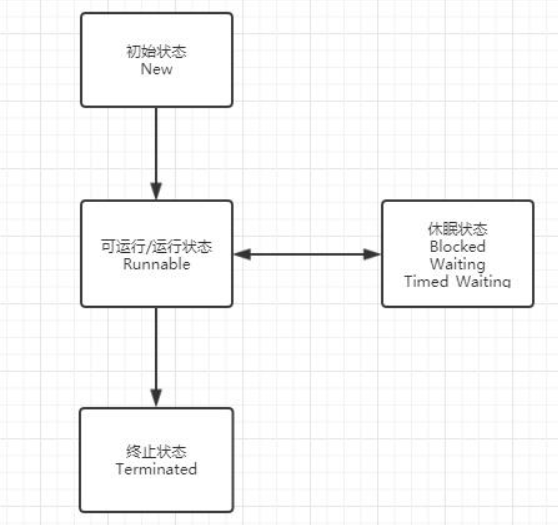

### Java生命周期概述

Java的线程生命周期有六种状态：

（1）New(初始化状态)

（2）Runnable(可运行/运行状态)

（3）Blocked(阻塞状态)

（4）Waiting(无时间限制的等待状态)

（5）Timed_Waiting(有时间限制的等待状态)

（6）Terminated(终止状态)

### New(初始化状态)

New(初始化状态)：指的是在高级语言，比如Java。在Java层面的线程被创建了，而在操作系统中的线程其实是还没被创建的，所以这个时候是不可能分配CPU执行这个线程的！所以这个状态是高级语言独有的，操作系统的线程没这个状态。我们New了一个线程，那时候它就是这个状态。

### Runnable(可运行/运行状态)

Runnable(可运行/运行状态)：这个状态下是可以分配CPU执行的，在New状态时候我们调用start()方法后线程就处于这个状态。

### Blocked(阻塞状态)

Blocked(阻塞状态)：这个状态下是不能分配CPU执行的，只有一种情况会导致线程阻塞，就是synchronized！我们知道被synchronized修饰的方法或者代码块同一时刻只能有一个线程执行，而其他竞争锁的线程就从Runnable到了Blocked状态！当某个线程竞争到锁了它就变成了Runnable状态。注意并发包中的Lock，是会让线程属于等待状态而不是阻塞，只有synchronized是阻塞。

### Waiting(无时间限制的等待状态)

Waiting(无时间限制的等待状态)：这个状态下也是不能分配CPU执行的。有三种情况会使得Runnable状态到waiting状态。

（1）调用无参的Object.wait()方法。等到notifyAll()或者notify()唤醒就会回到Runnable状态。

（2）调用无参的Thread.join()方法。也就是比如你在主线程里面建立了一个线程A，调用A.join()，那么你的主线程是得等A执行完了才会继续执行，这是你的主线程就是等待状态。

（3）调用LockSupport.park()方法。LockSupport是Java6引入的一个工具类Java并发包中的锁都是基于它实现的，再调用LocakSupport.unpark(Thread thread)，就会回到Runnable状态。

### Timed_Waiting(有时间限制的等待状态)

Timed_Waiting(有时间限制的等待状态)：其实这个状态和Waiting就是有没有超时时间的差别，这个状态下也是不能分配CPU执行的。有五种情况会使得Runnable状态到waiting状态。

（1）Object.wait(long timeout)。

（2）Thread.join(long millis)。

（3）Thread.sleep(long millis)。注意 Thread.sleep(long millis, int nanos) 内部调用的其实也Thread.sleep(long millis)。

（4）LockSupport.parkNanos(Object blocked,long deadline)。

（5）LockSupport.parkUntil(long deadline)。

### Terminated(终止状态)

Terminated(终止状态)：在线程正常run结束之后或者run一半异常了就是终止状态。

注：有个方法Thread.stop()是让线程终止的，但是这个方法已经被废弃了，不推荐使用，因为比如你这个线程得到了锁，你stop了之后这个锁也随着没了，其它线程就都拿不到这个锁了！这不玩完了么！所以推荐使用interrupt()方法。

interrupt()会使得线程Waiting和Timed_Waiting状态的线程抛出 interruptedException异常，使得Runnabled状态的线程如果是在I/O操作会抛出其它异常。

如果Runnabled状态的线程没有阻塞在I/O状态的话，那只能主动检测自己是不是被中断了，使用isInterrupted()。

