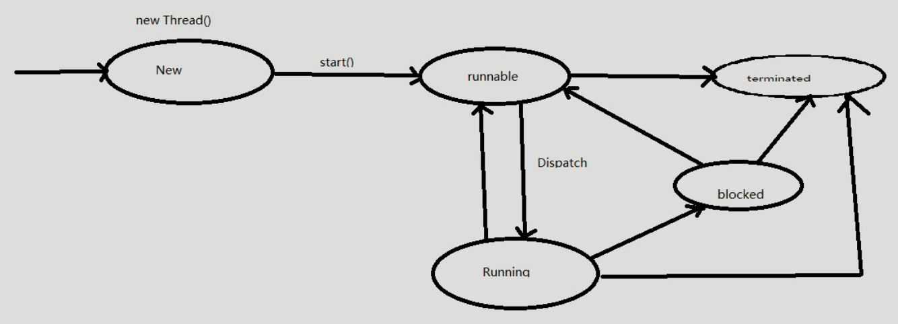

### 线程生命周期以及start方法源码解析

1、Java应用程序的main函数是一个线程，是被JVM启动的时候调用，线程的名字叫main。

2、实现一个线程，必须创建Thread实例，override run方法，并调用start方法。

3、在JVM启动后，实际上有多个线程，但是至少有一个非守护线程。

4、当调用一个线程start方法的时候，此时至少有两个线程，一个是调用你的线程，一个是执行run方法的线程。

5、线程的生命周期分为new、runnable、running、block、terminated。

（1）new：当程序使用new关键字创建了一个线程之后，该线程就处于新建状态，此时仅由JVM为其分配内存，并初始化其成员变量的值。

（2）runnable：当线程对象调用了start()方法之后，该线程处于就绪状态。Java虚拟机会为其创建方法调用栈和程序计数器，等待调度运行。

（3）running：如果处于就绪状态的线程获得CPU，开始执行run()方法的线程执行体，则该线程处于运行状态。

（4）block：当处于运行状态的线程失去所占用资源之后，便进入阻塞状态。

（5）terminated：线程在run()方法执行结束后进入死亡状态。此外，如果线程执行了interrupt()或stop()方法，那么它也会以异常退出的方式进入死亡状态。

### 构造Thread对象及源码分析

（1）通过构造器Thread()创建线程对象Thread，默认有一个线程名，已Thread-开头，从0开始计数递增。

（2）如果在构造Thread的时候没有传递Runnable或者没有复写Thread的run方法，该Thread将不会调用任何东西；如果传递了Runnable接口或者复写了Thread的run方法，则执行该方法的逻辑代码。

（3）如果构造线程对象时未传入ThreadGroup，Thread会默认获取父线程的ThreadGroup作为该线程的ThreadGroup，此时子线程和父线程将会在同一个threadGroup中。

（4）构造Thread的时候传入stackSize代表着该线程占用的stack大小，如果没有指定stackSize的大小，默认是0，0代表着会忽略该参数，该参数会被JNI函数去使用。

需要注意：该参数有些平台有效，在有些平台则无效。

